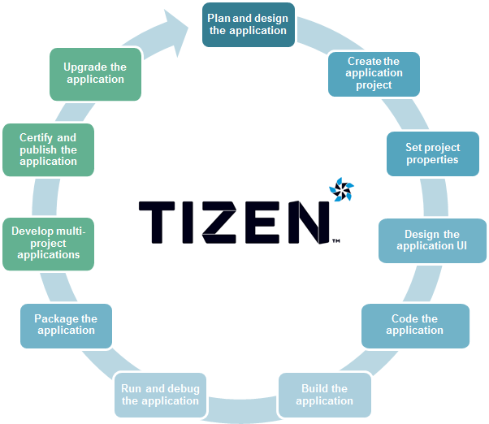

# Web Application Development Process

Tizen provides the tools required to manage your Web application life-cycle from product conception, through development and release, to end-of-life application retirement.

**Figure: Web application development process**



<a name="plan"></a>
## Plan and design the application

The first step in creating a Tizen Web application is planning and designing it using the design tools of your choice.

For information on planning and designing your applications, see [Tizen Web Guides](../../guides/index.md) and [Tizen Web API References](../../api/latest/device_api/tv/index.html).

Once you have finished the application plan and design, you are ready to create the application project.

<a name="create"></a>
## Create the application project

After you have planned and designed your application, you are ready to [create the application project](../../../../sdk-tools/vscode-ext/getting-started/creating-web-application-projects.md).

The Tizen SDK provides various project templates that make it easier for you to start coding your application. When you create a new project,
you can select a specific template or sample. Based on the selection, the Tizen Web [project wizard](../../../../sdk-tools/vscode-ext/getting-started/creating-web-application-projects.md) automatically creates basic functionalities that the application has to implement to be able to run. The default project files and folders are also created.

<a name="set"></a>
## Set project properties

After creating the application project, you can [configure the properties of the project and the Web application](setting-properties.md) to achieve the required functionality and features for your application.

<a name="code"></a>
## Code the application

[Code your application](coding-app.md) using the APIs defined in the Web [API References](../../api/latest/device_api/tv/index.html).

Once you have finished coding your application, you are ready to build your application.

<a name="build"></a>
## Build the application

When the Tizen SDK builds an application, the following process is executed:  
  1. Validation check for:
     - JavaScript
     - CSS
     - Privilege

  2. Compile for:
     - CoffeeScript
     - Less

 > [!NOTE]
 > About the output files:
 > -   Compiled CoffeeScript output file name is `<file name>.js`. This file is used when the project is packed to the WGT package file, but the script tag's reference path must be changed manually.
 > -   Compiled less output file name is `<file name>.css`. This file is   used when the project is packed to the WGT package file, but the script tag's reference path must be changed manually.

If the project has errors, they are reported by your IDE after the build.

For how to build a project in your IDE, see
[Build your project](../../../../sdk-tools/vscode-ext/Tizen/web-app.md#build-your-project).

Ensure that you have the latest build output before you run or debug a project.

<a name="run"></a>
## Run and debug the application

When the Tizen SDK runs or debugs the application, the following process is executed:

1.  Build automatically if no build has been created yet.
2.  Package.

    The optimization process is only executed when you execute the packaging process.

3.  Execute the application to the emulator or target device.

You can run your application in one of the following environments:

-   [Emulator](../../../../sdk-tools/vscode-ext/Tizen/web-app.md#deploy-and-run-your-application-in-emulator)

    The device emulator, provided with the Tizen SDK, imitates the target environment running Tizen Web applications. Using this
    replicated environment, you can test your application before deploying it to the real target device.

-   [Target device](../../../../sdk-tools/vscode-ext/Tizen/web-app.md#deploy-and-run-your-application-in-emulator)

    Running your application on a target device allows you to debug and test your application in a real-time environment.

-   [Simulator](../../../../sdk-tools/vscode-ext/Tizen/web-app.md#debug-your-application-in-web-simulator)

    Tizen Web simulator allows you to run application that use the Tizen Web APIs.

You can run the application smartly:

-   You can use the [Rapid Development Support (RDS)](../../../../sdk-tools/vscode-ext/Tizen/web-app.md#deploy-and-run-your-application-in-emulator) mode to run or test faster.
-   You can use the live editing mode to test faster (debug mode does not support it).

For more information on the debugging process and tools, see [Debugging Web Applications](../../../../sdk-tools/vscode-ext/Tizen/web-app.md#debug-your-application-in-emulator).

<a name="package"></a>
## Package the application

When the Tizen SDK packages the application, the following process is executed:

1.  Build automatically if no build has been created yet
2.  Optimize resources:
    -   Obfuscation (for JavaScript)
    -   Minification (for HTML, JavaScript, CSS, and PNG)
3.  Create the frame structure (for hybrid core applications).
4.  Make up resources (for hybrid core, font, and UI   framework applications).
5.  Handle signing.

Web application packaging process is based on the W3C packaging and
configuration.

You can package a Web application using the `web-packaging` command in the [Command Line Interface (CLI)](../../../../sdk-tools/baseline-sdk/common-tools/command-line-interface.md), which is a functional tool of the Tizen SDK:  
```bash
web-packaging project.wgt project/
```

The Tizen SDK provides the functionality to package a Web application quickly in the required format and to set the package properties.

The package properties control which resources are included:

-   **Excluding optimization resources**

    You can minify your JavaScript, CSS, HTML, and PNG resources and put in an exclude file pattern that you do not want to optimize.

-   **The hybrid application's main service application**

Additionally, you can [localize the Web application](setting-properties.md#localization) to support different languages and environments.

<a name="multi"></a>
## Develope multiple projects as a combined package

Tizen supports multi-project applications that combine different types of application templates in hybrid and companion applications.

<a name="hybrid"></a>
### Packaging hybrid applications

A hybrid application package combines a Web application and 1 or more native service applications.

To create and run a hybrid application, follow these steps:

1. Create a project for a [Web UI application](../../../../sdk-tools/vscode-ext/getting-started/creating-web-application-projects.md) and [native service application](../../../native/guides/development/index.md#creating).
2. Establish a project reference from the Web UI application to the service
   application. For the multi-project packaging support of your IDE, see
   [Hybrid application development](../../../../sdk-tools/vscode-ext/Tizen/hybrid.md).

3. [Build](#build) and [run](#run) the Web UI application. The service application is built and executed automatically at the same time,
    and a WGT file (hybrid application package) is produced under the Web UI application project.

    To modify the build configuration of the service application, see [Building the
    Application](../../../native/guides/development/index.md#build).

> [!NOTE]
> Tizen has limited a multi-project application combination policy for device usability. If you do not follow the policy, the submission of your application to the store can be rejected.


The following table shows the possible combinations for a hybrid multi-project. **M** means that multiple applications can be packaged as sub applications.

**Table: Combinations**
<table>
<tr>
 <th rowspan="2">Main project</th> <th colspan="4">Sub project</th>
</tr>
<tr>
   <th>UI</th>
   <th>SERVICE</th>
   <th>WATCH</th>
   <th>WIDGET</th>
</tr>
<tr>
  <td> WEB UI</td>
  <td> No </td>
  <td> M </td>
  <td> No </td>
  <td> M </td>
</tr>
<tr>
  <td> WEB SERVICE</td>
  <td> No </td>
  <td> No </td>
  <td> No </td>
  <td> No </td>
</tr>
</table>

With a hybrid application package, you can register the included applications in the official site for Tizen applications and install, upgrade, and uninstall them using the single hybrid package. When a hybrid application package is installed, the Web application is installed by the Web installer, followed by the native installer installing native service applications.

A hybrid application package is very useful to Web applications that need background processing or monitoring. A native service application does not have a UI and can be run in the background.

The Web application and native service applications within a hybrid application package share the same package ID and data folder. Sharing application data between them is easy. Many useful inter-application APIs, such as [Message Port](../../api/latest/device_api/tv/tizen/messageport.html) and [AppControl](../../api/latest/device_api/tv/tizen/application.html), can be used in a hybrid application package.

For more information on hybrid applications and their package structure, see
[Hybrid Service sample](/development/sample/native/AppFW/Hybrid_Service) and
[Hybrid Application Package](../../index.md#hap).

<a name="cert"></a>
## Certify and publish the application

After you have packaged your application, you are ready to certify and publish your application.

To certify and publish your application, follow these steps:

-   Upload your TV Web application to the Samsung App Store for registration.

    After the application is uploaded, the application is signed as a certified application installer package and the `<Application_name>.wgt` archive format, which contains the distributor signature, is added by the applicable store.

-   Submit your application to the applicable store for validation and publication.

    The store checks whether your application functions properly before publishing it.

You can also upgrade your application after certification. If you want to withdraw your application from distribution and operation, you need to request for application retirement from the store.

<a name="upgrade"></a>
## Upgrade the application

You can upgrade your application even after you have certified and published it at the official site for Tizen applications, Samsung Galaxy Apps Store, or Samsung App Store.

To upgrade your application, follow these steps:

1.  Update your application version, and if needed the privileges, in the `config.xml` configuration file.
2.  Update the application code as needed.
3.  If needed, update the privileges in the `config.xml` configuration file.
4.  Build, test, and repackage the application.
5.  Register the upgraded application on the applicable store.

When a previously installed application is upgraded on a device, you can decide which data files from the old version are retained and which are deleted. The common Tizen upgrade policy is to overwrite all the application package files, while keeping the user-created files and
directories unchanged.

Once your application has reached the end of its life-cycle, you can remove it from the store.
