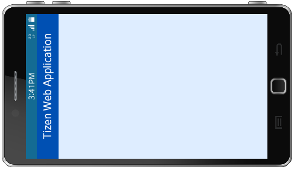
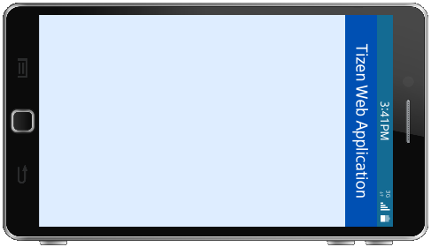
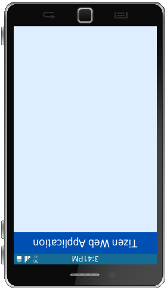

# System Information

You can access and monitor the [device and system properties](#system-information-properties) (both hardware and capability), such as the battery level, available device storage, version number, model name, and the cellular network being used.

The System Information API is mandatory for Tizen mobile, wearable, and TV profiles, which means that it is supported on all mobile, wearable, and TV devices. All mandatory APIs are supported on the Tizen Emulators.

The main features of the System Information API include:

- Checking the amount of total and available memory

  You can [retrieve memory amounts](#retrieving-the-memory-state), such as the total and available amount of system memory.

- Retrieving device capability

  You can [check the available capabilities of the device](#retrieving-a-device-capability).

- Checking device property states

  You can [retrieve the current state of a specific device property](#retrieving-the-current-state-of-a-property) to determine, for example, if your application has enough resources available to complete a task or a service successfully.

  You can also [check and monitor the device orientation](#retrieving-and-monitoring-the-device-orientation), and retrieve the number of system property information to check, for example, the number of installed SIM cards in the device.

- Receiving property state updates

  You can [receive state updates](#receiving-notifications-on-property-value-changes) when a specific property changes.

## Prerequisites

To use the System Information API (in [mobile](../../api/latest/device_api/mobile/tizen/systeminfo.html), [wearable](../../api/latest/device_api/wearable/tizen/systeminfo.html), and [TV](../../api/latest/device_api/tv/tizen/systeminfo.html) applications), the application has to request permission by adding the following privileges to the `config.xml` file:

```
<tizen:privilege name="http://tizen.org/privilege/system"/>
<tizen:privilege name="http://tizen.org/privilege/telephony"/>
```

## Retrieving a Device Capability

Retrieve a device capability using the `getCapability()` method of the `SystemInfo` interface (in [mobile](../../api/latest/device_api/mobile/tizen/systeminfo.html#SystemInfo), [wearable](../../api/latest/device_api/wearable/tizen/systeminfo.html#SystemInfo), and [TV](../../api/latest/device_api/tv/tizen/systeminfo.html#SystemInfo) applications):

1. To get a specific capability of the device, use the `getCapability()` method:

   ```
   var barometer = tizen.systeminfo.getCapability('http://tizen.org/feature/sensor.barometer');
   console.log(' Barometer = ' + barometer);
   ```

For a list of available keys and their meaning, see the device capability keys (in [mobile](../../api/latest/device_api/mobile/tizen/systeminfo_capability_keys.html) and [wearable](../../api/latest/device_api/wearable/tizen/systeminfo_capability_keys.html) applications).

## Retrieving the Current State of a Property

The property state can determine whether your application has enough resources to complete a particular task or service successfully. For example, if you are creating a file, you need to check the storage property to know whether a writable storage is available on the device.

Retrieve information about the property states using the applicable methods of the `SystemInfo` interface (in [mobile](../../api/latest/device_api/mobile/tizen/systeminfo.html#SystemInfo), [wearable](../../api/latest/device_api/wearable/tizen/systeminfo.html#SystemInfo), and [TV](../../api/latest/device_api/tv/tizen/systeminfo.html#SystemInfo) applications):

1. To check the current state of the property, use the `getPropertyValue()` method.

   The first method parameter must be of the `SystemInfoPropertyId` type (in [mobile](../../api/latest/device_api/mobile/tizen/systeminfo.html#SystemInfoPropertyId), [wearable](../../api/latest/device_api/wearable/tizen/systeminfo.html#SystemInfoPropertyId), and [TV](../../api/latest/device_api/tv/tizen/systeminfo.html#SystemInfoPropertyId) applications). For the available values, see the [Available properties](#property) table.

   ```
   /* Retrieve the battery property */
   tizen.systeminfo.getPropertyValue('BATTERY', onPowerSuccessCallback);

   /* Retrieve the cellular network property */
   tizen.systeminfo.getPropertyValue('CELLULAR_NETWORK', onCellularSuccessCallback);
   ```

   After retrieving a property, you can use all the details of the property in your code. The property values are returned in the success event handlers defined in the following steps.

2. Use the power property values.

   In the following example, the battery level and charging status of the power property are printed to a console log.

   ```
   function onPowerSuccessCallback(battery) {
       /* Log the device battery level to the console */
       console.log('The battery level is ' + battery.level);

       /* Check whether the device is charging */
       var charging = battery.isCharging;
   }
   ```

3. Retrieve the current states of a specific device property using the `getPropertyValueArray()` method. For example, you can check the state of SIM cards mounted in the Tizen device.

   ```
   function successCallback(properties) {
       console.log('The number of the returned system properties is ' + properties.length);
       for (var i = 0; i properties.length; i++) {
           console.log('[' + (i + 1) + '] SIM\'s state is ' + properties[i].state);
       }
   }

   tizen.systeminfo.getPropertyValueArray('SIM', successCallback);
   ```

4. Retrieve the number of system property information using the `getCount()` method. For example, you can check the number of SIM cards installed in the Tizen device.

   ```
   console.log('The number of SIM cards in the device is ' + tizen.systeminfo.getCount('SIM'));
   ```

## Retrieving the Memory State

Check the total or available amount of system memory using the applicable method of the `SystemInfo` interface (in [mobile](../../api/latest/device_api/mobile/tizen/systeminfo.html#SystemInfo), [wearable](../../api/latest/device_api/wearable/tizen/systeminfo.html#SystemInfo), and [TV](../../api/latest/device_api/tv/tizen/systeminfo.html#SystemInfo) applications):

- To get the total amount of system memory, use the `getTotalMemory()` method:

  ```
  console.log('The total memory size is ' + tizen.systeminfo.getTotalMemory() + ' bytes.');
  ```

- To get the available amount of system memory, use the `getAvailableMemory()` method:

  ```
  console.log('The available memory size is ' + tizen.systeminfo.getAvailableMemory() + ' bytes.');
  ```

## Retrieving and Monitoring the Device Orientation

The device orientation defines the angle between the direction of what is considered to be the "top" side of the device and the physical upward direction. The device orientation is not directly related to the screen orientation. For example, when the **Auto rotate screen** option is disabled or the Web application has the `screen-orientation` option (in [mobile](../../../tizen-studio/web-tools/config-editor.md#mw_setting) and [wearable](../../../tizen-studio/web-tools/config-editor.md#ww_setting) applications) set to "landscape" or "portrait", the screen is not rotated and the `window.screen.orientation` property does not change; however, the `SystemInfo` device orientation changes.

When a device is in its natural position, it is considered to be in the `PORTRAIT_PRIMARY` orientation (if the screen height is greater than its width) or the `LANDSCAPE_PRIMARY` orientation (otherwise). When the device is rotated 90 degrees clockwise (rotated right), the orientation changes from `LANDSCAPE_PRIMARY` to `PORTRAIT_PRIMARY`, from `PORTRAIT_PRIMARY` to `LANDSCAPE_SECONDARY`, from `LANDSCAPE_SECONDARY` to `PORTRAIT_SECONDARY`, and from `PORTRAIT_SECONDARY` back to `LANDSCAPE_PRIMARY`.

**Table: Device orientations**

<table>
<tbody>
<tr>
<th>LANDSCAPE_PRIMARY</th>
<th>PORTRAIT_PRIMARY</th>
<th>LANDSCAPE_SECONDARY</th>
<th>PORTRAIT_SECONDARY</th>
</tr>
<tr>
<td>

</td>
<td>

</td>
<td>

</td>
<td>

</td>
</tr>
<tr>
<td>

</td>
<td>

</td>
<td>

</td>
<td>

</td>
</tr>
</tbody>
</table>

To retrieve information about the device orientation:

1. To retrieve the current orientation of the device, use the `getPropertyValue()` method of the `SystemInfo` interface (in [mobile](../../api/latest/device_api/mobile/tizen/systeminfo.html#SystemInfo), [wearable](../../api/latest/device_api/wearable/tizen/systeminfo.html#SystemInfo), and [TV](../../api/latest/device_api/tv/tizen/systeminfo.html#SystemInfo) applications) and query the `DEVICE_ORIENTATION` property:

   ```
   function onDeviceOrientation(deviceOrientation) {
       console.log('The device orientation is now: ' + deviceOrientation.status);
   }
   tizen.systeminfo.getPropertyValue('DEVICE_ORIENTATION', onDeviceOrientation);
   ```

2. The user can rotate the device and change its orientation. To receive notifications about the orientation changes, use the `addPropertyValueChangeListener()` method of the `SystemInfo` interface:

   ```
   var orientationListenerId;
   orientationListenerId = tizen.systeminfo.addPropertyValueChangeListener('DEVICE_ORIENTATION', onDeviceOrientation);
   ```

3. To stop receiving change notifications, use the `removePropertyValueChangeListener()` method of the `SystemInfo` interface:

   ```
   tizen.systeminfo.removePropertyValueChangeListener(orientationListenerId);
   ```

## Receiving Notifications on Property Value Changes

You can receive state updates when a change occurs in a specific property. The `addPropertyValueChangeListener()` method registers an event listener for a specific property, and returns the subscription identifier for the listener. You can use the `SystemInfoPropertySuccessCallback` interface (in [mobile](../../api/latest/device_api/mobile/tizen/systeminfo.html#SystemInfoPropertySuccessCallback), [wearable](../../api/latest/device_api/wearable/tizen/systeminfo.html#SystemInfoPropertySuccessCallback), and [TV](../../api/latest/device_api/tv/tizen/systeminfo.html#SystemInfoPropertySuccessCallback) applications) to define the event handler for receiving the change notification.

To receive notifications on property value changes:

1. Register a `SystemInfoPropertySuccessCallback` event handler for the property value changes using the `addPropertyValueChangeListener()` method of the `SystemInfo` interface.

   The first parameter defines the property whose value changes you want to track, and the optional last parameter defines any thresholds when you want the notifications to be triggered. In the following example, an event handler is registered for the memory property value changes.

   ```
   function successCallback(memory) {
       console.log('The memory state is ' + memory.state);
   }

   tizen.systeminfo.addPropertyValueChangeListener('MEMORY', successCallback);
   ```

   The method returns a watch identifier, which can be used to deregister the event handler.

2. In the success event handler of the `addPropertyValueChangeListener()` method, define the notification event actions.

   In the following example, a warning about the low battery is logged to the console.

   ```
   /* Trigger a notification */
   function onSuccessCallback(battery) {
       console.log('Low battery: ' + battery.level);
   }

   tizen.systeminfo.addPropertyValueChangeListener('BATTERY', onSuccessCallback);
   ```

3. To deregister the event handler, use `removePropertyValueChangeListener()` method with the watch identifier returned from the `addPropertyValueChangeListener()` method.

   In the following example, the event handler is deregistered when the first change of the SIM card state is detected.

   ```
   function successCallback(properties) {
       for (var i = 0; i properties.length; i++) {
           console.log('[' + (i + 1) + '] SIM\'s state is ' + properties[i].state);
       }
       removePropertyValueChangeListener(id);
   }

   var id = tizen.systeminfo.addPropertyValueArrayChangeListener('SIM', successCallback);
   ```

<a name="property"></a>
## System Information Properties

The system properties are defined as subtypes of the `SystemInfoProperty` interface (in [mobile](../../api/latest/device_api/mobile/tizen/systeminfo.html#SystemInfoProperty), [wearable](../../api/latest/device_api/wearable/tizen/systeminfo.html#SystemInfoProperty), and [TV](../../api/latest/device_api/tv/tizen/systeminfo.html#SystemInfoProperty) applications). The following table lists the available subtypes, and the related `SystemInfoPropertyId` type values.

**Table: Available properties**

| Property                                 | PropertyID           | Description                              |
| ---------------------------------------- | -------------------- | ---------------------------------------- |
| `SystemInfoBattery` (in [mobile](../../api/latest/device_api/mobile/tizen/systeminfo.html#SystemInfoBattery), [wearable](../../api/latest/device_api/wearable/tizen/systeminfo.html#SystemInfoBattery), and [TV](../../api/latest/device_api/tv/tizen/systeminfo.html#SystemInfoBattery) applications) | `BATTERY`            | Provides information about the battery level and charging status. With this property, you can, for example, determine whether the application can be launched or whether the user needs to be warned about the level of power available for the device. Since Tizen 4.0, you can retrieve values about the estimated charging or discharging time of the battery. |
| `SystemInfoCpu` (in [mobile](../../api/latest/device_api/mobile/tizen/systeminfo.html#SystemInfoCpu), [wearable](../../api/latest/device_api/wearable/tizen/systeminfo.html#SystemInfoCpu), and [TV](../../api/latest/device_api/tv/tizen/systeminfo.html#SystemInfoCpu) applications) | `CPU`                | Provides information about the CPU load, allowing you to determine the efficiency of an application. |
| `SystemInfoStorage` (in [mobile](../../api/latest/device_api/mobile/tizen/systeminfo.html#SystemInfoStorage), [wearable](../../api/latest/device_api/wearable/tizen/systeminfo.html#SystemInfoStorage), and [TV](../../api/latest/device_api/tv/tizen/systeminfo.html#SystemInfoStorage) applications) | `STORAGE`            | Provides information about the currently connected data storage devices and their details, such as available capacity. With this property, you can, for example, allow the user to select which available storage they want to use, and determine whether the storage in question has enough free space for the actions the user wants to perform. |
| `SystemInfoDisplay` (in [mobile](../../api/latest/device_api/mobile/tizen/systeminfo.html#SystemInfoDisplay), [wearable](../../api/latest/device_api/wearable/tizen/systeminfo.html#SystemInfoDisplay), and [TV](../../api/latest/device_api/tv/tizen/systeminfo.html#SystemInfoDisplay) applications) | `DISPLAY`            | Provides information about the device display, allowing you, for example, to determine the resolution of the device to layout your application optimally on runtime. |
| `SystemInfoNetwork` (in [mobile](../../api/latest/device_api/mobile/tizen/systeminfo.html#SystemInfoNetwork), [wearable](../../api/latest/device_api/wearable/tizen/systeminfo.html#SystemInfoNetwork), and [TV](../../api/latest/device_api/tv/tizen/systeminfo.html#SystemInfoNetwork) applications) | `NETWORK`            | Provides information about the data network. With this property, you can, for example, determine whether the network type provides adequate connection speeds for the actions the user wants to perform. |
| `SystemInfoWifiNetwork` (in [mobile](../../api/latest/device_api/mobile/tizen/systeminfo.html#SystemInfoWifiNetwork), [wearable](../../api/latest/device_api/wearable/tizen/systeminfo.html#SystemInfoWifiNetwork), and [TV](../../api/latest/device_api/tv/tizen/systeminfo.html#SystemInfoWifiNetwork) applications) | `WIFI_NETWORK`       | Provides information about the Wi-Fi network. With this property, you can, for example, determine whether a Wi-Fi network is available and what its signal strength or SSID is.<br>**Note**<br>The SSID of a Wi-Fi network represents the public name of the network that is specified by the manufacturer. The SSID identifies a network by using a 32-character long alphanumeric key. The key ensures that only devices using the SSID can communicate with each other. |
| `SystemInfoCellularNetwork` (in [mobile](../../api/latest/device_api/mobile/tizen/systeminfo.html#SystemInfoCellularNetwork), [wearable](../../api/latest/device_api/wearable/tizen/systeminfo.html#SystemInfoCellularNetwork), and [TV](../../api/latest/device_api/tv/tizen/systeminfo.html#SystemInfoCellularNetwork) applications) | `CELLULAR_NETWORK`   | Provides information about the cellular network. With this property, you can, for example, retrieve the network details that allow your application to access the network. |
| `SystemInfoEthernetNetwork` (in [mobile](../../api/latest/device_api/mobile/tizen/systeminfo.html#SystemInfoEthernetNetwork), [wearable](../../api/latest/device_api/wearable/tizen/systeminfo.html#SystemInfoEthernetNetwork), and [TV](../../api/latest/device_api/tv/tizen/systeminfo.html#SystemInfoEthernetNetwork) applications) | `ETHERNET_NETWORK`   | Provides information about the Ethernet network. With this property, you can, for example, retrieve the network details that allow your application to access the network. |
| `SystemInfoNetProxyNetwork` (in [mobile](../../api/latest/device_api/mobile/tizen/systeminfo.html#SystemInfoNetProxyNetwork), [wearable](../../api/latest/device_api/wearable/tizen/systeminfo.html#SystemInfoNetProxyNetwork), and [TV](../../api/latest/device_api/tv/tizen/systeminfo.html#SystemInfoNetProxyNetwork) applications) | `NET_PROXY_NETWORK`  | Provides information about the proxy type network. With this property, you can, for example, retrieve the network details that allow your application to access the network. |
| `SystemInfoSIM` (in [mobile](../../api/latest/device_api/mobile/tizen/systeminfo.html#SystemInfoSIM), [wearable](../../api/latest/device_api/wearable/tizen/systeminfo.html#SystemInfoSIM), and [TV](../../api/latest/device_api/tv/tizen/systeminfo.html#SystemInfoSIM) applications) | `SIM`                | Provides information about the device SIM card, such as the operator name and the mobile country code (MCC). |
| `SystemInfoDeviceOrientation` (in [mobile](../../api/latest/device_api/mobile/tizen/systeminfo.html#SystemInfoDeviceOrientation), [wearable](../../api/latest/device_api/wearable/tizen/systeminfo.html#SystemInfoDeviceOrientation), and [TV](../../api/latest/device_api/tv/tizen/systeminfo.html#SystemInfoDeviceOrientation) applications) | `DEVICE_ORIENTATION` | Provides information about the current device display orientation allowing you, for example, to determine when the orientation changes to layout your application optimally on runtime. |
| `SystemInfoBuild` (in [mobile](../../api/latest/device_api/mobile/tizen/systeminfo.html#SystemInfoBuild), [wearable](../../api/latest/device_api/wearable/tizen/systeminfo.html#SystemInfoBuild), and [TV](../../api/latest/device_api/tv/tizen/systeminfo.html#SystemInfoBuild) applications) | `BUILD`              | Provides information about the build, such as the model name and manufacturer. |
| `SystemInfoLocale` (in [mobile](../../api/latest/device_api/mobile/tizen/systeminfo.html#SystemInfoLocale), [wearable](../../api/latest/device_api/wearable/tizen/systeminfo.html#SystemInfoLocale), and [TV](../../api/latest/device_api/tv/tizen/systeminfo.html#SystemInfoLocale) applications) | `LOCALE`             | Provides information about the locale, such as the currently set language. |
| `SystemInfoPeripheral` (in [mobile](../../api/latest/device_api/mobile/tizen/systeminfo.html#SystemInfoPeripheral), [wearable](../../api/latest/device_api/wearable/tizen/systeminfo.html#SystemInfoPeripheral), and [TV](../../api/latest/device_api/tv/tizen/systeminfo.html#SystemInfoPeripheral) applications) | `PERIPHERAL`         | Provides information about the video output status. |
| `SystemInfoMemory` (in [mobile](../../api/latest/device_api/mobile/tizen/systeminfo.html#SystemInfoMemory), [wearable](../../api/latest/device_api/wearable/tizen/systeminfo.html#SystemInfoMemory), and [TV](../../api/latest/device_api/tv/tizen/systeminfo.html#SystemInfoMemory) applications) | `MEMORY`             | Provides information about the memory state of the device. |
| `SystemInfoADS` (in [mobile](../../api/latest/device_api/mobile/tizen/systeminfo.html#SystemInfoADS), [wearable](../../api/latest/device_api/wearable/tizen/systeminfo.html#SystemInfoADS), and [TV](../../api/latest/device_api/tv/tizen/systeminfo.html#SystemInfoADS) applications) | `ADS`                | Provides information about the advertisement service. |

## Related Information
* Dependencies
  - Tizen 2.4 and Higher for Mobile
  - Tizen 2.3.1 and Higher for Wearable
  - Tizen 3.0 and Higher for TV
