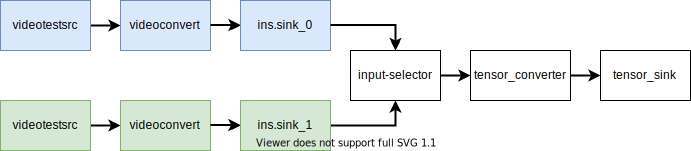

# Pipeline

Pipeline API allows you to use [NNStreamer](https://nnstreamer.ai/) machine learning inference pipelines in your applications. You can use them to process data with machine learning models and custom callbacks.

## Main features of Pipeline API

The main features of the Pipeline API include:

- Create and dispose of machine learning inference pipelines

  You can [set up pipelines and dispose of them when they are no longer needed](#create-and-dispose-machine-learning-inference-pipelines).

- Observe pipeline state and respond to its changes

  You can [register state change listeners or poll the state when needed](#observe-pipeline-state-and-respond-to-its-changes).

- Run machine learning inference pipelines

  You can [start and stop data flow within pipeline](#run-machine-learning-inference-pipelines).

- Get and set pipeline node properties

  You can [get and change pipeline node settings](#get-and-set-pipeline-node-properties).

- Input data from the application

  You can [use Source API to input data from JS application](#input-data-from-application).

- Read data from pipeline output

  You can [use SinkListener API to get pipeline output](#read-data-from-pipeline-output).

- Change data flow within the pipeline

  You can [use Switch API to choose the pipeline branch that should receive data](#change-data-flow-within-pipeline).

- Start and stop data flow to a pipeline branch

  You can [use Valve API to stop and resume data flow within a pipeline branch](#start-and-stop-data-flow-to-a-pipeline-branch).

- Write custom data filters

  You can [use CustomFilter API to write custom data processing routines in JS](#write-custom-data-filters).

- Use saved models

  You can use [`tensor_filter` element to read models trained with popular machine learning frameworks](#use-saved-models).

## Prerequisites

To access files, camera or recorder using the Pipeline API (in [mobile](../../api/latest/device_api/mobile/tizen/ml_pipeline.html), [wearable](../../api/latest/device_api/wearable/tizen/ml_pipeline.html), and [tv](../../api/latest/device_api/tv/tizen/ml_pipeline.html) applications), the application has to define proper privileges in its `config.xml`:

  ```xml
  <!-- for accessing internal storage only -->
  <tizen:privilege name="http://tizen.org/privilege/mediastorage"/>
  <!-- for accessing external storage only -->
  <tizen:privilege name="http://tizen.org/privilege/externalstorage"/>
  <!-- for accessing camera -->
  <tizen:privilege name="http://tizen.org/privilege/camera"/>
  <!-- for accessing recorder -->
  <tizen:privilege name="http://tizen.org/privilege/recorder"/>
  ```

As these are [privacy-related privileges](../../tutorials/sec-privileges.md), the application has to [request proper permissions using the PPM API](../security/privacy-related-permissions.md) (in [mobile](../../api/latest/device_api/mobile/tizen/ppm.html) and [wearable](../../api/latest/device_api/wearable/tizen/ppm.html) applications).

## Create and dispose machine learning inference pipelines

NNStreamer is a plugin for [GStreamer](https://gstreamer.freedesktop.org).
It adds new pipeline nodes and data types that allow to run on-device machine learning inference.
You can use some of the standard GStreamer and NNStreamer elements (also referred to as _nodes_ throughout this guide) in your applications.

- NNStreamer pipelines are created from string descriptions, for example:

    ```javascript
    'appsrc ! other/tensor,dimension=(string)2:1:1:1,type=(string)int8,framerate=(fraction)0/1 ! tensor_filter framework=custom-easy model=my-custom-filter ! tensor_sink'
    ```

- Exclamation marks `!` separate pipeline nodes.

You can learn how to define pipeline descriptions from [GStreamer documentation](https://gstreamer.freedesktop.org/documentation).

To create a machine learning inference pipeline:

1. Describe the pipeline as a string:

    ```javascript
    var pipelineDescription = 'videotestsrc num-buffers=3 ' +
                              '! video/x-raw,width=20,height=15,format=BGRA ' +
                              '! tensor_converter ' +
                              '! fakesink';
    ```

2. Call `tizen.ml.pipeline.createPipeline()`:

    ```javascript
    var pipeline = tizen.ml.pipeline.createPipeline(pipelineDescription);
    ```
You can use `pipeline` object to manage the pipeline. Machine learning pipelines can be expensive in terms of used system resources. You can dispose pipelines to reclaim resources.

3. To dispose a pipeline, call `dispose()`:

    ```javascript
    pipeline.dispose();
    ```

The disposed pipelines enter the `NULL` state, and cannot be restarted. Any attempt of calling any method of a disposed pipeline results in `NotFoundError` exception.

## Observe pipeline state and respond to its changes

Pipeline state reflects what the pipeline is doing right now and defines which methods can be called.
To see how pipelines transition between different states, see the API reference (for [mobile](../../api/latest/device_api/mobile/tizen/ml_pipeline.html#PipelineState), [wearable](../../api/latest/device_api/wearable/tizen/ml_pipeline.html#PipelineState), and [tv](../../api/latest/device_api/tv/tizen/ml_pipeline.html#PipelineState) applications).

Pipeline API allows you to register listeners triggered by pipeline state changes and to poll current pipeline state.

To register a state change listener:

1. Define a `PipelineStateChangeListener`, which is called when the pipeline changes its state:

    ```javascript
    function pipelineStateChangeListener(newState) {
      console.log('New pipeline state: ' + newState);
    }
    ```

2. Call `tizen.ml.pipeline.createPipeline()`, with state change listener as an argument:

    ```javascript
    var pipeline = tizen.ml.pipeline.createPipeline(pipelineDescription, pipelineStateChangeListener);
    ```

3. You can also check the current pipeline state by reading the value of its `state` property:

    ```javascript
    console.log(pipeline.state); // 'PLAYING'
    ```

## Run machine learning inference pipelines

The newly created pipeline transitions through `READY` to `PAUSED` state, you have to manually start it and set it to `PLAYING` state.

1. To start the data flow within a pipeline, call `start()`:

    ```javascript
    pipeline.start();
    ```

2. To stop inference, call pipeline's `stop()`:

    ```javascript
    pipeline.stop();
    ```

When pipeline stops, it changes its state to `PAUSED`.

## Get and set pipeline node properties

Operation of pipeline elements is controlled by properties, which can be read and written with Pipeline API.
You can get the information about nodes using `gst-inspect-1.0` command line tool on your Tizen device, for example:
      
  ```bash
  gst-inspect-1.0 videotestsrc
  ...
  Element Properties:
  animation-mode      : For pattern=ball, which counter defines the position of the ball.
                      flags: readable, writable
                      Enum "GstVideoTestSrcAnimationMode" Default: 0, "frames"
                          (0): frames           - frame count
                          (1): wall-time        - wall clock time
                          (2): running-time     - running time
  ...
  ```

You can use the following information to change the `pattern` of the test video signal source to `ball`:

  ```bash
  ...
  pattern             : Type of test pattern to generate
                      flags: readable, writable
                      Enum "GstVideoTestSrcPattern" Default: 0, "smpte"
                          (0): smpte            - SMPTE 100% color bars
                          (1): snow             - Random (television snow)
  ...

                          (18): ball             - Moving ball
  ...
  ```

To control node property with application code:

1. Create a pipeline and define the names for those elements for which you want to get or set a property:
  
    ```javascript
    var pipelineDescription = 'videotestsrc name=srcx ! tizenwlsink';
    var pipeline = tizen.ml.pipeline.createPipeline(pipelineDescription);
    ```

2. Get the `NodeInfo` object associated with the node you want to control:
   
    ```javascript
    var videotestsrcNode = pipeline.getNodeInfo('srcx');
    ```

3. To read the current value of `pattern` property,  use the property type defined in `gst-inspect-1.0` output:
 
    ```javascript
    var pattern = videotestsrcNode.getProperty('pattern', 'ENUM');
    console.log(videotestsrcNode.name + '\'s pattern: ' + pattern); // 'srcx's pattern: 0';
    ```

4. The current `pattern` is `0`, which translates to `frames` pattern, according to `gst-inspect-1.0` output. Change it to `ball` by setting property value to `18`:
     
    ```javascript
    videotestsrcNode.setProperty('pattern', 'ENUM', 18);
    ```

 > [!NOTE]
 > You can also set the `pattern` value in pipeline description, for example, `videotestsrc pattern=18 ! tizenwlsink`

## Input data from application

The pipeline input can be generated by specialized nodes, for example `videotestsrc` or by the application code feeding the `appsrc` nodes.

To input data from application:

1. Create a pipeline with `appsrc` node, define properties of the input tensor in pipeline description, using the [GStreamer capsfilter](https://gstreamer.freedesktop.org/documentation/coreelements/capsfilter.html):

    ```javascript
    var pipelineDescription = 'appsrc name=srcx ' +
                              '! other/tensor,dimension=(string)1:1:1:1,type=(string)int8 ' +
                              '! fakesink';
    var pipeline = tizen.ml.pipeline.createPipeline(pipelineDescription);
    ```

2. Get the `srcx` element from pipeline:

    ```javascript
    var src = pipeline.getSource('srcx');
    ```

3. Start the pipeline before providing input:

    ```javascript
    pipeline.start();
    ```

4. Input data is processed by the pipeline. The `Source.inputTensorsInfo` property has the `TensorsInfo` expected at input:

    ```javascript
    var inputInfo = src.inputTensorsInfo;

    var inputData = inputInfo.getTensorsData();
    var rawInputData = inputData.getTensorRawData(0);
    inputData.setTensorRawData(0, [123]);

    src.inputData(inputData);
    ```

Input data is passed to the further stages of the pipeline.

## Read data from pipeline output

You can read the tensors output by the pipeline with the application code by registering a callback, triggered by data coming into `appsink` or `tensor_sink`.
Use `gst-inspect-1.0` to learn more about the differences between these two elements.

To get pipeline output:

1. Create a pipeline with a sink node that can pass data to application:

    ```javascript
    var pipelineDescription = 'videotestsrc num-buffers=3 ' +
                              '! videoconvert ' +
                              '! videoscale ' +
                              '! video/x-raw,format=RGBx,width=16,height=16,framerate=10/1 ' +
                              '! tensor_converter ' +
                              '! tensor_sink name=sinkx';
    var pipeline = tizen.ml.pipeline.createPipeline(pipelineDescription);
    ```

2. Register a listener triggered by data incoming to `sinkx`:

    ```javascript
    function sinkListener(sinkName, data) {
      console.log('SinkListener for ' + sinkName + ' sink called. Data dimensions: ' +
                  data.tensorsInfo.getDimensions(0));

    // Read and process data according to your needs
    }
    pipeline.registerSinkListener('sinkx', sinkListener);
    ```

After starting the pipeline, `sinkListener` is be called repeatedly.

## Change data flow within pipeline

You may want to set the the source of the data to one of several pipeline branches.
It can be done with `input-selector` node and `Switch` API.

You can analyze the pipeline from the following figure to see how to use `input-selector` to choose between blue and green branch as the source for the white branch.



To choose a source branch with `input-selector`:

1. Create a pipeline:

    ```javascript
    var pipelineDescription = 'input-selector name=ins ! tensor_converter ! tensor_sink name=sinkx ' + // white branch
                              'videotestsrc is-live=true ! videoconvert ! ins.sink_0 ' + // blue branch
                              'videotestsrc num-buffers=3 is-live=true ! videoconvert ! ins.sink_1'; // green branch
    var pipeline = tizen.ml.pipeline.createPipeline(pipelineDescription);
    ```

2. Get `insSwitch`:

    ```javascript
    var insSwitch = pipeline.getSwitch('ins');
    ```

3. You can get `Switch` pads:

    ```javascript
    console.log(insSwitch.getPadList()); // ["sink_0", "sink_1"]
    ```

4. Choose the pad to be used as a source for `input-selector` and the white pipeline branch:

    ```javascript
    insSwitch.select('sink_1'); // green branch used as the source
    ```

In the preceding example, an `input-selector` is used to choose from alternative sources. Similarly, you can use an `output-selector` to direct data to one of a set of sinks.

## Start and stop data flow to a pipeline branch

Use `valve` element with `Valve` API to start and stop data flow in one of a pipeline branches.

To control data flow in a single pipeline branch:

1. Create and start a pipeline with a `valve` element:

    ```javascript
    var pipelineDescription = 'videotestsrc is-live=true ' +
                              '! videoconvert ' +
                              '! videoscale ' +
                              '! video/x-raw,format=RGBx,width=16,height=16,framerate=10/1 ' +
                              '! tensor_converter ' +
                              '! valve name=valve1 ' +
                              '! fakesink';

    var pipeline = tizen.ml.pipeline.createPipeline(pipelineDescription);
    pipeline.start();
    ```

2. Get `Valve` element from the pipeline:

    ```javascript
    var valve = pipeline.getValve('valve1');
    ```

3. You can check if the valve is opened or closed:

    ```javascript
    console.log(valve.isOpen); // true
    ```

4. Set the desired valve state:

    ```javascript
    valve.setOpen(false); // stop the data flow
    ```

## Write custom data filters

The data flowing through the pipeline can be transformed in application using `CustomFilter` callbacks.

 > [!NOTE]
 > Sending data between `CustomFilter` running in JS application and GStreamer pipeline has large overhead.
 > Using `CustomFilter` with large tensors may result in unsatisfactory performance.

To transform the data within a callback registered in JS application:

1. Define information about `CustomFilter`'s input and output tensors:

    ```javascript
    var inputInfo = new tizen.ml.TensorsInfo();
    inputInfo.addTensorInfo('3D', 'UINT8', [4, 20, 15, 1]);
    var outputInfo = new tizen.ml.TensorsInfo();
    outputInfo.addTensorInfo('flat', 'UINT8', [1200]);
    ```

2. Register `CustomFilter` in the pipeline. Ensure to return a proper status code from the callback. In this case, `0` is returned, that indicates success:

    ```javascript
    function flattenFilter(inputData, outputData) {
      var rawInputData = inputData.getTensorRawData(0);
      outputData.setTensorRawData(0, rawInputData.data);

      return 0;
    };
    tizen.ml.pipeline.registerCustomFilter('flattenFilter', flattenFilter, inputInfo, outputInfo);
    ```

 > [!NOTE]
 > `inputData` and `outputData` passed to `flattenFilter` are different than other `TensorsData` objects.
 > These objects cannot be disposed and are only valid within the callback. You have to copy the objects manually such that you can use these objects outside the callback.
 > `inputData` is read-only and `outputData` is initialized with random values.

3. Create a pipeline with a `custom-easy-filter` element:
   
    ```javascript
    var pipelineDescription = 'videotestsrc num-buffers=3 ' +
                              '! video/x-raw,width=20,height=15,format=BGRA ' +
                              '! tensor_converter ' +
                              '! tensor_filter framework=custom-easy model=flattenFilter ' +
                              '! fakesink';
    var pipeline = tizen.ml.pipeline.createPipeline(pipelineDescription);
    ```
When you start the pipeline, the `flattenFilter` transforms 3-dimensional tensors into 1-dimensional vector.

## Use saved models

Using machine learning models trained with popular frameworks like [TensorFlow](https://tensorow.org) is one of the main use cases for NNStreamer pipelines.

To read a model from file and use it in a pipeline:

1. You must know the absolute path to the saved model file. It can be obtained from a path relative to a virtual root:

    ```javascript
    var modelPath = 'documents/mobilenet_v1_1.0_224_quant.tflite';
    var URI_PREFIX = 'file://';

    var absoluteModelPath = tizen.filesystem.toURI(modelPath).substr(URI_PREFIX.length);
    ```

2. Create a pipeline with a `tensor_filter` node with `model` property set to the location of a model:

    ```javascript
    var pipelineDescription = 'appsrc name=srcx  ' +
                              '! other/tensor,dimension=(string)224:224:3:1,type=(string)float ' +
                              '! tensor_filter framework=tflite model=' + absoluteModelPath + ' ' +
                              '! appsink name=sinkx';
    var pipeline = tizen.ml.pipeline.createPipeline(pipelineDescription);
    ```

3. Set up other pipeline elements, and use custom `Source` and `Sink`:

    ```javascript
    var source = pipeline.getSource('srcx');

    function sinkListener(sinkName, data) {
      var rawData = data.getTensorRawData(0);
      console.log(sinkName + ' received the data:');
      console.log(rawData);
    };

    pipeline.registerSinkListener('sinkx', sinkListener);
    ```

4. Run the pipeline:

    ```javascript
    pipeline.start();

    var inputTensorsData = inputTensorsInfo.getTensorsData(0);
    var randomInput = [];
    for (var i = 0; i < 224 * 224 * 3; i++) {
      randomInput.push(Math.random());
    };
    inputTensorsData.setTensorRawData(0, randomInput);
    source.inputData(inputTensorsData);
    ```

## Related information

- Dependencies
  - Tizen 6.5 and Higher for Mobile
  - Tizen 6.5 and Higher for Wearable
  - Tizen 6.5 and Higher for TV
