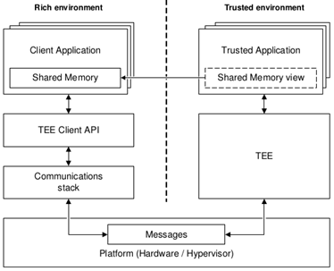

# TEE Communication

You can create secure communications by executing your application in a trusted execution environment (TEE), and communicating with other applications within that environment. To implement TEE communication, you can use the LibTeec API, which is based on the GlobalPlatform&reg; [TEE Client API](https://www.globalplatform.org/specificationsdevice.asp).

You can run applications in 2 environments: a rich environment (like Linux) with client applications (CA) and a secure environment with trusted applications (TA).

**Figure: TEE communication architecture**



The main features of the LibTeec API include:

-   Connecting to a trusted application

    You can securely [connect to a trusted application](#connecting) by creating a new session.

- Sending commands to a trusted application

    You can [pass commands from a client application to a trusted application](#secure_commands), including [using shared memory blocks](#shared_memory).

> **Note**  
> For security reasons, each device vendor usually uses their own TEE solution. If you intend your LibTeec application to be used on a real device, you must test your application on the TEE solution provided by the specific vendor. When developing and installing your trusted application, refer to the documentation provided by the vendor.


## Prerequisites

To enable your application to use the TEE communication functionality:

-   To use the LibTeec API, the application has to request permission by adding the following privilege to the `config.xml` file:

    ```
    <tizen:privilege name="http://tizen.org/privilege/tee.client"/>
    ```

    > **Note**  
    > To be able to use this privilege, your application must be signed with a partner-level certificate.

-   The trusted applications must be placed in a non-secure application install or resource directory before they can be discovered and transferred to the TEE.


<a name="connecting"></a>
## Connecting Applications

To connect a client application to a trusted application, first create a new TEE context with the `getContext()` method, and then open a session with the trusted application with the `openSession()` method of the context, identifying the trusted application by its UUID:

> **Note**  
> A client application can connect only to its own trusted application. Built-in security rules prevent connecting to other trusted applications.


<a name="secure_commands"></a>
## Sending Secure Commands

After opening a session with a trusted application, a client application can execute methods in the trusted application by sending secure commands to the trusted application.

To send a command, use the `invokeCommand()` method, with the first parameter identifying the method to be executed by the trusted application, and the second parameter containing an array of the executable method's parameters. The parameter array can have at most 4 elements.

You can use 3 types of objects in the parameters array:

-   `TeecValue` object (in [mobile](../../api/latest/device_api/mobile/tizen/libteec.html#TeecValue), [wearable](../../api/latest/device_api/wearable/tizen/libteec.html#TeecValue), and [TV](../../api/latest/device_api/tv/tizen/libteec.html#TeecValue) applications), which contains 1 or 2 simple integers.
-   `TeecTempMemory` object (in [mobile](../../api/latest/device_api/mobile/tizen/libteec.html#TeecTempMemory), [wearable](../../api/latest/device_api/wearable/tizen/libteec.html#TeecTempMemory), and [TV](../../api/latest/device_api/tv/tizen/libteec.html#TeecTempMemory) applications), which contains a local memory reference.
-   `TeecRegisteredMemory` object (in [mobile](../../api/latest/device_api/mobile/tizen/libteec.html#TeecRegisteredMemory), [wearable](../../api/latest/device_api/wearable/tizen/libteec.html#TeecRegisteredMemory), and [TV](../../api/latest/device_api/tv/tizen/libteec.html#TeecRegisteredMemory) applications), which contains a registered shared memory reference.

```
try {
    var gSession;

    function commandError(err) {
        gSession.close();
    }

    function commandSuccess(cmd, params) {
        console.log('command ' + cmd + ': ', params);
        gSession.close();
    }

    function sessionSuccess(session) {
        /* Session opened, the application can now communicate with the trusted application */
        gSession = session;
        var data = [1,2,3,4,45,6,7,7,7];
        var p1 = new TeecValue(10, 100); /* Integer parameters */
        var p2 = new TeecTempMemory(data); /* Temporary memory reference parameter */
        session.invokeCommand(1, [p1, p2], commandSuccess, commandError);
    }

    function sessionError(err) {
        console.log('openSession: ' + err.name + ': ' + err.message);
    }

    var ta = '123e4567-e89b-12d3-a456-426655440000';
    var ctx = tizen.teec.getContext();
    val cid = ctx.openSession(ta, TeecLoginMethod.PUBLIC, null, null, sessionSuccess, sessionError);
} catch (err) {
    console.log(err.name + ': ' + err.message);
}
```


<a name="shared_memory"></a>
## Using Shared Memory

You can handle a block of data without copying it to and from the trusted environment. For example, the client application can share a block of encrypted data from a data provider with the trusted application, and the trusted application can decrypt it.

To share a memory block between a client application and a trusted application:

1.  Allocate a new memory block as shared memory with the `allocateSharedMemory()` method:

    ```
    try {
        var gContext = tizen.teec.getContext();
        var gCleanup = false;
        var gSession = null;
        var ta = '123e4567-e89b-12d3-a456-426655440000';
        /* Allocate shared memory */
        var gShm = ctx.allocateSharedMemory(1024*1024, TeecSharedMemoryFlags.INOUT);
    ```

2. Fill the memory block with data from the data provider and create a new shared memory reference based on the memory block:

    ```
        function cleanup() {
            if (gSession !== null) {
                gSession.close();
                gSession = null;
            }
            gContext.releaseSharedMemory(gShm);
        }

        function getNextBlockFromDataProvider() {
            /* Fill the shared memory identified by gShm */
        }

        function commandError(err) {
            if (gCleanup === true) cleanup();
        }

        function commandSuccess(cmd, params) {
            console.log('command ' + cmd + ': ', params);
            if (gCleanup === true) cleanup();
        }

        function sessionSuccess(session) {
            /* Session opened, the application can now communicate with the trusted application */
            gSession = session;

            /* Get data from data provider */
            while (getNextBlockFromDataProvider()) {
                var p1 = new TeecRegisteredMemory(gShm, 0, gShm.size);  /* Shared memory reference parameter */
    ```

3. Pass the shared memory reference to the trusted application as a `TeecRegisteredMemory` object (in [mobile](../../api/latest/device_api/mobile/tizen/libteec.html#TeecRegisteredMemory), [wearable](../../api/latest/device_api/wearable/tizen/libteec.html#TeecRegisteredMemory), and [TV](../../api/latest/device_api/tv/tizen/libteec.html#TeecRegisteredMemory) applications) in the parameter array of the `invokeCommand()` method:

    ```
                session.invokeCommand(1, [p1], commandSuccess, commandError);
            }
            gCleanup = true;
            session.invokeCommand(1, [], commandSuccess, commandError);
        }

        function sessionError(err) {
            console.log('openSession: ' + err.name + ': ' + err.message);
        }

        gContext.openSession(ta, TeecLoginMethod.PUBLIC, null, null, sessionSuccess, sessionError);
    } catch (err) {
        console.log(err.name + ': ' + err.message);
    }
    ```

## Related Information
- Dependencies
  - Tizen 4.0 and Higher for Mobile
  - Tizen 4.0 and Higher for Wearable
  - Tizen 4.0 and Higher for TV
