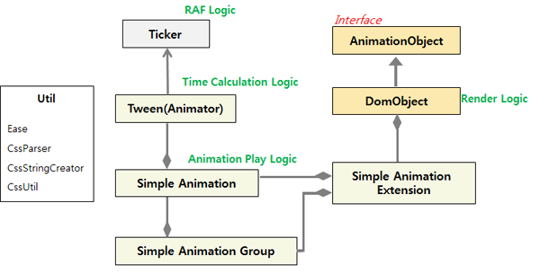
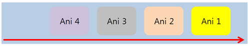
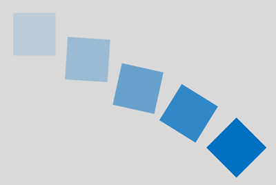
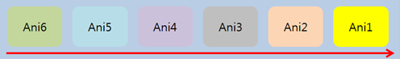

# Animation

TAU Animation is a module for animating target objects. It allows you to make and use animation without using any other animation library. TAU Animation provides good usability, high performance, and various functionalities.

This feature is supported in mobile and wearable applications only.

TAU Animation provides the following features:

- Single or group animation

  Provides usability from minimized parameters and APIs. You can easily make an animation or `TimeLine`.

- Group effects

  Provided by a stagger. Insert a stagger into the option, and all objects in the group are applied a sequential delay.

- Time control

  You can use ease, duration, and delay.

- Effect

  Provides predefined effects. This means that you can use a fancy effect simply with a string instead of specifying an animation value. Predefined effects are fully controlled in TAU Animation. You can also stop the animation.

- CSS animation

  Target objects can be animated using CSS styles, such as `backgroundColor`, `border`, `margin`, `padding`, and `shadow`. A CSS animation can also be controlled by TAU Animation.

- HTML element-based animation (in future)

  You can set an animation in an element instead of JavaScript. If you are skilled in HTML, you can make the animation in HTML.

- Custom `KeyFrame` (in future)  

	You can make an animation based on a custom `KeyFrame`.

- Callbacks

  Provides the `onStart`, `onUpdate`, and `onComplete` callbacks. CSS animations do not support the `updateCallback` and `progress` callbacks. TAU Animation provides these features.

To use TAU Animation, you must load the `tau.animation.min.js` file, which can work with any other library or Web framework. There are no other prerequisites.

## Animation Fundamentals

The `tau.animation.js` file has its own modules for animating target objects when animation methods are invoked.

The general idea of animating target objects is for several parts to interact with each other.

**Figure: Animation parts**



- Ticker: Switches the `requestAnimationFrame()` method on and off. The ticker operates based on events.
- TweenAnimator: Runs the whole time logic. The TweenAnimator invokes the animation to play or stop, and it also updates the tween value per frame.
- SimpleAnimation: Consists of the animation play logic. The animation makes the tween object and target object, and it also interacts with the TweenAnimator.
- SimpleAnimationGroup: Group of `simpleAnimation` objects. It can include several objects for animation.
- SimpleAnimation Extension: Provides the mixin functionality. Pure DOM can be a target object with the `simpleAnimation` extension.
- DomObject: Target object that also has a render logic. If the tick is switched on, the TweenAnimator invokes the update method. And then, the render logic of DomObject is invoked, and the target objects are moved based on the animation option.
- AnimationObject: Interface for various target objects. In this example, the `DomObject` is used as a reference.

To make and call several animations:

1. Make a target object for the animation.

   After making the target object, you can make and call animations.

   **Figure: Target object**

   

   ```
   <div id="blueBox" style="background-color: 'blue'; position:absolute; width:100px; height:100px;">
   </div>
   ```

   ```
   var t = tau.animation.target,
       blueBox = document.getElementById('blueBox');
   t('#blueBox');
   /* Pure HTML element can be a target */
   t(blueBox);
   ```

2. Create an animation with transform, CSS properties, effects, and ease.

   Once the target object is made, you can create an animation. The animation consists of an animation value including transform, CSS properties, and effect. Basically, an animation option is inserted with the duration of 1 s (1000 ms) only as a default. If you want to add an ease function, delay, loop, or callback, create an object for an animation option.

   ```
   <div id="blueBox" style="background-color: 'blue'; position:absolute; width:100px; height:100px;">
   </div>
   ```

   ```
   var t = tau.animation.target;
   t('#blueBox').tween({translateX: 1000}, {duration: 1000, delay: 500})
                .tween({scaleX: 1.2, scaleY: 1.2}, {duration: 1000})
                .tween({rotateZ: 30}, {duration: 1000})
                .tween({skewX: 30}, {duration: 1000});
   ```

3. Put the animations into an animation queue.

   After making an animation, the animation is inserted into the animation queue automatically.

   **Figure: Animation queue**

   

4. After inserting the animation, send an event to the Ticker.

   In the above queue, there are 4 animations in queue. When all animations are inserted, the animations are popped and animated sequentially by the TweenAnimator.

5. The Ticker calls the `requestAnimationFrame()` method.  
  The TweenAnimator invokes the play and tick methods in the Ticker. The Ticker calls the `on()` method, and the `on()` method includes the `requestAnimationFrame()` method. The `RAF()` method is invoked until the TweenAnimator's tick time reaches the end of the duration.

6. During the `requestAnimationFrame()` method call, the `AnimationObject` renders the target object and the TweenAnimator's time logic is operating.  
   The `AnimationObject` can get the time value using the calculating animation. The `AnimationObject` renders the target object based on the time value. If the duration is 1000 (ms), the TweenAnimator gives time 0 through 1000.

   **Figure: TweenAnimator**

   

## Animation Functions

To provide better functionality, various animation features have been implemented. You can easily increase and improve an animation effect. If you want to connect several animations, use chaining animations. Predefined effects and animations with CSS properties and stagger are also provided.

### Tween

You can make an animation using the `tween()` method. If a tween animation is made, the animation is run right away. The `tween()` method consists of 2 parameters, `{animation}` and `{option}`:

```
tween({animation}, {option});
```

`{animation}` can be various animations, such as transform, CSS property, or predefined effect. Basically, `{animation}` indicates the destination of the animation. For example, `{rotateZ: 90}` indicates a rotation from the current value to 90 degrees. To do this, you must set the starting point of the animation, and for this, an additional animation form is provided. `{rotateZ: [30, 90]}` indicates the changing rotation value of the transform from 30 to 90.

```
<div id="redBox" style="background-color: 'red'; position:absolute; width:100px; height:100px;"></div>
<div id="blueBox" style="background-color: 'blue'; position:absolute; width:100px; height:100px; left: 200px;"></div>
```

```
var t = tau.animation.target;
t('#redBox').tween({translateX: 1000}, 1000); /* Translate from current position to 1000 */
/* Add left property from current to 200, add top property from 100 to 300 */
t('#blueBox').tween({left: 200, top: [100, 300]}, 1000);
```

### Chaining

The animation is inserted to the animation queue automatically before playing. At first, this feature does not seem important for making an animation, but if the animation is implemented in this way, the LOC (lines of code) can be decreased significantly.

```
<div id="blueBox" style="background-color: 'blue'; position:absolute; width:100px; height:100px;"></div>
```

```
var t = tau.animation.target;
t('#blueBox').tween({translateX: [500, 1000]}, 1000).tween({translateY: 500}, 1000)
             .tween({rotateZ: 120}, 1000).tween({skewX: [0, 30]}, 1000)
             .tween({opacity: [1, 0]}, 1000).tween({opacity: 0.5}, 1000);
```

**Figure: Animation queue and chaining**



The chaining feature makes an intuitive sequence group animation.

### Predefined Effects

To make an effect, you can combine many single animations, or use a predefined effect.

The following predefined effects are available:

`bounce`, `flash`, `pulse`, `rubberBand`, `shake`, `swing`, `tada`, `wobble`, `jello`, `bounceIn`, `bounceInDown`, `bounceInLeft`, `bounceInRight`, `bounceInUp`, `bounceOut`, `bounceOutDown`, `bounceOutLeft`, `bounceOutRight`, `bounceOutUp`, `fadeIn`, `fadeInDown`, `fadeInLeft`, `fadeInRight`, `fadeInUp`, `fadeOut`, `fadeOutDown`, `fadeOutLeft`, `fadeOutRight`, `fadeOutUp`, `flip`, `flipInX`, `flipInY`, `flipOutX`, `flipOutY`, `lightSpeedIn`, `lightSpeedOut`, `rotateIn`, `rotateInDownLeft`, `rotateInDownRight`, `rotateInUpLeft`, `rotateInUpRight`, `rotateOut`, `rotateOutDownLeft`, `rotateOutDownRight`, `rotateOutUpLeft`, `rotateOutUpRight`, `slideInUp`, `slideInDown`, `slideInLeft`, `slideInRight`, `slideOutUp`, `slideOutDown`, `slideOutLeft`, `slideOutRight`, `zoomIn`, `zoomInDown`, `zoomInLeft`, `zoomInRight`, `zoomInUp`, `zoomOut`, `zoomOutDown`, `zoomOutLeft`, `zoomOutRight`, `zoomOutUp`, `hinge`, `rollIn`, `rollOut`

The following example shows how you can make a shake effect:

- Using multiple animations:

   ```
   <div id="blueBox" style="background-color: 'blue'; position:absolute; width:100px; height:100px;"></div>
   ```

   ```
   var t = tau.animation.target;
   t('#blueBox').tween({translateX: -10}, 100);
   t('#blueBox').tween({translateX: 10}, 100);
   t('#blueBox').tween({translateX: -10}, 100);
   t('#blueBox').tween({translateX: 10}, 100);
   t('#blueBox').tween({translateX: -10}, 100);
   t('#blueBox').tween({translateX: 10}, 100);
   t('#blueBox').tween({translateX: -10}, 100);
   t('#blueBox').tween({translateX: 10}, 100);
   t('#blueBox').tween({translateX: -10}, 100);
   t('#blueBox').tween({translateX: 0}, 100);
   ```

- Using the predefined `shake` effect:

   ```
   <div id="blueBox" style="background-color: 'blue'; position:absolute; width:100px; height:100px;"></div>
   ```

   ```
   var t = tau.animation.target;
   t('#blueBox').tween('shake', 1000);
   ```

### Group

Sometimes, you need to animate all objects with the same animation. To make an animation group for this purpose, the `target()` method is provided. If all classes of DOM are `box`, you can create a box group. Like in CSS selectors, '.' is a class selector and '\#' is an ID selector. Also, a pure HTML element can be a parameter of the `target()` method.

```
<div class="box"></div>
<div class="box"></div>
<div class="box"></div>
<div class="box"></div>
```

```
var t = tau.animation.target;
t('.box').tween({rotateZ: 120}, 1000);
/* All DOM are rotated */
```

### Stagger

When handling an animation group, you can apply a different delay value to a group. The following example shows a delay with the `zoomIn` effect:

```
<div class='box'></div>
<div class='box'></div>
<div class='box'></div>
<div class='box'></div>
<div class='box'></div>
```

```
var t = tau.animation.target;
t('.box').tween('zoomIn', {duration: 1000, stagger: 200});
/* Each box is animated with 200 ms time difference */
```

### Callback

You can add some actions before and after an animation. If you add the `onStart` callback, it is invoked before the animation. The `onComplete` callback is invoked after the animation.

```
<div id='blueBox'></div>
var t = tau.animation.target;
t('#blueBox').tween({translateY: [0, 150], rotateZ: [0, 180]}, {
    duration: 1000,
    onStart: function() {
        t('#blueBox').innerText = 'start';
    },
    onComplete: function() {
        t('#blueBox').tween({backgroundColor: 'navy'}, {duration: 1000});
    }
});
```

In the above animation, the box is translated along the Y axis from 0 to 150 and rotated from 0 to 180. Before translating and rotating, the `start` text is inserted into the box. After translating and rotating, the box's background color is changed to navy.

## Related Information
* Dependencies
  - Tizen 2.4 and Higher for Mobile
  - Tizen 2.3.1 and Higher for Wearable
