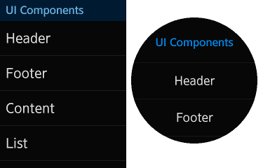

# Applications for Circular UI

TAU supports different types of wearable devices (rectangular and circular) in the same application. To support a circular UI along with a rectangular UI, a media query is required.

This feature is supported in wearable applications only.

## Applying the Circular UI

To support the circular UI:

1. Include the `link` element for the latest `tau.css` file into the `<head>` element in HTML. Note that for the compatibility with the rectangular UI, you must use the latest version of the TAU library.
2. Include the `link` element for the latest `tau.circle.css` file with the media query feature (`-tizen-geometric-shape: circle`) next to the `link` element for the `tau.css`. Note that adding the `tau.circle.css` file following the general `tau.css` file covers the additional circular UI.
3. Include the `link` element for the latest `tau.js` script file at the end of `<body>` element in HTML.
4. For writing a separate code for a circular UI in JavaScript, you can use the `tau.support.shape.circle` property for detecting the circular device.

```xml
<head name="viewport" content="width=device-width, user-scalable=no">
   <title>Support for Circular UI</title>
   <link rel="stylesheet" href="tau.css">
   <!--CSS media query on a link element-->
   <link rel="stylesheet" media="all and (-tizen-geometric-shape: circle)" href="tau.circle.css">
   <link rel="stylesheet" href="css/style.css">
</head>
<body>
   <script type="text/javascript" src="tau.js"></script>
   <script>
       if (tau.support.shape.circle) {
           /* Implement your code for circular UI */
       } else {
           /* Implement your code for rectangular UI */
       }
   </script>
</body>
```

The following figure shows how the media query `-tizen-geometric-shape: circle` works in a rectangular and circular UI.

**Figure: Media query on rectangular and circular devices**

​	

## Overriding the Circular CSS Style with a Media Query

For some styles to be applied selectively, you can use the `-tizen-geometric-shape` media query feature with a `rectangle` or `circle` value to distinguish the type difference. Note that the `-tizen-geometric-shape` feature is only available on Tizen devices.

**Table: -tizen-geometric-shape feature description**

| -tizen-geometric-shape  |                        |
| ----------------------- | ---------------------- |
| Value                   | `rectangle`  &verbar;  `circle` |
| Applied to              | Visual media types     |
| Accept min/max prefixes | No                     |

```
.className {
   /* Implement the basic CSS style for all types of devices (rectangular and circular) */
}

@media screen and (-tizen-geometric-shape: circle) {
   .className {
      /* Implement the CSS style to be overridden in circular */
   }
}
```

## Writing JavaScript Selectively for the Circular UI

TAU provides the `tau.support.shape.circle` property that checks whether the device screen is a circle. If you want to implement code selectively for a circular UI and rectangular UI, you can use the property with a boolean value. Note that for developing in a browser environment, this property is always set to `true` when the `tau.circle.css` file is loaded.

```csharp
if (tau.support.shape.circle) {
    /* Implement your code for circular UI */
} else {
    /* Implement your code for rectangular UI */
}
```

## Supported UI Components

The following components can be used on both rectangular and circular devices.

**Table: UI components supported by a rectangular and circular UI**

| Component                                | Description                              |
| ---------------------------------------- | ---------------------------------------- |
| [Rotary Events](tau-rotary.md) | Shows how to support the "rotarydetent" event. |
| [Helper Script](helper.md) | Shows how to support some application components. |
| [Snap List](list.md) | Shows how to create a snap list component. |
| [Expandable Header](header.md) | Shows how to create a header component.  |
| [Circle-shaped Progress Bar](circle-progressbar.md) | Shows how to create a circle progress bar component. |
| [Full Size Processing Component](processing.md) | Shows how to create a processing component. |
| [Footer Button](footerbutton.md) | Shows how to create a footer button component. |
| [Thumbnail](thumbnail.md) | Shows how to create a thumbnail component. |
| [Popup Button](popup.md) | Shows how to create a popup component.   |
| [Index Scroll Bar](indexscrollbar.md) | Shows how to create an index scroll bar component. |
| [More Options](moreoptions.md) | Shows how to create a more options button component. |

## Related Information
* Dependencies
  - Tizen 2.3.1 and Higher for Wearable
