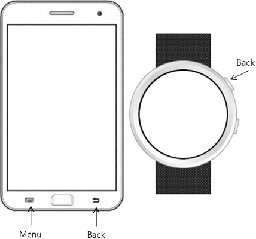

# Event Handling

The Tizen platform supports some device events for user interaction. To provide a full user experience for your application users, you must handle various events in your application.

This feature is supported in mobile and wearable applications only.

## Hardware Key Events

The Tizen platform supports hardware key events for user interaction on devices.

The following figures show the hardware keys for mobile (on the left) and wearable (on the right) devices.

**Figure: Hardware keys**



**Table: Hardware key events**

| Type         | Description                              | Attribute                                |
| ------------ | ---------------------------------------- | ---------------------------------------- |
| `tizenhwkey` | Event is triggered when a device detects the user interaction through a special point of hardware. | `event.keyName`<br> - `back` for wearable<br> - `back` or `menu` for mobile |

To bind an event callback on the `tizenhwkey` events, use the following code:

```javascript
window.addEventListener('tizenhwkey', function(ev) {
    if (ev.keyName == 'back') {
        /* Call window.history.back() to go to previous browser window */
        /* Call tizen.application.getCurrentApplication().exit() to exit application */
        /* Add script to add another behavior */
    }
});
```

### Exiting the Application with the Back Key

When the application binds a `tizenhwkey` event, it checks the page ID and decides to go back or exit with several lines of app-side script.

The Tizen Device APIs provide an application exit method. Even if the application has many pages, it can handle the back/exit process.

With a TAU page, simply remember the ID of the main page. In the following example, the ID of the main page is `main`.

```javascript
(function() {
    window.addEventListener('tizenhwkey', function(ev) {
        if (ev.keyName === 'back') {
            var page = document.getElementsByClassName('ui-page-active')[0],
                pageid = page ? page.id : '';
            if (pageid === 'main') {
                try {
                    tizen.application.getCurrentApplication().exit();
                } catch (ignore) {}
            } else {
                window.history.back();
            }
        }
    });
}());
```

## Rotary Events in Wearable Applications

The Tizen platform supports rotary events for user interaction on a wearable rotary device or sensor. The rotary device can rotate clockwise or counter-clockwise, and dispatch an event for each movement. The rotary device has points called detents. If the rotary device detects the detent point while rotating, it dispatches a separate new event about the point. The number of the available detent points depends on the device hardware.

**Figure: Rotary device**


Rotary events are used to deliver the rotary device or sensor data to the application. The following table describes the rotary events.

**Table: Rotary events**

| Type           | Description                              | Attribute                                |
| -------------- | ---------------------------------------- | ---------------------------------------- |
| `rotarydetent` | Event is triggered when a device detects the detent point. | `detail.direction`: rotation direction<br> - `CW` for clockwise rotation direction<br> - `CCW` for counter-clockwise rotation direction |

To bind an event callback on rotary events, use the following code:

```javascript
document.addEventListener('rotarydetent', function(ev) {
    var direction = ev.detail.direction;
    /* Add behavior for detent detected event with a direction value */
});
```

## Related Information
* Dependencies
  - Tizen 2.4 and Higher for Mobile
  - Tizen 2.3.1 and Higher for Wearable
