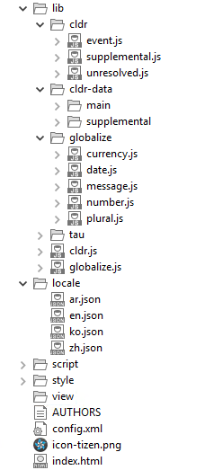
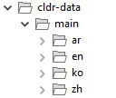

# Globalization

The TAU Globalize utility supports internationalization and localization. It wraps the [Globalize](https://github.com/jquery/globalize) functionality for easy access from Tizen Web applications, and it is extended to support right-to-left (RTL) languages.

This feature is supported in mobile and wearable applications only.

## jQuery and Globalize

Globalize is a jQuery JavaScript library for internationalization and localization that leverages the official Unicode CLDR JSON data. The library works both for the browser and as a Node.js module. jQuery and Globalize have dependencies with [cldr.js](https://github.com/rxaviers/cldrjs), which is a CLDR low-level manipulation tool.

Globalize:

- Leverages the Unicode CLDR data and follows its UTS#35 specification.
- Keeps the code separate from the i18n content. Does not host or embed any locale data in the library. Empowers you to control the loading mechanism of your choice.
- Allows you to load as much or as little data as you need. Avoids duplicating data if using multiple i18n libraries that leverage CLDR.
- Keeps the code modular. Allows you to load the i18n functionalities you need.
- Runs in browsers and Node.js, and consistently across all of them.
- Makes globalization as easy to use as jQuery.

### CLDR Data

The Unicode CLDR provides the key building blocks for software to support the world's languages. It includes:

- Locale-specific patterns for formatting and parsing dates, times, time zones, numbers, and currency values
- Translations of names: languages, scripts, countries and regions, currencies, eras, months, weekdays, day periods, time zones, cities, and time units
- Language and script information: characters used, plural cases, gender of lists, capitalization, rules for sorting and searching, writing direction, transliteration rules, rules for spelling out numbers, and rules for segmenting text into graphemes, words, and sentences
- Country information: language usage, currency information, calendar preference and week conventions, and postal and telephone codes
- ISO and BCP 47 code support (such as cross-mappings) and keyboard layouts

CLDR uses the XML format provided by UTS #35: Unicode Locale Data Markup Language (LDML). LDML is a format used not only for CLDR, but also for the general interchange of locale data. For more information on CLDR, see [CLDR release notes](http://cldr.unicode.org/index/downloads/cldr-27), and to download the JSON format file, see [JSON Data from the Unicode CLDR Project](https://github.com/unicode-cldr/cldr-json).

The TAU Globalize utility uses the CLDR 26 release, and when you create a Tizen Web application project, you find CLDR in the `<project>/lib/tau/<profile>js/cldr-data` folder.

## Using the Globalize Utility

To use the TAU Globalize utility in your application:

1. Download the following dependency files for your application:            

   - [Cldr](https://github.com/rxaviers/cldrjs)  (v0.4.0)
   - [Globalize](https://github.com/jquery/globalize) (v1.0.0-alpha.17)
   - [Cldr-date](http://unicode.org/Public/cldr/26/json-full.zip) (26 version) main and supplemental

2. Create a folder structure, as shown in the following table.

   **Table: Globalize folder structure**

<table>
  <tr><th colspan="2">Folder structure</th>
  <th>Description</th></tr>
  <tr><td rowspan="7">  </td>
  <td rowspan="7">  </td>
  <td> <code>cldr/</code>: Copy the cldr.js library in this folder. </td>
  </tr>
  <tr><td> <code>cldr-data/</code>: Copy the cldr-data files in this folder.<br><code>cldr-data/main</code>: Copy the languages to be supported in this folder.<br><br> <strong>Note</strong><br>	Do not copy all languages; copy only the ones you need. </td></tr>
  <tr><td> <code>globalize/</code>: Copy the Globalize library in this folder.</td></tr>
  <tr><td> <code>locale/</code>: Make the custom locale string in this folder. </td></tr>
  <tr><td> <code>script/</code>: JavaScript files.  </td></tr>
  <tr><td> <code>style/</code>: CSS, image, and other style related files.</td></tr>
  <tr><td> <code>view/</code>: HTML files </td></tr>
</table>

3. Set the locale using the following example code:

   ```javascript
   var globalize = tau.util.globalize,
       localeId = 'ko-KR';

   document.addEventListener('pageshow', function() {
       globalize.setLocale(localeId).done(function(ko) {
           /* 'ko' is the Globalize utility instance */
           console.log(ko.getLocale()); /* 'ko' */
       });
   });
   ```

   The `setLocale()` method is not synchronous, and it returns the deferred object with the methods `then()`, `done()`, and `fail()`. Use these methods to receive the Globalize utility instance.

   You can specify locales in 2 ways using IETF language tags, such as en, pt-BR, or zh-Hant-TW:

   - Specify the locale ID in the `lang` attribute of the body element, such as `<body lang="ko-KR">`.
   - Use a string variable as an input argument of the `setLocale()` method (for example `ko.setLocale("en")`) to overwrite the body element setting.

   If no `lang` attribute or `setLocale()` input argument is defined, the Globalize utility finds the locale by checking the `window.navigator.language` property. If the check result is false, the utility uses the default locale "en".

   The following table illustrates the locale setting method order.

   **Table: Locale setting methods**

   | Order | Locale setting methods      |
   | ----- | --------------------------- |
   | 1     | `setLocale(LocaleId)`       |
   | 2     | `<body lang="ko-KR">`       |
   | 3     | `window.navigator.language` |
   | 4     | Default locale "en"         |

4. Make sure that you have all required CLDR files.            

   The `setLocale()` method automatically loads the basic CLDR data files which are match the given locale by local AJAX. During the method call, the Globalize utility also loads the basic CLDR JSON files:

   - `cldr/main/locale/ca-gregorian.json`
   - `cldr/main/locale/numbers.json`
   - `cldr/main/locale/currencies.json`
   - `cldr/supplemental/likelySubtags.json`
   - `cldr/supplemental/scriptMetaData.json`
   - `cldr/supplemental/timeData.json`
   - `cldr/supplemental/weekData.json`
   - `cldr/supplemental/numberingSystems.json`
   - `cldr/supplemental/plurals.json` (for cardinals)
   - `cldr/supplemental/ordinals.json` (for ordinals)

   In addition to the basic files, each Globalize method requires a special set of CLDR portions. Determine which Globalize module functionalities you need, and make sure you have the required files, as defined in the following table.

   **Table: CLDR requirements**

   | Module        | Required CLDR JSON files                 |
   | ------------- | ---------------------------------------- |
   | Core module   | `cldr/supplemental/likelySubtags.json`   |
   | Date module   | `cldr/main/locale/ca-gregorian.json`<br>                          `cldr/main/locale/timeZoneNames.json`   <br>                     `cldr/supplemental/timeData.json`     <br>             `cldr/supplemental/weekData.json`     <br>         CLDR JSON files from the number module |
   | Number module | `cldr/main/locale/numbers.json`   <br>         `cldr/supplemental/numberingSystems.json` |
   | Plural module | `cldr/supplemental/plurals.json` (for cardinals) <br>      `cldr/supplemental/ordinals.json` (for ordinals) |

## Using the Globalize Utility Methods

The following code snippets show how to use the TAU Globalize utility methods:

- `formatCurrency()`:

  ```javascript
  var globalize = tau.util.globalize,
      localeId = 'ko-KR',
      currency_unit = 'KRW'; /* ISO 4217 */

  document.addEventListener('pageshow', function() {
      globalize.setLocale(localeId).done(function(ko) {
          console.log(ko.formatCurrency(69000, currency_unit)); /* ₩69,900 */
      });
  });           
  ```

   For more information, see the [currency unit standard in ISO 4217](http://en.wikipedia.org/wiki/ISO_4217).        

- `formatDate()`:

  ```javascript
  var globalize = tau.util.globalize,
      localeId = 'ko-KR',
      currency_unit = 'KRW'; /* ISO 4217 */

  document.addEventListener('pageshow', function() {
      globalize.setLocale(localeId).done(function(ko) {
          console.log(ko.formatDate(new Date(), {datetime:'medium'});
      });
  });         
  ```

  For more information, see [date-formatter](https://github.com/jquery/globalize/blob/master/doc/api/date/date-formatter.md).        

- `getCalendar()`:

  ```javascript
  var globalize = tau.util.globalize,
      localeId = 'ko-KR';

  document.addEventListener('pageshow', function() {
      globalize.setLocale(localeId).done(function(ko) {
          console.log(ko.getCalendar().months.format.wide, undefined, 4));
      });
  });         
  ```

  The calendar format is specified in the `gregorian.json` file in the CLDR data.        

- `formatMessage()`:            

  This method supports custom locale data.                            

  1. Create a directory for each locale that has localized content under the locales directory in the project root. The locale names are defined in the [W3C IANA Language Subtag Registry](http://www.iana.org/assignments/language-subtag-registry/language-subtag-registry).

     ```
     index.html
     locale
        en.json
        ko.json                            
     ```

  2. Create a JSON file for the `formatMessage` strings (custom locale strings) in locales paths:

     ```json
     {
        "en": {
           "like": [
              "{0, plural, offset:1",
              "=0 {Be the first to like this}",
              "=1 {You liked this}",
              "one {You and someone else liked this}",
              "other {You and # others liked this}",
              "}"
           ],
           "greeting": {
              "hello":"hello",
              "bye":"bye"
           },
           "longText": [
              "Lorem ipsum dolor sit amet, consectetur adipisicing elit. Eligendi non",
              "quis exercitationem culpa nesciunt nihil aut nostrum explicabo",
              "reprehenderit optio amet ab temporibus asperiores quasi cupiditate.",
              "Voluptatum ducimus voluptates voluptas?"
           ]
        }
     }                               
     ```

  3. Call the `setLocale()` method to load the custom locale files automatically:

     ```javascript
     var globalize = tau.util.globalize,
         localeId = 'ko-KR';

     document.addEventListener('pageshow', function() {
         globalize.setLocale(localeId).done(function(ko) {
             console.log(ko.formatMessage('greeting/hello'));
             console.log(ko.formatMessage('greeting/bye'));
             console.log(ko.formatMessage('longText'));
         });
     });                                  
     ```

- `messageFormatter()`:  
   This method returns a function that formats a message using the ICU message format pattern. For more information, see [message-formatter](https://github.com/jquery/globalize/blob/master/doc/api/message/message-formatter.md).                            

  1. Create a locale resource in the locales path:

     ```
     {
        "en": {
           "formatter": {
              "welcome":"Hello Mr. {0}",
              "thankyou":"Bye Mr. {custom}."
           }
        }
     }                              
     ```

  2. Use the `messageFormatter()` method:

     ```
     var globalize = tau.util.globalize,
         localeId = 'en-US';

     document.addEventListener('pageshow', function() {
         globalize.setLocale(localeId).done(function(en) {
             var welcomeFormatter = en.messageFormatter('formatter/welcome'),
                 thankyouFormatter = en.messageFormatter('formatter/thankyou'),
                 welcomeMessageList = ['Tom'],
                 thankyouMessageList = {custom:'Tom'};

             console.log(welcomeFormatter(welcomeMessageList));
             console.log(thankyouFormatter(thankyouMessageList));
         });
     });                                 
     ```

## Right-to-left (RTL) Language Support

TAU offers 2 ways to handle right-to-left (RTL) languages:

- Locale-specific CSS
- RTL property in a locale object

When the `setLocale()` method is called, it automatically applies a CSS class to the body element of your DOM if the given locale has an RTL direction.

The following examples show how to use the locale-specific CSS:

- The following example has ar-EG as the given locale, and the language has an RTL direction:

  ```
  var globalize = tau.util.globalize,
      localeId = 'ar-EG';

  document.addEventListener('pageshow', function() {
      globalize.setLocale(localeId).done(function(ar) {
          /* Do something */
      });
  });
  ```

- The following example has a DOM of body with a locale-specific CSS named `ui-script-direction-rtl`:
  ```
  <body class="ui-script-direction-rtl">
  ```

- The following example uses the locale-specific CSS to switch on the RTL feature for a UI component:

  ```
  .ui-script-direction-rtl .ui-listview {
     direction: rtl;
  }
  .ui-script-direction-rtl .ui-li.ui-li-static {
     text-align: right;
     unicode-bidi: bidi-override;
  }
  ```

The following example shows how to use the RTL property in a locale object (the `rtl` variable). If a given locale has an RTL direction, the variable is `true`.

```
var globalize = tau.util.globalize,
    localeId = 'ar-EG';

document.addEventListener('pageshow', function() {
    globalize.setLocale(localeId).done(function(ar) {
        console.log(ar.rtl); /* true */
    });
});
```

## Related Information
* Dependencies
  - Tizen 2.4 and Higher for Mobile
  - Tizen 2.3.1 and Higher for Wearable
