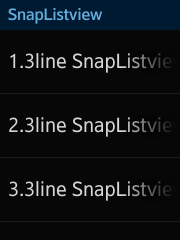

# Creating Snap Lists

You can create a snap list component with the marquee component using the SnapListview API and the [helper script](helper.md).

This feature is supported in wearable applications only.

The following figure shows the layout of the list component in a rectangular and circular UI.

**Figure: List component on rectangular and circular devices**

 

To implement the list component:

1. Edit the HTML code to add the list component to your application screen:

   ```
   <div class="ui-page ui-page-active" id="snapListPage">
      <header class="ui-header">
         <h2 class="ui-title">Snap List</h2>
      </header>
      <div class="ui-content">
         <ul class="ui-listview ui-snap-listview expand-list" id="snapList">
            <li class="li-has-3line">
            <div class="ui-marquee ui-marquee-gradient">1.3line SnapListview with Marquee SnapListview with Marquee</div>
               <div class="li-text-sub ui-li-sub-text">sub-text</div>
               <div class="li-text-sub ui-li-sub-text">sub-text</div>
            </li>
            <li class="li-has-3line">
               <div class="ui-marquee ui-marquee-gradient">2.3line SnapListview with Marquee SnapListview with Marquee</div>
               <div class="li-text-sub ui-li-sub-text">sub-text</div>
               <div class="li-text-sub ui-li-sub-text">sub-text</div>
            </li>
            <li class="li-has-3line">
               <div class="ui-marquee ui-marquee-gradient">3.3line SnapListview with Marquee SnapListview with Marquee</div>
               <div class="li-text-sub ui-li-sub-text">sub-text</div>
               <div class="li-text-sub ui-li-sub-text">sub-text</div>
            </li>
            <li class="li-has-3line">
               <div class="ui-marquee ui-marquee-gradient">4.3line SnapListview with Marquee SnapListview with Marquee</div>
               <div class="li-text-sub ui-li-sub-text">sub-text</div>
               <div class="li-text-sub ui-li-sub-text">sub-text</div>
            </li>
            <li class="li-has-3line">
               <div class="ui-marquee ui-marquee-gradient">5.3line SnapListview with Marquee SnapListview with Marquee</div>
               <div class="li-text-sub ui-li-sub-text">sub-text</div>
               <div class="li-text-sub ui-li-sub-text">sub-text</div>
            </li>
         </ul>
      </div>
   </div>
   ```

2. Edit the CSS code to set the visual style of the list:

   ```
   .ui-listview li .li-text-sub {
      display: block;
      text-overflow: ellipsis;
      overflow: hidden;
      line-height: 32px;
      color: rgb(51, 51, 51);
   }

   .ui-listview li.li-has-3line {
      padding-top: 0;
      padding-bottom: 0;
      height: 115px;
   }

   .ui-listview.expand-list li.li-has-3line .ui-marquee {
      -webkit-transform: translate3d(0, 30px, 0);
   }

   .ui-listview.expand-list li.li-has-3line.ui-snap-listview-selected .ui-marquee {
      -webkit-transform: translate3d(0, 0, 0);
      -webkit-transition: all ease 1s;
   }

   .ui-listview.expand-list li.li-has-3line .ui-li-sub-text:nth-child(2) {
      -webkit-transform: translate3d(0, -10px, 0);
      opacity: 0;
   }

   .ui-listview.expand-list li.li-has-3line.ui-snap-listview-selected .ui-li-sub-text:nth-child(2) {
      -webkit-transform: translate3d(0, 0, 0);
      opacity: 1;
      -webkit-transition: all ease 1s;
   }

   .ui-listview.expand-list li.li-has-3line .ui-li-sub-text:last-child {
      -webkit-transform: translate3d(0, -42px, 0);
      opacity: 0;
   }

   .ui-listview.expand-list li.li-has-3line.ui-snap-listview-selected .ui-li-sub-text:last-child {
      -webkit-transform: translate3d(0, 0, 0);
      opacity: 1;
      -webkit-transition: all ease 1s;
   }
   ```

3. Edit the JavaScript code to manage the list events and other functionality:

   ```
   var page = document.querySelector('#snapListPage'),
       listHelper;

   page.addEventListener('pagebeforeshow', function() {
       var list = document.getElementById('snapList');

       if (tau.support.shape.circle) {
           listHelper = tau.helper.SnapListMarqueeStyle.create(list, {marqueeDelay: 1000});
       }
   });

   page.addEventListener('pagehide', function() {
       if (tau.support.shape.circle) {
           if (listHelper) {
               listHelper.destroy();
           }
       }
   });
   ```

## Related Information
* Dependencies
  - Tizen 2.3.1 and Higher for Wearable
