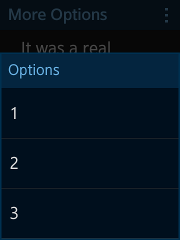
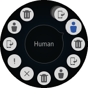

# Implementing More Options

In a rectangular UI, you can implement more options using the button and popup components. In a circular UI, the selector component provides the more options button. The following example shows how to create a more options button for the circular UI.

This feature is supported in wearable applications only.

The following figure shows the more options component in a rectangular and circular UI.

**Figure: More options component on rectangular and circular devices**

 

To implement the more options component:

1. Edit the HTML code to add the more options component to your application screen:

   ```
   <div id="moreoptionsPage" class="ui-page">
      <link rel="stylesheet" href="./moreoptions.css">
      <header class="ui-header ui-has-more">
         <h2 class="ui-title">More Options</h2>
         <button type="button" class="ui-more ui-icon-overflow">More Options</button>
      </header>
      <div class="ui-content content-padding">
         It was a real pleasure for me to finally get to meet you. My colleagues join me in sending you our holiday greetings.
      </div>

      <!--Rectangular profile-->
      <div id="moreoptionsPopup" class="ui-popup" data-transition="slideup">
         <div class="ui-popup-header">Options</div>
         <div class="ui-popup-content">
            <ul class="ui-listview">
               <li><a href="#">1</a></li>
               <li><a href="#">2</a></li>
               <li><a href="#">3</a></li>
            </ul>
         </div>
      </div>

      <!--Circular profile-->
      <div id="moreoptionsDrawer" class="ui-drawer" data-drawer-target="#moreoptionsPage" data-position="right" data-enable="true" data-drag-edge="1">
         <div id="selector" class="ui-selector">
            <div class="ui-item show-icon" data-title="Show"></div>
            <div class="ui-item human-icon" data-title="Human"></div>
            <div class="ui-item delete-icon" data-title="Delete"></div>
            <div class="ui-item show-icon" data-title="Show"></div>
            <div class="ui-item human-icon" data-title="Human"></div>
            <div class="ui-item delete-icon" data-title="Delete"></div>
            <div class="ui-item x-icon" data-title="X Icon"></div>
            <div class="ui-item fail-icon" data-title="Fail"></div>
            <div class="ui-item show-icon" data-title="Show"></div>
            <div class="ui-item human-icon" data-title="Human"></div>
            <div class="ui-item delete-icon" data-title="Delete"></div>
            <div class="ui-item show-icon" data-title="Show"></div>
            <div class="ui-item human-icon" data-title="Human"></div>
         </div>
      </div>
   </div>
   ```

2. Edit the CSS code to set the visual style of the buttons:

   ```
   #moreoptionsDrawer {
      display: none;
   }

   @media all and (-tizen-geometric-shape: circle) {
      #moreoptionsDrawer {
         display: block;
         background-color: rgba(255, 255, 255, 0.1);
         border-radius: 100%;
      }
      #moreoptionsPopup {
         display: none;
      }
   }
   ```

3. Edit the JavaScript code to manage the option button events and other functionality:

   ```
   (function() {
       var page = document.querySelector('#moreoptionsPage'),
           popup = page.querySelector('#moreoptionsPopup'),
           handler = page.querySelector('.ui-more'),
           drawer = page.querySelector('#moreoptionsDrawer'),
           selector = page.querySelector('#selector'),
           helper,
           clickHandlerBound;

       function clickHandler(event) {
           tau.openPopup(popup);
       }

       page.addEventListener('pagebeforeshow', function() {
           if (tau.support.shape.circle) {
               helper = tau.helper.DrawerMoreStyle.create(drawer, {
                   handler: '.drawer-handler'
               });
           } else {
               /* Shape is square */
               clickHandlerBound = clickHandler.bind(null);
               handler.addEventListener('click', clickHandlerBound);
           }
       });

       page.addEventListener('pagebeforehide', function() {
           if (tau.support.shape.circle) {
               handler.removeEventListener('click', clickHandlerBound);
               helper.destroy();
           }
       });
   })();
   ```

## Related Information
* Dependencies   
   - Tizen 2.3.1 and Higher for Wearable
