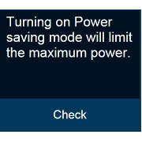
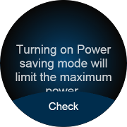
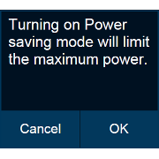
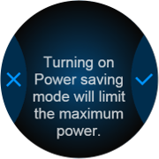

# Creating Popup Buttons

You can create bottom and side popup button components with the Popup API.

This feature is supported in wearable applications only.

The following figures show the layout of the popup component in a rectangular and circular UI.

**Figure: Bottom popup component on rectangular and circular devices**

 

**Figure: Side popup component on rectangular and circular devices**

 

To implement the popup button component:

- To implement a bottom popup button component:

  Edit the HTML code to add the bottom popup button component to your application screen. To add the bottom button to the circular UI, you must add the `ui-bottom-button` class to the popup footer. The popup can have only 1 bottom button.

  ```
  <div id="bottomBtnPopup" class="ui-popup">
     <div class="ui-popup-content">
        Turning on Power
        saving mode will
        limit the maximum
        power
     </div>
     <div class="ui-popup-footer ui-bottom-button">
        <button id="bottomBtn" class="ui-btn">Check</button>
     </div>
  </div>
  ```

- To implement a side popup button component:

  Edit the HTML code to add the side popup button component to your application screen. To add side buttons for the circular UI, you must add the `ui-side-button` class to the popup footer. The popup can have only 2 side buttons.

  ```
  <style>
     .btn-icon-cancel::before {-webkit-mask-image: url(./cancel.png)}
     .btn-icon-ok::before {-webkit-mask-image: url(./ok.png)}
  </style>
  <div id="sideBtnPopup" class="ui-popup">
     <div class="ui-popup-content">
        Turning on Power
        saving mode will
        limit the maximum
        power
     </div>
     <div class="ui-popup-footer ui-grid-col-2 ui-side-button">
        <button id="sideBtn-1" class="ui-btn btn-icon-cancel">Cancel</button>
        <button id="sideBtn-2" class="ui-btn btn-icon-ok">OK</button>
     </div>
  </div>
  ```

## Related Information
* Dependencies
  - Tizen 2.3.1 and Higher for Wearable
