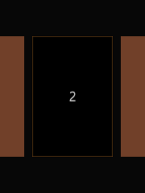
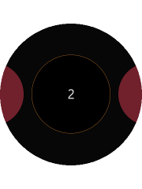

# Creating Thumbnails

You can create a thumbnail component with the SectionChanger API.

This feature is supported in wearable applications only.

The following figure shows the layout of the thumbnail component in a rectangular and circular UI.

**Figure: Thumbnail component on rectangular and circular devices**

 

To implement the thumbnail component:

1. Edit the HTML code to add the thumbnail component to your application screen:

   ```
   <div class="ui-page ui-page-active" id="sectionChangerPage" data-enable-page-scroll="false">
      <div id="sectionChanger" class="ui-content ui-section-changer">
         <div id="scroller">
            <section class="ui-section-active">
               <div class="thumbnail">1</div>
            </section>
            <section>
               <div class="thumbnail">2</div>
            </section>
            <section>
               <div class="thumbnail">3</div>
            </section>
         </div>
      </div>
   </div>
   ```

2. Edit the CSS code to set the visual style of the thumbnail:

   ```
   section {
      padding: 0 10px 0 10px;
      height: 100%;
   }
   .thumbnail {
      height: 300px;
      width: 200px;
      background-color: #80482f;
      top: 50%;
      transform: translate3d(0, -50%, 0);
      position: relative;
      text-align: center;
      line-height: 300px;
   }
   .ui-section-active .thumbnail {
      background-color: #000000;
      border: 1px solid #a06322;
   }

   @media all and (-tizen-geometric-shape: circle) {
      section {
         padding: 0;
      }
      .thumbnail {
         height: 200px;
         width: 200px;
         border-radius: 50%;
         background-color: #802532;
         top: 50%;
         position: relative;
         text-align: center;
         line-height: 200px;
         transform: scale(0.8) translate3d(0, -60%, 0);
         transition: transform 300ms;
      }
      .ui-section-active .thumbnail {
         transform: scale(1) translate3d(0, -50%, 0);
      }
   }
   ```

3. Edit the JavaScript code to manage the thumbnail events and other functionalities:

   ```
   (function() {
       var page = document.getElementById('sectionChangerPage'),
           sectionChanger = document.getElementById('sectionChanger');

       page.addEventListener('pagebeforeshow', function() {
           tau.widget.SectionChanger(sectionChanger, {
               orientation: 'horizontal',
               fillContent: false
           });
       });
   })();
   ```

## Related Information
* Dependencies   
   - Tizen 2.3.1 and Higher for Wearable
