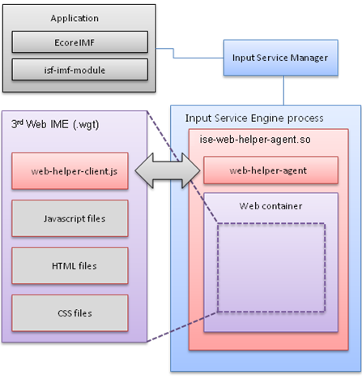

# IME Application

Tizen Web IME (Input Method Editor) applications are written in HTML5 for Tizen, combining HTML, JavaScript, and CSS into a package that can be installed on a Tizen device, such as Samsung Gear, or the Tizen emulator. Both the Tizen device and the emulator must run Tizen version 2.3 or higher to run Web IME applications.

This feature is supported in wearable applications only.

## Architecture

IME applications differ from other applications in that they do not follow the normal application life-cycle management and they need a mechanism to interact with the client application requesting the IME.

Tizen provides a special architecture to guarantee that Web IME applications work exactly like native IME applications, but with some restrictions due to capability limitations of Web applications in general. A Web IME application can be run within the core Input Service Engine process, which is also used to run native IME applications.

The following figure shows the overall architecture of the Tizen Web IME support.

**Figure: Tizen Web IME support architecture**



When a Web IME is executed, the Input Service framework launches the Input Service Engine process, as with native IME applications. The Input Service Engine process loads a special bridge IME module, `ise-web-helper-agent`, which executes a Web IME within its Web container and communicates with the executed Web IME.

The communication between the Web IME and the `ise-web-helper-agent` module is accomplished by 2 utility modules, `web-helper-agent` on the Web helper agent side and `web-helper-client` on the Web IME side. Therefore, a Web IME application must contain the `web-helper-client.js`, which is created automatically when you create a Web IME project using the Tizen Studio.

Since the Web IME runs within a Web container and communicates with it, as a Web IME application developer you do not need knowledge of the platform architecture or details of the native API. You can develop Web IME applications as if they were normal Web applications, as long as the `web-helper-client.js` file is included and properly used.

## Supported Application Types

Tizen Web IME can interact with 2 types of Tizen applications:

- In-house (native) application
- Downloaded (Web) application

The [Web container is executed by the core Input Service Engine process](#architecture), allowing the Web IME to provide text input services to both Web applications and in-house native applications.

## Supported APIs

All the APIs you can use for your Web IME are provided by the `WebHelperClient` object, which is accessible when you include the `web-helper-client.js` file in your Web IME project:

```
<script type="text/javascript" src="js/web-helper-client.js"></script>
```

The following table lists the `WebHelperClient` methods that you can invoke in your Web IME.

**Table: WebHelperClient methods**

| Method                                   | Description                              |
| ---------------------------------------- | ---------------------------------------- |
| `initialize(handler)`                    | Initializes the WebHelperClient object by registering a handler object. Before using the `WebHelperClient` functionalities, make sure to call this method passing the handler object as its parameter, which implements the event handlers that must be handled by the IME.<br><br>`handler` parameter: Handler object implementing the `on*` event handlers.<br><br>The following example shows how to initialize the `WebHelperClient` by passing a customized handler object.<br><br>var WebHelperClientHandler = {<br>&nbsp;&nbsp;&nbsp;&nbsp;onInit: function() {<br>&nbsp;&nbsp;&nbsp;&nbsp;&nbsp;&nbsp;&nbsp;&nbsp;/* Do what you want when your IME gets the INIT message */<br>&nbsp;&nbsp;&nbsp;&nbsp;}<br>};<br>WebHelperClient.initialize(WebHelperClientHandler); |
| `log(str)`                               | Leaves a dlog message.<br><br>`str` parameter: Log message to display. |
| `commitString(str)`                      | Commits a UTF-8 string to the client application directly.<br><br>`str` parameter: Byte array of the UTF-8 string to be committed. |
| `updatePreeditString(str)`               | Updates a new UTF-8 string for pre-edit.<br><br>`str` parameter: Byte array of the UTF-8 string to be updated. |
| `sendKeyEvent(code)`                     | Sends a key event to a client application.<br><br>`code` parameter: Key event to be sent. |
| `setKeyboardSizes(portraitWidth, portraitHeight, landscapeWidth, landscapeHeight)` | Updates the keyboard window geometry information.<br><br>You must specify the portrait and landscape sizes of the Web IME using this method, or the Web IME cannot be displayed correctly as the Input Service Engine process cannot resize the IME window to the desired size.<br><br>`portraitWidth` parameter: Width of the keyboard, when in portrait mode.<br>`portraitHeight` parameter: Height of the keyboard, when in portrait mode.<br>`landscapeWidth` parameter: Width of the keyboard, when in landscape mode.<br>`landscapeHeight` parameter: Height of the keyboard, when in landscape mode. |
| `setSelection(start_index, end_index)`   | Selects text.<br><br>`start_index` parameter: Text start position.<br>`end_index` parameter: Text end position. |
| `getSelection()`                         | Gets the selected text.                  |
| `getSurroundingText(maxlen_before, maxlen_after)` | Selects the surrounding text.<br><br>`maxlen_before` parameter: Max length before.<br>`maxlen_after` parameter: Max length after. |
| `deleteSurroundingText(offset, len)`     | Deletes the surrounding text.<br><br>`offset` parameter: Cursor position offset.<br>`len` parameter: Length of the text deletion. |

The following table lists the `WebHelperClient` enumerations that you can use when invoking the `sendKeyEvent()` and `forwardKeyEvent()` methods of the `WebHelperClient` object.

**Table: WebHelperClient enumerations**

| Enumeration                                   | Description                              |
| ---------------------------------------- | ---------------------------------------- |
| `Keycode`                    | Enumeration values used when invoking the `sendKeyEvent()` and `forwardKeyEvent()` methods.<br><br>Keycode example:<br><br>Keycode: {<br>&nbsp;&nbsp;&nbsp;&nbsp;BACKSPACE:0xff08,<br>&nbsp;&nbsp;&nbsp;&nbsp;TAB:0xff09,<br>&nbsp;&nbsp;&nbsp;&nbsp;RETURN:0xff0d,<br><br>&nbsp;&nbsp;&nbsp;&nbsp;ASCIITILDE:0x07e<br>}, |

You can display event notifications, such as client application requesting the IME, on the screen. In these cases, implement the event handlers in your handler  object, which you pass as a parameter of the `WebHelperClient` object `initialize()` method.

The following table lists the events that you can implement in your handler object.

**Table: Handler events**

| Event                                    | Description                              |
| ---------------------------------------- | ---------------------------------------- |
| `onInit()`                               | Handler for the initialization signal, used when the Web IME framework initialization is finished. |
| `onExit()`                               | Handler for the exit signal, used when this Web IME is about to be terminated. |
| `onFocusIn(inputContext)`                | Handler for the focus in signal, used to do something when the input context is focused in.<br><br>`inputContext` parameter: Handle of the client input context that sent this event. |
| `onFocusOut(inputContext)`               | Handler for the focus out signal, used to do something when the input context is focused out.<br><br>`inputContext` parameter: Handle of the client input context that sent this event. |
| `onShow(inputContext)`                   | Handler for the show signal, used to show the keyboard.<br><br>`inputContext` parameter: Handle of the client input context that sent this event. |
| `onHide(inputContext)`                   | Handler for the hide signal, used to hide the keyboard.<br><br>`inputContext` parameter: Handle of the client input context that sent this event. |
| `onSetRotation(degree)`                  | Handler for the rotation signal, used to notify that the keyboard is being rotated.<br><br>`degree` parameter: Angle that this keyboard is being rotated to. |
| `onUpdateCursorPosition(inputContext, position)` | Handler for the update cursor position signal, used to let the keyboard get the cursor position information.<br><br>`inputContext` parameter: Handle of the client input context that sent this event. |
| `onSetLanguage(language)`                | Handler for the set language signal, used to set the input language.<br><br>`language` parameter: Language to be set. |
| `onSetImdata(imdata)`                    | Handler for the set IM data signal, used to send IM data to the keyboard.<br><br>`imdata` parameter: IM data to be set. |
| `onGetImdata()`                          | Handler for the get IM data signal, used to get IM data from the keyboard.<br><br>This method returns the current IM data value. |
| `onSetReturnKeyType(type)`               | Handler for the set return key type signal, used to set the return key type to the keyboard.<br><br>`type` parameter: Type of the return key to be set; the following values are acceptable:<br><br>`"default"`<br>`"done"`<br>`"go"`<br>`"join"`<br>`"login"`<br>`"next"`<br>`"search"`<br>`"send"`<br>`"signin"` |
| `onGetReturnKeyType()`                   | Handler for the get return key type signal, used to get the return key type from the keyboard.<br>This method returns the current return key type value, which is one of the values introduced in the `onSetReturnKeyType()` event. |
| `onSetReturnKeyDisable(disabled)`        | Handler for the set return key disable signal, used to set the return key disabled state to the keyboard.<br>`disabled` parameter: Value that indicates whether the return key must be disabled. |
| `onGetReturnKeyDisable()`                | Handler for the get return key disable signal, used to get the return key disabled state from the keyboard.<br>This method returns the current return key disabled state value. |
| `onSetLayout(layout)`                    | Handler for the set virtual keyboard layout signal, used to set the virtual keyboard layout.<br>`layout` parameter: Virtual keyboard layout value to be set; the following values are acceptable:<br><br>`"normal"`<br>`"number"`<br>`"email"`<br>`"url"`<br>`"phonenumber"`<br>`"ip"`<br>`"month"`<br>`"numberonly"`<br>`"password"`<br>`"datetime"` |
| `onGetLayout()`                          | Handler for the get virtual keyboard layout signal, used to get the virtual keyboard layout.<br><br>This method returns the current virtual keyboard layout value, which is one of the values introduced in `onSetLayout()` event. |
| `onResetInputContext(inputContext)`      | Handler for the reset input context signal, used to reset the keyboard input context.<br><br>`inputContext` parameter: Handle of the client input context that sent this event. |
| `onProcessKeyEvent(code, mask, layout)`  | Handler for the process key event signal.<br><br>`code` parameter: Key code of the current key event.<br>`mask` parameter: Modifier mask of the current key event.<br>`layout` parameter: Hardware keyboard layout identifier.<br><br>This method returns `true` if the event is processed; otherwise it is forwarded to the client application. |
| `onUpdateSurroundingText(cursor, text)`  | Handler for the surrounding text signal update.<br><br>`cursor` parameter: Cursor position.<Br>`text` parameter: Surrounding text near the cursor. |
| `onUpdateSelection(text)`                | Handler for the selection signal update.<br><br>`text` parameter: Currently selected text. |

> **Note**  
> The Device APIs are currently not supported in Web IME applications. Device API support is expected to be included in the next version.

## Web IME Configuration

The Web IME configuration follows the Tizen packaging policy with certain extensions. Tizen applications are packaged according to the [Widget packaging guidelines](https://www.w3.org/TR/2011/REC-widgets-20110927/). For more information on Tizen extensions to configuration elements, see [Configuration Elements](../../../tizen-studio/web-tools/config-editor.md#elements) and [Extending Configuration Elements](../../../tizen-studio/web-tools/config-editor.md#ww_extend).

Internally, the application package manager is responsible for installing, uninstalling, and updating packages and storing their information.

Tizen has the following additional configuration elements:

- `tizen:category`  
   To identify with other IMEs, the Web IME application must contain the UUID information.

  ```
  <tizen:category name="http://tizen.org/category/ime"/>
  ```

- `tizen:uuid`  
   Added to identify the Web IME application type. If this element is defined, the application type is IME.

  > **Note**  
  > The Device APIs are currently not supported in Web IME applications. Device API support is expected to be included in the next version.

  ```
  <tizen:uuid>6153122a-a429-40d2-ef21-a75f468c202c</tizen:uuid>
  ```

- `tizen:languages`  
    The locale string in the `<tizen:language>` element can be used to display the input language the specific Input Method Editor supports. The `<tizen:languages>` parent element can have more than 1 `<tizen:language>` child element.

  ```
  <tizen:languages>
     <tizen:language>en-us</tizen:language>
     <tizen:language>en-gb</tizen:language>
  </tizen:languages>
  ```

> **Note**  
> 2-letter primary codes are reserved for [ISO639] language abbreviations. 2-letter codes include `fr` (French), `de` (German), `it` (Italian), `nl` (Dutch), `el` (Greek), `es` (Spanish), `pt` (Portuguese), `ar` (Arabic), `he` (Hebrew), `ru` (Russian), `zh` (Chinese), `ja` (Japanese), `hi` (Hindi), `ur` (Urdu), and `sa` (Sanskrit).  
> 
> Any 2-letter subcode is understood to be a [ISO3166] country code. For more information, see [http://www.w3.org/TR/html401/struct/dirlang.html](http://www.w3.org/TR/html401/struct/dirlang.html).

## Hardware Key Events

The Web IME is capable of not only showing a soft keyboard and emitting key events to the client application, but also handling hardware key events and translating them to a specific language. This is very common when entering texts in CJK (Chinese, Japanese, and Korean) languages, where each key event must be composed to produce a final result string.

When a hardware key is pressed, the client application receives the key event and requests the Input Service framework to translate the key event. The request is then delivered to the currently selected Web IME through the event handler.

When creating the handler object for `WebHelperClient`, implement the `onProcessKeyEvent()` method if you want to translate each hardware key event.

The following example translates the key event to a string "ㅁ", which is a Korean character mapped to the `a` key event.

> **Note**  
> To provide full support for Korean character composition, a more complex process is needed. This example is only a demonstration.

```
var WebHelperClientHandler = {
    onProcessKeyEvent: function(code, mask, layout) {
        if (code == WebHelperClient.Keycode.a) {
            WebHelperClient.commitString('ㅁ');

            return true;
        } else {
            return false;
        }
    }
};
WebHelperClient.initialize(WebHelperClientHandler);
```

When the processing of a hardware key event is completed, the `onProcessKeyEvent` event handler must return `true`. Otherwise, the client application considers the Web IME as not reacting to the key event, and tries to invoke its fallback handler, which appends an additional `a` to the committed "ㅁ" string.

## Key Events, Commit Strings, and Pre-edit Strings

Key events, commit strings and pre-edit strings are needed to send appropriate messages to the client application.

Key events, when sent to the client application, use the same process as when a hardware key is pressed. Therefore, sending a key event to the client application using the `sendKeyEvent()` method calls the Web IME `onProcessKeyEvent()` event handler.

To prevent the key event from being sent back to the Web IME (as there is no need to translate that key event again), use the `forwardKeyEvent()` method that invokes the client application's fallback key event handler.

```
<script type="text/javascript">
    /* Trigger the Web IME onProcessKeyEvent() event handler */
    WebHelperClient.sendKeyEvent(WebHelperClient.Keycode.a);
    /* Do NOT trigger the Web IME onProcessKeyEvent() event handler */
    WebHelperClient.forwardKeyEvent(WebHelperClient.Keycode.SEMICOLON);
</script>
```

To send a batch of strings simultaneously, without generating key events for each of the component of a specific string, use the `commitString()` method:

```
/*
   Generate the 'a' key event in the client application
   'a' is appended to the client application's editable widget
*/
WebHelperClient.forwardKeyEvent(WebHelperClient.Keycode.a);
/*
   Append the string 'www.' to the client application's editable widget,
   without generating key events
*/
WebHelperClient.commitString('www.');
```

To display a pre-edit string (a string that has not been finalized and can be substituted with another string), use the `updatePreeditString()` method:

```
/*
   Show the pre-edit string 'abc', usually marked with an underline or highlight
*/
WebHelperClient.updatePreeditString('abc');
/*
   Substitute the 'abc' pre-edit string with a new pre-edit string 'def' on the editable widget
*/
WebHelperClient.updatePreeditString('def');
```

## Web IME Life-cycle

The Web IME applications have exactly the same life-cycle as the native IME applications. They have 4 states: unloaded, invisible, visible, and terminated.

A Web IME in the unloaded state is loaded and transferred to the invisible state when:

- The system starts.
- The Web IME is selected in setting the application keyboard selection menu.

The invisible state changes to the visible state when the Web IME receives a request from a client application to show the IME, and decides to show itself according to the request. This process is usually initiated by the user touching the editable widget area. In contrast, the visible state changes back to the invisible state when the Web IME receives a hide request message due to the loss of focus in the client application and decides to hide itself. On occasion, the Web IME can hide itself without a request from client application, for example, when the Web IME provides a **Hide keyboard** button within the soft keyboard, and hides itself when the button is pressed.

A Web IME in the visible or invisible state can move on to the terminated state when:

- The system is shut down.
- A different Web IME is selected in setting the application keyboard selection menu.

## Sample IME Application

To create an IME application:

1. To create the Web IME project, launch the Tizen Studio and go to **File > New > Tizen Project**.
2. In the Project Wizard, select **Template** as the project type, **WEARABLE** profile and applicable version, **Web Application** type, and **Web Input Method Editor** template.
3. Enter the project name and click **Finish**.   

4. Modify the source code in, for example, the `index.html` and `style.css` files, as needed.
5. Install the Web IME package  on the emulator. To run the application, go to **Run As > Tizen Web Application**.
6. In the emulator, change the default keyboard with the Web IME you developed in **Setting > Text input**.   


## Related Information
* Dependencies
  - Tizen 2.3.1 and Higher for Wearable
