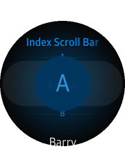

# Creating Index Scroll Bars

You can create a circle- or rectangle-shaped index scroll bar component with the CircularIndexScrollBar and IndexScrollBar APIs.

This feature is supported in wearable applications only.

The following figure shows the layout of the index scroll bar component in a rectangular and circular UI.

**Figure: Index scroll bar component on rectangular and circular devices**

  

To implement the index scroll bar component:

1. Edit the HTML code to add the component to your application screen:

   ```
   <div class="ui-page ui-page-active" id="pageIndexScrollbar">
      <header class="ui-header ui-header-small">
         <h2 class="ui-title ui-title-text-fadeout">Index Scroll Bar</h2>
      </header>
      <div id="indexscrollbar"></div>
      <section class="ui-content">
         <ul class="ui-listview ui-snap-listview" id="list1">
            <li class="ui-listview-divider">A</li>
            <li>Anton</li>
            <li class="ui-listview-divider">B</li>
            <li>Barry</li>
            <li>Bob</li>
            <li class="ui-listview-divider">C</li>
            <li>Carry</li>
            <li class="ui-listview-divider">D</li>
            <li>Daisy</li>
            <li class="ui-listview-divider">E</li>
            <li>Eric</li>
            <li class="ui-listview-divider">F</li>
            <li>Fay</li>
            <li class="ui-listview-divider">G</li>
            <li>Garry</li>
          </ul>
      </section>
   </div>
   ```

2. Edit the JavaScript code to manage the index scroll bar events and other functionality:

   To create a component selectively:

   ```
   var indexScrollbarElement = document.getElementById('indexscrollbar');

   if (!tau.support.shape.circle) {
       /* Create IndexScrollbar */
       indexScrollbar = new tau.widget.IndexScrollbar(indexScrollbarElement);
   } else {
       /* Create CircularIndexScrollbar */
       indexScrollbar = new tau.widget.CircularIndexScrollbar(indexScrollbarElement);
   }
   ```

   To use the callback:

   ```
   indexScrollbarElement.addEventListener('select', function(event) {
       var index = event.detail.index;
       /* Do something using the index */
       console.log(index);
   });
   ```

   In the following example, the list scrolls to the position of the list item defined using the `ui-listview-divider` class, selected by the index scroll bar.

   Note that in a rectangular UI, touching the index generates the selection, but in a round UI, the selection occurs when using the rotary.

   ```
   (function() {
       var page = document.getElementById('pageIndexScrollbar'),
           listviewElement = document.getElementById('list1'),
           isCircle = tau.support.shape.circle,
           scroller,
           indexScrollbar;

       page.addEventListener('pageshow', function(ev) {
           var indexScrollbarElement = document.getElementById('indexscrollbar'),
               /* List dividers */
               listDividers = listviewElement.getElementsByClassName('ui-listview-divider'),
               dividers = {}, /* Collection of list dividers */
               indices = [], /* Index list */
               divider,
               i, idx;

           /* For all list dividers */
           for (i = 0; i < listDividers.length; i++) {
               /* Add the list divider elements to the collection */
               divider = listDividers[i];
               idx = divider.innerText;
               dividers[idx] = divider;

               /* Add the index to the index list */
               indices.push(idx);
           }

           scroller = tau.util.selectors.getScrollableParent(listviewElement);

           if (!isCircle) {
               indexScrollbar = new tau.widget.IndexScrollbar(indexScrollbarElement, {index: indices, container: scroller});
           } else {
               /* Create IndexScrollbar */
               indexScrollbar = new tau.widget.CircularIndexScrollbar(indexScrollbarElement, {index: indices});

               /* Add SnapListview item 'selected' event handler */
               listviewElement.addEventListener('selected', function(ev) {
                   var indexValue = ev.target.textContent[0];
                   indexScrollbar.value(indexValue);
               });
           }

           /* Add IndexScrollbar index 'select' event handler */
           indexScrollbarElement.addEventListener('select', function(ev) {
               var divider,
                   idx = ev.detail.index;

               divider = dividers[idx];
               if (divider && scroller) {
                   /* Scroll to the ui-listview-divider element */
                   scroller.scrollTop = divider.offsetTop - scroller.offsetTop;
               }
           });
       });

       page.addEventListener('pagehide', function(ev) {
           indexScrollbar.destroy();
       });
   }());
   ```

## Related Information
* Dependencies   
   - Tizen 2.3.1 and Higher for Wearable
