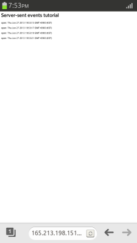
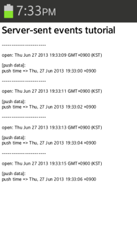

# Server-Sent Events

The Server-Sent Events feature is used to implement server push functionality in a Web environment. The server push feature has evolved over time from a hidden IFrame through Ajax polling and Comet to the current implementation of server-sent events.

This feature is optional.

The Server-Sent Events API defines a simple data structure and interface, and a communication mechanism to realize the server push. In addition, it can handle the received data in the general DOM event format. However, the API repeatedly requests the data from the client to the server, so it is not a complete server push. The repeat period of the server request is determined by the `retry` field value of the [event stream data](https://html.spec.whatwg.org/multipage/server-sent-events.html#event-stream-interpretation){:target="_blank"}. If the value is not defined, the repeat period is the default value of the browser.

The main features of the Server-Sent Events API include the following:

- Creating an [EventSource](https://html.spec.whatwg.org/multipage/server-sent-events.html#the-eventsource-interface){:target="_blank"} instance

  The `EventSource` interface is the core object of server-sent event implementation. [Creating a new EventSource instance](#trigger-server-push-requests) triggers repeated server request automatically, and allows you to use the receiving data event. When creating the `EventSource` instance, you must use the URL of the server page sending the event stream as a parameter.

- Receiving server push data

  After triggering the server requests, you can [receive push data from the server](#receive-server-push-data) by implementing the [message](https://html.spec.whatwg.org/multipage/images.html#images-processing-model){:target="_blank"} event.

  The received event stream data is parsed as a [MessageEvent](https://html.spec.whatwg.org/multipage/comms.html#the-messageevent-interface){:target="_blank"} object, to make the target data easily accessible.

## Trigger server push requests

To take advantage of the server push feature, you must learn to connect to the server to request push data:

1. Create an [EventSource](https://html.spec.whatwg.org/multipage/server-sent-events.html#the-eventsource-interface){:target="_blank"} interface instance:

   ```
   <script>
       var serverPage = 'http://165.213.198.151:8080/server_sent_events_server.php';
       var eventSource = new EventSource(serverPage);
   ```

   > [!NOTE]
   > For the server push to work, the `serverPage` parameter must contain the actual push server URL.

2. Implement the event handler for the [open](https://html.spec.whatwg.org/multipage/images.html#images-processing-model){:target="_blank"} event:

   ```
       var log = document.getElementById('log')

       /* Open event */
       eventSource.onopen = function(e) {
           log.innerHTML += '<p>open: ' + new Date() + '</p>';
       };
   </script>
   ```

   The `open` event is triggered repeatedly based on the `retry` value of the [event stream data format](https://html.spec.whatwg.org/multipage/server-sent-events.html#event-stream-interpretation){:target="_blank"}, to request push messages from the server.

In the following figure, the `open` event is fired every 2 seconds.

**Figure: Push request event**



### Source code

For the complete source code related to this use case, see the following files:

- [server_sent_events_client1.html](http://download.tizen.org/misc/examples/w3c_html5/communication/server_sent_events){:target="_blank"}
- [server_sent_events_server.php](http://download.tizen.org/misc/examples/w3c_html5/communication/server_sent_events){:target="_blank"}

## Receive server push data

To take advantage of the server push feature, you must learn to handle the push data events:

1. Define the data server that the client connects to, according to the [event stream interpretation rules](https://html.spec.whatwg.org/multipage/server-sent-events.html#event-stream-interpretation){:target="_blank"}.

   Set the [MIME type](https://html.spec.whatwg.org/multipage/iana.html#iana){:target="_blank"} to `text/event-stream` so that the event stream can be sent, and set the header not to be cached:

   ```
   <?php
      header('Content-Type: text/event-stream');
      header('Cache-Control: no-cache');

      echo "retry: 2000\n\n"; /* Reconnection interval */
      echo "data: push time => ". date('r') . "\n\n";

      flush();
   ?>
   ```

2. Create an [EventSource](https://html.spec.whatwg.org/multipage/server-sent-events.html#the-eventsource-interface){:target="_blank"} interface instance and implement the event handler for the [message](https://html.spec.whatwg.org/multipage/images.html#images-processing-model){:target="_blank"} event:

   ```
   <script>
       var serverPage = 'http://localhost/server_sent_events_server.php';
       var eventSource = new EventSource(serverPage);
       var log = document.getElementById('log');

       /* Open event */
       eventSource.onopen = function(e) {
           log.innerHTML += '<p>-----------------------</p>';
           log.innerHTML += '<p>open: ' + new Date() + '</p>';
       };

       /* message event */
       eventSource.onmessage = function(e) {
           log.innerHTML += '<p>[push data]: <br/>' + e.data + '</p>';
       };
   </script>
   ```

In the following figure, the `open` event is fired every 2 seconds and the `message` event shows that push data is received.

**Figure: Push message event**



### Source code

For the complete source code related to this use case, see the following files:

- [server_sent_events_client2.html](http://download.tizen.org/misc/examples/w3c_html5/communication/server_sent_events){:target="_blank"}
- [server_sent_events_server.php](http://download.tizen.org/misc/examples/w3c_html5/communication/server_sent_events){:target="_blank"}

## Related information
* Dependencies
  - Tizen 3.0 and Higher for TV
* API References
  - [W3C](https://html.spec.whatwg.org/multipage/server-sent-events.html#the-eventsource-interface){:target="_blank"}
