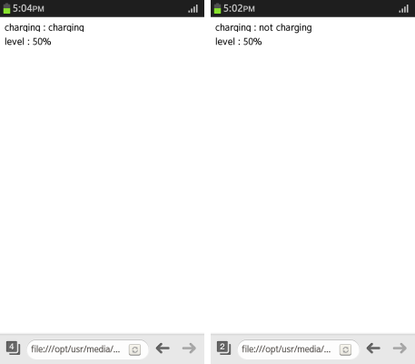

# Battery Status

You can programmatically determine the battery status of the device on which your application is running.

This feature is supported in mobile and wearable applications only.

The main features of the Battery Status API include:

- Retrieving the battery status   

  You can use the attributes of the `BatteryManager` interface (in [mobile](https://www.w3.org/TR/2016/CR-battery-status-20160707/#the-batterymanager-interface) and [wearable](http://www.w3.org/TR/2012/CR-battery-status-20120508/#batterymanager-interface) applications) to [check the battery status information](#retrieving-battery-status-information), such as battery charging status and battery charge level.

- Detecting battery status changes

  You can set event listeners with the `BatteryManager` interface attributes to [detect changes in the battery status](#detecting-battery-status-changes).

Knowing the battery status of the device helps you to defer or scale back work when the device is not charging or is low on battery. For example:

- A Web-based email client can modify how often it checks the server for new email depending on the battery status. It can make the check every few seconds if the device is charging or has a full battery, but less often if the device is not charging or is low on battery.
- A Web-based word processor can monitor the battery level and prevent data loss by saving any changes before the battery runs out.

## Retrieving Battery Status Information

To enhance the user interaction with the device, you must learn to retrieve and display the battery status:

1. Define the elements used to display the battery status information on the screen:

   ```
   <div>charging: <span id="charging"></span></div>
   <div>level: <span id="level"></span></div>
   ```

2. Check whether the Battery Status API is supported. If it is supported, the object navigator area contains the `battery` property:

   ```
   <script>
       /* As Tizen is webkit-based, it uses the webkit prefix */
       var battery = navigator.battery || navigator.webkitBattery || navigator.mozBattery;
   </script>
   ```

3. Use the attributes of the `BatteryManager` interface (in [mobile](https://www.w3.org/TR/2016/CR-battery-status-20160707/#the-batterymanager-interface) and [wearable](http://www.w3.org/TR/2012/CR-battery-status-20120508/#batterymanager-interface) applications) to display the battery charging status and battery charge level:

   ```
   <script>
       window.addEventListener('load', function(e) {
           /* Charging status: true or false */
           document.querySelector('#charging').textContent = battery.charging ? 'charging' : 'not charging';

           /* Battery.level: between 0 and 1 (for example, 0.50) */
           document.querySelector('#level').textContent = Math.floor(battery.level * 100) + '%';
       }, false);
   </script>
   ```

**Figure: Displaying battery status (in mobile applications only)**



### Source Code

For the complete source code related to this use case, see the following file:

- [show_battery_state.htm](http://download.tizen.org/misc/examples/w3c_html5/device/battery_status_api)

## Detecting Battery Status Changes

To enhance the user interaction with the device, you must learn to set event handlers to detect changes in the battery status:

1. Define the elements used to display the battery status change information on the screen:

   ```
   <div id="charging"></div>
   <div>
      <progress id="progress" value="0" max="100"></progress>
      <span id="level"></span>
   </div>
   <div id="message"></div>
   ```

2. Check whether the Battery Status API is supported. If it is supported, the object navigator area contains the `battery` property:

   ```
   <script>
       /* As Tizen is webkit-based, it uses the webkit prefix */
       var battery = navigator.battery || navigator.mozBattery || navigator.webkitBattery;
   </script>
   ```

3. Set event listeners with the `BatteryManager` interface (in [mobile](https://www.w3.org/TR/2016/CR-battery-status-20160707/#the-batterymanager-interface) and [wearable](http://www.w3.org/TR/2012/CR-battery-status-20120508/#batterymanager-interface) applications) attributes to detect changes in the battery status:

   ```
   <script>
       window.addEventListener('load', getBatteryState);

       /* Detects changes in the battery charging status */
       battery.addEventListener('chargingchange', getBatteryState);
       /* Detects changes in the battery level */
       battery.addEventListener('levelchange', getBatteryState);
   </script>
   ```

4. Display the battery state information when a change occurs:

   ```
   <script>
       function getBatteryState() {
           var message = '';

           var charging = battery.charging;
           var level = Math.floor(battery.level * 100);

           if (charging == false && level < 100) {
               /* Not charging */
               }
           } else if (level == 100) {
               message = 'Charging is completed';
           }

           document.querySelector('#charging').textContent = charging ? 'charging...' : 'Please connect the charger.';
           document.querySelector('#level').textContent = level + '%';
           document.querySelector('#progress').value = level;
           document.querySelector('#message').textContent = message;
       }
   </script>
   ```

   If the battery is not charging, a message is displayed telling you to charge the battery.

   You can use a progress bar to display the battery charge level.

**Figure: Battery status (in mobile applications only)**


### Source Code

For the complete source code related to this use case, see the following file:

- [battery_event.htm](http://download.tizen.org/misc/examples/w3c_html5/device/battery_status_api)

## Related Information
* Dependencies
  - Tizen 2.4 and Higher for Mobile
  - Tizen 2.3.1 and Higher for Wearable
