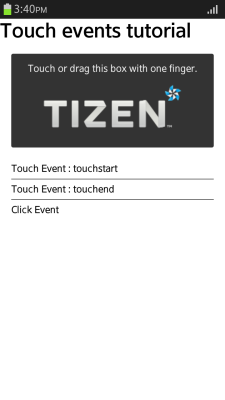
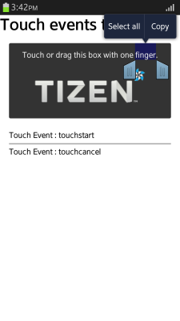

# Touch Events

As there is no mouse on a mobile device, user actions must be handled with touch events instead of mouse events.

This feature is supported in mobile and wearable applications only.

The main touch event features include:

- Touch event types

  You can [define event handlers](#handling-touch-events) for different types of touch events:

  - [touchstart](http://www.w3.org/TR/2013/REC-touch-events-20131010/#the-touchstart-event) handles an event which occurs when a finger comes in contact with the device screen.
  - [touchmove](http://www.w3.org/TR/2013/REC-touch-events-20131010/#the-touchmove-event) handles an event which occurs when a finger moves while it is in contact with the screen.
  - [touchend](http://www.w3.org/TR/2013/REC-touch-events-20131010/#the-touchend-event) handles an event which occurs when a finger is removed from the screen.
  - [touchcancel](http://www.w3.org/TR/2013/REC-touch-events-20131010/#the-touchcancel-event) handles an event which occurs when a touch is cancelled.

  These events are similar to the `mousedown`, `mousemove`, and `mouseup` mouse events.

- Touch point coordinate

  When a touch event occurs, you can [retrieve the coordinate of the event point occurrence](#retrieving-the-event-point-occurrence). Because the finger, and consequently the contact area of the screen, is quite large, the retrieved coordinate is the average value of the contact area.

  Since a mobile device has no sub-devices to provide event inputs, you can use gesture events, such as the page turning effect or image drawing, based on the finger movement coordinates of the `touchmove` event.

- Multi-point touch control

  Unlike with mouse events, multiple concurrent touch events (represented by the [Touch](http://www.w3.org/TR/2013/REC-touch-events-20131010/#idl-def-Touch) interface) can occur. To [control multi-point touch events](#controlling-multi-point-touches), the [TouchList](http://www.w3.org/TR/2013/REC-touch-events-20131010/#idl-def-TouchList) interface is used to save the respective event status (based on the `touches`, `targetTouches`, and `changedTouches` attributes). The status stored in the `TouchList` instance is renewed every time a new touch event occurs.

A touch-based mobile operating system uses tap and double-tap gestures. The tap is used to generate a click event, and double-tap used for zooming. To recognize the touch gestures, the OS sets a timer which starts at the first tap and checks for a second before the event is fired. This causes a delay in the single tap event, making the touch responsiveness of the application suffer.  To avoid the delay, you can [enhance the touch event responsiveness](#enhancing-touch-responsiveness) by making the page unscalable, or modifying touch responses.

## Handling Touch Events

Depending on the touch type, different touch events occur:

- When the user first touches the element and removes their finger from the screen, the [touchstart](http://www.w3.org/TR/2013/REC-touch-events-20131010/#the-touchstart-event) and [touchend](http://www.w3.org/TR/2013/REC-touch-events-20131010/#the-touchend-event) events occur.  
**Figure: Simple touch (in mobile applications only)**  


- When the user moves their finger across the element, and then removes their finger, the `touchstart`, [touchmove](http://www.w3.org/TR/2013/REC-touch-events-20131010/#the-touchmove-event), and `touchend` events occur.  
**Figure: Moving touch (in mobile applications only)**  


- When the user long-presses the DOM element, such as text or image, in the element, the `touchstart` and [touchcancel](http://www.w3.org/TR/2013/REC-touch-events-20131010/#the-touchcancel-event) events occur.  
**Figure: Canceling touch with a long press (in mobile applications only)**  


  > **Note**  
  > In Tizen, the `touchcancel` event occurs when a context menu is activated by a long press of a DOM element, such as text or image.

Learning how to handle touch events improves the user interaction of your application:

1. Define the element from which you want to trigger touch events. In this case, an area with a text and an image is defined as an element.

   ```
   <div id="touchable">
      Touch or drag this box with one finger.
      
   </div>
   <div id="log"></div>
   ```

2. Add event handlers for the defined element:

   ```
   <script>
       var log = document.querySelector('log');
       var touchable = document.querySelector('touchable');

       /* touchstart event */
       touchable.addEventListener('touchstart', function(e) {
           log.innerHTML = '<p>Touch Event: touchstart</p>';
       }, false);

       /* touchend event */
       touchable.addEventListener('touchend', function(e) {
           log.innerHTML += '<p>Touch Event: touchend</p>';
       }, false);

       /* touchmove event */
       touchable.addEventListener('touchmove', function(e) {
           log.innerHTML += '<p>Touch Event: touchmove</p>';
       }, false);

       /* touchcancel event */
       touchable.addEventListener('touchcancel', function(e) {
           log.innerHTML += '<p>Touch Event: touchcancel</p>';
       }, false);
   </script>
   ```

> **Note**  
> Since the device input takes place by touching the screen, sometimes the features of your application and the browser can respond simultaneously to the same touch event. To prevent the unintended effects (for example, the customized gesture and the browser scroll operating simultaneously), use the `preventDefault()` method to prevent the basic browser events:
>
>```
><script>
>    touchable.addEventListener('touchmove', function(e) {
>        if (event.touches.length >= 1) {
>            log.innerHTML += '<p>Touch Event: touchmove</p>';
>            e.preventDefault(); /* Prevent default scroll action */
>        }
>    }, false);
></script>
>```


### Source Code

For the complete source code related to this use case, see the following file:

- [touch_event_types.html](http://download.tizen.org/misc/examples/w3c_html5/device/touch_events_version_1)

## Retrieving the Event Point Occurrence

Learning how to retrieve the coordinate of the touch event point occurrence improves the user interaction of your application:

1. Define the element from which you want to trigger touch events. In this case, an area with a text is defined as an element.

   ```
   <div id="touchable">
      Touch and move this box with one finger.
   </div>
   <div id="log"></div>
   ```

2. Add an event listener and handler for the [touchmove](http://www.w3.org/TR/2013/REC-touch-events-20131010/#the-touchmove-event) event to the defined element:

   ```
   <script>
       var log = document.getElementById('log');
       var touchable = document.getElementById('touchable');

       /* touchmove event */
       touchable.addEventListener('touchmove', phaseCalcul, false);

       function phaseCalcul(e) {
           var pTarget = e.touches.item(0);

           log.innerHTML = '<strong>pageX:</strong> ' + pTarget.pageX +
                           '<br/><strong>pageY:</strong> ' + pTarget.pageY +
                           '<br/><strong>clientX:</strong> ' + pTarget.clientX +
                           '<br/><strong>clientY:</strong> ' + pTarget.clientY +
                           '<br/><strong>screenX:</strong> ' + pTarget.screenX +
                           '<br/><strong>screenY:</strong> ' + pTarget.screenY;

           e.preventDefault();
       }
   </script>
   ```

   Each time the `touchmove` event is triggered, the position of the touch point is renewed. The position is returned in 2D coordinates of the page, client, and screen. You can use the position to compare the coordinates to the [touchstart](http://www.w3.org/TR/2013/REC-touch-events-20131010/#the-touchstart-event) and [touchend](http://www.w3.org/TR/2013/REC-touch-events-20131010/#the-touchend-event) events, and to analyze the gesture of the user by using the consequent `touchmove` events to determine the movement direction.

### Source Code

For the complete source code related to this use case, see the following file:

- [event_handling_prevent_default.html](http://download.tizen.org/misc/examples/w3c_html5/device/touch_events_version_1)

## Controlling Multi-point Touches

Learning how to control multiple concurrent touch events improves the user interaction of your application:

1. Define the element from which you want to trigger touch events. In this case, an area with a text is defined as an element.

   ```
   <div id="touchable"> Touch this box with two finger. </div>
   ```

2. Add an event listener and handler for the [touchstart](http://www.w3.org/TR/2013/REC-touch-events-20131010/#the-touchstart-event) event to the defined element:

   ```
   <script>
       var touchable = document.getElementById('touchable');

       /* touchstart event */
       touchable.addEventListener('touchstart', touchStartHandler, false);

       function touchStartHandler(e) {
           /* Return if there is no multi-point touch */
           if (e.touches.length < 2) return;

           var width = Math.abs(e.touches.item(0).clientX - e.touches.item(1).clientX);
           var height = Math.abs(e.touches.item(0).clientY - e.touches.item(1).clientY);

           /* Create a new image object instance */
           var tizenLogo = document.createElement('img');
           tizenLogo.setAttribute('src', 'sample_image.png');
           tizenLogo.setAttribute('width', width);
           tizenLogo.setAttribute('height', height);
           tizenLogo.style.position = 'absolute';

           /* Assign the position where the image is shown based on the touch point */
           tizenLogo.style.left = (e.touches.item(0).pageX + e.touches.item(1).pageX - width) / 2 + 'px';
           tizenLogo.style.top = (e.touches.item(0).pageY + e.touches.item(1).pageY - height) / 2 + 'px';

           this.appendChild(tizenLogo);
       }
   </script>
   ```

   When a touch events is triggered, its details, such as the event coordinates, identification number, and the subject of the touch, are stored in the [Touch](http://www.w3.org/TR/2013/REC-touch-events-20131010/#idl-def-Touch) interface instance. To access the details, the `touches.item()` method can be used in an array format.  
   A multi-point touch event refers to additional instances being pushed to the `touches.item(index)` array. For example, the first touch event is pushed to `touches.item(0)`, and if a second touch event is triggered without removing the first finger from the screen, the second event is pushed to `touches.item(1)`.

### Source Code

For the complete source code related to this use case, see the following file:

- [multi_touch.html](http://download.tizen.org/misc/examples/w3c_html5/device/touch_events_version_1)

## Enhancing Touch Responsiveness

To avoid having a delay in the single tap gesture, you can make the page unscalable, or modify touch responses:

- Make a page unscalable:

  If a page is made unscalable, the double-tap gesture is not required for zooming, so the single tap gesture can be processed without delay. To make a page unscalable, use the `viewport` meta tag:

  ```
  <meta name="viewport"
        content="width=device-width, initial-scale=1.0, minimum-scale=1.0,
                 maximum-scale=1.0, user-scalable=0">
  ```

- Modify touch responses

  A touch event occurs immediately when the touched point is released, making it faster than the tap event. However, the touch event occurs even though the touched point is moved before releasing.

  - To avoid processing the gesture when the touched point is moved, check whether the touched point is moved by setting a flag in the `touchmove()` event handler:

    ```
    <a id="test" href="#">Click test using touch event</a>
    <div id="log"></div>
    <script>
        var moved = false;

        $('#test').on('touchstart', function(e) {
            moved = false;
        });

        $('#test').on('touchmove', function(e) {
            moved = true;
        });

        $('#test').on('touchend', function(e) {
            if (!moved)
                $('#log').innerHTML = 'Test link is clicked!';

            return false;
        });
    </script>
    ```

    To avoid activating the click event after the touch event, set the return type to `false`.

  - You can also use the `vclick` event provided by jQuery Mobile. The `vclick` event is based on the touch event and generated only if the touched point is not moved.

    ```
    <a id="test" href="#">Click test using touch event</a>
    <div id="log"></div>
    <script>
        $('#test').on('vclick', function(e) {
            $('#log').html('Test link is clicked!');

            return false;
        });
    </script>
    ```

## Related Information
* Dependencies    
  - Tizen 2.4 and Higher for Mobile
  - Tizen 2.3.1 and Higher for Wearable
