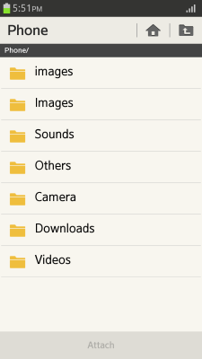
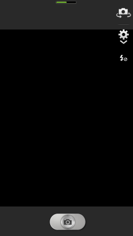

# HTML Media Capture

Media capture uses the `capture` attribute of the [HTMLInputElement](http://www.w3.org/TR/2012/WD-html-media-capture-20120712/#dfn-htmlinputelement) interface to [activate features](#activating-the-media-capture), such as camera or microphone, to enable direct media capture when the user is uploading a file.

This feature is supported in mobile applications only.

The following media formats can be used with the `capture` attribute:

- `filesystem`  
 Activates the device file picker.

- `camera`  
 Activates the device camera.

- `camcorder`  
 Activates the device video camera.

- `microphone`  
Activates the device sound recorder.

## Activating the Media Capture

To provide users with the HTML media capture feature, you must learn to activate the media capture feature by selecting the file type during file upload:

1. Activate the media capture feature by adding the `capture` attribute to the `<input>` element:

   ```
   <input type="file" capture="filesystem"/>
   ```

   

2. Assign format, such as `filesystem`, `camera`, or `camcorder`:

   ```
   <input type="file" accept="audio/*" capture="camera"/>
   <input type="file" accept="image/*" capture="camcorder"/>
   <input type="file" accept="video/*" capture="microphone"/>
   ```

    If the `capture` attribute does not exist or the value has not been entered, the `filesystem` format is activated. If the `camera` or `camcorder` format is selected, the device camera is activated.

    > **Note**  
    > In the current version of the Tizen Studio, the `microphone` format for the capture attribute is not available as the voice recorder application is not included.

   The `accept` attribute (in [mobile](http://www.w3.org/TR/2014/REC-html5-20141028/forms.html#attr-input-accept) and [wearable](https://www.w3.org/TR/2014/CR-html5-20140429/forms.html#attr-input-accept) applications) indicates which file types are appropriate. If used with a device that has a camera, it activates the device camera. With a device without a camera, it activates the My photo folder.

   

### Source Code

For the complete source code related to this use case, see the following file:

- [media_capture.html](http://download.tizen.org/misc/examples/w3c_html5/media/html_media_capture)

## Related Information
* Dependencies
  - Tizen 2.4 and Higher for Mobile
