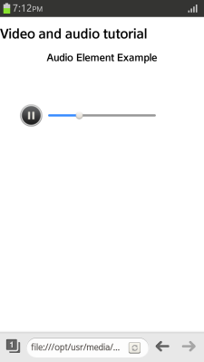
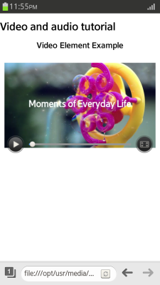
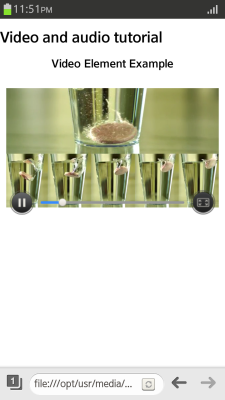
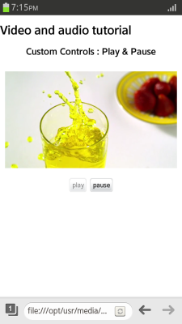
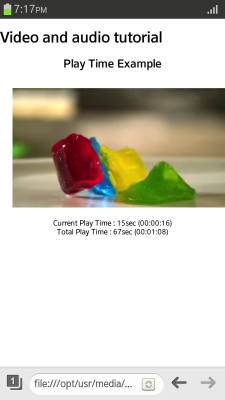
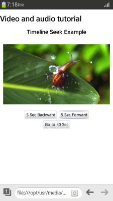
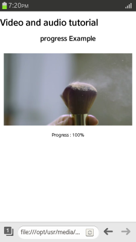
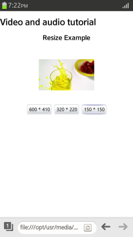

# HTML5 video and audio element

You can use the HTML5 `audio` and `video` elements to play multimedia files streaming, without a separate plug-in.

Using JavaScript, the playback can be controlled with [media events](http://www.w3.org/wiki/HTML/Elements/video#Media_Events). The audio and video elements used as media elements inherit all the properties and methods of the `HTMLMediaElement` interface (in [mobile](http://www.w3.org/TR/2014/REC-html5-20141028/embedded-content-0.html#media-element), [wearable](http://www.w3.org/TR/2014/CR-html5-20140429/embedded-content-0.html#media-element), and [TV](https://www.w3.org/TR/2014/REC-html5-20141028/embedded-content-0.html#media-element) applications).

The main features of the audio and video elements with JavaScript include:

- Creating a player

  You can [create a simple audio and video player](#creating-an-audio-and-video-player).

- Controlling the playback

  You can use the `Play()` and `Pause()` methods of the `Media` object (in [mobile](http://www.w3.org/TR/2014/REC-html5-20141028/embedded-content-0.html#media-elements), [wearable](http://www.w3.org/TR/2014/CR-html5-20140429/embedded-content-0.html#media-elements), and [TV](http://www.w3.org/TR/2014/REC-html5-20141028/embedded-content-0.html#media-elements) applications) to [control playing and pausing](#playing-media-files) media files. With media events, additional features can be used.

- Retrieving duration and play time

  You can [retrieve the duration and play time](#retrieving-media-information) of the media file, if its metadata (such as playing time, duration, and video's width and height) is loaded.

- Playing from a random position

  You can indicate the playback time by [playing the media file from a random position](#moving-the-timeline-position). To do this, you must change the `currentTime` value of the `Media` object to trigger the `timeupdate` event (in [mobile](http://www.w3.org/TR/2014/REC-html5-20141028/embedded-content-0.html#event-media-timeupdate), [wearable](http://www.w3.org/TR/2014/CR-html5-20140429/embedded-content-0.html#event-media-timeupdate), and [TV](http://www.w3.org/TR/2014/REC-html5-20141028/embedded-content-0.html#event-media-timeupdate) applications).

- Retrieving progress state

  You can [retrieve and display the download progress state](#displaying-the-progress-state) using the `Progress` media event, which is triggered when information related to the progress of a media object loading media contents is updated.

- Resizing the video screen

  You can [resize the video screen](#resizing-the-video-screen) to offer different viewing options for the user.

- Checking supported media formats

  You can [check whether the media data can be played](#checking-supported-media-formats) using the `canPlayType()` method. Basically, the MIME type must be set in the Web server in a format that is supported in Tizen. If a non-supported MIME type is used, you can [handle exceptions](#handling-errors) in advance.

## Creating an Audio and Video Player

To provide users with HTML5 audio and video features, you must learn to create a simple player for streaming playback:

1. To create an audio player, create an `audio` element including the necessary attributes:

   ```
   <audio id="audio" src="media/audio_sample.mp3"
          preload="auto" controls muted loop autoplay>
   </audio>
   ```

   

2. To create a video player, create a `video` element including the necessary attributes. In addition to the attributes available for the `audio` element, you can also use the `width`, `height`, and `poster` attributes.

   ```
   <video id="video" src="media/video_sample.mp4"
          width="400" height="220" poster="media/poster_sample.png"
          preload="auto" controls muted loop>
   </video>
   ```

   A player with a play control (built-in control provided in the browser) is created. The control is visible only when the `controls` attribute is added. If the `poster` attribute is not defined, the video's first frame is shown on the screen before the playback. The following figure shows the video player before and during playback.

    

> **Note**  
> The `preload` attribute is set to `auto` by default, meaning that the media metadata is automatically loaded. If you do not want to load the metadata, set the attribute value as `metadata` or `none`.

> **Note**  
> Carefully consider before using the `autoplay` feature (in [mobile](http://www.w3.org/TR/2014/REC-html5-20141028/embedded-content-0.html#attr-media-autoplay), [wearable](http://www.w3.org/TR/2014/CR-html5-20140429/embedded-content-0.html#attr-media-autoplay), and [TV](http://www.w3.org/TR/2014/REC-html5-20141028/embedded-content-0.html#attr-media-autoplay) applications), which plays content automatically in the mobile environment without user interaction. The user can face unintended Internet packet fees or interfering factors, such as playback being stopped unintentionally.

### Source Code

For the complete source code related to this use case, see the following files:

- [mini_code_audio.html](http://download.tizen.org/misc/examples/w3c_html5/media/html5_the_video_element_and_html5_the_audio_element)
- [mini_code_video.html](http://download.tizen.org/misc/examples/w3c_html5/media/html5_the_video_element_and_html5_the_audio_element)
- [audio_sample.mp3](http://download.tizen.org/misc/examples/w3c_html5/media/html5_the_video_element_and_html5_the_audio_element/media)
- [poster_sample.png](http://download.tizen.org/misc/examples/w3c_html5/media/html5_the_video_element_and_html5_the_audio_element/media)
- [video_sample.mp4](http://download.tizen.org/misc/examples/w3c_html5/media/html5_the_video_element_and_html5_the_audio_element/media)

## Playing Media Files

To provide users with HTML5 audio and video features, you must learn to play and pause media files using custom controls:

1. Create the `video` element and buttons used to control the play and pause:

   ```
   <div class="media">
      <video id="video" src="media/video_sample.mp4"></video>
      <div>
         <button id="v-play" type="button">play</button>
         <button id="v-pause" type="button" disabled >pause</button>
      </div>
   </div>
   ```

   The **Pause** button is disabled until the play event occurs.

2. Define the button functions. Play and pause the media file using the `play()` and `pause()` methods of the `HTMLMediaElement` interface (in [mobile](http://www.w3.org/TR/2014/REC-html5-20141028/embedded-content-0.html#media-element), [wearable](http://www.w3.org/TR/2014/CR-html5-20140429/embedded-content-0.html#media-element), and [TV](http://www.w3.org/TR/2014/REC-html5-20141028/embedded-content-0.html#media-element) applications).

   ```
   <script>
       var play_button = document.getElementById('v-play');
       var pause_button = document.getElementById('v-pause');

       play_button.addEventListener('click', function() {
           video.play(); /* Play movie */
       }, false);

       pause_button.addEventListener('click', function() {
           video.pause(); /* Pause movie */
       }, false);
   ```

3. Apply event listeners to detect button events an react to them:

   ```
       var video = document.getElementById('video');

       video.addEventListener('play', function() {
           play_button.disabled = true; /* Play button disabled */
           pause_button.disabled = false; /* Pause button enabled */
       }, false);

       video.addEventListener('pause', function() {
           play_button.disabled = false; /* Play button enabled */
           pause_button.disabled = true; /* Pause button disabled */
       }, false);

       video.addEventListener('ended', function() {
           play_button.disabled = false; /* Play button enabled */
           pause_button.disabled = true; /* Pause button disabled */
       }, false);
   </script>
   ```

   **Figure: Playing files (in mobile applications only)**

   

### Source Code

For the complete source code related to this use case, see the following files:

- [play_pause.html](http://download.tizen.org/misc/examples/w3c_html5/media/html5_the_video_element_and_html5_the_audio_element)
- [video_sample.mp4](http://download.tizen.org/misc/examples/w3c_html5/media/html5_the_video_element_and_html5_the_audio_element/media)

<a name="retrieve"></a>
## Retrieving Media Information

To provide users with HTML5 audio and video features, you must learn to retrieve the total duration and playing time of a media file:

> **Note**  
> The media file metadata can only be retrieved, if it is loaded in the application. The `preload` attribute is must be set to `auto`, or the `autoplay` attribute be set as `true`.

1. Create the `video` element and the elements to display the total duration and playing time of the file:

   ```
   <div class="media">
      <h1>Play Time Example</h1>
      <video id="video" src="media/video_sample.mp4" controls preload="auto"></video>
      <div class="log">Current Play Time: <span id="currentTime"></span></div>
      <div class="log">Total Play Time: <span id="totalTime"></span></div>
   </div>
   ```

2. Apply the `loadedmetadata` [media event](http://www.w3.org/wiki/HTML/Elements/video#Media_Events) to the `video` object to get the total duration of the file:

   ```
   <script>
       var video = document.getElementById('video');
       var currentTime = document.getElementById('currentTime');
       var totalTime = document.getElementById('totalTime');

       /* Indicate the total duration */
       video.addEventListener('loadedmetadata', function() {
           /* Total video duration */
           var totalSec = video.duration;

           /* Import method to change seconds to time (HH:MM:SS) format */
           var time = secondsToTime(totalSec);

           /* Display the calculated time on screen */
           totalTime.innerHTML = parseInt(totalSec) + 'sec (' + time.h +
                                 ':' + time.m + ':' + time.s + ')';
       }, false);
   ```

3. Apply the `timeupdate` media event to the `video` object to get the playing time:

   ```
       /* Indicate play time status */
       video.addEventListener('timeupdate', function() {
           /* Current play time */
           var currSec = video.currentTime;
           var c_time = secondsToTime(currSec);

           /* Display the current play time */
           currentTime.innerHTML = parseInt(currSec) + 'sec (' + c_time.h +
                                   ':' + c_time.m + ':' + c_time.s + ')';
       }, false);
   </script>
   ```

4. To manage the data more efficiently, convert the time units to JSON parser objects:

   ```
   <script>
       /* Change seconds to time (HH:MM:SS) format */
       function secondsToTime(secs) {
           var hours = Math.floor(secs / (60 * 60));

           var divisor_for_minutes = secs % (60 * 60);
           var minutes = Math.floor(divisor_for_minutes / 60);

           var divisor_for_seconds = divisor_for_minutes % 60;
           var seconds = Math.ceil(divisor_for_seconds);

           /* Set as JSON object */
           var obj = {
               'h': intToString(hours),
               'm': intToString(minutes),
               's': intToString(seconds)
           };

           return obj;
       }

       /* Ensure that each time is set in 2 characters according to the time format */
       function intToString(time) {
           return (parseInt(time) < 10 ? ('0' + time) : time);
       }
   </script>
   ```

   **Figure: Displaying the duration and play time (in mobile applications only)**

   

### Source Code

For the complete source code related to this use case, see the following files:

- [play_time_view.html](http://download.tizen.org/misc/examples/w3c_html5/media/html5_the_video_element_and_html5_the_audio_element)
- [video_sample.mp4](http://download.tizen.org/misc/examples/w3c_html5/media/html5_the_video_element_and_html5_the_audio_element/media)

## Moving the Timeline Position

To provide users with HTML5 audio and video features, you must learn to move the play position on the timeline:

1. Create the `video` element and buttons used to control the timeline:

   ```
   <div class="media">
      <video id="video" src="media/video_sample.mp4" controls ></video>
      <div>
         <button id="v-back">5 Sec Backward</button>
         <button id="v-forw">5 Sec Forward</button>
      </div>
      <div><button id="v-goto">Go to 40 Sec</button></div>
   </div>
   ```

2. Add event listeners to change the `currentTime` value when a `click` event occurs in the button elements:

   ```
   <script>
       var video = document.getElementById('video'); /* Video object */
       var back_button = document.getElementById('v-back'); /* Back button */
       var forw_button = document.getElementById('v-forw'); /* Forward button */
       var go_button = document.getElementById('v-goto'); /* Jump button */

       /* Move 5 seconds back */
       back_button.addEventListener('click', function() {
           video.currentTime -= 5;
       }, false);

       /* Move 5 seconds forward */
       forw_button.addEventListener('click', function() {
           video.currentTime += 5;
       }, false);

       /* Move timeline to 40 seconds */
       go_button.addEventListener('click', function() {
           video.currentTime = 40;
       }, false);
   </script>
   ```

   If the metadata of the media file is loaded, you can move to the assigned timeline position even when the media file is not playing. For more information, see [Retrieving Media Information.](#retrieve)

   **Figure: Moving the timeline position (in mobile applications only)**

   

### Source Code

For the complete source code related to this use case, see the following files:

- [time_jumping.html](http://download.tizen.org/misc/examples/w3c_html5/media/html5_the_video_element_and_html5_the_audio_element)
- [video_sample.mp4](http://download.tizen.org/misc/examples/w3c_html5/media/html5_the_video_element_and_html5_the_audio_element/media)

## Displaying the Progress State

To provide users with HTML5 audio and video features, you must learn to check the download progress status of media content:

1. Create the `video` element and the elements to display the download progress status of the media file:

   ```
   <div class="media">
      <video id="video" src="media/video_sample.mp4" controls poster="media/poster_sample.png"></video>
      <div>Progress: <span id="state"></span></div>
   </div>
   ```

   While the download is in progress, the `poster1.png` image is shown.

2. The `buffered` attribute of the `video` object returns a [TimeRanges](http://www.w3.org/TR/html5/embedded-content-0.html#timeranges) object that represents the downloaded buffering range. Use the `end` property of the `TimeRanges` object to find out the end time (in seconds) of the buffered range:

   ```
   <script>
       var video = document.getElementById('video');

       /* Progress event */
       video.addEventListener('progress', function() {
           /* Returns a TimeRanges object */
           var buffered = video.buffered;

           /* Returns time in seconds */
           var buffered_end = buffered.end();
   ```

3. Use the `progress` [media event](http://www.w3.org/wiki/HTML/Elements/video#Media_Events) to convert the end time to percent form, and display the progress state:

   ```
           /* Change to progress rate percent */
           var progress = (buffered_end / video.duration) * 100;

           /* Display the progress state */
           document.getElementById('state').innerHTML = parseInt(progress) + '%';
       }, false);
   </script>
   ```

   **Figure: Displaying the progress state (in mobile applications only)**

   

### Source Code

For the complete source code related to this use case, see the following files:

- [progress.html](http://download.tizen.org/misc/examples/w3c_html5/media/html5_the_video_element_and_html5_the_audio_element)
- [poster_sample.png](http://download.tizen.org/misc/examples/w3c_html5/media/html5_the_video_element_and_html5_the_audio_element/media)
- [video_sample.mp4](http://download.tizen.org/misc/examples/w3c_html5/media/html5_the_video_element_and_html5_the_audio_element/media)

## Resizing the Video Screen

To provide users with HTML5 audio and video features, you must learn to resize the video screen:

> **Note**  
> If the screen size is reduced, the basic `play` control can be wrongly positioned. Therefore, do not use the `controls` attribute when providing the resizing custom control.

1. Create the `video` element and buttons used to control the screen size:

   ```
   <video id="video" src="media/video_sample.mp4" controls ></video>
   <div>
      <button id="size_big">600 * 410</button>
      <button id="size_middle">320 * 220</button>
      <button id="size_small">150 * 150</button>
   </div>
   ```

2. Add event listeners to change the `width` and `height` values when a `click` event occurs in the button elements:

   ```
   <script>
       var video = document.getElementById('video');

       /* Resize to big size */
       document.getElementById('size_big').addEventListener('click', function() {
           video.width = 600;
           video.height = 410;
       }, false);

       /* Resize to middle size */
       document.getElementById('size_middle').addEventListener('click', function() {
           video.width = 320;
           video.height = 220;
       }, false);

       /* Resize to small size */
       document.getElementById('size_small').addEventListener('click', function() {
           video.width = 150;
           video.height = 150;
       }, false);
   </script>
   ```

   **Figure: Resizing the video screen (in mobile applications only)**

   

### Source Code

For the complete source code related to this use case, see the following files:

- [resize.html](http://download.tizen.org/misc/examples/w3c_html5/media/html5_the_video_element_and_html5_the_audio_element)
- [video_sample.mp4](http://download.tizen.org/misc/examples/w3c_html5/media/html5_the_video_element_and_html5_the_audio_element/media)

## Checking Supported Media Formats

Tizen supports the following media formats:

- Video: 3GP, AVI, ASF, OGV, MP4, MKV, WMV
- Audio: AAC, AMR, MP3, OGG, WAV, WMA

To provide users with HTML5 audio and video features, you must learn to check whether the media data of the assigned MIME type can be played:

1. Create the `video` element and determine the media files you want to check:

   ```
   <div class="media">
      <video id="video1" src="media/video_sample_001.ogv" controls ></video>
      <div class="log">video/ogg can play type: <span id="vlog1"></span></div>
   </div>

   <div class="media">
      <video id="video2" src="media/video_sample_002.webm" controls ></video>
      <div class="log">audio/acc can play type: <span id="vlog2"></span></div>
   </div>
   ```

2. Use the `canPlayType()` method (in [mobile](http://www.w3.org/TR/2014/REC-html5-20141028/embedded-content-0.html#dom-navigator-canplaytype), [wearable](http://www.w3.org/TR/2014/CR-html5-20140429/embedded-content-0.html#dom-navigator-canplaytype), and [TV](http://www.w3.org/TR/2014/REC-html5-20141028/embedded-content-0.html#dom-navigator-canplaytype) applications) to check, whether the selected media files have an acceptable MIME type, and can be played:

   ```
   <script>
       var video1 = document.getElementById('video1');
       var video2 = document.getElementById('video2');
       var videoElem03 = document.getElementById('video3');

       /* Check the ogg format */
       document.getElementById('vlog1').innerHTML = video1.canPlayType('video/ogg');

       /* Check the webm format */
       document.getElementById('vlog2').innerHTML = video2.canPlayType('audio/acc');
   </script>
   ```

### Source Code

For the complete source code related to this use case, see the following files:

- [can_play_type.html](http://download.tizen.org/misc/examples/w3c_html5/media/html5_the_video_element_and_html5_the_audio_element)
- [video_sample_001.ogv](http://download.tizen.org/misc/examples/w3c_html5/media/html5_the_video_element_and_html5_the_audio_element/media)
- [video_sample_002.webm](http://download.tizen.org/misc/examples/w3c_html5/media/html5_the_video_element_and_html5_the_audio_element/media)

## Handling Errors

To provide users with HTML5 audio and video features, you must learn to handle errors that can occur during playback:

1. Create the video and button elements, which can induce errors:

   ```
   <div class="media">
      <video id="video" src="media/video_sample.mp4" controls ></video>
      <div>
         <button id="btn01">src Null</button>
      </div>
   </div>
   ```

2. Add an event listener to detect errors and trigger error messages:

   ```
   <script>
       var video = document.getElementById('video');

       /* Button event: induce error */
       document.getElementById('btn01').addEventListener('click', function() {
           video.src = ''; /* Set value as null value */
       }, false);

       video.addEventListener('error', function() {
           /* Video playback failed: show a message saying why */
           switch (video.error.code) {
               case 1:
                   alert('MEDIA_ERR_ABORTED = 1 Media data download is stopped by the user');
                   break;
               case 2:
                   alert('MEDIA_ERR_NETWORK = 2 Download is stopped due to network error ');
                   break;
               case 3:
                   alert('MEDIA_ERR_DECODE = 3 Media data decoding failure ');
                   break;
               case 4:
                   alert('MEDIA_ERR_SRC_NOT_SUPPORTED = 4 Format not supported');
                   break
           }
       }, false);
   </script>
   ```

### Source Code

For the complete source code related to this use case, see the following files:

- [error.html](http://download.tizen.org/misc/examples/w3c_html5/media/html5_the_video_element_and_html5_the_audio_element)
- [video_sample.mp4](http://download.tizen.org/misc/examples/w3c_html5/media/html5_the_video_element_and_html5_the_audio_element/media)

## Supported Codecs

The following tables list the codecs supported in Tizen.

**Table: Supported codecs**

| Type  | Codec                                    | Encoder | Decoder |
| ----- | ---------------------------------------- | ------- | ------- |
| Video | MPEG-1                                   | No      | Yes     |
| Video | MPEG-4 part 2                            | Yes     | Yes     |
| Video | MPEG-4 part 2 MS v1                      | No      | Yes     |
| Video | MPEG-4 part 2 MS v2                      | Yes     | Yes     |
| Video | MPEG-4 part 2 MS v3                      | Yes     | Yes     |
| Video | H.264, H.263-1996, H.263+,  H263-1998, H263 v2 | Yes     | Yes     |
| Video | H.264, MPEG-4 AVC, MPEG-4 part10         | No      | Yes     |
| Video | WMV3                                     | No      | Yes     |
| Video | VC1                                      | No      | Yes     |
| Video | THEORA                                   | Yes     | Yes     |
| Audio | AAC                                      | No      | Yes     |
| Audio | MP3                                      | No      | Yes     |
| Audio | WMA (Available up to WMA8. WMA9 is  not available.) | No      | Yes     |
| Audio | AMR-NB                                   | Yes     | Yes     |
| Audio | AMR-WB                                   | No      | Yes     |
| Audio | VORBIS                                   | Yes     | Yes     |

## Related Information
* Dependencies
  - Tizen 2.4 and Higher for Mobile
  - Tizen 2.3.1 and Higher for Wearable
  - Tizen 3.0 and Higher for TV
