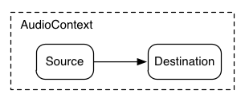
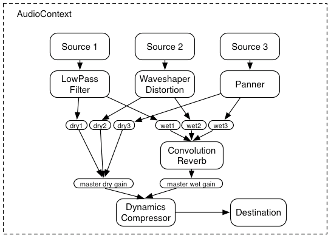

# Web Audio

You can include high-quality sound in your application by setting space and direction through audio data, and synthetizing them. This is used in the audio engines of sophisticated games to mix, process, and filter effects.

This feature is supported in mobile and TV applications only.

The main features of the Web Audio API include:

- Loading source data

  You must [load source data](#loading-data-and-creating-audio-context) before using the Web Audio API. You can do this using [XMLHttprequest](../communication/xmlhttprequest.md).

  The [AudioContext](https://www.w3.org/TR/2015/WD-webaudio-20151208/#AudioContext) interface is used to manage and play the sound. It creates a high quality sound and connects to the destination of the sound.

- Modular routing

  [Modular routing](https://www.w3.org/TR/2015/WD-webaudio-20151208/#ModularRouting) means [routing audio data](#using-modular-routing) either in a direct manner, such as speaker output, or through a connection to [AudioNodes](https://www.w3.org/TR/2015/WD-webaudio-20151208/#the-audionode-interface), which handle, for example, volume adjustment and filters.

- Playing sound

  Use the `noteOn(time)` or `start(time)` method to [play sound](#playing-sound) with the time parameter for specifying the time interval in seconds after which the audio is played. For example, the `0` time value implies playing the audio immediately and the `currentTime + 0.75` time value implies that the audio is played after 0.75 seconds.

  You can use the `noteOff(time)` or `stop(time)` methods similarly to stop the sound. After stopping sound, recreate the [AudioBufferSourceNode](https://www.w3.org/TR/2015/WD-webaudio-20151208/#AudioBufferSourceNode) interface instance to play sound again.

## Loading Data and Creating Audio Context

To provide users with sophisticated audio features, you must learn to modulate source data into decoded audio data using [XMLHttpRequest](../communication/xmlhttprequest.md), and create an instance of the [AudioContext](https://www.w3.org/TR/2015/WD-webaudio-20151208/#AudioContext) interface:

1. To load source audio data:

   1. Load a source audio file using XMLHttpRequest. Set the `responseType` to `arraybuffer` to receive binary response:

      ```
      <script>
          var url = 'sample.mp3';
          var request = new XMLHttpRequest();
          request.open('GET', url, true);
          request.responseType = 'arraybuffer';

          request.send();
      </script>
      ```

   2. The `onload` event is triggered. Retrieve the decoded audio data:

      ```
      <script>
          /* Asynchronous event handling */
          request.onload = function() {
              /* Put the modulated audio data into the audioData variable */
              var audioData = request.response;
          };
      </script>
      ```

      This data is used in the [AudioBuffer](https://www.w3.org/TR/2015/WD-webaudio-20151208/#AudioBuffer).

2. To create an audio context:

   Create a WebKit-based `AudioContext` instance, which plays and manages the audio data:

   ```
   <script>
       var context;
       context = new webkitAudioContext();
   </script>
   ```

   AudioContext instance supports various sound inputs, and it is possible to create an audio graph. You can create 1 or more sound sources to manage sound and connect to the sound destination.

   The majority of the Web Audio API features, such as creating audio file data, decoding it, and creating [AudioNodes](https://www.w3.org/TR/2015/WD-webaudio-20151208/#the-audionode-interface) are managed using the methods of the `AudioContext` interface.

3. To create an audio buffer:

   Create an [AudioBuffer](https://www.w3.org/TR/2015/WD-webaudio-20151208/#AudioBuffer) interface using the array buffer of audio data response attributes of the `XMLHttpRequest()` method. Select from the following options:

   - Create the audio buffer using the `createBuffer()` method:

     ```
     <script>
         var context = new webkitAudioContext();
         function setSound() {
             var url = 'sample_audio.mp3';
             var request = new XMLHttpRequest();
             request.open('GET', url, true);
             request.responseType = 'arraybuffer';

             /* Asynchronous callback */
             request.onload = function() {
                 /* Create the sound source */
                 soundSource = context.createBufferSource();
                 soundBuffer = context.createBuffer(request.response, true);
                 soundSource.buffer = soundBuffer;
             };
             request.send();
         }
     </script>
     ```

     The `createBuffer()` method is used as a synchronous decoding method to create an audio buffer of the required size.

   - Create the audio buffer using the `decodeAudioData()` method:

     ```
     <script>
         var context = new webkitAudioContext();
         function setSound() {
             var url = 'sample_audio.mp3';
             var request = new XMLHttpRequest();
             request.open('GET', url, true);
             request.responseType = 'arraybuffer';

             /* Asynchronous callback */
             request.onload = function() {
                 /* Create the sound source */
                 soundSource = context.createBufferSource();

                 /*
                    Import a callback that provides PCM audio data
                    decoded as an audio buffer
                 */
                 context.decodeAudioData(request.response, function(buffer) {
                     bufferData = buffer;
                     soundSource.buffer = bufferData;
                 }, this.onDecodeError);
             };
             request.send();
         }
     </script>
     ```

     The `decodeAudioData()` method asynchronously decodes audio data from the [XMLHttpRequest](../communication/xmlhttprequest.md) array buffer. Since this method does not prevent the execution of JavaScript threads, consider using it instead of the `createBuffer()` method.

   To use an audio buffer created with the `createBuffer()` or `decodeAudioData()` method, the buffer must be allocated to the `audioBufferSourceNode` buffer.

### Source Code

For the complete source code related to this use case, see the following file:

- [web_audio_basic_playback.html](http://download.tizen.org/misc/examples/w3c_html5/media/web_audio_api)

## Using Modular Routing

To provide users with sophisticated audio features, you must learn to enable routing audio source data using [AudioNode](https://www.w3.org/TR/2015/WD-webaudio-20151208/#the-audionode-interface) objects:

1. To route to speaker output in a direct sound destination:

   1. Create a WebKit-based [AudioContext](https://www.w3.org/TR/2015/WD-webaudio-20151208/#AudioContext) instance:

      ```
      <script>
          var context;
          context = new webkitAudioContext();
      ```

   2. Route a single audio source directly to the output:

      ```
          var soundSource;

          function startSound(audioData) {
              soundSource = context.createBufferSource();
              soundSource.buffer = soundBuffer;

              /* Direct routing to speaker */
              soundSource.connect(volumeNode);
              volumeNode.connect(context.destination);
          }
      </script>
      ```

      All routing occurs within an `AudioContext` containing a single [AudioDestinationNode](https://www.w3.org/TR/2015/WD-webaudio-20151208/#AudioDestinationNode).

      

2. To route to the sound destination using `AudioNodes`:

   1. Create an `AudioContext` instance:

      ```
      <script>
          var context;
          context = new webkitAudioContext();
      ```

   2. Create the sound source:

      ```
          function startSound(audioData) {
              soundSource = context.createBufferSource();
              soundBuffer = context.createBuffer(audioData, true);
              soundSource.buffer = soundBuffer;

              volumeNode = context.createGainNode();
              filter = context.createBiquadFilter();
              audioAnalyser = context.createAnalyser();

      ```

   3. Create the node to manage the output, for example, adjusting volume and applying filters:

      ```
              soundSource.connect(volumeNode);
              volumeNode.connect(filter);
              filter.connect(audioAnalyser);
              audioAnalyser.connect(context.destination);
          }
      </script>
      ```

      The following figure illustrates using 3 sources and a convolution reverb sent with a dynamics compressor at the final output stage.

      

`AudioNodes` can be used to activate sound effects, and create tweaks, audio parameters, and audio graphs using the [GainNode](https://www.w3.org/TR/2015/WD-webaudio-20151208/#GainNode) interface, or filter sounds using the [BiquadFilterNode](https://www.w3.org/TR/2015/WD-webaudio-20151208/#the-biquadfilternode-interface) interface.

### Source Code

For the complete source code related to this use case, see the following file:

- [web_audio_basic_playback.html](http://download.tizen.org/misc/examples/w3c_html5/media/web_audio_api)

## Playing Sound

To provide users with sophisticated audio features, you must learn to play sound:

1. Create a WebKit-based [AudioContext](https://www.w3.org/TR/2015/WD-webaudio-20151208/#AudioContext) instance:

   ```
   <script>
       var context;
       context = new webkitAudioContext();
   ```

2. Play audio through direct sound destination using the `noteOn()` method:

   ```
       function playSound() {
           var soundSource = context.createBufferSource();
           soundSource.buffer = soundBuffer;
           soundSource.connect(context.destination);
           soundSource.noteOn(context.currentTime);
       }
   </script>
   ```

   Use time as parameter of the `noteOn()` method. Time is based on the `currentTime` property of the `AudioContext`, and expressed in seconds. If you set the value as '0', the playback begins immediately.

   You can also use time as parameter of the `noteOff()` method. If you set the value as '0', the playback stops immediately.

The `AudioContext` instance digitally modulates the audio source file into audio data. After creating the sound source, playback is implemented by processing audio data using [AudioNodes](https://www.w3.org/TR/2015/WD-webaudio-20151208/#the-audionode-interface) either directly to the speaker, or in the middle.

### Source Code

For the complete source code related to this use case, see the following file:

- [web_audio_basic_playback.html](http://download.tizen.org/misc/examples/w3c_html5/media/web_audio_api)

## Related Information
* Dependencies
  - Tizen 2.4 and Higher for Mobile
  - Tizen 3.0 and Higher for TV
