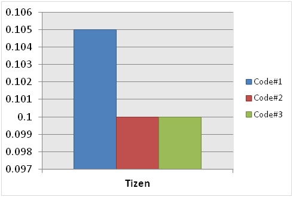
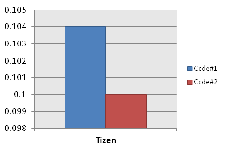
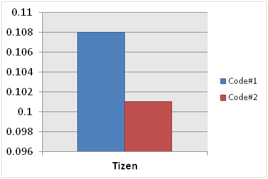

# jQuery Performance Improvement

The following techniques of writing JavaScript code can be used to improve application performance when using jQuery:

- [Using selectors](#using-selectors)
- [Using caches](#using-caches)
- [Using chaining](#using-chaining)
- [Managing DOM control](#managing-dom-control)


The following example HTML code has been used as a basis when describing the techniques:

```
<div id="contents">
   <h3>Selector Test</h3>
   <ul id="contents_list">
      <li>List 1</li>
      <li>List 2</li>
      <li>List 3</li>
   </ul>
   <button id="search_dom" class="blue">Search DOM</button>
</div>
<div id="contents1">
   <h3>Selector Test</h3>
   <ul id="contents_list1">
      <li>List 1</li>
      <li>List 2</li>
      <li>List 3</li>
   </ul>
   <button id="search_dom1" class="blue">Search DOM</button>
</div>
<div id="contents2">
   <h3>Selector Test</h3>
   <ul id="contents_list2">
      <li>List 1</li>
      <li>List 2</li>
      <li>List 3</li>
   </ul>
   <button id="search_dom2" class="blue">Search DOM</button>
</div>
<div id="contents3">
   <h3>Selector Test</h3>
   <ul id="contents_list3">
      <li>List 1</li>
      <li>List 2</li>
      <li>List 3</li>
   </ul>
   <button id="search_dom3" class="blue">Search DOM</button>
</div>
<div id="contents4">
   <h3>Selector Test</h3>
   <ul id="contents_list4">
      <li>List 1</li>
      <li>List 2</li>
      <li>List 3</li>
   </ul>
   <button id="search_dom4" class="blue">Search DOM</button>
</div>
<div id="contents5">
   <h3>Selector Test</h3>
   <ul id="contents_list5">
      <li>List 1</li>
      <li>List 2</li>
      <li>List 3</li>
   </ul>
   <button id="search_dom5" class="blue">Search DOM</button>
</div>
```

## Using Selectors

 When navigating a specific element, use an ID selector prior to other selectors, such as tags and classes. The following example shows how using an ID selector improves performance.

```
/* Code#1 */
var search_button = $('button');
```

```
/* Code#2 */
var search_button = $('#contents button');
```

**Figure: jQuery performance improvement result (in mobile applications only)**


**Table: jQuery performance improvement result**

| Browser | Execution time for Code#1 | Execution time for Code#2 |
| ------- | ------------------------- | ------------------------- |
| Tizen   | 0.118                     | 0.100                     |

 When using a class selector, apply a tag preceded by the class name. The following example shows how using a tag improves performance.

```
/* Code#1 */
var search_button = $('.blue');
```

```
/* Code#2 */
var search_button = $('button.blue');
```

```
/* Code#3 */
var search_button = $('#contents button.blue');
```

**Figure: jQuery performance improvement result (in mobile applications only)**



**Table: jQuery performance improvement result**

| Browser | Execution time for Code#1 | Execution time for Code#2 | Execution time for Code#3 |
| ------- | ------------------------- | ------------------------- | ------------------------- |
| Tizen   | 0.105                     | 0.100                     | 0.100                     |

## Using Caches

 When referring to a DOM object, you can first create a cache for it.

Without doing this, every time a DOM object is called, DOM is searched to return a new jQuery object, which degrades performance.

The following example shows how using a cache improves performance.

```
/* Code#1 */
$('#search_dom').on('click', function() {});
$('#search_dom').removeClass('blue');
$('#search_dom').addClass('red');
```

```
/* Code#2 */
var $search_button = $('#search_dom');
$search_button.on('click', function() {});
$search_button.removeClass('blue');
$search_button.addClass('red');
```

**Figure: jQuery performance improvement result (in mobile applications only)**



**Table: jQuery performance improvement result**

| Browser | Execution time for Code#1 | Execution time for Code#2 |
| ------- | ------------------------- | ------------------------- |
| Tizen   | 0.104                     | 0.100                     |

## Using Chaining

 Chaining makes the code lighter and reduces repeated operations, such as reflow and repaint.

When a DOM element is changed, chaining ties similar object references into groups for execution. jQuery objects need not be repeatedly created as existing ones can be reused. The following example shows how chaining improves performance.

```
/* Code#1 */
$('#contents').addClass('active');
$('#contents').css('border', '1px solid');
$('#contents').('background-color', 'red');
```

```
/* Code#2 */
$('#contents').addClass('active').css('border', '1px solid').('background-color', 'red');
```

**Figure: jQuery performance improvement result (in mobile applications only)**



**Table: jQuery performance improvement result**

| Browser | Execution time for Code#1 | Execution time for Code#2 |
| ------- | ------------------------- | ------------------------- |
| Tizen   | 0.108                     | 0.101                     |

## Managing DOM Control

Minimizing direct DOM manipulation improves jQuery performance. Every time an element is created and inserted, time and capacity is needed. Using a cached selector with the `append()` method reduces the need for capacity.

The following example shows how applying DOM control improves performance.

```
/* Code#1 */
var $contents_list = $('#contents_list'),
    array_list = [...];

for (var i = 0, len = array_list.length; i < len; i++) {
    $contents_list.append('<li>' + array_list[i] + '</li>');
}
```

```
/* Code#2 */
var $contents_list = $('#contents_list'),
    array_list = [...],
    list = '';

for (var i = 0, len = array_list.length; i < len; i++) {
    list += '<li>' + array_list[i] + '</li>';
}
$contents_list.append(list);
```

**Figure: jQuery performance improvement result (in mobile applications only)**


**Table: jQuery performance improvement result**

| Browser | Execution time for Code#1 | Execution time for Code#2 |
| ------- | ------------------------- | ------------------------- |
| Tizen   | 0.120                     | 0.101                     |

## Related Information
* Dependencies
  - Tizen 2.4 and Higher for Mobile
  - Tizen 2.3.1 and Higher for Wearable
  - Tizen 3.0 and Higher for TV
