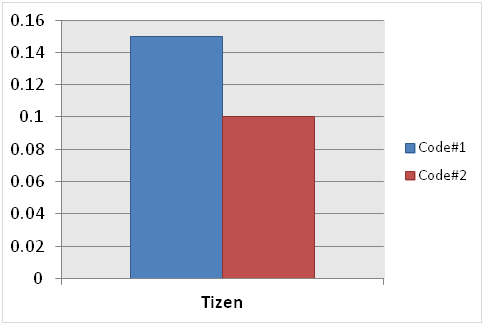
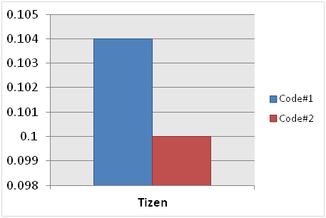
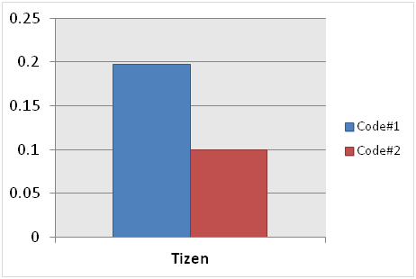
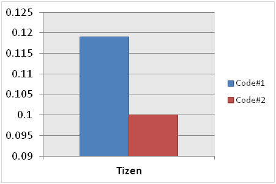

# JavaScript Performance Improvement

The following techniques of writing JavaScript code can be used to improve application performance:

- [Removing the debugging statement](#removing-the-debugging-statement)
- [Removing slow loop statements](#removing-slow-loop-statements)
- [Using cached array length](#using-cached-array-length)
- [Using literal expressions](#using-literal-expressions)
- [Managing DOM control](#managing-dom-control)

## Removing the Debugging Statement

 The `console.log` statement, which is frequently used in JavaScript debugging, can cause poor performance. The following example shows how deleting the statement improves performance.

```
/* Code#1 */
var array_list = [0,1,2,3,4,5,6,7,8,9],
    new_array_list = [];

for (var i = 0, len = array_list.length; i < len; i++) {
    new_array_list.push(array_list[i]);
    console.log(array_list[i]);
}
```

```
/* Code#2 */
var array_list = [0,1,2,3,4,5,6,7,8,9],
    new_array_list = [];

for (var i = 0, len = array_list.length; i < len; i++) {
    new_array_list.push(array_list[i])
}
```

**Figure: JavaScript performance improvement result (in mobile applications only)**


**Table: JavaScript performance improvement result**

| Browser | Execution time for Code#1 | Execution time for Code#2 |
|---------|---------------------------|---------------------------|
| Tizen   | 0.823                     | 0.100                     |

## Removing Slow Loop Statements

 The `for - in` loop is relatively slower than the other loops, such as `for`, `while`, and `do - while`, as it assigns object properties to the variable (`idx` in the following example), navigating the object every time the loop is iterated. The following example shows how modifying the loop improves performance.

```
/* Code#1 */
var array_list = [0,1,2,3,4,5,6,7,8,9],
    new_array_list = [];
for (var idx in array_list) {
    new_array_list.push(array_list[idx]);
}
```

```
/* Code#2 */
var array_list = [0,1,2,3,4,5,6,7,8,9],
    new_array_list = [];
for (var i = 0, len = array_list.length; i < len; i++) {
    new_array_list.push(array_list[i]);
}
```

**Figure: JavaScript performance improvement result (in mobile applications only)**



> **Note**  
> By caching the `array_list.length` before using it, as shown in the second example above, better performance is achieved. For more information, see [Using cached array length](#arraylength).

**Table: JavaScript performance improvement result**

| Browser | Execution time for Code#1 | Execution time for Code#2 |
|---------|---------------------------|---------------------------|
| Tizen   | 0.150                     | 0.100                     |

<a name="arraylength"></a>
## Using Cached Array Length

In a loop statement, you can cache the length of an array before using it instead of using it directly in the loop. Minimizing the steps taken to search for the scope chain activation object speeds up the response performance. The following example shows how caching the array list improves performance.

```
/* Code#1 */
var array_list = [],
    new_array_list = [],
    i = 0;
for (i = 0; i < 100; i++) {
    array_list.push(i);
}
for (i = 0; i < array_list.length; i++) {
    new_array_list.push(array_list[i]);
}
```

```
/* Code#2 */
var array_list = [],
    new_array_list = [],
    i = 0,
    arrayLen = 0;
for (i = 0; i < 100; i++) {
    array_list.push(i);
}
for (i = 0, arrayLen = array_list.length; i < arrayLen; i++) {
    new_array_list.push(array_list[i]);
}
```

**Figure: JavaScript performance improvement result (in mobile applications only)**



**Table: JavaScript performance improvement result**

| Browser | Execution time for Code#1 | Execution time for Code#2 |
|---------|---------------------------|---------------------------|
| Tizen   | 0.104                     | 0.100                     |

## Using Literal Expressions

 Using literal expressions instead of newly created ones improves the JavaScript performance. Literal expressions are optimized for modern browser engines. They reduce the amount of interpretation time of the JavaScript interpreter. The following example shows how using literal expressions improves performance.

```
/* Code#1 */
var str = '';
for (var i = 0; i < 100; i++) {
    str = new String('abcd');
}
```

```
/* Code#2 */
var str = '';
for (var i = 0; i < 100; i++) {
    str = 'abcd';
}
```

**Figure: JavaScript performance improvement result (in mobile applications only)**



**Table: JavaScript performance improvement result**

| Browser | Execution time for Code#1 | Execution time for Code#2 |
|---------|---------------------------|---------------------------|
| Tizen   | 0.197                     | 0.100                     |

## Managing DOM Control

 Rendering performance can be improved by minimizing direct DOM manipulation and creating a new instance of a cached DOM object.

When referring to variables, JavaScript revolves around a scope chain (variable object set that can be accessed in the current scope). The deeper the scope chain, the more execution time is needed.

The following example shows how applying DOM control improves performance.

```
/* Code#1 */
var id = document.getElementById('contents_list').getAttribute('id');
var name = document.getElementById('contents_list').getAttribute('name');
var style = document.getElementById('contents_list').getAttribute('style');
for (var i = 0; i < 100; i++) {
    id = document.getElementById('contents_list').getAttribute('id');
    name = document.getElementById('contents_list').getAttribute('name');
    style = document.getElementById('contents_list').getAttribute('style');
}
```

```
/* Code#2 */
var contents_list = document.getElementById('contents_list');
var id = contents_list.getAttribute('id');
var name = contents_list.getAttribute('name');
var style = contents_list.getAttribute('style');
for (var i = 0; i < 100; i++) {
    id = contents_list.getAttribute('id');
    name = contents_list.getAttribute('name');
    style = contents_list.getAttribute('style');
}
```

**Figure: JavaScript performance improvement result (in mobile applications only)**



**Table: JavaScript performance improvement result**

| Browser | Execution time for Code#1 | Execution time for Code#2 |
|---------|---------------------------|---------------------------|
| Tizen   | 0.119                     | 0.100                     |

## Related Information
- Dependencies
  - Tizen 2.4 and Higher for Mobile
  - Tizen 2.3.1 and Higher for Wearable
  - Tizen 3.0 and Higher for TV
