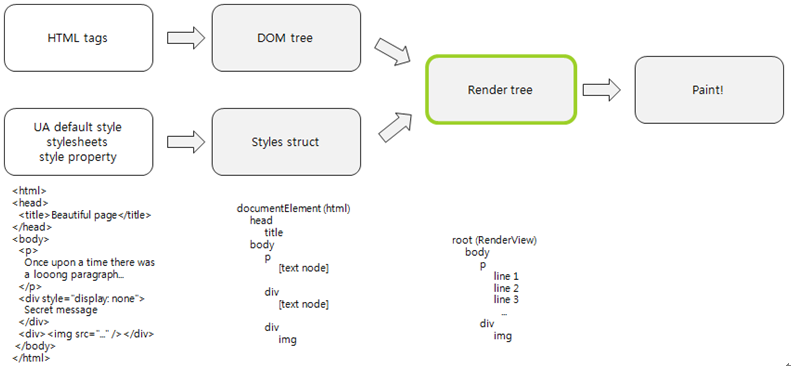

# Performance Improvement

With the following instructions, you can improve the performance of your wearable Web applications. The instructions summarize some representative tips that are frequently used in the Web community.

- [Reducing the access time for variables](#reducing-the-access-time-for-variables)
- [Improving the event handler response time](#improving-the-event-handler-response-time)
- [Cleaning up unused properties and DOM elements](#cleaning-up-unused-properties-and-dom-elements)
- [Minimizing the document flow](#minimizing-the-document-flow)
- [Improving the application launch time](#improving-the-application-launch-time)

This feature is supported in wearable applications only.

For more detailed and comprehensive information, study the following documentation:

- [Make the Web Faster by Google Developers](https://developers.google.com/speed/)
- [Speed Up Your JavaScript by Nicholas C. Zakas](http://www.slideshare.net/nzakas/speed-up-your-javascript)
- [High-Performance Kick-Ass Web Apps by Stoyan Stefanov](http://www.slideshare.net/stoyan/high-performance-kick-ass-web-apps-javascript-edition)
- [Best Practices for Speeding Up Your Web Site, by Yahoo Developer Network](http://developer.yahoo.com/performance/rules.html)  
- [Rendering: repaint, reflow/relayout, restyle by Stoyan Stefanov](http://www.phpied.com/rendering-repaint-reflowrelayout-restyle/)

## Reducing the Access Time for Variables

Out-of-scope variables, properties, and arrays, which are accessed more than twice, can be inefficient. It takes time to search whenever you reference an out-of-scope variable.

A better approach is to cache the values into local variables.  Caching the value into a local variable is equivalent to one search, so it yields performance benefits from the second access onwards. This even applies to DOM properties: Each property access requires DOM traverse overhead, and since JavaScript does not know ahead of time if a given access is going to change values, caching a common part can save a lot of search time.

The following example illustrates the issue.

**Table: Example of using local variables**

<table border="1">
	<tbody>
		<tr>
			<th>Before</th>
			<td>
<pre class="prettyprint">
var globalVar;
test: function() {
    var one = globalVar + 1; (X)
    var two = globalVar + 2; (X)
    var ratio = window.innerWidth /
                (window.innerHeight + window.innerWidth); (X)
}
</pre>
			</td>
		</tr>
		<tr>
			<th>After</th>
			<td>
<pre class="prettyprint">
test: function() {
    var global = globalVar; (O)
    var one = global + 1;
    screenHeight = window.innerHeight; (O)
    screenWidth= window.innerWidth; (O)
    var ratio = screenWidth / (screenHeight + screenWidth);
}
</pre>
			</td>
		</tr>
	</tbody>
</table>

> **Tip**  
> To minimize the property access time:  
> - Property depth: the deeper the property hierarchy is, the more search time is required (`object.name` < `object.name.name`).
> - Property notation: dot notation is faster than associate notation in Webkit (`object.name` < `object ["name"]`).

## Improving the Event Handler Response Time

As the number of event handlers grows in the DOM tree, Webkit consumes more memory to trace the events and the response time for each event increases. To prevent response time slow-down, you can use a technique called event delegation.

Event delegation means that you attach only one handler in the parent element and let it handle all the events from the child elements. Event delegation is based on bubbling, or events propagating up to the parent node, so the parent can handle all the events from the child nodes.

The following example illustrates the issue.

**Table: Example of improving response time**

<table border="1">
<tbody>
<tr>
	<th>Before</th>
	<td>
<pre class="prettyprint">
document.getElementById('a').onclick = function() {
    alert('&lt;a&gt; clicked!!');
};

document.getElementById('div').onclick = function() {
&nbsp;&nbsp;&nbsp;&nbsp;alert('&lt;div&gt; clicked!!');
};
</pre>
	</td>
</tr>
<tr>
	<th>After</th>
	<td>
<pre class="prettyprint">
document.getElementById('ul').onclick = function() {
    var target = e.target;
    if (target.nodeName == 'a') {
        alert('&lt;a&gt; clicked!!');
    } else if (target.nodeName == 'div') {
        alert('&lt;div&gt; clicked!');
    }
};
</pre>
	</td>
</tr>
</tbody>
</table>

## Cleaning up Unused Properties and DOM Elements

When DOM elements or object properties are accessed, JavaScript searches the variables with its variable resolution mechanism. Try to reduce the number of potential targets, since the average variable search slows when the target coverage grows. To minimize this problem, good coding practice demands that you explicitly remove unused DOM elements and properties when you know they are no longer needed.

The following examples illustrate the issue.

**Table: Example of removing unused elements and properties**

<table border="1">
<tbody>
	<tr>
		<th>Removing an unused property</th>
		<td>
<pre class="prettyprint">
var myApp = {prop: 'myprop'};
delete myApp.prop;
</pre>
		</td>
	</tr>
	<tr>
		<th>Removing an unused DOM element</th>
		<td>
<pre class="prettyprint">
var el = $('#myelem');
el.parentNode.removeChild(el);
</pre>
		</td>
	</tr>
</tbody>
</table>

## Minimizing the Document Flow

The layout of the Web application is maintained in Webkit as a DOM tree. The CSS style is applied to the DOM tree and produces the render tree that contains the rendering information for the real screen. The user sees the result of painting the render tree. The following figure shows the overall rendering flow that happens in the Webkit layout engine.

**Figure: Webkit rendering flow**

You can improve performance by designing your application to avoid unnecessary rendering. Minimizing the chances of DOM tree changes is a key to optimizing Web application performance, because usually the rendering needs to be done whenever the DOM tree is changed (this situation is called "document reflow" - Webkit needs to recalculate the position of elements in the document after a DOM change).

The document reflow happens:

- At the initial page load
- On user actions, such as browser window resizing and font size change
- When DOM node operations, such as add, remove, or update, are required
- When the DOM node is animated or moved
- When a layout style is applied
- When layout information is retrieved

To reduce document reflow, apply the following tips:

- Manipulate tables separately from the DOM tree.

  The intuitive way to manipulate table values is to directly access and modify each value. However, this approach results in very poor performance, since every change of every value leads to a DOM change (often causing a document reflow). To avoid this problem, separate the table from the DOM tree and make changes on the detached table only. After the changes, attach the changed table to the original DOM tree. The end result is the same, but the performance difference is significant.

  The following example illustrates the issue.

  **Table: Example of manipulating tables**

  <table border="1">
  <tbody>
  	<tr>
  		<th>Directly manipulating table nodes</th>
  		<td>
  <pre class="prettyprint">
  table.addLotsAndLotsOfRows();
  </pre>
  		</td>
  	</tr>
  	<tr>
  		<th>Manipulating table nodes without document reflow</th>
  		<td>
  <pre class="prettyprint">
  var table = $('#some-table');
  var parent = table.parent();
  table.remove();
  table.addLotsAndLotsOfRows();
  parent.append(table);
  </pre>
  		</td>
  	</tr>
  </tbody>
  </table>

- Be careful with specific properties.

  The following properties are known to cause document reflow. Use a cached value with them, or minimize their usage altogether.

  - `offsetTop`, `offsetLeft`, `offsetWidth`, `offsetHeight`
  - `scrollTop`, `scrollLeft`, `scrollWidth`, `scrollHeight`
  - `clientTop`, `clientLeft`, `clientWidth`, `clientHeight`
  - `getComputedStyle()`

- Consider the expression order.

  When you use inline CSS, consider the expression order in your code. The following example shows the difference between 2 code snippets that have the same result but different expression order. In the first example, the read and write order is mixed and Webkit executes the rendering flow twice, while the second example triggers the reflow only once.

  **Table: Examples of expression order effects**

  <table border="1">
  		<tbody>
  			<tr>
  				<th>2 document reflows </th>
  				<td>
  <pre class="prettyprint">
  var newWidth = aDiv.offsetWidth + 10; /* Read */
  aDiv.style.width = newWidth + 'px'; /* Write */
  var newHeight = aDiv.offsetHeight + 10; /* Read */
  aDiv.style.height = newHeight + 'px'; /* Write */
  </pre></td>
  			</tr>
  			<tr>
  				<th>1 document reflow</th>
  				<td>
  <pre class="prettyprint">
  var newWidth = aDiv.offsetWidth + 10; /* Read */
  var newHeight = aDiv.offsetHeight + 10; /* Read */
  aDiv.style.width = newWidth + 'px'; /* Write */
  aDiv.style.height = newHeight + 'px'; /* Write */
  </pre></td>
  			</tr>
  		</tbody>
  </table>

## Improving the Application Launch Time

The basic principle of improving the launch time of a Web application is simply to "show first page as quickly as possible and do nothing but UI rendering". To apply this principle:

- Reduce the number of files.

  The intuition behind the rule to reducing the number of files can be expressed as "less files > less file operations > faster load". As shown in the following table, you can reduce 3 JavaScript files to just 1 while keeping the same content.

  In large-scale Web applications, 1 application can contain 20-30 or even more JavaScript files, and concatenating the JavaScript can make the initial file operations significantly faster, leading to a faster launch time.

  **Table: Example of reducing the number of files**

  <table border="1">
  		<tbody>
  			<tr>
  				<th>Separating JavaScript files</th>
  				<td>
  <pre class="prettyprint">
  &lt;script src="foo1.js"&gt;&lt;/script&gt;
  &lt;script src="foo2.js"&gt;&lt;/script&gt;
  &lt;script src="foo3.js"&gt;&lt;/script&gt;
  </pre></td>
  			</tr>
  			<tr>
  				<th>Concatenating JavaScript files</th>
  				<td>
  <pre class="prettyprint">
  &lt;script src="foo.js"&gt;&lt;/script&gt;
  &lt;!--foo.js contains foo1.js, foo2.js, and foo3.js--&gt;
  </pre></td>
  			</tr>
  		</tbody>
  </table>
  
- Minify JavaScript and CSS files.

  You can utilize several minifying tools to reduce the size of the JavaScript file. Minified JavaScript is very helpful in achieving faster launch time, because it minimizes the data size to load.

  The following are examples of well-known minifier tools, most of which are free and open source software:

  - Google closure compiler
  - YUICompressor
  - JSMin
  - UglifyJS

- Keep only the first page elements in the `index.html` file.

  Take advantage of a useful technique called deferring loading. The UI component creation starts at the DOMContentLoad time, and at this time all the DOM elements in the first page (`index.html`) are constructed. Of course, images and other resources are not yet loaded at this stage.
  
  Often the first page can contain unnecessary elements, and consequently slow down the DOM construction. To avoid the problem, construct the first page to contain only the necessary elements to show the first scene, and put the rest of the pages in another HTML file. Similarly, if you do not need some JavaScript functionality on the first page, load the related JavaScript files only after the first page is loaded.

## Related Information
* Dependencies
  - Tizen 2.3.1 and Higher for Wearable
