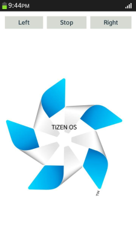

# Timing control for script-based animations

Timing control is used mainly in animations for cyclic script execution synchronized with screen changes.

Making script-based animations requires updating the properties of the animated objects in each frame. In computerized animations, the frame rate is normally 30 or 60 fps (frames per second), because the human eye perceives a sequence of images as an animation when they change at least 12-15 times per second. The `requestAnimationFrame()` (or `webkitRequestAnimationFrame()`) method enables [scheduling the animation frame update requests](#creating-an-application-with-a-controllable-animation). The frame update rate depends on implementation. In Tizen 2.2, it is about 60 fps.

> **Note**  
> In mobile applications, when using the emulator, you must include the  `webkit` prefix in method names, such as `window.performance.webkitNow()`. However, when using a device, the prefix must not be used. In addition, when using the emulator, methods assigned to variables must be formatted as follows:

```
window.performance.windowNow = window.performance.now || window.performance.webkitNow || Date.now;
window.performance.windowNow();
```

In wearable applications, when you are using the emulator and want to support backward compatibility, methods assigned to variables must be formatted as follows:

```
window.performance.windowNow = window.performance.now || window.performance.webkitNow || Date.now;
window.performance.windowNow();
```

## Creating an Application with a Controllable Animation

To optimize the performance of your application, you must learn to create a simple controllable DOM animation.

This example creates a screen with a Tizen pinwheel rotating on it, and buttons to increase or decrease the rotation speed and start or stop the animation.

**Figure: Controllable animation (in mobile applications only)**



1. Create the HTML layout, including a `<nav>` element with 3 buttons and `<div>` elements for the pinwheel image and text:

   ```
   <nav>
      <a href="#" id="leftBtn" class="btn">Left</a>
      <a href="#" id="playstopBtn" class="btn">Stop</a>
      <a href="#" id="rightBtn" class="btn">Right</a>
   </nav>

   <div id="pinwheel">
      <div id="rotateBackground"></div>
      TIZEN OS
   </div>
   ```

2. Set the CSS properties:			

   1. Define properties for a flexible vertical layout for the content area, and the `nav` container:

      ```
      body {
         display: -webkit-flex;
         -webkit-flex-direction: column;
      }

      nav {
         display: -webkit-flex;
         -webkit-flex-direction: row;
         -webkit-align-content: stretch;
         width: 100%;
      }
      ```

   2. To enable the rotation of the background, define the `pinwheel` element in relation to its children, and set its size to change according to the display size. Define the `rotateBackground` element to have a fixed size depending on the display size:

      ```
      #pinwheel {
         width: 90vw;
         height: 80vh;
         position: relative;
         overflow: hidden;
         line-height: 80vh;
         text-align: center;
      }

      #rotateBackground {
         background: url(images/Tizen-Pinwheel-On-Dark-RGB.png) no-repeat center;
         background-size: 90vw;
         content: "";
         position: absolute;
         width: 90vw;
         height: 90vh;
         z-index: -1;
      }
      ```

3. Declare the variables used in the application:

   ```
   <script type="text/javascript">
       var leftDiv, rightDiv, playstopDiv,
           handlerRequest, rotateBackgroundDiv, rotation = 0, speed = -1;
   </script>
   ```

   The `leftDiv`, `rightDiv`, `playstopDiv`, and `rotateBackgroundDiv` variables contain DOM elements from the application UI. The `handlerRequest` variable handles the `requestAnimationFrame()` requests. The `rotation` variable is the current angle of the pinwheel, and the `speed` variable is the rotation speed in degrees per frame.

4. Create a DOM object for the **Play** or **Stop** button and define button events:

   ```
   playstopDiv = document.getElementById('playstopBtn');

   playstopDiv.onclick = function() {
       if (handlerRequest) {
           window.webkitCancelRequestAnimationFrame(handlerRequest);
           handlerRequest = 0;
           playstopDiv.innerHTML = 'Play';
       } else {
           handlerRequest = window.webkitRequestAnimationFrame(nextFrame);
           playstopDiv.innerHTML = 'Stop';
       }
   };
   ```

   When the `handlerRequest` variable returns `true`, the animation is played. Clicking the button calls the `cancelRequestAnimationFrame()` method to stop the animation. The `handlerRequest` is reset to value 0, and the button text changes from **Stop** to **Play**.

   If the `handlerRequest` value is undefined or 0, the animation is not played. Clicking the button calls the `requestAnimationFrame()` method to play the animation, and the button text changes from **Play** to **Stop**. The parameter of the `requestAnimationFrame()` method defines the callback.

5. In the callback of the `requestAnimationFrame()` method, to avoid rotation value overflow, define the rotation value to be decreased when the absolute value is greater than the round angle (360 degrees). Set the background rotation using the `rotate()` method, and use the `requestAnimationFrame()` method to update the next frame of the animation:

   ```
   function nextFrame(arg) {
       rotation += speed;

       if (rotation > 360) {
           rotation -= 360;
       } else if (rotation < -360) {
           rotation += 360;
       }
       rotateBackgroundDiv.style.webkitTransform = 'rotate(' + rotation + 'deg)';
       handlerRequest = window.webkitRequestAnimationFrame(nextFrame);
   }
   ```

   The callback method is automatically called before the screen is updated. To keep the animation going, the `requestAnimationFrame()` method is called at the end of the callback method. Because the callback is synchronized with screen updates, when application is in the background and not visible on the screen, the updates are not called and the animation stops.

6. Set events for the **Left** and **Right** buttons. Tapping the buttons increases or decreases the animation speed.

   ```
   leftDiv = document.getElementById('leftBtn');
   leftDiv.onclick = function() {
       speed -= 0.5;
   };
   rightDiv = document.getElementById('rightBtn');
   rightDiv.onclick = function() {
       speed += 0.5;
   };
   handlerRequest = window.webkitRequestAnimationFrame(nextFrame);
   ```

### Source Code

For the complete source code related to this use case, see the following file:

- [renamed_index.html](http://download.tizen.org/misc/examples/w3c_html5/performance_and_optimization/timing_control_for_script_based_animations/animation_timing_warm_up)

## Related Information
* Dependencies
  - Tizen 2.4 and Higher for Mobile
  - Tizen 2.3.1 and Higher for Wearable
  - Tizen 3.0 and Higher for TV
