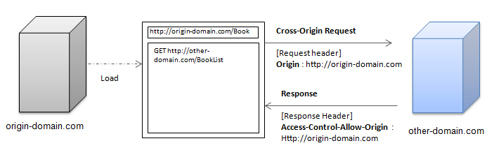
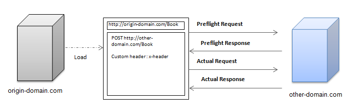

# Cross-Origin Resource Sharing

Tizen supports the mechanism of cross-origin resource sharing (CORS), which can activate a client-side [cross-origin request](http://www.w3.org/TR/2014/REC-cors-20140116/#cross-origin-request-0) (COR).

In CORS, new headers related to HTTP communication have been added to allow you to accept or reject CORs:

- [Origin](http://www.w3.org/TR/2014/REC-cors-20140116/#origin-request-header) request header

  Includes the domain information which has incurred the COR, and is used for the purpose of checking the source of the domain side that has received the relevant request. In addition, this header is protected in the browser side and cannot be changed from the application side.

- [Access-Control-Allow-Origin](http://www.w3.org/TR/2014/REC-cors-20140116/#access-control-allow-origin-response-header) response header

  Allows a relevant response only when the information in the `Origin` request header matches. If the `Access-Control-Allow-Origin` header is a wildcard (*), it unconditionally allows the response regardless of the `Origin` request header information.

  > **Note**  
  > If an extremely permissive CORS policy is used, it can lead to spoofing, data stealing, relay, and other attacks through communication with malicious application programs. To avoid unexpected consequences, pay attention when defining the response header.

CORS supports 2 request types: simple and preflight.

## Simple Request

The request is considered to be a [simple request](http://www.w3.org/TR/2014/REC-cors-20140116/#resource-requests), if all the conditions following conditions are met:

- HTTP methods can only use `GET`, `POST`, and `HEAD`.
- No custom header is allowed.
- The `Content-Type` is one of the following:  
  - `application/x-www-form-urlencoded`
  - `multipart/form-data`
  - `text/plain`

When [using simple requests](#using-simple-requests), the response is set in the server side with the following response headers:

- [Access-Control-Allow-Origin](http://www.w3.org/TR/2014/REC-cors-20140116/#access-control-allow-origin-response-header) (mandatory)
- [Access-Control-Allow-Credentials](http://www.w3.org/TR/2014/REC-cors-20140116/#access-control-allow-credentials-response-header) (optional)
- [Access-Control-Expose-Headers](http://www.w3.org/TR/2014/REC-cors-20140116/#access-control-expose-headers-response-header) (optional)

**Figure: Simple request workflow**



## Preflight Request

If a request is not a simple request, it is considered to be a [preflight (non-simple) request](http://www.w3.org/TR/2014/REC-cors-20140116/#resource-preflight-requests), which is [case-insensitive](http://www.w3.org/TR/2014/REC-cors-20140116/#terminology).

If the access authority is allowed through the preflight request, the actual request for sending the actual data is made. The preflight request can allow access based on various standards other than `Origin`, such as HTTP certification, HTTP method (for example, `GET`, `POST`, or `PUT…`), or the existence of a certain header.

When [using preflight requests](#using-preflight-requests), the response is set in the server side with the following response headers:

- [Access-Control-Allow-Origin](http://www.w3.org/TR/2014/REC-cors-20140116/#access-control-allow-origin-response-header) (mandatory)
- [Access-Control-Allow-Methods](http://www.w3.org/TR/2014/REC-cors-20140116/#access-control-allow-methods-response-header) (mandatory)
- [Access-Control-Allow-Headers](http://www.w3.org/TR/2014/REC-cors-20140116/#access-control-allow-headers-response-header) (mandatory, if a custom header is used)
- [Access-Control-Allow-Credentials](http://www.w3.org/TR/2014/REC-cors-20140116/#access-control-allow-credentials-response-header) (optional)
- [Access-Control-Expose-Headers](http://www.w3.org/TR/2014/REC-cors-20140116/#access-control-expose-headers-response-header) (optional)
- [Access-Control-Max-Age](http://www.w3.org/TR/2014/REC-cors-20140116/#access-control-max-age-response-header) (optional)

**Figure: Preflight request workflow**



## Using Simple Requests

Learning how to handle a simple request based on an XML HTTP Request enhances the security features of your application:

1. Create an [XML HTTP request](../communication/xmlhttprequest.md) on the client side, using JavaScript code that requests Ajax communication:

   ```
   <script>
       var method = 'GET';
       var url = 'http://another-domain.com/CORS/';
       var xhr = new XMLHttpRequest();

       xhr.open(method, url);
       xhr.send();
   </script>
   ```

2. On the server side, define the domain from which requests are allowed. In this case, the `http://origin-domain.com` domain has the required authority.

   ```
   <?php
      header("Access-Control-Allow-Origin: http://origin-domain.com");
   ?>
   ```

   If all sites are allowed to send requests, use the wildcard (\*):

   ```
   <?php
      header("Access-Control-Allow-Origin: *");
   ?>
   ```

3. Check the request header.

   If you check the request header through the network log, you find that an additional `Origin` header has been added. This header informs the relevant server of the sender side domain. The `Origin` header is protected in the browser side, and cannot be changed by the user.

   ```
   GET http://origin-domain.com/CORS/simple_reqeust.html HTTP/1.1
   Host: origin-domain.com
   Origin: http://origin-domain.com
   ```

4. Check the response header:

   - If the request is received from a domain with access authority, the server allows a response. The response header includes the `Access-Control-Allow-Origin` header set in the server side.

     ```
     HTTP/1/1 200 OK
     Access-Control-Allow-Origin: http://origin-domain.com
     ```

   - If the request is received from a domain without access authority, the server sends no response, and the following error occurs:

     ```
     XMLHttpRequest cannot load http://another-domain.com/CORS.
     Origin http://another-domain.com/CORS is not allowed by Access-Control-Allow-Origin.
     ```

   > **Note**  
   > You must define the authorized domains on the server side to ensure that CORS is handled properly. For more information on setting the authorization settings on different platforms, see [Enable CORS Web site](http://enable-cors.org/server.html).

### Source Code

For the complete source code related to this use case, see the following file:

- [simple_request.html](http://download.tizen.org/misc/examples/w3c_html5/security/cross_origin_resource_sharing)

## Using Preflight Requests

Learning how to handle a preflight request based on an XML HTTP Request enhances the security features of your application.

1. Create an [XML HTTP request](../communication/xmlhttprequest.md) on the client side, using JavaScript code that requests Ajax communication. In addition, define the request `Content-Type` and add a custom header.

   ```
   <script>
       var xhr = new XMLHttpRequest();
       xhr.open('PUT', 'http://another-domain.com/CORS/');

       xhr.setRequestHeader('Content-Type', 'application/json');

       xhr.setRequestHeader('Header-Custom-TizenCORS', 'OK');
       xhr.send(data);
   </script>
   ```

2. On the server side, define the domain from which requests are allowed. In this case, the `http://110.0.0.160:8081` domain has the required authority. In addition, define various server settings.

   ```
   <?php
      header("Access-Control-Allow-Origin: http://110.0.0.160:8081");

      /* Allowed request method */
      header("Access-Control-Allow-Methods: PUT");

      /* Allowed custom header */
      header("Access-Control-Allow-Headers: Content-Type");

      /* Age set to 1 day to improve speed caching */
      header("Access-Control-Max-Age: 86400");

      /* Options request exits before the page is completely loaded */
      if (strtolower($_SERVER['REQUEST_METHOD']) == 'options') {
         exit();
      }

      /* Response data */
      $arr = array("user_name" => "tizen", "phone_number" => "12312334234");

      /* Response data returned in JSON format */
      echo json_encode($arr);
   ?>
   ```

3. Check the request and response headers.

   If you check the network log, you find that 2 communications between the browser and server occur consecutively: first the preflight request and response, and then the actual request and response.

   - The preflight request checks the access authority before sending the actual data. The `Origin` and `Access-Control-Request-Headers` headers have been added to the request, because the request has a user-defined custom header, and the `Content-Type` set to `application/json`:

     ```
     OPTION http://origin-domain.com/CORS/non_simple_reqeust.html HTTP/1.1
     Host: origin-domain.com
     Origin: http://origin-domain.com
     Access-Control-Request-Headers: Header-Custom-Tizen, origin, content-type
     ```

   - If the request is sent from the browser side, a preflight response is sent for it from the server side. The browser determines from the response whether the actual data is sent. In the following preflight response example, the `Content-Type` and `Header-Custom-Tizen` are included in the `Access-Control-Allow-Headers` header:

     ```
     HTTP/1/1 200 OK
     Access-Control-Allow-Headers: Content-Type, Header-Custom-Tizen
     Access-Control-Allow-Methods: PUT
     Access-Control-Allow-Origin: http://origin-domain.com
     Access-Control-Max-Age: 86400
     ```

   - Once the access authority is checked, the browser sends the actual data request to the server side. This request includes the actual data:

     ```
     PUT http://origin-domain.com/CORS/non_simple_reqeust.html HTTP/1.1
     Content-Type: application/json
     Host: origin-domain.com
     Origin: http://origin-domain.com
     Header-Custom-TizenCOURSTest: OK
     ```

   - The response to the actual data request contains the actual handled result:

     ```
     HTTP/1/1 200 OK
     Access-Control-Allow-Headers: Content-Type, Header-Custom-Tizen
     Access-Control-Allow-Methods: PUT
     Access-Control-Allow-Origin: http://origin-domain.com
     Access-Control-Max-Age: 86400
     ```

   If the access authority fails, the browser does not send the actual data request. Instead, the following error occurs in the browser side:

   ```
   XMLHttpRequest cannot load http://another-domain.com/CORS.
   Request header field Header-Custom-Tizen is not allowed by Access-Control-Allow-Headers.
   ```

	> **Note**  
	> You must define the authorized domains on the server side to ensure that CORS is handled properly. For more information on setting the authorization settings on different platforms, see [Enable CORS Web site](http://enable-cors.org/server.html).

## Related Information
* Dependencies  
  - Tizen 2.4 and Higher for Mobile
  - Tizen 2.3.1 and Higher for Wearable
  - Tizen 3.0 and Higher for TV
