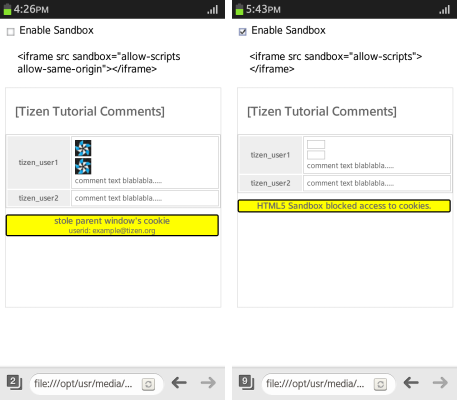
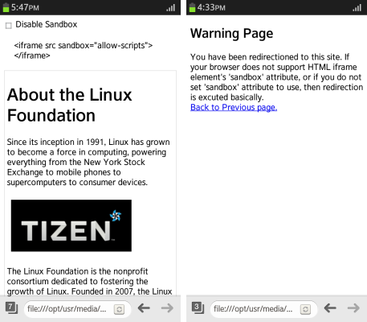
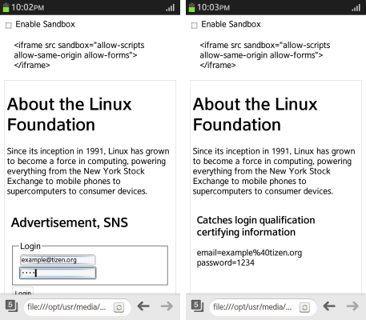
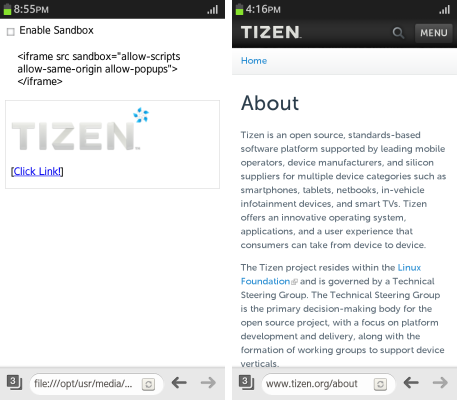

# HTML5 iframe element

The HTML5 `iframe` element can be used to solve security and design issues in embedded Web content.

The main feature of the `iframe` element is the `sandbox` attribute (in [mobile](http://www.w3.org/TR/2014/REC-html5-20141028/embedded-content-0.html#attr-iframe-sandbox), [wearable](http://www.w3.org/TR/2014/CR-html5-20140429/embedded-content-0.html#attr-iframe-sandbox), and [TV](http://www.w3.org/TR/2014/REC-html5-20141028/embedded-content-0.html#attr-iframe-sandbox) applications):

- To enhance application security, you can use the `sandbox` attribute of the `iframe` object to control the execution of tasks that can result in unreliable content.

- If an empty value is assigned to the `sandbox` attribute, the following restrictions are applied:

  - Content is treated as belonging to a unique origin. Access to cookies, local storage, and other pages within the same domain are not allowed.
  - Form submission is disabled.
  - Script execution is disabled.
  - Link navigation is disabled.
  - Plug-ins are disabled.
  - Pop-ups are disabled.

  To work around these restrictions, you can use the following additional security restriction conditions:

  - `allow-same-origin`  
    Enables the content [to be treated as belonging to the same origin](#sandboxed_cookies).

  - `allow-top-navigation`  
    Enables [ navigation for the top-level browsing context](#sandboxed_page).

  - `allow-forms`  
    Enables [form submission](#sandboxed_form).

  - `allow-scripts`  
     Enables script execution, but blocks pop-ups.

  - `allow-popups`  
    Enables [ opening a pop-up window from the sandboxed element](#sandboxed_popups).

> **Note**  
> The `scrolling`, `align`, `frameborder`, `marginheight`, `marginwidth`, `longdesc`, and `seamless` HTML5 attributes are no longer supported in the latest HTML5 version.

<a name="sandboxed_cookies"></a>
## Accessing Sandboxed Cookies

Learning how to control `iframe` element content when accessing the cookies of the parent document enhances the security features of your application:

1. Create an `<input>` element of the `checkbox` type that enables the sandbox activation. In addition, create an `iframe` element with the `sandbox` property (in [mobile](http://www.w3.org/TR/2014/REC-html5-20141028/embedded-content-0.html#attr-iframe-sandbox), [wearable](http://www.w3.org/TR/2014/CR-html5-20140429/embedded-content-0.html#attr-iframe-sandbox), and [TV](http://www.w3.org/TR/2014/REC-html5-20141028/embedded-content-0.html#attr-iframe-sandbox) applications). To allow script execution in the `iframe` element content and cookie access, set the `sandbox` attribute value as `allow-same-origin`:

   ```
   <input type="checkbox" id="chkSandbox" name="chkSandbox"
          onclick="setSandbox()"/> Enable Sandbox
   <div id="description" style="padding: 10px; margin: 10px;"></div>

   <iframe src="iframe_cookie_stolen.html"
           sandbox="allow-scripts allow-same-origin"
           id="iframe"
           width="100%" height="350px"
           style="border: 1px solid #DCDCDC;"></iframe>
   ```

2. Create a test cookie:

   ```
   <script>
       SetCookie('userid', 'example@tizen.org', 7);

       function SetCookie(name, value, expiredays) {
           var today = new Date();
           today.setDate(today.getDate() + expiredays);
           document.cookie = name + '=' + escape(value) +
                             '; path=/; expires=' + today.toGMTString() + ';';
       }
   </script>
   ```

3. To block cookie access, remove the `allow-same-origin` attribute from the `sandbox` attribute value:

   ```
   <script>
       function setSandbox() {
           var checkbox = document.querySelector('#chkSandbox');
           var frame = document.querySelector('#iframe');
           var frameInfo = '', flag = '';

           if (checkbox.checked) {
               /* Access to cookies within the same domain is not allowed */
               flag = 'allow-scripts';
               frameInfo = '<iframe src sandbox="allow-scripts"></iframe>';
           } else {
               /* Access to cookies within the same domain is allowed */
               flag = 'allow-scripts allow-same-origin';
               frameInfo = '<iframe src sandbox="allow-scripts allow-same-origin"></iframe>';
           }

           frame.setAttribute('sandbox', flag);
           frame.setAttribute('src', 'iframe_cookie_stolen.html');
           document.querySelector('#description').textContent = frameInfo;
       }
   </script>
   ```

4. Display the result:

   ```
   <div id="message"></div>
   ```

5. If the sandboxing functionality is active, a message is displayed. If the sandboxing functionality is inactive, the imported cookie is displayed:

   ```
   <script>
       window.onload = function() {
           var message = document.getElementById('message');
           try {
               message.innerHTML = '<h3>stole parent window\'s cookie</h3> userid: ' + GetCookie('userid');
           } catch (e) {
               message.innerHTML = '<h3>HTML5 Sandbox blocked access to cookies.</h3>';
           }
       };

       function GetCookie(Name) {
           var search = Name + '='

           if (document.cookie.length > 0) {
               offset = document.cookie.indexOf(search);

               if (offset != -1) {
                   offset += search.length;
                   end = document.cookie.indexOf(';', offset);

                   if (end == -1)
                       end = document.cookie.length;

                   return unescape(document.cookie.substring(offset, end));
               }
           }

           return '';
       }
   </script>
   ```

**Figure: Sandbox cookie access (in mobile applications only)**



### Source Code

For the complete source code related to this use case, see the following files:

- [cookie_stolen.html](http://download.tizen.org/misc/examples/w3c_html5/security/html5_the_iframe_element)
- [iframe_cookie_stolen.html](http://download.tizen.org/misc/examples/w3c_html5/security/html5_the_iframe_element)

## Redirecting a Sandboxed Page

Learning how to control `iframe` element content when redirecting a page enhances the security features of your application:

1. Create an `<input>` element of the `checkbox` type that disables the sandbox. In addition, create an `iframe` element with the `sandbox` property (in [mobile](http://www.w3.org/TR/2014/REC-html5-20141028/embedded-content-0.html#attr-iframe-sandbox), [wearable](http://www.w3.org/TR/2014/CR-html5-20140429/embedded-content-0.html#attr-iframe-sandbox), and [TV](http://www.w3.org/TR/2014/REC-html5-20141028/embedded-content-0.html#attr-iframe-sandbox) applications):

   ```
   <input type="checkbox" id="chkSandbox" name="chkSandbox"
          onclick="setSandbox()"/> Disable Sandbox
   <div id="description" style="padding: 10px; margin: 10px;"></div>

   <iframe src="iframe_page_redirection.html"
           sandbox="allow-scripts"
           id="iframe"></iframe>
   ```

2. If the `sandbox` attribute is deactivated, set the `allow-top-navigation` attribute to the `sandbox` attribute value:

   ```
   <script>
       function setSandbox() {
           var checkbox = document.querySelector('#chkSandbox');
           var frame = document.querySelector('#iframe');
           var frameInfo = '', flag = '';

           if (checkbox.checked) {
               flag = 'allow-scripts allow-top-navigation';
               frameInfo = '<iframe src sandbox="allow-scripts allow-top-navigation"></iframe>';
           } else {
               flag = 'allow-scripts';
               frameInfo = '<iframe src sandbox="allow-scripts"></iframe>';
           }

           frame.setAttribute('sandbox', flag);
           frame.setAttribute('src', 'iframe_page_redirection.html');
           document.querySelector('#description').textContent = frameInfo;
       }
   </script>
   ```

3. Include the image displayed on the page:

   ```
   
   ```

4. If the page redirection is blocked, a message is displayed. If not, the user is redirected to the `warning.html` page:

   ```
   <script>
       try {
           location = 'warning.html';
       } catch (e) {
           alert('HTML5 Sandbox prevented top-level navigation.');
       }
   </script>
   ```

**Figure: Sandbox page redirection (in mobile applications only)**



### Source Code

For the complete source code related to this use case, see the following files:

- [iframe_page_redirection.html](http://download.tizen.org/misc/examples/w3c_html5/security/html5_the_iframe_element)
- [page_redirection.html](http://download.tizen.org/misc/examples/w3c_html5/security/html5_the_iframe_element)
- [warning.html](http://download.tizen.org/misc/examples/w3c_html5/security/html5_the_iframe_element)

<a name="sandboxed_form"></a>
## Submitting a Sandboxed Form

Learning how to control `iframe` element content when submitting a form enhances the security features of your application:

1. Create an `<input>` element of the `checkbox` type that enables the sandbox activation. In addition, create an `iframe` element with the `sandbox` property (in [mobile](http://www.w3.org/TR/2014/REC-html5-20141028/embedded-content-0.html#attr-iframe-sandbox), [wearable](http://www.w3.org/TR/2014/CR-html5-20140429/embedded-content-0.html#attr-iframe-sandbox), and [TV](http://www.w3.org/TR/2014/REC-html5-20141028/embedded-content-0.html#attr-iframe-sandbox) applications). To allow form submission, set the `sandbox` attribute value as `allow-forms`:

   ```
   <input type="checkbox" id="chkSandbox" name="chkSandbox"
          onclick="setSandbox()"/> Enable Sandbox
   <div id="description" style="padding: 10px; margin: 10px;"></div>

   <iframe src="iframe_form_submission.html"
           sandbox="allow-scripts allow-same-origin allow-forms"
           width="100%" height="200px"></iframe>
   ```

2. If the `sandbox` attribute is activated, remove the `allow-forms` attribute from the `sandbox` attribute value:

   ```
   <script>
       function setSandbox() {
           var checkbox = document.querySelector('#chkSandbox');
           var frame = document.querySelector('#iframe');
           var frameInfo = '', flag = '';

           if (checkbox.checked) {
               flag = 'allow-scripts allow-same-origin';
               frameInfo = '<iframe src sandbox="allow-scripts allow-same-origin"></iframe>';
           } else {
               flag = 'allow-scripts allow-same-origin allow-forms';
               frameInfo = '<iframe src sandbox="allow-scripts allow-same-origin allow-forms"></iframe>';
           }

           frame.setAttribute('sandbox', flag);
           frame.setAttribute('src', 'iframe_form_submission.html');
           document.querySelector('#description').textContent = frameInfo;
       }
   </script>
   ```

3. Create a form for the login screen with `<input>` elements to enter an email and password, and submit them:

   ```
   <form method="get" action="iframe_form_submission.html">
      <h3>Advertisement, SNS</h3>

      <fieldset>
         <legend>Login</legend>
         <input type="text" id="email" name="email" placeholder="e-mail address" required />
         <input type="password" id="password" name="password" placeholder="password" required />
      </fieldset>
      <input type="submit" value="Login"/>
   </form>
   ```

4. If the `sandbox` attribute is deactivated, the imported login information is displayed:

   ```
   <script>
       window.onload = function() {
           var html;

           if (location.href.indexOf('?') >= 0) {
               html = ['<div id='message'>',
                      '<h3>Catches login qualification certifying information</h3>',
                      (location.href.split('?')[1]).replace('&', '<br/>'),
                      '</div>'].join('');

               document.body.innerHTML = html;
           }
       };
   </script>
   ```

**Figure: Sandbox form submission (in mobile applications only)**



### Source Code

For the complete source code related to this use case, see the following files:

- [form_submission.html](http://download.tizen.org/misc/examples/w3c_html5/security/html5_the_iframe_element)
- [iframe_form_submission.html](http://download.tizen.org/misc/examples/w3c_html5/security/html5_the_iframe_element)


<a name="sandboxed_popups"></a>
## Managing Sandboxed Pop-ups

Learning how to control the opening of the `iframe` element content enhances the security features of your application:

1.  Create an `<input>` element of the `checkbox` type that enables the sandbox activation. In addition, create an `iframe` element with the `sandbox` property (in [mobile](http://www.w3.org/TR/2014/REC-html5-20141028/embedded-content-0.html#attr-iframe-sandbox), [wearable](http://www.w3.org/TR/2014/CR-html5-20140429/embedded-content-0.html#attr-iframe-sandbox), and [TV](http://www.w3.org/TR/2014/REC-html5-20141028/embedded-content-0.html#attr-iframe-sandbox) applications). To allow pop-ups, set the `sandbox` attribute value as `allow-popups`:

   ```
   <input type="checkbox" id="chkSandbox" name="chkSandbox"
          onclick="setSandbox()"/> Enable Sandbox
   <div id="description" style="padding:10 px; margin:10 px;"></div>

   <iframe src="iframe_popup.html"
           sandbox="allow-scripts allow-same-origin allow-popups"
           id="iframe"
           style="border: 1px solid #DCDCDC;"></iframe>
   ```

2. If the `sandbox` attribute is activated, remove the `allow-popups` flag from the `sandbox` attribute value:

   ```
   <script>
       function setSandbox() {
           var checkbox = document.querySelector('#chkSandbox');
           var frame = document.querySelector('#iframe');
           var frameInfo = '', flag ='';

           if (checkbox.checked) {
               flag = 'allow-scripts allow-same-origin';
               frameInfo = '<iframe src sandbox="allow-scripts allow-same-origin"></iframe>';
           } else {
               flag = 'allow-scripts allow-same-origin allow-popups'
               frameInfo = '<iframe src sandbox="allow-scripts allow-same-origin allow-popups"></iframe>';
           }

           frame.setAttribute('sandbox', flag);
           frame.setAttribute('src', 'iframe_popup.html');
           document.querySelector('#description').textContent = frameInfo;
       }
   </script>
   ```

3. Create an external link in the `iframe` element:

   ```
   <p>[<a href="https://www.tizen.org/about" target="_blank">Click Link!</a>]</p>
   ```

**Figure: Sandbox pop-up (in mobile applications only)**



### Source Code

For the complete source code related to this use case, see the following files:

- [iframe_popup.html](http://download.tizen.org/misc/examples/w3c_html5/security/html5_the_iframe_element)
- [popup.html](http://download.tizen.org/misc/examples/w3c_html5/security/html5_the_iframe_element)

## Related Information
* Dependencies
  - Tizen 2.4 and Higher for Mobile
  - Tizen 2.3.1 and Higher for Wearable
  - Tizen 3.0 and Higher for TV
