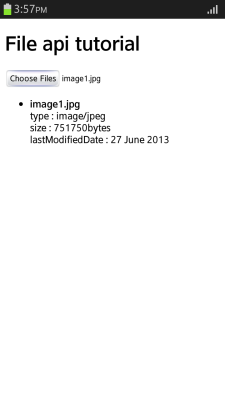
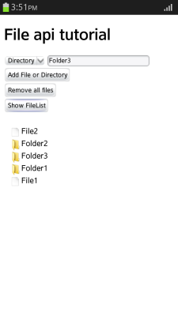

# File

You can access a local storage to read file information. In mobile applications, you can also manipulate files by accessing sandboxed file systems.

The main features of the File API include:

- Local file management

  - Reading local file information

    You can select a local file to upload using the `FileList` interface (in [mobile](http://www.w3.org/TR/2015/WD-FileAPI-20150421/#dfn-filelist), [wearable](http://www.w3.org/TR/2011/WD-FileAPI-20111020/#dfn-filelist), and [TV](http://www.w3.org/TR/2015/WD-FileAPI-20150421/#dfn-filelist) applications), which creates and returns a `File` object (in [mobile](http://www.w3.org/TR/2015/WD-FileAPI-20150421/#file), [wearable](http://www.w3.org/TR/2011/WD-FileAPI-20111020/#file), and [TV](http://www.w3.org/TR/2015/WD-FileAPI-20150421/#file) applications).

    The `File` object is used to [read basic file information](#reading-local-file-information).

  - Reading local file content

    You can use the reading methods of the `FileReader` interface (in [mobile](http://www.w3.org/TR/2015/WD-FileAPI-20150421/#dfn-filereader), [wearable](http://www.w3.org/TR/2011/WD-FileAPI-20111020/#FileReader-interface), and [TV](http://www.w3.org/TR/2015/WD-FileAPI-20150421/#dfn-filereader) applications) to [read file content](#reading-local-file-content) in text, binary, or `dataURL` format. If the data is loaded, the `onload` event occurs. This event uses the data reading methods according to file format.

  - Slicing local files

    You can use the `slice()` method with a local file or the `Blob` interface (in [mobile](http://www.w3.org/TR/2015/WD-FileAPI-20150421/#blob), [wearable](http://www.w3.org/TR/2011/WD-FileAPI-20111020/#blob), and [TV](http://www.w3.org/TR/2015/WD-FileAPI-20150421/#blob) applications) to [slice data objects](#slicing-blob). You can use the created blob to read data as a binary string using the `FileReader` interface.

- Sandboxed file system management **in mobile applications only**

  - Accessing sandboxed file systems

    You can [request access to a sandboxed file system](#accessing-a-sandboxed-file-system-in-mobile-applications) using the [LocalFileSystem](http://www.w3.org/TR/2011/WD-file-system-api-20110419/#using-localfilesystem) interface.

  - Displaying files in a sandboxed file system

    You can use `readEntries()` method of the [DirectoryReader](http://www.w3.org/TR/2011/WD-file-system-api-20110419/#the-directoryreader-interface) interface to [display directories or files](#displaying-files-in-a-sandboxed-file-system-in-mobile-applications).

  - Creating a directory or file within a sandboxed file system

    You can use the `getDirectory()` and `getFile()` methods of the [DirectoryEntry](http://www.w3.org/TR/2011/WD-file-system-api-20110419/#the-directoryentry-interface) interface) to [create a directory or file](#creating-a-directory-or-file-in-mobile-applications).

  - Deleting a directory or file within a sandboxed file system

    You can use the `removeRecursively()` method of the `DirectoryEntry` interface and the `remove()` method of the [Entry](http://www.w3.org/TR/2011/WD-file-system-api-20110419/#the-entry-interface) interface to [delete a directory or file](#removing-a-directory-or-file-in-mobile-applications).

## Reading Local File Information

Reading basic information, such as file name, size, MIME type, modification date, and path, of a local file is a useful file management skill:

1. To display file information, create the `<input type="file">` element and other needed elements:

   ```
   <input type="file" id="tizenFiles" onchange="readSelectedFiles();" multiple />
   <div id="selectedFileInfoList"></div>
   ```

	> **Note**  
	> To enable multiple upload, use the `multiple` attribute.

2. Create a `FileList` instance (in [mobile](http://www.w3.org/TR/2015/WD-FileAPI-20150421/#dfn-filelist), [wearable](http://www.w3.org/TR/2011/WD-FileAPI-20111020/#dfn-filelist), and [TV](http://www.w3.org/TR/2015/WD-FileAPI-20150421/#dfn-filelist) applications):

   ```
   <script>
       var files = document.getElementById('tizenFiles').files;
       if (files.length === 0) return;
   </script>
   ```

3. Use the `readSelectedFiles()` method of the `FileList` interface to retrieve and display file information, such as file name, size, MIME type, and modification date:

   ```
   <script>
       function readSelectedFiles() {
           var displaySection = document.getElementById('selectedFileInfoList');
           var html = [];
           for (var i = 0; i < files.length; i++) {
               var file = files[i];
               html.push('<li>',
                         '<strong>', escape(file.name), '</strong><br/>',
                         '    type: ', file.type, '<br/>', /* MIME type */
                         '    size: ', file.size, 'bytes<br/>', /* Size */
                         '    lastModifiedDate: ', /* Last modification date */
                         (file.lastModifiedDate ? file.lastModifiedDate.toLocaleDateString() : ''),
                         '   <br/>',
                         '</li>');
           }
           displaySection.innerHTML = '<ul>' + html.join('') + '</ul>';
       }
   </script>
   ```

   **Figure: Displaying file information (in mobile applications only)**  
   

### Source Code

For the complete source code related to this use case, see the following file:

- [file_api_reading_local_files_info.html](http://download.tizen.org/misc/examples/w3c_html5/storage/file_api)

## Reading Local File Content

Reading a local image file in a Web application is a useful file management skill:

1. To read a local image file and display its information, create the `<input type="file">` element and other needed elements:

   ```
   <input type="file" id="tizenFiles" onchange="readSelectedFiles();" multiple/>
   <div id="selectedFileInfoList"></div>
   ```

2. Create a `FileReader` instance (in [mobile](http://www.w3.org/TR/2015/WD-FileAPI-20150421/#dfn-filereader), [wearable](http://www.w3.org/TR/2011/WD-FileAPI-20111020/#FileReader-interface), and [TV](http://www.w3.org/TR/2015/WD-FileAPI-20150421/#dfn-filereader) applications) to read the content of the local image file. Use the `readAsDataURL()` method to read data in the `dataURL` format.

   If the data is loaded, an `onload` event is fired. Create an `img` element to allocate the event result property value for rendering:

   ```
   <script>
       function readSelectedFiles() {
           var files = document.getElementById('tizenFiles').files;
           if (files.length === 0) {
               return;
           }

           var html = [];
           for (var i = 0; i < files.length; i++) {
               var file = files[i];

               var reader = new FileReader();

               /* Check whether the file is an image */
               if (!file.type.match('image.*')) {
                   continue;
               }

               reader.onload = (function(e) {
                   var img = document.createElement('img');
                   img.src = e.target.result;

                   /* Set the selected image's dataURL */
                   img.title = escape(file.name);
                   img.className = 'img';

                   document.getElementById('selectedFileInfoList').appendChild(img);
               };
               reader.readAsDataURL(file);
           }
       }
   </script>
   ```

   **Figure: Displaying an image file (in mobile applications only)**  
   

### Source Code

For the complete source code related to this use case, see the following file:

- [file_api_reading_local_files.html](http://download.tizen.org/misc/examples/w3c_html5/storage/file_api)

## Slicing Blob

Slicing a local file using the `Blob` interface (in [mobile](http://www.w3.org/TR/2015/WD-FileAPI-20150421/#blob), [wearable](http://www.w3.org/TR/2011/WD-FileAPI-20111020/#blob), and [TV](http://www.w3.org/TR/2015/WD-FileAPI-20150421/#blob) applications) is a useful file management skill:

1. Create the `<input type="file">` element, the element for inputting the start byte and the end byte for slice, and the element for displaying the slicing result:

   ```
   <input type="file" id="tizenFile" name="tizenFile" onchange="setFileSize();"/> <br/>
   start byte: <input type="text" id="startByte" name="startByte" style="width: 100px;"/>~
   end byte: <input type="text" id="endByte" name="endByte" style="width: 100px;"/>
   <input type="button" value="Slice File" onclick="readBinaryString();"/>

   <div id="result" style="padding: 25px 10px 0 20px;"></div>
   ```

2. To read the local file, create a `FileReader` instance (in [mobile](http://www.w3.org/TR/2015/WD-FileAPI-20150421/#dfn-filereader), [wearable](http://www.w3.org/TR/2011/WD-FileAPI-20111020/#FileReader-interface), and [TV](http://www.w3.org/TR/2015/WD-FileAPI-20150421/#dfn-filereader) applications):

   ```
   <script>
       var reader = new FileReader();
   </script>
   ```

3. Slice the defined byte range (from `startByte` to `endByte`) using the `slice()` method of the `File` interface (in [mobile](http://www.w3.org/TR/2015/WD-FileAPI-20150421/#file), [wearable](http://www.w3.org/TR/2011/WD-FileAPI-20111020/#file), and [TV](http://www.w3.org/TR/2015/WD-FileAPI-20150421/#file) applications):

   ```
   <script>
       function readBinaryString() {
           if (document.getElementById('tizenFile').files.length === 0) {
               alert('Upload File');

               return;
           }

           var file = document.getElementById('tizenFile').files[0];
           var startByte = document.getElementById('startByte').value;
           var endByte = document.getElementById('endByte').value;

           var blob = file.slice(startByte, endByte);
   ```

   A new `Blob` object is created.

4. Read the data as a binary string using the `readAsBinaryString()` method:

   ```
           reader.readAsBinaryString(blob);
       }
   </script>
   ```

5. If the data loading is complete, the read data is displayed. Check the status using the `onloadend` event:

   ```
   <script>
       reader.onloadend = function(e) {
           if (e.target.readyState == FileReader.DONE) /* DONE == 2 */ {
               document.getElementById('result').textContent = e.target.result;
           }
       };
   </script>
   ```

   **Figure: Slicing a file (in mobile applications only)**  
   

### Source Code

For the complete source code related to this use case, see the following file:

- [file_api_slicing_blob.htm](http://download.tizen.org/misc/examples/w3c_html5/storage/file_api)

## Accessing a Sandboxed File System in Mobile Applications

Requesting access to sandboxed sections of a local file system is a useful file management skill:

1. Use the `requestFileSystem()` method of the [LocalFileSystem](http://www.w3.org/TR/2011/WD-file-system-api-20110419/#using-localfilesystem) interface to request access to sandboxed sections of a local file system:

   ```
   <script>
       /* Tizen uses the webkit prefix */
       window.requestFileSystem = window.webkitRequestFileSystem;

       var fs = null;

       /* Initialize the file system when loading a page */
       if (window.requestFileSystem) {
           initFS();
       }

       function initFS() {
           /* Request for access to the sandboxed file system */
           /* and define PERSISTENT or TEMPORARY storage */
           window.requestFileSystem(window.TEMPORARY,
                                    1024 * 1024, /* Storage space (bytes) */
                                    function(filesystem) {fs = filesystem;},
                                    errorHandler);
       }
   </script>
   ```

   > **Note**  
   > The `requestFileSystem()` method is created in the Web application program when it is initially called.
 
   The directory file in the file system root can be searched, created and deleted by accessing local file system.

### Source Code

For the complete source code related to this use case, see the following file:

- [file_api_file_system.htm](http://download.tizen.org/misc/examples/w3c_html5/storage/file_api)

## Displaying Files in a Sandboxed File System in Mobile Applications

Reading a file or directory in a sandboxed section of a local file system is a useful file management skill:

1. Create the `<input type="button">` element for displaying the entries (directories or files) stored in the root directory within the file system, and the list element for displaying the result:

   ```
   <input type="button" value="Show FileList" onclick="ShowFileList();"/>
   <ul id="resultSection"></ul>
   ```

2. To read the entry within the file system, use the `createReader()` method of the [DirectoryEntry](http://www.w3.org/TR/2011/WD-file-system-api-20110419/#the-directoryentry-interface) interface:

   ```
   <script>
       function ShowFileList() {
           if (!fs) return;

           var objResultSection = document.querySelector('#resultSection');

           var root = fs.root;
           var dirReader = root.createReader();
   ```

3. Use the `readEntries()` method of the [DirectoryReader](http://www.w3.org/TR/2011/WD-file-system-api-20110419/#the-directoryreader-interface) interface to read all entries:

   ```
           dirReader.readEntries(function(entries) {
   ```

4. Display the list of the relevant entries using the [Entry](http://www.w3.org/TR/2011/WD-file-system-api-20110419/#the-entry-interface) interface:

   ```
               if (!entries.length) {
                   objResultSection.innerHTML = 'Filesystem is empty.';
               } else {
                   var fragment = document.createDocumentFragment();
                   var entry, i;

                   for (i = 0; i < entries.length; i++) {
                       entry = entries[i];

                       var img = entry.isDirectory ?
                                 '' :
                                 '';

                       var li = document.createElement('li');
                       /* Display entry name */
                       li.innerHTML = [img, '<span>', entry.name, '</span>'].join('');
                       objResultSection.innerHTML = '';
                       fragment.appendChild(li);
                   }
                   objResultSection.appendChild(fragment);
               }
           }, errorHandler);
       }
   </script>
    ```

> **Note**  
> For error handling, see [Accessing a Sandboxed File System](#accessing-a-sandboxed-file-system-in-mobile-applications).

**Figure: Displaying files**



### Source Code

For the complete source code related to this use case, see the following files:

- [file_api_file_system.htm](http://download.tizen.org/misc/examples/w3c_html5/storage/file_api)
- [icon_file.png](http://download.tizen.org/misc/examples/w3c_html5/storage/file_api/img)
- [icon_folder.png](http://download.tizen.org/misc/examples/w3c_html5/storage/file_api/img)

## Creating a Directory or File in Mobile Applications

Creating a directory or file in a sandboxed section of a local file system is a useful file management skill:

1. Create the `select` element for selecting the type of entry to be added, `<input type="text">` element for entering the entry name, and `<input type="button>"` element for creating the entry:

   ```
   <select id="selType">
      <option value="dir">Directory</option>
      <option value="file">File</option>
   </select>
   <input type="text" id="txtName" name="txtName" style="width: 200px;" maxlength="20"/>
   <input type="button" value="Add File or Directory" onclick="AddFile();"/>
   ```

2. To create a directory, use the `getDirectory()` method. To create a file, use the `getFile()` method:

    ```
    <script>
        function AddFile() {
            if (!fs) return;

            var type = document.querySelector('#selType').value;
            var name = document.querySelector('#txtName').value;

            if (name == '') {
                return alert('Enter File or Directory Name.');
            }

            if (type == 'file') {
                /* Create file */
                fs.root.getFile(name, {create: true}, null, errorHandler);
            } else if (type == 'dir') {
                /* Create directory */
                fs.root.getDirectory(name, {create: true}, null, errorHandler);
            }

            document.querySelector('#resultSection').innerHTML = 'Files created.';
        }
    </script>
    ```

    > **Note**  
    > For error handling, see [Accessing a Sandboxed File System](#accessing-a-sandboxed-file-system-in-mobile-applications).

    **Figure: Adding a file**  
    

### Source Code

For the complete source code related to this use case, see the following file:

- [file_api_file_system.htm](http://download.tizen.org/misc/examples/w3c_html5/storage/file_api)

## Removing a Directory or File in Mobile Applications

Deleting a directory or file in a sandboxed section of a local file system is a useful file management skill:

1. Create the `<input type="button">` element for deleting the entry (directory or file):

   ```
   <input type="button" value="Remove all files" onclick="RemoveFile();"/>
   ```

2. To delete a directory and all the files in it, use the `removeRecursively()` method. To delete an individual file, use the `remove()` method:

   ```
   <script>
       function RemoveFile() {
           if (!fs) return;

           var dirReader = fs.root.createReader();
           var entry, i;

           dirReader.readEntries(function(entries) {
               for (i = 0; i < entries.length; i++) {
                   entry = entries[i];
                   if (entry.isDirectory) {
                       entry.removeRecursively(function() {}, errorHandler);
                   } else {
                       entry.remove(function() {}, errorHandler);
                   }
               }
               document.querySelector('#resultSection').innerHTML = 'Directory emptied.';
           }, errorHandler);
       }
   </script>
   ```

   > **Note**  
   > For error handling, see [Accessing a Sandboxed File System](#accessing-a-sandboxed-file-system-in-mobile-applications).

   **Figure: Deleting files**  
   

### Source Code

For the complete source code related to this use case, see the following file:

- [file_api_file_system.htm](http://download.tizen.org/misc/examples/w3c_html5/storage/file_api)

## Related Information
* Dependencies
  - Tizen 2.4 and Higher for Mobile
  - Tizen 2.3.1 and Higher for Wearable
  - Tizen 3.0 and Higher for TV
