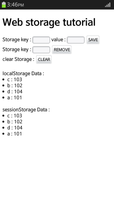
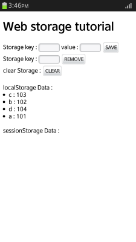

# Web Storage

A Web storage stores data in key-value format. The process is similar to existing cookies, but by using the Web Storage API, structured objects can be stored, and the storage capacity is increased to 5 MB per domain. In addition, no server request is needed, so server traffic is significantly reduced.

The Web Storage API provides 2 storage types:

-   Local storage (in [mobile](http://www.w3.org/TR/2015/CR-webstorage-20150609/#the-localstorage-attribute), [wearable](http://www.w3.org/TR/2011/WD-webstorage-20110901/#the-localstorage-attribute), and [TV](http://www.w3.org/TR/2015/CR-webstorage-20150609/#the-localstorage-attribute) applications)

    Stores data to be used in multiple windows, beyond the current session, with no expiration date. The stored data is not deleted when the browser window is closed, and can be shared between browser windows.

-   Session storage (in [mobile](http://www.w3.org/TR/2015/CR-webstorage-20150609/#the-sessionstorage-attribute), [wearable](http://www.w3.org/TR/2011/WD-webstorage-20110901/#the-sessionstorage-attribute), and [TV](http://www.w3.org/TR/2015/CR-webstorage-20150609/#the-sessionstorage-attribute) applications)

    Valid for only a single session.

    The data stored in a temporary storage can be shared in all browser windows within the same domain, but once the browser window is closed, data is deleted.

    If a new window is opened using a link, the session storage data is copied to the new window. However, if the data in the new window is edited, it is stored as a separate data item.

You can [save and read data in the local and session storages](#managing-data-in-local-and-session-storage). You can also [use the local storage](#using-a-local-storage) to delete the data.

## Using a Local Storage

Saving, reading, and deleting data in a local Web storage is a useful data management skill:

1. To save data in the storage, use the `setItem()` method that saves data in key-value format:

   ```
   <script>
       localStorage.setItem(key.value, data.value);
   </script>
   ```

 > **Note**  
 > If the size of the data exceeds 5 MB, an error occurs.

2. To get the saved data, use the `getItem()` method with the data key:

   ```
   <script>
       for (var i = 0; i < localStorage.length; i++) {
           localhtml += '<li>' + localStorage.key(i) + ' : ' + localStorage.getItem(localStorage.key(i)) + '</li>';
       }
   </script>
   ```

3. To delete the saved data:

   - To delete a specific item, use the `removeItem()` method with the data key:

     ```
     <script>
         localStorage.removeItem(key.value);
     </script>
     ```

   - To delete all the data stored in the local storage, use the `clear()` method:

     ```
     <script>
         localStorage.clear();
     </script>
     ```

		> **Note**  
		> The `clear()` method deletes all data within the same domain.

### Source Code

For the complete source code related to this use case, see the following file:

- [local_storage_session_storage.htm](http://download.tizen.org/misc/examples/w3c_html5/storage/web_storage)

## Managing Data in Local and Session Storage

With the `setItem()` method, you can store searches on certain conditions used in the browser by the user. When the user reconnects, the `getItem()` method is called to retrieve the stored data.

Knowing how the same data is saved in local storage and session storage, and checking whether data exists when the browser is closed and reopened is a useful data management skill:

1. Create the storage key and define a `button` element for saving the data:

   ```
   <body>
      Storage key:
      <input type="text" id="storageKey" style="width: 50px"/>
      value:
      <input type="text" id="storageData" style="width: 50px"/>
      <input type="button" id="save" value="SAVE" onclick="addStorage(); return false;"/>
   </body>
   ```

2. Get the key-value pair to be stored in the local storage and session storage using the `getElementById()` method. Store the input key-value pair received using the `setItem()` method:

   ```
   <script>
       function addStorage() {
           var key = document.getElementById('storageKey');
           var data = document.getElementById('storageData');

           /* Set the local storage item */
           if ('localStorage' in window) {
               localStorage.setItem(key.value, data.value);
               location.reload();
           } else {
               alert('no localStorage in window');
           }

           /* Set the session storage item */
           if ('sessionStorage' in window) {
               sessionStorage.setItem(key.value, data.value);
               location.reload();
           } else {
               alert('no sessionStorage in window');
           }
       }
   </script>
   ```

3. Retrieve and display the stored data using the `getItem()` method:

   ```
   <script>
       window.onload = function() {
           var localhtml = '';
           var sessionhtml = '';

           /* Get the local storage item */
           for (var i = 0; i < localStorage.length; i++) {
               localhtml += '<li>' + localStorage.key(i) + ' : ' + localStorage.getItem(localStorage.key(i)) + '</li>';
           }
           document.getElementById('localStorageData').innerHTML = localhtml;

           /* Get the session storage item */
           for (var j = 0; j < sessionStorage.length; j++) {
               sessionhtml += '<li>' + sessionStorage.key(j) + ' : ' + sessionStorage.getItem(sessionStorage.key(j)) + '</li>';
           }
           document.getElementById('sessionStorageData').innerHTML = sessionhtml;
       };
   </script>
   ```

   **Figure: Displaying local and session storage data (in mobile applications only)**

   

   If the browser is closed and reopened, only the local storage data can be displayed, as illustrated in the following figure.

   **Figure: Displaying data after reopening the browser (in mobile applications only)**

   

### Source Code

For the complete source code related to this use case, see the following file:

- [local_storage_session_storage.htm](http://download.tizen.org/misc/examples/w3c_html5/storage/web_storage)

## Related Information
* Dependencies
  - Tizen 2.4 and Higher for Mobile
  - Tizen 2.3.1 and Higher for Wearable
  - Tizen 3.0 and Higher for TV
