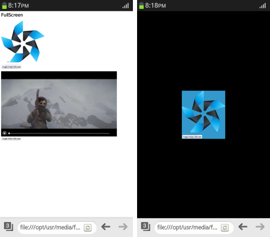

# FullScreen API - Mozilla

You can [display an element in the fullscreen mode](#using-the-fullscreen-mode). If the element uses the  [:full-screen](https://wiki.mozilla.org/index.php?title=Gecko:FullScreenAPI#full-screen_pseudo-class) CSS pseudo-class to switch to the fullscreen mode, a style can be assigned for the fullscreen mode.

This feature is supported in mobile and TV applications only.

To switch to the fullscreen and back:

- With the `webkitRequestFullScreen()` method, you can convert a specific element to fullscreen.
- With the `webkitCancelFullScreen()` method, you can cancel the fullscreen mode.

> **Note**  
> Tizen supports the WebKit-based Fullscreen API. When using the Fullscreen API, you must include the webkit prefix.

## Using the Fullscreen Mode

To display and element on full screen, you must learn to use the fullscreen mode:

1. Define the element to be shown in the fullscreen mode.

   In the following example, the screen contains an image, a video playback area, and 2 buttons. For the fullscreen mode, the image and 1 button are defined as an element (`fs-image`). The video playback area (`video`) is another element.

   ```
   <h1>FullScreen</h1>
   <div class="example_body">
      <div id='fs-image'>
         
         <p id="log"></p>
         <p><button id="toggleImage">Toggle Image fullscreen</button></p>
      </div>
      <div>
         <video id="video" controls preload="none"
                poster="http://media.w3.org/2010/05/sintel/poster.png">
            <source id="mp4" src="http://media.w3.org/2010/05/sintel/trailer.mp4"
                    type="video/mp4">
         </video>
      </div>
      <button id="toggleVideo">Toggle Video fullscreen</button>
   </div>
   ```

2. Define the fullscreen mode style by expressing the fullscreen status of the element with the [:full-screen](https://wiki.mozilla.org/index.php?title=Gecko:FullScreenAPI#full-screen_pseudo-class) CSS pseudo-class (`-webkit-full-screen`):

   ```
   <style>
      #fs-image: -webkit-full-screen {
         background: #39c;
      }
      #fs-image: full-screen {
         background: #39c;
      }
   </style>
   ```

3. Toggle between the normal and fullscreen mode by using the `webkitCancelFullScreen()` and `webkitRequestFullScreen()` methods:

   ```
   <script>
       function toggleFullScreenHandler(e, target) {
           var target = document.getElementById(target);
           /* Check whether in fullscreen mode */
           if (document.webkitIsFullScreen) {
               /* Cancel the fullscreen mode */
               document.webkitCancelFullScreen();
           } else {
               /* Switch on the fullscreen mode */
               target.webkitRequestFullScreen();
           }
       }

       document.getElementById('toggleImage').addEventListener('click', function(e) {
           toggleFullScreenHandler(e, 'fs-image')
       }, false);

       document.getElementById('toggleVideo').addEventListener('click', function(e) {
           toggleFullScreenHandler(e, 'video')
       }, false);

       document.addEventListener('click', function(e) {
           toggleFullScreenHandler(e)
       }, false);
   </script>
   ```

**Figure: Normal and fullscreen modes**



### Source Code

For the complete source code related to this use case, see the following files:

- [fullscreen.html](http://download.tizen.org/misc/examples/w3c_html5/ui/mozilla_fullscreen)
- [tizen_logo_light.png](http://download.tizen.org/misc/examples/w3c_html5/ui/mozilla_fullscreen/images)

## Related Information
* Dependencies
  - Tizen 2.4 and Higher for Mobile
  - Tizen 3.0 and Higher for TV
