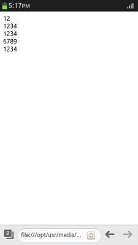
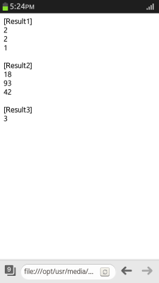

# Typed Array - Khronos

Typed Array - Khronos is an HTML5 feature that allows you to access binary data in JavaScript. It is designed to effectively handle the complex binary data of WebGL&trade;. It provides better performance than the WebGL - Khronos API (in [mobile](../../../api/latest/w3c_api/w3c_api_m.html#webgl), [wearable](../../../api/latest/w3c_api/w3c_api_w.html#webgl), and [TV](../../../api/latest/w3c_api/w3c_api_tv.html#webgl) applications) when manipulating binary data and handling the data of other HTML APIs.

The main features of the Typed Array - Khronos API include:

- Creating an array buffer

  An [ArrayBuffer](http://www.khronos.org/registry/typedarray/specs/latest/#5) is a fixed-length binary data buffer, and a reference to the used raw binary data in the data format. It does not interact with the data directly, but [creates a new instance of the ArrayBufferView object](#creating-an-array-buffer). The instance presents the buffer in a certain format, and can read and write the buffer content.

- Using typed array views

  A [TypedArrayView](http://www.khronos.org/registry/typedarray/specs/latest/#6) can be used to establish a detailed data structure. To [create a typed array view](#creating-typed-array-views), you must create an array buffer and the view that points to the array buffer.

- Using typed arrays

  You can [deliver binary data](#using-typed-arrays) effectively in other HTML5 APIs that employ a typed array, such as:

  - [WebGL&trade;](./webgl.md)
  - [Canvas](../graphics/canvas.md)
  - [XMLHttpRequest](../communication/xmlhttprequest.md)

A typed array is capable of handling binary data in different sources:

- Network protocol
- Binary file formats
- Raw graphic buffers

Additionally, a typed array can be used to manage in-memory binary data of byte layouts, and assist in efficiently manipulating raw data for complex and powerful Web applications, such as audio and video operation, Web sockets, and the [File API operations](../../data/file-system.md).

## Creating an Array Buffer

To handle binary data in your application with JavaScript, you must learn to create array buffers:

1. Create a new [ArrayBuffer](http://www.khronos.org/registry/typedarray/specs/latest/#5) with a specific length:

   ```
   <script>
       var log = document.getElementById('log');

       /* Create a 12-byte buffer */
       var buffer = new ArrayBuffer(12);
       var x = new Int32Array(buffer);

       /* Check the buffer length */
       log.innerHTML = '<div>' + buffer.byteLength + '<div>';
   ```

   The content of the array buffer is initialized to 0. If the requested number of bytes are not allocated, an exception is raised.

2. Slice the array buffer to copy the buffer bytes and return a new array buffer:

   ```
       /* Get slice: '1234' */
       x[1] = 1234;
       var slice = buffer.slice(4);
       var y = new Int32Array(slice);
       log.innerHTML += '<div>' + x[1] + '<div>';
       log.innerHTML += '<div>' + y[0] + '<div>';

       /* Get slice: '6789' */
       x[1] = 6789;
       log.innerHTML += '<div>' + x[1] + '<div>';
       log.innerHTML += '<div>' + y[0] + '<div>';
   </script>
   ```

   **Figure: Creating and slicing array buffers (in mobile applications only)**

   

### Source Code

For the complete source code related to this use case, see the following file:

- [sample_1.html](http://download.tizen.org/misc/examples/w3c_html5/graphics/khronos_typed_array)

## Creating Typed Array Views

The array buffer view shares information between views of all types, and has the following properties:

- Typed array view types

  In the typed array view types, an array buffer view is used while manipulating and indexing binary data and returning the value of a general number. The specification of the respective array buffer length is fixed, and forms the basis for typed array view types.

  The following table describes the typed array view types.

  **Table: Typed array view types**

  | Type                 | Size<sup>1</sup> | Description                          | Equivalent C type |
  | -------------------- | ----- | ------------------------------------ | ----------------- |
  | `Int8Array`          | 1     | 8-bit 2's complement signed integer  | signed char       |
  | `Uint8Array`         | 1     | 8-bit unsigned integer               | unsigned char     |
  | `Uint8ClampedArray`<sup>2</sup> | 1     | 8-bit unsigned integer (clamped)     | unsigned char     |
  | `Int16Array`         | 2     | 16-bit 2's complement signed integer | short             |
  | `Uint16Array`        | 2     | 16-bit unsigned integer              | unsigned short    |
  | `Int32Array`         | 4     | 32-bit 2's complement signed integer | int               |
  | `Uint32Array`        | 4     | 32-bit unsigned integer              | unsigned int      |
  | `Float32Array`       | 4     | 32-bit IEEE floating point           | float             |
  | `Float64Array`       | 8     | 64-bit IEEE floating point           | double            |

  <sup>1</sup> The size unit is bytes, and it corresponds to the `BYTES_PER_ELEMENT` constant for the given type.

  <sup>2</sup> The `Uint8ClampedArray` is a special view, and it replaces the `CanvasPixelArray`.

  > **Note**  
  > There are no restrictions related to sorting the typed array view types.

- DataView view types

  The DataView view types are used to handle heterogeneous data with a defined byte order, displaying chunks of data read from a disk or the network. Since the view types import the API with the same array, the DataView objects set the API to randomly read and write data from the byte offset.

To handle binary data in your application with JavaScript, you must learn to access the binary data for reading and writing:

1. Create new instances of the typed array view types with a general fixed-length binary buffer:

   ```
   <script>
       /* 8-bit 2's complement signed integer */
       var int8 = new Int8Array(8);
       /* 8-bit unsigned integer */
       var uint8 = new Uint8Array(16);
       /* 8-bit unsigned integer (clamped) */
       var uint8Cl = new Uint8ClampedArray(32);
       /* 16-bit 2's complement signed integer */
       var int16 = new Int16Array(64);
       /* 16-bit unsigned integer */
       var uint16 = new Uint16Array(8);
       /* 32-bit 2's complement signed integer */
       var int32 = new Int32Array(16);
       /* 32-bit unsigned integer */
       var uint32 = new Uint32Array(32);
       /* 32-bit IEEE floating point */
       var float32 = new Float32Array(64);
       /* 64-bit IEEE floating point */
       var float64 = new Float64Array(8);
   </script>
   ```

	> **Note**  
	> In the above code, to access a buffer with an array of 16-bit signed integers, use the `Int16Array` instance that references an array buffer.

2. Create a typed array view:

   ```
   <script>
       var log = document.getElementById('log');
       /* Create an array buffer */
       var buffer = new ArrayBuffer(12);

       /* Create a typed array view that points to the array buffer */
       var x = new Int32Array(buffer, 0, 2);
   ```

   You can use the view to establish a detailed data structure by creating the value of 32-bit signed integers in a byte-type composition element.

3. Use the typed array view buffer:

   ```
       var y = new Int32Array(x.buffer, 4, 2);
       log.innerHTML += '<div>' + (x.buffer === y.buffer) + '<div>';

       /* Use the byteLength, length, and byteOffset properties */
       log.innerHTML += '<div>' + x.byteLength + '<div>';
       log.innerHTML += '<div>' + (x.length * Int32Array.BYTES_PER_ELEMENT) + '<div>';
       log.innerHTML += '<div>' + x.byteOffset + '<div>';
   </script>
   ```

   

4. Replace the `CanvasPixelArray` instance with the `Uint8ClampedArray` instance:

   ```
   <script>
       var buffer = new ArrayBuffer(12);
       var x = new Uint8ClampedArray(buffer, 4, 2);
       log.innerHTML += '<div>[Result1]</div>';
       log.innerHTML += '<div>' + x.byteLength + '<div>';
       log.innerHTML += '<div>' + x.length + '<div>';
       log.innerHTML += '<div>' + Uint8ClampedArray.BYTES_PER_ELEMENT + '<div>';

       var x = new Uint8ClampedArray(10);
       x.set([18, 93, 42], 3);
       log.innerHTML += '<br/><div>[Result2]</div>';
       log.innerHTML += '<div>' + x[3] + '<div>';
       log.innerHTML += '<div>' + x[4] + '<div>';
       log.innerHTML += '<div>' + x[5] + '<div>';

       var x = new Uint8ClampedArray([0, 1, 2, 3, 4, 5]);
       var y = x.subarray(2, 5);
       log.innerHTML += '<br/><div>[Result3]</div>';
       log.innerHTML += '<div>' + y.length + '<div>';
   </script>
   ```

   The `Uint8ClampedArray` behavior is identical to the other typed array views. The only notable exception is that the setters and constructors use clamping rather than modulo arithmetic while converting incoming number values.  
   

5. When an `ArrayBuffer` with heterogeneous type of data is used, you can take advantage of the `DataView` of the buffer:

   ```
   <script>
       var log = document.getElementById('log');

       /* Create DataView */
       var x = new DataView(new ArrayBuffer(12), 0);

       /* Store the variable */
       x.setFloat32(1, Math.PI);

       /* Get the variable */
       log.innerHTML += '<div>' + x.getFloat32(1) + '<div>';
       log.innerHTML += '<div>' + Math.PI + '<div>';
   </script>
   ```

   The `DataView` stores the values of the given type at the specified byte offset from the start of the view. Moreover, alignment is not a constraint, and it can store the multi-byte values at any offset. For multi-byte values, the optional `littleEndian` argument indicates that the value can be stored in a big-endian or little-endian byte order. If the argument is set to `false` or is undefined, the value gets stored in the big-endian byte order.  
   

### Source Code

For the complete source code related to this use case, see the following files:

- [sample_2.html](http://download.tizen.org/misc/examples/w3c_html5/graphics/khronos_typed_array)
- [sample_3.html](http://download.tizen.org/misc/examples/w3c_html5/graphics/khronos_typed_array)
- [sample_4.html](http://download.tizen.org/misc/examples/w3c_html5/graphics/khronos_typed_array)

## Using Typed Arrays

To handle binary data in your application with JavaScript, you must learn to deliver binary data effectively in other HTML5 APIs that employ a typed array:

1. For the WebGL - Khronos API (in [mobile](../../../api/latest/w3c_api/w3c_api_m.html#webgl), [wearable](../../../api/latest/w3c_api/w3c_api_w.html#webgl), and [TV](../../../api/latest/w3c_api/w3c_api_tv.html#webgl) applications), import the `gl.bufferData()` method to set the buffer object to deliver texture data:

   ```
   <script>
       var textureCoords = [0.0,  0.5, 0.25, 0.5, 0.25, 1.0, 0.0,  1.0, /* Front */
                            0.5,  0.5, 0.75, 0.5, 0.75, 1.0, 0.5,  1.0, /* Back */
                            0.0,  0.5, 0.25, 0.5, 0.25, 0.0, 0.0,  0.0, /* Top */
                            0.25, 0.5, 0.5,  0.5, 0.5,  0.0, 0.25, 0.0, /* Bottom */
                            0.25, 0.5, 0.5,  0.5, 0.5,  1.0, 0.25, 1.0, /* Right */
                            0.75, 0.5, 1.0,  0.5, 1.0,  1.0, 0.75, 1.0]; /* Left */

       cubeVertexTextureCoordBuffer = gl.createBuffer();
       gl.bindBuffer(gl.ARRAY_BUFFER, cubeVertexTextureCoordBuffer);
       gl.bufferData(gl.ARRAY_BUFFER, new Float32Array(textureCoords), gl.STATIC_DRAW);
       cubeVertexTextureCoordBuffer.itemSize = 2;
       cubeVertexTextureCoordBuffer.numItems = 24;
   </script>
   ```

2. For the HTML5 canvas element API (in [mobile](../../../api/latest/w3c_api/w3c_api_m.html#canvas), [wearable](../../../api/latest/w3c_api/w3c_api_w.html#canvas), and [TV](../../../api/latest/w3c_api/w3c_api_tv.html#canvas) applications), use the typed array with the following steps:

   1. Create an `ImageData` object of the canvas internally.

   2. Deliver the pixel expression of the canvas element:

     ```
     <script>
         var tempContext = canvas.getContext('2d');
         tempContext.drawImage(picture, 0, 0, canvas.width, canvas.height);
         var pixels = canvas.width * canvas.height * 4;
         var canvasData = tempContext.getImageData(0, 0, canvas.width, canvas.height);
         var binaryData = canvasData.data;
     </script>
     ```

	> **Note**  
	> The pixel array of a canvas can be created and edited without direct manipulation of the canvas element.  

3. For the XMLHttpRequest API (in [mobile](../../../api/latest/w3c_api/w3c_api_m.html#httpreq), [wearable](../../../api/latest/w3c_api/w3c_api_w.html#httpreq), and [TV](../../../api/latest/w3c_api/w3c_api_tv.html#httpreq) applications), set the response type of the `XMLHttpRequest` object as `arraybuffer` to receive a typed array response. This allows you to parse the binary file through the network.

   ```
   this.setSound = function() {
       var request = new XMLHttpRequest();
       request.open('GET', url, true);
       request.responseType = 'arraybuffer';

       request.onload = function() {
           var data = request.response;
       };
       request.send();
   };
   ```

## Related Information
* Dependencies   
   - Tizen 2.4 and Higher for Mobile
   - Tizen 2.3.1 and Higher for Wearable
   - Tizen 3.0 and Higher for TV
