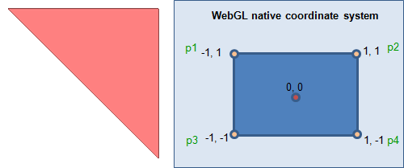
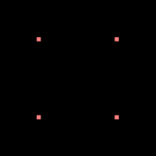
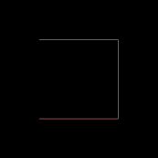
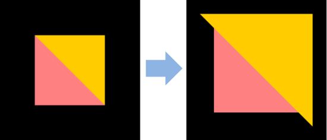
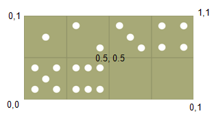
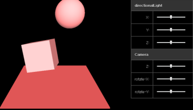

# WebGL - Khronos

WebGL - Khronos is a graphics library for creating 3D visual elements in Web applications without separate plug-ins.

WebGL&trade; is designed as a rendering context of the [HTML5 &lt;canvas&gt; element](../graphics/canvas.md). The WebGL&trade; context is still being developed and has not been standardized. WebGL&trade; uses 3D rendering APIs derived from [OpenGL&reg; ES 2.0](http://www.opengl.org/documentation/specs/version2.0/glspec20.pdf), and is realized by binding shaders and [OpenGL&reg; ES Shading Language](http://www.khronos.org/registry/gles/specs/2.0/GLSL_ES_Specification_1.00.pdf) (GLSL ES) as JavaScript.

The main features of WebGL&trade; include:

- Importing the WebGL&trade; context

  You can use the `getContext()` method of the `Canvas` object to [import the WebGL&trade; context](#import).

- Using programs and shaders

  You can use shaders, such as the vertex shader and fragment shader, to convert shape data to display it on the screen as pixels. [Shaders must be initialized](#initializing-programs-and-shaders) and attached to programs. The vertex shader sets the final position of a vertex, and the fragment shader sets the final colors of each pixel.

- Using buffers

  A buffer is a memory block for storing temporary data. In WebGL&trade;, you must [create a vertex buffer object (VBO) to store vertex attributes](#initializing-buffers), such as location, color, and texture coordinates.

  > **Note**  
  > The `deleteBuffer()` method can be used to delete the buffer.

- Drawing on the screen

  You can use shader attributes to define which buffer to pass to the application, and then record the buffer in the drawing buffer to [display the content on the screen](#drawing-shapes-on-the-screen).

- Applying realistic 3D effects

  To apply a more realistic 3D effect to objects in WebGL&trade;, you can use the following features:

  - Texture

    You can [set the color value](#setting-colors) and [map an image](#setting-textures) on the object surface.

    Each vertex can have a unique color. When converting a vertex shader to a fragment shader, all the middle pixels are filled, and through linear interpolation of the vertex attributes, the color differences between vertices are automatically given gradation effects.

  - Animation

    You can apply object and timer coordinate changes to [create a moving animation](#creating-an-animation).

  - 3D perspective

    You can use Z-index and matrix to [create a 3D perspective](#creating-a-3d-perspective).

  You can also [use touch effects](#using-touch-events) with textures and 3D perspectives.

- WebGL&trade; frameworks

  Numerous [frameworks](http://www.khronos.org/webgl/wiki/User_Contributions#Frameworks) exist to easily import low-level methods to WebGL&trade; and to develop WebGL&trade; more productively.

  The [three.js](https://github.com/mrdoob/three.js/) is one of the most widely used WebGL&trade; frameworks. It is a lightweight JavaScript library, in which many settings that need to be performed when developing WebGL&trade; are already set as basis. Consequently, three.js reduces the amount of overlapping code due to repetitive setting works.

  You can use the three.js framework to, for example, [apply light and camera effects](#framework).

<a name="import"></a>
## Importing the WebGL&trade; Context

To import the WebGL&trade; context from the HTML5 `<canvas>` element:

1. Define the `<canvas>` element ID and set its width and height:

   ```
   <body>
      <canvas id="canvas" width="300" height="300"></canvas>
   </body>
   ```

   > **Note**  
   > If the width and height are not set, the default size, 300 x 150 px, is used.

2. Use the `getContext()` method of the `Canvas` object to import the WebGL&trade; context:

   ```
   <script>
       function startWegGL() {
           gl = getWebGLContext();
       }

       function getWebGLContext() {
           var webGLContext;
           var canvas = document.getElementById('canvas');

           /* Context name can vary depending on the browser used */
           /* Store the context name in an array and check its validity */
           var names = ['webgl', 'experimental-webgl', 'webkit-3d', 'moz-webgl'];
           for (var i = 0; i < names.length; ++i) {
               try {
                   webGLContext = canvas.getContext(names[i]);
               }
               if (webGLContext) break;
           }

           return webGLContext;
       }
   </script>
   ```

### Source Code

For the complete source code related to this use case, see the following file:

- [webgl_camera_effect.html](http://download.tizen.org/misc/examples/w3c_html5/graphics/khronos_webgl)

## Initializing Programs and Shaders

To bind the shaders and GLSL ES in WebGL&trade; by using shaders and programs:

1. Define the vertex shader and fragment shader using the `gl_Position` and `gl_FragColor` variables of the [OpenGL&reg; ES Shading Language](http://www.khronos.org/registry/gles/specs/2.0/GLSL_ES_Specification_1.0.17.pdf) (GLSL ES):

   ```
   <script id="vshader" type="x-shader/x-vertex">
       attribute vec2 attVertexPos;

       void main() {
           /* vec4(2D coordinates, depth, perspective) */
           gl_Position = vec4(attVertexPos, 0, 2);
       }
   </script>

   <script id="fshader" type="x-shader/x-fragment">
       void main() {

           /* Color stored in the gl_FragColor variable becomes the pixel color */
           /* vec4(R, G, B, A) */
           gl_FragColor = vec4(1, 0.5, 0.5, 1);
       }
   </script>
   ```

2. Import the `createShader()` method to create the shaders:

   ```
   <script>
       var vshader = gl.createShader(gl.VERTEX_SHADER);
       var fshader = gl.createShader(gl.FRAGMENT_SHADER);
   ```

3. Import the `shaderSource()` method to attach the source elements to the shaders:

   ```
       gl.shaderSource(vshader, document.getElementById('vshader').text);
       gl.shaderSource(fshader, document.getElementById('fshader').text);
   ```

4. Import the `compileShader()` method and compile the shaders:

   ```
       gl.compileShader(vshader);
       gl.compileShader(fshader);
   ```

   > **Note**  
   > After a shader has been used, you can use the `deleteShader()` method to delete it.

5. Import the `createProgram()` method to create a new instance of the [WebGLProgram](https://www.khronos.org/registry/webgl/specs/1.0/#5.6) object, in which the shaders are then attached:

   ```
       var program = null;
       program = gl.createProgram();
   ```

6. Import the `attachShader()` method to attach the shaders to the program:

   ```
       gl.attachShader(program, vshader);
       gl.attachShader(program, fshader);
   ```

7. Import the `linkProgram()` method to connect to the program:

   ```
       gl.linkProgram(program);
   ```

8. Import the `useProgram()` method to enable WebGL&trade; to use the program:

   ```
       /* Shaders are loaded and used */
       gl.useProgram(program);
   </script>
   ```

   > **Note**  
   > After a  WebGL&trade; program has been used, you can use the `deleteProgram()` method to delete it.

### Source Code

For the complete source code related to this use case, see the following file:

- [webgl_circle.html](http://download.tizen.org/misc/examples/w3c_html5/graphics/khronos_webgl)

## Initializing Buffers

To create buffers, bind them, and store data in them:

1. To create a triangle (shown on the left in the figure), define the coordinates of a triangle according to the WebGL&trade; coordinate system (shown on the right):

   

   ```
   <script>
       var vertices = [1.0,  1.0, /* p2 */
                       -1.0, 1.0, /* p1 */
                       1.0,  -1.0]; /* p4 */
   </script>
   ```

2. Import the `createBuffer()` method to create the vertex buffer object (VBO):

   ```
   <script>
       triangleVerticesBuffer = gl.createBuffer();
   ```

3. Import the `bindBuffer()` method to bind the VBO:

   ```
       gl.bindBuffer(gl.ARRAY_BUFFER, triangleVerticesBuffer);
   ```

4. Import the `bufferData()` method to store data to the VBO:

   ```
       /* Convert to Float32Array format that allows the array to be used in WebGL */
       gl.bufferData(gl.ARRAY_BUFFER, new Float32Array(vertices), gl.STATIC_DRAW);
   </script>
   ```

The following figure shows the final triangle as it is displayed on the screen.

**Figure: Triangle on the screen**


### Source Code

For the complete source code related to this use case, see the following file:

- [webgl_triangle.html](http://download.tizen.org/misc/examples/w3c_html5/graphics/khronos_webgl)

## Drawing Shapes on the Screen

To display shapes on the screen using attribute array data and a drawing buffer:

1. Import the `getAttribLocation()` method to bring the attribute location from the WebGL&trade; program:

   ```
   <script>
       var vertexPositionAttribute = gl.getAttribLocation(program, 'attVertexPos');
   ```

   The shader is an external program that is compiled. To enable the attribute to be searched for and referenced in the program, allocate it to the `vertexPositionAttribute` variable.

2. Activate the attribute data array:

   ```
       gl.enableVertexAttribArray(vertexPositionAttribute);
   ```

3. Import the `vertexAttribPointer()` method that indicates the data format to the shader.

   The second argument value is the number of components per vertex. It can be 2, 3, or, for RGBA, 4.

   ```
       gl.vertexAttribPointer(vertexPositionAttribute, 2, gl.FLOAT, false, 0, 0);
   ```

4. Use the `drawArrays()` method to send the shape to the drawing buffer:

   ```
       gl.drawArrays(gl.TRIANGLES, 0, 3);
   </script>
   ```

   The following arguments can be used with the `drawArrays()` method and their results:

   - `POINTS`

     The point type renders 1 point at a time.<br>
     ```
     var vertices = [1.0,  1.0,
                     -1.0, 1.0,
                     1.0,  -1.0,
                     -1.0, -1.0];

     gl.vertexAttribPointer(vertexPositionAttribute, 2, gl.FLOAT, false, 0, 0);
     gl.drawArrays(gl.POINTS, 0, 4);
     ```
   - `LINES`

     In the lines type, 2 lines share the same vertex, but each is defined separately. In the example, 6 vertices are needed.

     
     ```
     var vertices = [-1.0, 1.0,
                     1.0,  1.0,

                     1.0,  1.0,
                     1.0,  0.0,

                     1.0,  -1.0,
                     -1.0, -1.0];

     gl.vertexAttribPointer(vertexPositionAttribute, 2, gl.FLOAT, false, 0, 0);
     gl.drawArrays(gl.LINES, 0, 6);
     ```
   - `LINE_STRIP`

     In the line strip type, a part of the vertex is shared. In the example, 4 vertices are needed.

     
     ```
     var vertices = [-1.0, 1.0,
                     1.0,  1.0,
                     1.0,  -1.0,
                     -1.0, -1.0];

     gl.vertexAttribPointer(vertexPositionAttribute, 2, gl.FLOAT, false, 0, 0);
     gl.drawArrays(gl. LINE_STRIP, 0, 4);
     ```
   - `LINE_LOOP`

     In the line loop type, the first vertex and the last vertex are connected, otherwise this type is similar to the line strip type. In the example, 4 vertices are needed.

     
     ```
     var vertices = [-1.0, 1.0,
                     1.0,  1.0,
                     1.0,  -1.0,
                     -1.0, -1.0];

     gl.vertexAttribPointer(vertexPositionAttribute, 2, gl.FLOAT, false, 0, 0);
     gl.drawArrays(gl. LINE_LOOP, 0, 4);
     ```
   - `TRIANGLES`

     In the triangles type, 2 triangles consist of 3 vertices each. In the example, 6 vertices are needed.

     
     ```
     var vertices = [-1.0, 1.0,
                     1.0,  1.0,
                     0.0,  0.0,

                     0.0,  0.0,
                     -1.0, -1.0,
                     -1.0, 0.0];

     gl.vertexAttribPointer(vertexPositionAttribute, 2, gl.FLOAT, false, 0, 0);
     gl.drawArrays(gl. TRIANGLES, 0, 6);
     ```

   - `TRIANGLE_STRIP`

     In the triangle strip type, a triangle is created using the last 2 vertices and the next vertex. In the example, 6 vertices are needed.

     
     ```
     var vertices = [1.0, 1.0, /* p1 */
                     0.0, 1.0, /* p2 */
                     1.0, 0.0, /* p3 */
                     0.0, 0.0, /* p4 */
                     1.0, -1.0, /* p5 */
                     0.0, -1.0]; /* p6 */

     gl.vertexAttribPointer(vertexPositionAttribute, 2, gl.FLOAT, false, 0, 0);
     gl.drawArrays(gl. TRIANGLE_STRIP, 0, 6);
     ```
   - `TRIANGLE_FAN`

     In the triangle fan type, the first IBO index is shared in all elements. In the example, the `p0` vertex is shared by all triangles, so 4 triangles are created with 6 vertices.

     
     ```
     var vertices = [0.0,  0.0, /* p0 */
                     1.0,  0.8, /* p1 */
                     -0.5, 1.0, /* p2 */
                     -0.8, 0.2, /* p3 */
                     -1.0, -1.0, /* p4 */
                     1.0,  -1.0]; /* p5 */

     gl.vertexAttribPointer(vertexPositionAttribute, 2, gl.FLOAT, false, 0, 0);
     gl.drawArrays(gl. TRIANGLE_FAN, 0, 6);
      ```

### Source Code

For the complete source code related to this use case, see the following files:

- [webgl_circle.html](http://download.tizen.org/misc/examples/w3c_html5/graphics/khronos_webgl)
- [webgl_rectangle.html](http://download.tizen.org/misc/examples/w3c_html5/graphics/khronos_webgl)
- [webgl_triangle.html](http://download.tizen.org/misc/examples/w3c_html5/graphics/khronos_webgl)

## Setting Colors

To set colors using attributes and a buffer:

1. Define the vertex shader and fragment shader using the `gl_Position` and `gl_FragColor` variables of the [OpenGL&reg; ES Shading Language](http://www.khronos.org/registry/gles/specs/2.0/GLSL_ES_Specification_1.0.17.pdf) (GLSL ES):

   ```
   <script id="vshader" type="x-shader/x-vertex">
       attribute vec2 attVertexPos;
       attribute vec4 attVertexColor;

       varying vec4 vColor;

       void main() {
           gl_Position = vec4(attVertexPos, 0, 2);
           vColor = attVertexColor;
       }
   </script>

   <script id="fshader" type="x-shader/x-fragment">
       precision mediump float;

       varying vec4 vColor;

       void main() {
           gl_FragColor = vColor;
       }
   </script>
   ```

2. Define a rectangular vertex consisting of 2 triangles:

   ```
   <script>
       var vertices = [1.0,  1.0, /* p1 */
                       -1.0, 1.0, /* p2 */
                       1.0,  -1.0, /* p3 */
                       -1.0, -1.0]; /* p4 */
   ```

   

3. Create the color buffer and render the 2 triangles using the `gl.TRIANGLE_STRIP` attribute:

   ```
       /* Define the color of each vertex as an array */
       var colors = [1.0, 0.0, 0.0, 1.0, /* Red */
                     0.0, 1.0, 0.0, 1.0, /* Green */
                     0.0, 0.0, 1.0, 1.0, /* Blue */
                     1.0, 0.0, 0.0, 1.0]; /* Red */

       /* Create a buffer for storing the color value */
       var triangleVerticesColorBuffer = gl.createBuffer();
       /* Bind the buffer */
       gl.bindBuffer(gl.ARRAY_BUFFER, triangleVerticesColorBuffer);
       /* Store data in the buffer */
       gl.bufferData(gl.ARRAY_BUFFER, new Float32Array(colors), gl.STATIC_DRAW);

       /* Bring the color attribute position from the WebGlProgram instance */
       var vertexColorAttribute = gl.getAttribLocation(program, 'attVertexColor');
       /* Activate the attribute data array */
       gl.enableVertexAttribArray(vertexColorAttribute);
       gl.vertexAttribPointer(vertexColorAttribute, 4, gl.FLOAT, false, 0, 0);

       gl.drawArrays(gl.TRIANGLE_STRIP, 0, 4);
   </script>
   ```

The following figure shows the result as it is displayed on the screen.

**Figure: Color on the screen**


### Source Code

For the complete source code related to this use case, see the following file:

- [webgl_color.html](http://download.tizen.org/misc/examples/w3c_html5/graphics/khronos_webgl)

## Setting Textures

To apply an image from a file to a surface as a texture:

1. Define the vertex shader and fragment shader using the `gl_Position` and `gl_FragColor` variables of the [OpenGL&reg; ES Shading Language](http://www.khronos.org/registry/gles/specs/2.0/GLSL_ES_Specification_1.0.17.pdf) (GLSL ES). In this example, the texture coordinate attribute is used instead of the vertex coordinate attribute.

   Set the variable to pass the texture coordinate over to the fragment shader. Define the formula for calculating the texture coordinates.

   > **Note**  
   > The coordinate range of a vertex is -1 ~ 1, and the coordinate range of a texture is 0 ~ 1.

   ```
   <script id="vshader" type="x-shader/x-vertex">
       attribute vec2 attVertexPos;
       varying highp vec2 varTextureCoord;

       void main(void) {
           gl_Position = vec4(attVertexPos, 0, 2.0);
           varTextureCoord = 0.5 * attVertexPos.xy + 0.5;
       }
   </script>

   <script id="fshader" type="x-shader/x-fragment">
       varying highp vec2 varTextureCoord;
       uniform sampler2D unfSampler; /* Used to access the texture */

       void main(void) {
           /* texture2D(texture sampler, texture coordinate) */
           gl_FragColor= texture2D(unfSampler, vec2(varTextureCoord.s, varTextureCoord.t));
       }
   </script>
   ```

   > **Note**  
   > The texture coordinates use the `s, t` pair.

2. Create a new `texture` instance using the `createTexture()` method:

   ```
   <script>
       var texture = gl.createTexture();
   ```

   > **Note**  
   > After a texture has been used, you can use the `deleteTexture()` method to delete it.

3. Load the image file to be used as texture data, and bind the texture using the `bindTexture()` method:

   ```
       var textureImage = new Image();
       textureImage.onload = function() {
           loadedTextureHandler(texture);
       };
       textureImage.src = 'images/carp.jpg';

       function loadedTextureHandler(texture) {
           /* Initialize texture */
           gl.bindTexture(gl.TEXTURE_2D, texture);
           gl.pixelStorei(gl.UNPACK_FLIP_Y_WEBGL, true);
   ```

   The image data loaded in HTML has the opposite Y axis as the WebGL&trade; direction. Use the `gl.UNPACK_FLIP_Y_WEBGL` attribute to reverse the data and store it.

4. Use the loaded image file to fill the texture data. The `texImage2D()` method assigns the image to be used as a texture, and the `textParameteri()` method assigns a filter.

   ```
           gl.texImage2D(gl.TEXTURE_2D, 0, gl.RGBA, gl.RGBA, gl.UNSIGNED_BYTE, textureImage);

           /* Filter texture */
           gl.texParameteri(gl.TEXTURE_2D, gl.TEXTURE_MAG_FILTER, gl.LINEAR);
           gl.texParameteri(gl.TEXTURE_2D, gl.TEXTURE_MIN_FILTER, gl.LINEAR);

           /* Wrap texture */
           gl.texParameteri(gl.TEXTURE_2D, gl.TEXTURE_WRAP_S, gl.CLAMP_TO_EDGE);
           gl.texParameteri(gl.TEXTURE_2D, gl.TEXTURE_WRAP_T, gl.CLAMP_TO_EDGE);
   ```

5. Import the `unfSampler` uniform location to use in the program:
   ```
           var unfSampler = gl.getUniformLocation(program, 'uSampler');
           gl.uniform1i(unfSampler, 0);
   ```

6. Draw the image using the `drawArrays()` method:
   ```
           var vertexPositionAttribute = gl.getAttribLocation(program, 'attVertexPos');
           gl.enableVertexAttribArray(vertexPositionAttribute);
           gl.bindBuffer(gl.ARRAY_BUFFER, triangleVerticesBuffer);
           gl.vertexAttribPointer(vertexPositionAttribute, 2, gl.FLOAT, false, 0, 0);

           gl.drawArrays(gl.TRIANGLE_STRIP, 0, 4);
       }
    </script>
    ```

The following figure shows the result as it is displayed on the screen.

**Figure: Texture on the screen**


### Source Code

For the complete source code related to this use case, see the following files:

- [webgl_texture.html](http://download.tizen.org/misc/examples/w3c_html5/graphics/khronos_webgl)
- [carp.jpg](http://download.tizen.org/misc/examples/w3c_html5/graphics/khronos_webgl/images)

## Creating an Animation

To create an animation by adjusting and moving object coordinates:

1. Calculate the central point:

   ```
   <script>
       var r = 0.1; /* Radius */
       var n = 50; /* Number of vertices */
       var cx = 0; /* X axis central point */
       var cy = 0; /* Y axis central point */

       /* Common coordinates for all triangles (the central point of a circle) */
       var centerVertices = [cx, cy];
       var circumVertices = [];
       var lastVertices = [];
       var vertices = [];
       var angle = 0.0;
       draw();

       function draw() {
           gl.clear(gl.COLOR_BUFFER_BIT | gl.DEPTH_BUFFER_BIT); /* Clear the canvas */
           /* Calculate the coordinate of central point to be moved to */
           cy = cx = Math.sin(angle) * 0.9;
           centerVertices = [cx, cy];
           circumVertices = [];
           lastVertices = [];
           vertices = [];
   ```

2. Use a trigonometric function to calculate the vertex location of a regular N polygon with the central point as the center. Store the n(50) vertex coordinates using the changed central point as the center of the array.

   ```
           for (var i = 0; i < n; i++) {
               circumVertices.push(cx+r * Math.cos(i/n*2 * Math.PI - Math.PI/2));
               circumVertices.push(cy+r * Math.sin(i/n*2 * Math.PI - Math.PI/2));
           }

           lastVertices = [circumVertices[0], circumVertices[1]];
           circumVertices = circumVertices.concat(lastVertices);
           vertices = vertices.concat(centerVertices);
           vertices = vertices.concat(circumVertices);
   ```

3. Change the value of the variable in order to calculate the central point. Render the circle with the central point and vertex location, using the `TRIANGLE_FAN` argument that allows all triangles to share a central point to make a circle.
   ```
           /* Change the angle value to change the central point coordinates */
           angle += 0.01;

           var triangleVerticesBuffer = gl.createBuffer();
           gl.bindBuffer(gl.ARRAY_BUFFER, triangleVerticesBuffer);
           gl.bufferData(gl.ARRAY_BUFFER, new Float32Array(vertices), gl.STATIC_DRAW);

           var vertexPositionAttribute = gl.getAttribLocation(program, 'attVertexPos');
           gl.enableVertexAttribArray(vertexPositionAttribute);
           gl.vertexAttribPointer(vertexPositionAttribute, 2, gl.FLOAT, false, 0, 0);
           gl.drawArrays(gl.TRIANGLE_FAN, 0, n + 2);
       }
   ```

4. Use the `setInterval()` method to set the rendering interval of the circle:
   ```
       window.setInterval(function() {draw();}, 10);
   </script>
   ```
   > **Note**  
   > Instead of the `setInterval()` method, you can also use the script-based W3C `requestAnimationFrame()` method.

The following figure shows the animation as it is displayed on the screen.

**Figure: Animation on the screen**


### Source Code

For the complete source code related to this use case, see the following file:

- [webgl_animation.html](http://download.tizen.org/misc/examples/w3c_html5/graphics/khronos_webgl)

## Creating a 3D Perspective

To create a 3D perspective, you can use the [glMatrix library](https://github.com/toji/gl-matrix):

1. Set the vertex coordinate and color buffer values to draw 2 triangles:

   ```
   <script>
       function setupBuffers() {
           var colors = [1.0, 0.5, 0.5,
                         1.0, 0.5, 0.5,
                         1.0, 0.5, 0.5,

                         1.0, 0.8, 0.0,
                         1.0, 0.8, 0.0,
                         1.0, 0.8, 0.0];

           triangleVerticesColorBuffer = gl.createBuffer();
           gl.bindBuffer(gl.ARRAY_BUFFER, triangleVerticesColorBuffer);
           gl.bufferData(gl.ARRAY_BUFFER, new Float32Array(colors), gl.STATIC_DRAW);
       }

       function setupVerticesBuffer() {
           var vertices = [-0.5, 0.5,  0.0,
                           0.5,  -0.5, 0.0,
                           -0.5, -0.5, 0.0,

                           0.5,  0.5,  0.0,
                           -0.5, 0.5,  0.0,
                           0.5,  -0.5, 0.0];

           triangleVerticesBuffer = gl.createBuffer();
           gl.bindBuffer(gl.ARRAY_BUFFER, triangleVerticesBuffer);
           gl.bufferData(gl.ARRAY_BUFFER, new Float32Array(vertices), gl.STATIC_DRAW);
       }

       function drawScene() {
           vertexColorAttribute = gl.getAttribLocation(program, 'attVertexColor');
           gl.bindBuffer(gl.ARRAY_BUFFER, triangleVerticesColorBuffer);
           gl.enableVertexAttribArray(vertexColorAttribute);
           gl.vertexAttribPointer(vertexColorAttribute, 3, gl.FLOAT, false, 0, 0);

           vertexPositionAttribute = gl.getAttribLocation(program, 'attVertexPos');

           gl.bindBuffer(gl.ARRAY_BUFFER, triangleVerticesBuffer);
           gl.enableVertexAttribArray(vertexPositionAttribute);
           gl.vertexAttribPointer(vertexPositionAttribute, 3, gl.FLOAT, false, 0, 0);

           gl.drawArrays(gl.TRIANGLES, 0, 6);
       }
   </script>
   ```

   

2. Define the vertex shader and fragment shader with using the `gl_Position` and `gl_FragColor` variables of the [OpenGL&reg; ES Shading Language](http://www.khronos.org/registry/gles/specs/2.0/GLSL_ES_Specification_1.0.17.pdf) (GLSL ES), and modify the GLSL ES variables:

   ```
   <script id="vshader" type="x-shader/x-vertex">
       attribute vec3 attVertexPos;
       attribute vec3 attVertexColor;

       uniform mat4 uMVMatrix; /* Uniform variable delivered with the model view matrix */
       uniform mat4 uPMatrix; /* Uniform variable delivered with the projection matrix */

       varying vec4 vColor;

       void main() {
           /*
              Multiply the model view matrix and projection matrix
              to the original coordinates
           */
           gl_Position = uPMatrix * uMVMatrix *  vec4(attVertexPos, 1.0);

           vColor = vec4(attVertexColor, 1.0);
       }
   </script>

   <script id="fshader" type="x-shader/x-fragment">
       precision mediump float;

       varying vec4 vColor;

       void main() {
           gl_FragColor = vColor;
       }
   </script>
   ```

3. Edit the z coordinate of the right triangle to apply perspective:

   ```
   <script>
       gl.viewport(0, 0, canvas.width, canvas.height);
       mat4.perspective(45, canvas.width / canvas.height, 0.1, 100.0, pMatrix);
       mat4.identity(mvMatrix);
       mat4.translate(mvMatrix, [0, 0, -2.0]);
   </script>
   ```

4. Download the glMatrix library (`gl-matrix-min.js`) and include it in the HTML:

   ```
   <script src="js/lib/gl-matrix-min.js"></script>
   ```

5. Declare the variable to store the model view matrix and projection matrix:

   ```
   <script>
       var mvMatrix = mat4.create();
       var pMatrix = mat4.create();
   </script>
   ```

6. Check that the location of the `uPMatrix` and `uMVMatrix` uniforms can be used in program:

   ```
   <script>
       function getMatrixUniforms() {
           pMatrixUniform = gl.getUniformLocation(program, 'uPMatrix');
           mvMatrixUniform = gl.getUniformLocation(program, 'uMVMatrix');
       }

       function setMatrixUniforms() {
           gl.uniformMatrix4fv(pMatrixUniform, false, pMatrix);
           gl.uniformMatrix4fv(mvMatrixUniform, false, mvMatrix);
       }
   </script>
   ```

The following figure shows the 3D perspective as it is displayed on the screen.

**Figure: 3D perspective on the screen**



### Source Code

For the complete source code related to this use case, see the following files:

- [webgl_camera_effect.html](http://download.tizen.org/misc/examples/w3c_html5/graphics/khronos_webgl)
- [gl-matrix-min.js](http://download.tizen.org/misc/examples/w3c_html5/graphics/khronos_webgl/js/lib)

## Using Touch Events

You can apply a texture and 3D perspective with touch events by using the [glMatrix library](https://github.com/toji/gl-matrix). The following example demonstrates how to display and turn a dice on the screen based on touch events:

1. Define the vertex shader and fragment shader using the `gl_Position` and `gl_FragColor` variables of the [OpenGL&reg; ES Shading Language](http://www.khronos.org/registry/gles/specs/2.0/GLSL_ES_Specification_1.0.17.pdf) (GLSL ES):

   ```
   <script id="vshader" type="x-shader/x-vertex">
       attribute vec3 attVertexPos; /* Vertex coordinate attribute */
       attribute vec2 attTextureCoord; /* Texture coordinate attribute */

       uniform mat4 unifMVMatrix; /* Model-view uniform */
       uniform mat4 unifPMatrix; /* Projection matrix uniform */

       /* Texture coordinate storing variable used in the fragment shader */
       varying vec2 vTextureCoord;

       void main(void) {
           /*
              Multiply the model-view matrix and projection matrix
              to the original coordinates to apply the 3D perspective
           */
           gl_Position = unifPMatrix * unifMVMatrix * vec4(attVertexPos, 1.0);
           /* Store the texture coordinates */
           vTextureCoord = attTextureCoord;
       }
   </script>

   <script id="fshader" type="x-shader/x-fragment">

       /*
          Use a floating point arithmetic value to define
          the display precision (highp, mediump, or lowp)
       */
       precision mediump float;

       varying vec2 vTextureCoord;

       uniform sampler2D unifSampler; /* Handle the cube mapped texture */

       void main(void) {
           gl_FragColor = texture2D(unifSampler, vec2(vTextureCoord.s, vTextureCoord.t));
       }
   </script>
   ```

2. Define the variables to be used and the methods to be executed when the window is loaded:

   ```
   <script>
       var gl = null;
       var program = null;

       var diceTexture;
       var mvMatrix = mat4.create();
       var pMatrix = mat4.create();

       var cubeVertexPositionBuffer; /* Buffer for vertex coordinate information */
       var cubeVertexTextureCoordBuffer; /* Buffer for texture coordinate information */
       var cubeVertexIndexBuffer; /* Buffer for index information */

       var xRot = 30;
       var yRot = 30;

       window.onload = startWegGL;

       function startWegGL() {
           gl = getWebGLContext();
           initShaders();
           initBuffers();
           initTexture(drawScene);

           gl.clearColor(0.5, 0.5, 0.4, 1.0);
           gl.enable(gl.DEPTH_TEST);

           initEvent();
       }
   </script>
   ```

3. Use the `getContext()` method of the `canvas` object to import the WebGL&trade; context:

   ```
   <script>
       function getWebGLContext() {
           canvas = document.getElementById('canvas');
           var webGLContext = canvas.getContext('experimental-webgl');

           return webGLContext;
       }
   </script>

   <body>
      <canvas id="canvas" width="300" height="300"></canvas>
   </body>
   ```

4. Create the shaders and programs using the `createShader()` and `createProgram()` methods:

   ```
   <script>
       function initShaders() {
           var vshader = gl.createShader(gl.VERTEX_SHADER);
           var fshader = gl.createShader(gl.FRAGMENT_SHADER);
           gl.shaderSource(vshader, document.getElementById('vshader').text);
           gl.shaderSource(fshader, document.getElementById('fshader').text);
           gl.compileShader(vshader);
           gl.compileShader(fshader);

           program = gl.createProgram();
           gl.attachShader(program, vshader);
           gl.attachShader(program, fshader);
           gl.linkProgram(program); /* Link to program */
           gl.useProgram(program); /* Shaders are loaded and used */

           program.vertexPositionAttribute = gl.getAttribLocation(program, 'attVertexPos');
           gl.enableVertexAttribArray(program.vertexPositionAttribute);

           program.textureCoordAttribute = gl.getAttribLocation(program, 'attTextureCoord');
           gl.enableVertexAttribArray(program.textureCoordAttribute);

           program.pMatrixUniform = gl.getUniformLocation(program, 'unifPMatrix');
           program.mvMatrixUniform = gl.getUniformLocation(program, 'unifMVMatrix');
   ```

5. To send the loaded texture image to the shader program, and add a reference to the shader program `unifSampler` location:
   ```
           program.samplerUniform = gl.getUniformLocation(program, 'unifSampler');
       }
   ```

6. Initialize the buffer:

   ```
       function initBuffers() {
           vertices = [-1.0, -1.0, 1.0,    1.0, -1.0, 1.0,    1.0, 1.0, 1.0,    -1.0, 1.0, 1.0, /* Front */
                       -1.0, -1.0, -1.0,   -1.0, 1.0, -1.0,   1.0, 1.0, -1.0,   1.0, -1.0, -1.0, /* Back */
                       -1.0, 1.0, -1.0,    -1.0, 1.0, 1.0,    1.0, 1.0, 1.0,    1.0, 1.0, -1.0, /* Top */
                       -1.0, -1.0, -1.0,   1.0, -1.0, -1.0,   1.0, -1.0, 1.0,   -1.0, -1.0, 1.0, /* Bottom */
                       1.0, -1.0, -1.0,    1.0, 1.0, -1.0,    1.0, 1.0, 1.0,    1.0, -1.0, 1.0, /* Right */
                       -1.0, -1.0, -1.0,   -1.0, -1.0, 1.0,   -1.0, 1.0, 1.0,   -1.0, 1.0, -1.0]; /* Left */
           cubeVertexPositionBuffer = gl.createBuffer();
           gl.bindBuffer(gl.ARRAY_BUFFER, cubeVertexPositionBuffer);
           /* Convert to Float32Array */
           gl.bufferData(gl.ARRAY_BUFFER, new Float32Array(vertices), gl.STATIC_DRAW);
           cubeVertexPositionBuffer.itemSize = 3;
           cubeVertexPositionBuffer.numItems = 24;

           var textureCoords = [0.0, 0.5,   0.25, 0.5,  0.25, 1.0,  0.0, 1.0, /* Front */
                                0.5, 0.5,   0.75, 0.5,  0.75, 1.0,  0.5, 1.0, /* Back */
                                0.0, 0.5,   0.25, 0.5,  0.25, 0.0,  0.0, 0.0, /* Top */
                                0.25, 0.5,  0.5, 0.5,   0.5, 0.0,   0.25, 0.0, /* Bottom */
                                0.25, 0.5,  0.5, 0.5,   0.5, 1.0,   0.25, 1.0, /* Right */
                                0.75, 0.5,  1.0, 0.5,   1.0, 1.0,   0.75, 1.0]; /* Left */
           cubeVertexTextureCoordBuffer = gl.createBuffer();
           gl.bindBuffer(gl.ARRAY_BUFFER, cubeVertexTextureCoordBuffer);
           gl.bufferData(gl.ARRAY_BUFFER, new Float32Array(textureCoords), gl.STATIC_DRAW);
           cubeVertexTextureCoordBuffer.itemSize = 2;
           cubeVertexTextureCoordBuffer.numItems = 24;

           cubeVertexIndexBuffer = gl.createBuffer();
           gl.bindBuffer(gl.ELEMENT_ARRAY_BUFFER, cubeVertexIndexBuffer);
           var cubeVertexIndices = [0,  1,  2,    0,  2,  3, /* Front */
                                    4,  5,  6,    4,  6,  7, /* Back */
                                    8,  9,  10,   8,  10, 11, /* Top */
                                    12, 13, 14,   12, 14, 15, /* Bottom */
                                    16, 17, 18,   16, 18, 19, /* Right */
                                    20, 21, 22,   20, 22, 23]; /* Left */

           gl.bufferData(gl.ELEMENT_ARRAY_BUFFER, new Uint16Array(cubeVertexIndices), gl.STATIC_DRAW);
           cubeVertexIndexBuffer.itemSize = 1;
           cubeVertexIndexBuffer.numItems = 36;
       }
   ```

7. Initialize the WebGL&trade; texture and load the image to be used as the texture (the figure shows the coordinates of the image to be loaded):

   ```
      function initTexture(callback) {
           textureImage = new Image();
           textureImage.onload = function() {
               handleLoadedTexture(textureImage)
               if (callback) callback();
           };
           textureImage.src = 'images/dice.gif';
       }

       function handleLoadedTexture(textureImage) {
           diceTexture = gl.createTexture();
           gl.bindTexture(gl.TEXTURE_2D, diceTexture);

           gl.pixelStorei(gl.UNPACK_FLIP_Y_WEBGL, true);
           gl.texImage2D(gl.TEXTURE_2D, 0, gl.RGBA, gl.RGBA, gl.UNSIGNED_BYTE, textureImage);

           gl.texParameteri(gl.TEXTURE_2D, gl.TEXTURE_MAG_FILTER, gl.NEAREST);
           gl.texParameteri(gl.TEXTURE_2D, gl.TEXTURE_MIN_FILTER, gl.NEAREST);
       }
   ```

   

8. Define the rendering location and canvas width and height:

   ```
       function drawScene() {
           gl.viewport(0, 0, canvas.width, canvas.height);
           gl.clear(gl.COLOR_BUFFER_BIT | gl.DEPTH_BUFFER_BIT); /* Clear the canvas */
   ```

9. Import the `mat4()` method module and define it using the utility methods:

   > **Note**  
   > The `perspective()` method is not WebGL&trade;-embedded, so it must be used directly, or a third-party matrix library must be used.

   ```
           mat4.perspective(45, canvas.width / canvas.height, 0.1, 100.0, pMatrix);
           mat4.identity(mvMatrix);

           mat4.translate(mvMatrix, [0.0, 0.0, -5.0]);

           mat4.rotate(mvMatrix, xRot * Math.PI / 180, [1, 0, 0]);
           mat4.rotate(mvMatrix, yRot * Math.PI / 180, [0, 1, 0]);

           gl.bindBuffer(gl.ARRAY_BUFFER, cubeVertexPositionBuffer);
           gl.vertexAttribPointer(program.vertexPositionAttribute, cubeVertexPositionBuffer.itemSize, gl.FLOAT, false, 0, 0);

           gl.bindBuffer(gl.ARRAY_BUFFER, cubeVertexTextureCoordBuffer);
           gl.vertexAttribPointer(program.textureCoordAttribute, cubeVertexTextureCoordBuffer.itemSize, gl.FLOAT, false, 0, 0);

           gl.activeTexture(gl.TEXTURE0);
           gl.bindTexture(gl.TEXTURE_2D, diceTexture);
           gl.uniform1i(program.samplerUniform, 0);

           gl.bindBuffer(gl.ELEMENT_ARRAY_BUFFER, cubeVertexIndexBuffer);

           gl.uniformMatrix4fv(program.pMatrixUniform, false, pMatrix);
           gl.uniformMatrix4fv(program.mvMatrixUniform, false, mvMatrix);

           gl.drawElements(gl.TRIANGLES, cubeVertexIndexBuffer.numItems, gl.UNSIGNED_SHORT, 0);
       }
   ```

10. Add touch events:

    ```
        var touches;
        function initEvent() {
            var startPosX;
            var startPosY;
            var movedPosX;
            var movedPosY;

            function mouseMoveHandler(e) {
                movedPosX = e.touches[0].pageX - startPosX;
                movedPosY = e.touches[0].pageY - startPosY;
                xRot += movedPosY * 0.05;
                yRot += movedPosX * 0.05;

                drawScene();
            }

            canvas.addEventListener('touchstart', function(e) {
                touches = e.touches.item(0);

                startPosX = touches.pageX;
                startPosY = touches.pageY;

                canvas.addEventListener('touchmove', mouseMoveHandler)
            });

            canvas.addEventListener('touchend', function(e) {
                canvas.removeEventListener('touchmove', mouseMoveHandler)
            });

            canvas.addEventListener('touchend', function() {
                canvas.removeEventListener('touchmove', mouseMoveHandler)
            });
        }
    </script>
    ```

The following figure shows the dice as it is displayed on the screen.

**Figure: Dice on the screen**


### Source Code

For the complete source code related to this use case, see the following files:

- [webgl_dice.html](http://download.tizen.org/misc/examples/w3c_html5/graphics/khronos_webgl)
- [dice.gif](http://download.tizen.org/misc/examples/w3c_html5/graphics/khronos_webgl/images)

<a name="framework"></a>
## Using WebGL&trade; Frameworks

To use the three.js framework for your WebGL&trade; application:

1. Download the [three.js library](http://threejs.org/) and include it in the HTML file:

   ```
   <head>
      <script src="js/lib/three.js"></script>
   </head>
   ```

2. Set the area to allocate the `<canvas>` element in HTML, and to adjust the camera and light settings:

   ```
   <body>
      <div>
         <span id='webGLContainer'></span>
         <span>
            <table style='padding: 0px; background: black' border="1"  cellspacing="0" cellpadding="5">
               <tr>
                  <td colspan="2" class="hd"><b>directionalLight</b></td>
               </tr>
               <tr>
                  <td align='right'>X:</td>
                  <td width='150px'><input id="slider-lx" type="range" min="-1" max="1" step="0.01"/></td>
               </tr>
               <tr>
                  <td align='right'>Y:</td>
                  <td width='150px'><input id="slider-ly" type="range" min="-1" max="1" step="0.01"/></td>
               </tr>
               <tr>
                  <td align='right'>Z:</td>
                  <td width='150px'><input id="slider-lz" type="range" min="-1" max="1" step="0.01"/></td>
               </tr>
               <tr>
                  <td colspan="2" class="hd"><b>Camera</b></td>
               </tr>
               <tr>
                  <td align='right'>Z:</td>
                  <td width='150px'><input id="slider-cz" type="range" type="range" min="300" max="800" step="10"/></td>
               </tr>
               <tr>
                  <td align='right'>rotate-X:</td>
                  <td width='150px'><input id="slider-cax" type="range" min="-0.5" max="0.5" step="0.01"/></td>
               </tr>
               <tr>
                  <td align='right'>rotate-Y:</td>
                  <td width='150px'><input id="slider-cay" type="range" min="-0.5" max="0.5" step="0.01"/></td>
               </tr>
            </table>
         </span>
      </div>
   </body>
   ```

3. Define the variables to be used and the methods to be executed when the window is loaded. Once the window load is complete, import the `startWebGl()` method.

   ```
   <script>
       var canvasWidth = 250; /* Canvas width */
       var canvasHeight = 250; /* Canvas height */

       var renderer = null; /* Variable containing the WebGLRenderer object */
       var camera = null; /* Variable containing the PerspectiveCamera object */
       var scene = null; /* Variable containing the Scene object */

       /*
          Object type variable containing, for example,
          light and mesh information
       */
       var components = {};

       window.onload = startWegGL;

       function startWegGL() {
           setupWebGLRenderer();
           setupCamera();
           setupScene();

           animate();
           manipulate();
       }
   ```

4. Create a new `WebGLRenderer` instance and, after setting the canvas size, add the `domElement` to the designated HTML location:

   ```
       function setupWebGLRenderer() {
           renderer = new THREE.WebGLRenderer();
           renderer.setSize(canvasWidth, canvasHeight);

           /* Add the canvas element to HTML */
           document.getElementById('webGLContainer').appendChild(renderer.domElement);
       }
   ```

5. Create a new `PerspectiveCamera` instance:

   ```
       function setupCamera() {
           camera = new THREE.PerspectiveCamera(45, canvasWidth / canvasHeight, 1, 1000);
           camera.position.z = 500;
       }
   ```

   > **Note**  
   > In WebGL&trade;, there is no `Camera` object.

6. Create a new `Scene` instance and create the mesh and light elements using the `createMeshs()` and `setupLight()` methods:

   ```
       function setupScene() {
           scene = new THREE.Scene();
           createMeshs();
           setupLight();

           /*
              Circulate components and add the mesh
              and light elements to the scene object
           */
           for (n in components) {
               scene.add(components[n]);
           }
       }

       function createMeshs() {
           /* Create the cube mesh */
           components.cubeMesh = (function() {
               var cube = new THREE.Mesh(new THREE.CubeGeometry(100, 100, 100),
                                         new THREE.MeshLambertMaterial({color: new THREE.Color(0xff8080)}));
               cube.overdraw = true;
               cube.rotation.x = Math.PI * 0.1;
               cube.position.x = -50;

               return cube;
           })();

           /* Create the sphere mesh */
           components.sphereMesh = (function() {
               var sphere = new THREE.Mesh(new THREE.SphereGeometry(50, 40, 40),
                                           new THREE.MeshLambertMaterial({color: new THREE.Color(0xff8080)}));
               sphere.overdraw = true;
               sphere.position.x = 50;
               sphere.position.z = 50;

               return sphere;
           })();

           /* Create the plane mesh */
           components.planeMesh = (function() {
               var plane = new THREE.Mesh(new THREE.PlaneGeometry(300, 300, 10, 0),
                                          new THREE.MeshLambertMaterial({color:'red'}));
               plane.overdraw = true;
               plane.position.y = -100;
               plane.rotation.x = Math.PI * -0.4;

               return plane;
           })();
       }

       function setupLight() {
           /* Create a new DirectionalLight instance */
           var directionalLight = new THREE.DirectionalLight(0xffffff);
           /* Set the DirectionalLight location */
           directionalLight.position.set(0, 0, 1).normalize();
           /* Set directionalLight as a component element */
           components.directionalLight = directionalLight;

           /* Create a new AmbientLight instance and set it as a component element */
           components.ambientLight = new THREE.AmbientLight(0x915656);
       }
   ```

7. Add an animation:

   ```
       function animate() {
           var speed = 0.2;
           var lastTime = 0;
           var angle = 0.0;

           (function moveWebGLObject() {
               /* Update */
               var time = (new Date()).getTime();
               var timeDiff = time - lastTime;
               var angleChange = speed * timeDiff * 2 * Math.PI / 1000;
               components.cubeMesh.rotation.x = components.cubeMesh.rotation.z = components.cubeMesh.rotation.y += angleChange;

               var range = Math.sin(angle);
               if (range < 0) {
                   range *=-1;
               }
               components.sphereMesh.position.y = range * 200 - 50;

               lastTime = time;

               /* Render */
               renderer.render(scene, camera);

               /* Request a new frame */
               requestAnimationFrame(function() {
                   moveWebGLObject();
               });

               angle += 0.03;
           })();
       }
   ```

8. Adjust the camera and light location using events in the `manipulate()` method:

   ```
       function manipulate() {
           /*
              Search for the HTML <input type='range'> element
              as the ID value and store it in the variable
          */
           var sliderLx = document.getElementById('slider-lx');
           var sliderLy = document.getElementById('slider-ly');
           var sliderLz = document.getElementById('slider-lz');

           var sliderCz = document.getElementById('slider-cz');

           var sliderCax = document.getElementById('slider-cax');
           var sliderCay = document.getElementById('slider-cay');

           /* Add an event listener to each <input type='range'> element */
           sliderLx.addEventListener('change', function(){changeLightDirection(this, 'x')});
           sliderLy.addEventListener('change', function(){changeLightDirection(this, 'y')});
           sliderLz.addEventListener('change', function(){changeLightDirection(this, 'z')});

           sliderCz.addEventListener('change', function(){changeCameraDirection(this, 'z')});

           sliderCax.addEventListener('change', function(){changeCameraAngle(this, 'x')});
           sliderCay.addEventListener('change', function(){changeCameraAngle(this, 'y')});

           /*
              When a change occurs, a related event is fired,
              and the axis parameter is handled
           */

           function changeLightDirection(target, axis) {
               components.directionalLight.position[axis] = target.value;
               components.directionalLight.position.set(components.directionalLight.position.x,
                                                        components.directionalLight.position.y,
                                                        components.directionalLight.position.z).normalize();
           }

           function changeCameraDirection(target, axis) {
               camera.position[axis] = target.value;
           }

           function changeCameraAngle(target, axis) {
               camera.rotation[axis] = target.value;
           }
       }
   </script>
   ```

The following figure shows the final result as it is displayed on the screen.

**Figure: Final result**



### Source Code

For the complete source code related to this use case, see the following files:

- [webgl_using_three_js.html](http://download.tizen.org/misc/examples/w3c_html5/graphics/khronos_webgl)
- [three.js](http://download.tizen.org/misc/examples/w3c_html5/graphics/khronos_webgl/js/lib)

## Related Information
* Dependencies
  - Tizen 2.4 and Higher for Mobile
  - Tizen 2.3.1 and Higher for Wearable
  - Tizen 3.0 and Higher for TV
