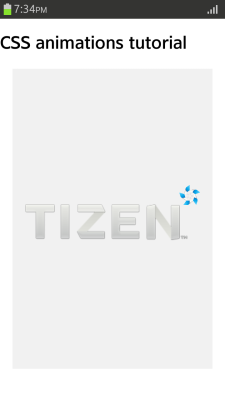

# CSS Animations Module (Level 3)

Animations (like [transitions](./transition.md)) change the presentational value of the CSS properties over time. The principal difference between animations and transitions is that while transitions are triggered implicitly when property values change, animations are explicitly executed when the animation properties are applied. This means that for animations, you must [use animation keyframes to define explicit values for the properties](#creating-a-logo-animation) being animated.

The main features of the CSS Animations Module Level 3 API include:

- Using keyframes

  You can [use keyframes](#using-keyframes) to define property changes complementing the simple running of a transition.

- Defining animation properties

  You can [define various properties](#defining-animation-properties) to control animations.

## Using Keyframes

The CSS animations work based on `@-webkit-keyframes` rules defined for specific elements. The rules can define various property changes complementing the simple running of a transition.

If the animation only has one set of changes over its whole iteration, the rule values can be assigned with a `from {} to {}` rule, where `from` is the beginning of the animation at 0% and `to` is the end at 100%. If there are multiple changes required, you can define their exact time periods using multiple `<number>% {}` rules that together cover the entire animation iteration from 0% to 100%.

The following code snippet demonstrates how to use keyframes:

```
<style type="text/css">

   @-webkit-keyframes boxani {
      from {left: 0; top: 0;}
      to {left: 100px; top: 100px;}
   }
   @-webkit-keyframes boxani_case01 {
      0% {left: 0; top: 0;}
      25% {left: 100px; top: 0;}
      50% {left: 100px; top: 100px;}
      75% {left: 0; top: 100px;}
      100% {left: 0; top: 0;}
   }

</style>
```

### Source Code

For the complete source code related to this use case, see the following file:

- [animation_keyframes.html](http://download.tizen.org/misc/examples/w3c_html5/dom_forms_and_styles/css_animations_module_level_3)

## Defining Animation Properties

You can define various properties for an animation to control how it is played:

- `animation-name`  
This property uses the name defined in the `@-webkit-keyframes` rules to play the animation.

- `animation-duration`  
This property defines how long one iteration of the animation takes.

- `animation-iteration-count`  
This property defines how many times the animation is repeated. If the value is set as `infinite`, the repetitions are unlimited.

- `animation-timing-function`  
This property defines the pace of the animation.

- `animation-direction`  
This property defines the replay direction. The `reverse` value plays the animation from 100% keyframe to 0% keyframe, while the `alternate` value plays the animation normally during odd iterations, and from 100% keyframe to 0% keyframe during even iterations.

- `animation-play-state`  
This property defines the replay status of the animation. The `paused` value temporarily stops the animation.

- `animation-delay`  
This property defines the delay time before the start of the animation.

- `animation-fill-mode`  
This property defines the state of the animation before or after the animation is played. The `forwards` value maintains the last value of the keyframe rule when the animation is over, while the `backwards` value fills up the first value of the keyframe rule when the animation with the `animation-delay` property is in a standby state. The `both` value covers both the start and the end of the animation.

The following code snippet demonstrates how to use animation properties:

```
<head>
   <style type="text/css">
      .box {
         -webkit-animation-name: boxani;
         -webkit-animation-duration: 5s;
         -webkit-animation-iteration-count: infinite;
         -webkit-animation-timing-function: linear;
         -webkit-animation-direction: normal;
         -webkit-animation-delay: 1s;
         -webkit-animation-fill-mode: none;
      }

      .box.case01: hover {
         -webkit-animation-play-state: paused;
         -webkit-animation-fill-mode: forwards;
      }
   </style>
</head>

<body>
   <h1>animation-name</h1>
   <div class="boxarea">
      <div class="box">
         <p>animate</p>
         <p>animation-name: boxani;</p>
      </div>
   </div>
   <div class="boxarea">
      <div class="box case01">
         <p>animate</p>
         <p>animation-name: boxani_case01;</p>
      </div>
   </div>
</body>
```

> **Note**  
> The `hover` pseudo class in Tizen maintains a `mouseover` state when an element is tapped, and becomes a `mouseout` state when another element is tapped.

The `animation` property allows you to define all the animation properties in a shorthand mode in the order of `animation-name` | `animation-duration` | `animation-timing-function` | `animation-delay` | `animation-iteration-count` | `animation-direction` | `animation-fill-mode`. If you omit a property value, a default value is used instead.

```
<style type="text/css">
   .box {
      width: 150px; height: 100px; background: Coral; position: relative;
      -webkit-animation: boxani 3s ease 1s infinite alternate backwards;
   }
</style>
```

### Source Code

For the complete source code related to this use case, see the following files:

- [animation_delay.html](http://download.tizen.org/misc/examples/w3c_html5/dom_forms_and_styles/css_animations_module_level_3)
- [animation_direction.html](http://download.tizen.org/misc/examples/w3c_html5/dom_forms_and_styles/css_animations_module_level_3)
- [animation_fill_mode.html](http://download.tizen.org/misc/examples/w3c_html5/dom_forms_and_styles/css_animations_module_level_3)
- [animation_iteration_count.html](http://download.tizen.org/misc/examples/w3c_html5/dom_forms_and_styles/css_animations_module_level_3)
- [animation_name.html](http://download.tizen.org/misc/examples/w3c_html5/dom_forms_and_styles/css_animations_module_level_3)
- [animation_play_state.html](http://download.tizen.org/misc/examples/w3c_html5/dom_forms_and_styles/css_animations_module_level_3)
- [animation_timing_function.html](http://download.tizen.org/misc/examples/w3c_html5/dom_forms_and_styles/css_animations_module_level_3)

## Creating a Logo Animation

You can create an animation where element properties can be assigned and changed for each element and keyframe. The logo animation in the following example is similar to the animation that appears when a Tizen device (or the emulator) is switched on:

1. No elements are initially shown on the screen.  
2. The Tizen logo gradually appears in the middle of the screen, and as it moves to the right, it becomes smaller.
3. Each letter in the word "TIZEN" consecutively comes in from the left of the screen and moves to the right to its correct location.

**Figure: Logo animation (in mobile applications only)**



To create a logo animation:

1. Create the HTML layout for the animation. To be able to manage the movement of each animation part separately, you must define individual elements for each part.

   ```
   <div class="animation-holder">
      <span class="tizen-txt t"></span>
      <span class="tizen-txt i"></span>
      <span class="tizen-txt z"></span>
      <span class="tizen-txt e"></span>
      <span class="tizen-txt n"></span>
      <span class="tizen-txt tm"></span>
      <span class="tizen-logo"></span>
   </div>
   ```

2. Define the basic style for the animation:

   ```
   .example-body {width: 320px; height: 480px; background: #000; margin: 0 auto;
                  position: relative; border: 2px solid #fff; overflow: hidden;}
   .animation-holder {width: 280px; height: 88px; position: absolute;
                      left: 50%; top: 50%; margin: -54px 0 0 -140px;}

   .tizen-txt, .tizen-logo {position: absolute; display: block;
                            background-repeat: no-repeat; background-position: 50% 50%}
   .tizen-txt.t {width: 48px; height: 56px; background-image: url(images/txt_t.png);}
   .tizen-txt.i {width: 15px; height: 56px; background-image: url(images/txt_i.png);}
   .tizen-txt.z {width: 46px; height: 56px; background-image: url(images/txt_z.png);}
   .tizen-txt.e {width: 45px; height: 56px; background-image: url(images/txt_e.png);}
   .tizen-txt.n {width: 54px; height: 58px; background-image: url(images/txt_n.png);}
   .tizen-txt.tm {width: 11px; height: 6px; background-image: url(images/txt_tm.png);}
   .tizen-logo {width: 220px; height: 211px; left: 30px; top: -61px;
                background-image: url(images/logo_tizen.png); background-size: 100% 100%;}
   ```

3. Create the animation:

   a. To ensure that all the animation elements are played within the same time frame, some common properties are defined for the animation. The animation movement time is 7 seconds, and the animation repeats infinitely.

      When an animation that repeats itself is activated, it can look unnatural when it suddenly returns to its initial position after finishing an iteration. To make the repetition move naturally, set the `animation-direction` property to `alternate`. The alternate direction means that during the odd iterations the animation proceeds in the normal direction (from the 0% keyframe to the 100% keyframe), while during the even iterations the keyframes are played in the opposite direction from 100% to 0%.

      ```
      .tizen-txt, .tizen-logo {
         -webkit-animation-duration: 7s;
         -webkit-animation-iteration-count: infinite;
         -webkit-animation-direction: alternate;
      }
      ```

   b. Create the keyframes to implement the flow for the Tizen logo:

      - During the first 25% of the animation total playing time (7 seconds), the transparency disappears and the Tizen logo appears.
      - During the 25 - 50% of the playing time, the logo size becomes smaller as the width and height values are reduced, and due to the left and top values, the logo is positioned at the top-right corner of the screen.
      - During the 50 - 100% of the playing time, the values do not change, and the logo remains in its new position.

      ```
      @-webkit-keyframes tizen-logo {
         0% {width: 220px; height: 211px; left: 30px; top: -61px; opacity: 0;}
         25% {width: 220px; height: 211px; left: 30px; top: -61px; opacity: 1;}
         50% {left: 247px; top: 0px; width: 33px; height: 32px; opacity: 1;}
         100% {left: 247px; top: 0px; width: 33px; height: 32px; opacity: 1;}
      }
      ```

	> **Note**  
	> If the 100% keyframe is not defined, the animation is executed based on the original properties, and the logo size increases to its original size at the end.

   c. Create the keyframes to implement the flow for each letter in the word "TIZEN":

      - To hide the letter initially, the property has been assigned outside the screen at the 0% keyframe. To allow the Tizen logo to appear first, the first letter is introduced at the 30% keyframe.
      - To create a slight collision animation, the letter element moves to -10 px of the final value at the 40% keyframe before reaching its final 0 px value at the 45% keyframe.
      - The `animation-timing-function` property can be changed for each keyframe point, and is used to determine the pace of the animation. When the letter is actually shown on the screen and moved to its final location, the ease in and out timing functions are used.

      To show the letters one at a time, the timing is pushed back a bit more for each consecutive letter:

      ```
      <!--Letter T-->
      @-webkit-keyframes tizen-txt-t {
         0% {left: 340px; top: 31px;}
         30% {left: 340px; top: 31px; animation-timing-function: ease-in;}
         40% {left: -10px; top: 31px; animation-timing-function: ease-out;}
         45% {left: 0; top: 31px;}
         100% {left: 0; top: 31px;}
      }

      <!--Letter I-->
      @-webkit-keyframes tizen-txt-i {
         0% {left: 340px; top: 31px;}
         40% {left: 340px; top: 31px; animation-timing-function: ease-in;}
         50% {left: 47px; top: 31px; animation-timing-function: ease-out;}
         55% {left: 57px; top: 31px;}
         100% {left: 57px; top: 31px;}
      }

      <!--Remaining letters-->
      ```

   d. After creating all the keyframes, define the `animation-name` property for each element:

      ```
      .tizen-txt.t {
         -webkit-animation-name: tizen-txt-t;
      }
      .tizen-txt.i {
         -webkit-animation-name: tizen-txt-i;
      }
      ```

### Source Code

For the complete source code related to this use case, see the following files:

- [animation_practical.html](http://download.tizen.org/misc/examples/w3c_html5/dom_forms_and_styles/css_animations_module_level_3)
- [logo_tizen.png](http://download.tizen.org/misc/examples/w3c_html5/dom_forms_and_styles/css_animations_module_level_3/images/)
- [txt_e.png](http://download.tizen.org/misc/examples/w3c_html5/dom_forms_and_styles/css_animations_module_level_3/images/)
- [txt_i.png](http://download.tizen.org/misc/examples/w3c_html5/dom_forms_and_styles/css_animations_module_level_3/images/)
- [txt_n.png](http://download.tizen.org/misc/examples/w3c_html5/dom_forms_and_styles/css_animations_module_level_3/images/)
- [txt_t.png](http://download.tizen.org/misc/examples/w3c_html5/dom_forms_and_styles/css_animations_module_level_3/images/)
- [txt_tm.png](http://download.tizen.org/misc/examples/w3c_html5/dom_forms_and_styles/css_animations_module_level_3/images/)
- [txt_z.png](http://download.tizen.org/misc/examples/w3c_html5/dom_forms_and_styles/css_animations_module_level_3/images/)

## Related Information
* Dependencies
  - Tizen 2.4 and Higher for Mobile
  - Tizen 2.3.1 and Higher for Wearable
  - Tizen 3.0 and Higher for TV
