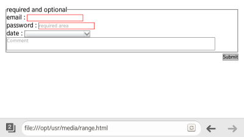

# CSS Basic User Interface Module (Level 3)

You can apply styles to HTML documents.

The CSS3 version has caused changes in the Selector, Color, Web Form, and Fonts CSS modules. In addition, the CSS3 UI API also handles changes related to the following user interface items:

- User interface selectors

  The CSS Selector is an essential module for applying a CSS to HTML in order to enable the DOM element selection. The [pseudo-class selectors](https://www.w3.org/TR/2013/WD-selectors4-20130502/#pseudo-classes) can be used to assign the user interface state. With the selectors, you can [change the Web form style](#using-pseudo-class-selectors) according to the user input without using JavaScript.

- Box model properties

  A box model refers to all DOM elements excluding design elements, such as `<br>` and `<i>`. The box model area is set as defined in the following figure.

  - **Content**: Content area
  - **Padding**: Gap between the content and boundary
  - **Border**: Boundary
  - **Margin**: Overall size of the box model

  **Figure: Box model structure**

  

  You can [use the box model properties](#using-box-model-properties) to assign styles to the selected DOM elements:

  - The `box-sizing` property assigns the box size range.
  - The `outline` properties make the box outstanding.
  - The `text-overflow` property handles the text extending outside the box.

## Using Pseudo-class Selectors

To use pseudo-class selectors:

1. Use the pseudo-classes, such as `:enabled` and `:disabled`, to add different styles based on the state of the DOM elements:

   ```
   input: enabled {border: 1px solid blue}
   input: disabled {border: 1px solid red}
   ```

   > **Note**  
   > In the versions prior to CSS3, pseudo-classes, such as `:hover`, `:active`, and `:focus`, were used, and required an attribute selector. Since the `:enabled` and `:disabled` classes are not influenced by the `display` and `visibility` attributes, they improve the accessibility.

2. To control the state of the HTML5 Web Forms (in [mobile](../../../api/latest/w3c_api/w3c_api_m.html#forms), [wearable](../../../api/latest/w3c_api/w3c_api_w.html#forms), and [TV](../../../api/latest/w3c_api/w3c_api_tv.html#forms) applications), use the `:in-range` and `:out-of-range` pseudo-classes.

   They check for any values that have exceeded the inserted range. (The following figure applies to mobile applications only.)
   
   ```
   <!--HTML-->
   <input type="number" step="10" min="10" max="100"/>
   ```

   ```
   <!--CSS-->
   input[type="number"]: in-range {border: 3px solid blue; width: 90%}
   input[type="number"]: out-of-range {border: 3px solid red; width: 90%}
   ```

   

3. To apply different styles to required input items and option items, use the `:required` and `:optional` pseudo-classes. (The following figure applies to mobile applications only.)

   ```
   <!--HTML-->
   <fieldset>
      <legend>required and optional</legend>
      <label>email: <input type="email" required ></label>
      <label>password: <input type="Password" placeholder="required area" required ></label>

      <label>date: <input type="date" placeholder="You know what to do, huh?"></label>
      <textarea placeholder="Comment"></textarea>
   </fieldset>
   ```

   ```
   <!--CSS-->
   input: required, textarea: required {border: 1px solid red}
   input: optional, textarea: optional {border: 1px solid #777}
   ```

   

### Source Code

For the complete source code related to this use case, see the following files:

- [range.html](http://download.tizen.org/misc/examples/w3c_html5/dom_forms_and_styles/css_basic_user_interface_module_level_3)
- [required_and_optional.html](http://download.tizen.org/misc/examples/w3c_html5/dom_forms_and_styles/css_basic_user_interface_module_level_3)

## Using Box Model Properties

To use the box model properties in your application:

> **Note**  
> The properties dependent on mouse and keyboard functions are not discussed in this topic.

1. To assign the area that is included in the width and height of the box automatically, use the `box-sizing` property. To assign the width without a margin, use the `box-sizing: border-box` property.

   ```
   <!--width (height) = content-->
   div.content-box {box-sizing: content-box}
   <!--width (height) = content + padding + border-->
   div.border-box {box-sizing: border-box}
   div.border-box: before {height: 40px}
   ```

2. To draw an outline without using up the area, use the `outline` property:

   ```
   .Test-Box {outline: 5px dashed red}
   .outline: before {outline: 2px dashed red}
   .outline-offset: before {outline-offset: 35px}
   ```

3. To handle text that exceeds the area of the box model, use the `text-overflow` property. The `text-overflow: ellipsis` property is used to indicate the text exceeded the padding area as '...'.

   ```
   div {
      width: 250px;
      margin: 20px auto;
      padding: 20px 30px;
      background-color: #eee;
      color: #333;
      border: 5px solid #333;
      font-weight: bold;
      overflow: hidden;
      white-space: nowrap;
   }

   .clip {text-overflow: clip}
   .ellipsis {text-overflow: ellipsis}
   ```

The following figure illustrates the box model properties; from left to right, it shows the effects of the box sizing, outline, and text overflow properties.

**Figure: Box model properties (in mobile applications only)**


### Source Code

For the complete source code related to this use case, see the following files:

- [box_sizing_property.html](http://download.tizen.org/misc/examples/w3c_html5/dom_forms_and_styles/css_basic_user_interface_module_level_3)
- [outline_property.html](http://download.tizen.org/misc/examples/w3c_html5/dom_forms_and_styles/css_basic_user_interface_module_level_3)
- [text_overflow_property.html](http://download.tizen.org/misc/examples/w3c_html5/dom_forms_and_styles/css_basic_user_interface_module_level_3)

## Related Information
* Dependencies
  - Tizen 2.4 and Higher for Mobile
  - Tizen 2.3.1 and Higher for Wearable
  - Tizen 3.0 and Higher for TV
