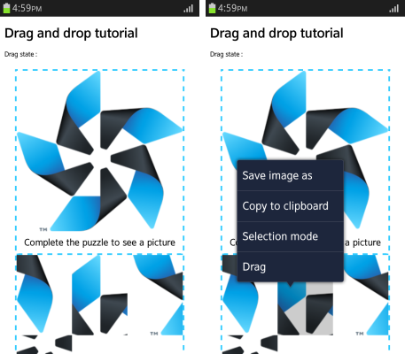
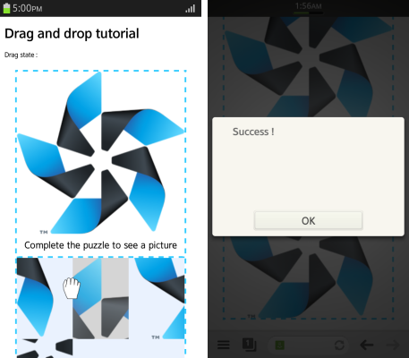

# HTML5 Drag and Drop

HTML5 drag and drop activates through event-based JavaScript and added attributes.

This feature is supported in mobile applications only.

The main features of the HTML5 Drag and drop API include:

- Using drag and drop

  To make an element draggable, add the `draggable="true"` attribute to it. Only elements thus defined as draggable can [generate drag and drop events](#handle).

  A drag and drop requires a source, target, and data. It is used through the following events:

  - `dragstart`
  - `drag`
  - `dragleave`
  - `dragenter`
  - `dragover`
  - `drop`
  - `dragend`

  The `dragstart` and `drop` events send data through the [DataTransfer](http://www.w3.org/TR/2012/WD-html5-20120329/dnd.html#the-datatransfer-interface) interface.

- Transferring data

  You can [transfer data from the drag source to the drop target](#transfer). The `DataTransfer` interface instance receives the `dragstart` event and fills itself with the data to be transferred. It then receives a `drop` event, and puts the data into the drop target.

> **Note**  
> To use drag and drop on a Tizen device, long-press the draggable element. When the context menu opens, select **Drag**.

<a name="handle"></a>
## Handling Drag and Drop Events

Learning how to handle drag and drop events is a basic user interaction skill:

1. Define the draggable elements by adding the `draggable="true"` attribute to them:

   ```
   <h1>Drag and drop tutorial</h1>
   <div class="example_body">
      <div id="drag-list">
         <div class="drag-row" draggable="true">1</div>
         <div class="drag-row" draggable="true">2</div>
      </div>
      <div>Drag state: <span id="log"></span></div>
   </div>
   ```

2. Add event listeners for the various drag and drop events:

   ```
   <script>
       var cols = document.querySelectorAll('#drag-list_.drag-row');
       var colsLength = cols.length;

       for (var i = 0; i < colsLength; i++) {
           cols[i].addEventListener('dragstart', dragStart, false);
           cols[i].addEventListener('drag', dragIng, false);
           cols[i].addEventListener('dragenter', dragEnter, false);
           cols[i].addEventListener('dragover', dragOver, false);
           cols[i].addEventListener('dragleave', dragLeave, false);
           cols[i].addEventListener('drop', dragDrop, false);
           cols[i].addEventListener('dragend', dragEnd, false);
       }
   </script>
   ```

3. Define event handlers for the events. In this case, each event handler displays a text on the screen.

   ```
   function dragStart(e) {
       log.innerHTML = 'dragStart';
   }

   function dragIng(e) {
       log.innerHTML = 'drag';
   }

   function dragOver(e) {
       e.preventDefault();
       log.innerHTML = 'dragOver';
   }

   function dragEnter(e) {
       log.innerHTML = 'dragEnter';
   }

   function dragLeave(e) {
       log.innerHTML = 'dragLeave';
   }

   function dragDrop(e) {
       e.stopPropagation();
       log.innerHTML = 'dragDrop';
   }

   function dragEnd(e) {
       log.innerHTML = 'dragEnd';
   }
   ```

### Source Code

For the complete source code related to this use case, see the following file:

- [drag_and_drop.html](http://download.tizen.org/misc/examples/w3c_html5/ui/html5_drag_and_drop)


<a name="transfer"></a>
## Transferring Data over Drag and Drop

Learning how to transfer data in a simple drag and drop puzzle is a basic user interaction skill:

1. Define the draggable elements by adding the `draggable="true"` attribute to them.  
   In this example, the Tizen logo image has been divided and allocated randomly. Each imager part is defined as draggable, so that the user can rearrange the image parts in the correct order.

   ```
   <h1>Drag and drop tutorial</h1>
   <div class="example_body">
      <div>Drag state: <span id="log"></span></div>
      <div class="holder">
         <div>
            
            <p class="txt">Complete the puzzle to see a picture</p>
         </div>
         <ul id="puzzle">
            <li class="puzzle-piece" draggable="true">
               
            </li>
            <li class="puzzle-piece" draggable="true">
               
            </li>
            <li class="puzzle-piece" draggable="true">
               
            </li>
            <li class="puzzle-piece" draggable="true">
               
            </li>
            <li class="puzzle-piece" draggable="true">
               
            </li>
            <li class="puzzle-piece" draggable="true">
               
            </li>
         </ul>
      </div>
   </div>
   ```

2. Add event listeners for the `dragover`, `dragleave`, `dragstart`, and `drop` events:

   ```
   <script>
       var cols = document.querySelectorAll('#puzzle_.puzzle-piece');
       var colsLength = cols.length;
       for (var i = 0; i < colsLength; i++) {
           cols[i].addEventListener('dragstart', dragStartHandler, false);
           cols[i].addEventListener('dragover', dragOverHandler, false);
           cols[i].addEventListener('dragleave', dragLeaveHandler, false);
           cols[i].addEventListener('drop', dragDropHandler, false);
       }
   </script>
   ```

3. Transfer data (in this case, image parts):

   1. Declare the `dragElem` variable, which is an empty object for the data exchange:

      ```
      var dragElem = null;
      ```

   2. Use the [DataTransfer](http://www.w3.org/TR/2012/WD-html5-20120329/dnd.html#the-datatransfer-interface) interface in the `dragStartHandler()` and `dragDropHandler()` event handlers to exchange image parts:

      ```
      function dragStartHandler(e) {
          /* Set data */
          dragElem = this;
          e.dataTransfer.effectAllowed = 'move';
          e.dataTransfer.setData('text/html', this.innerHTML);
          this.classList.add('over');
          for (var i = 0; i < colsLength; i++) {
              cols[i].classList.add('start');
          }
      }
      function dragDropHandler(e) {
          /* Get data */
          dragElem.innerHTML = this.innerHTML;
          this.innerHTML = e.dataTransfer.getData('text/html');
          for (var i = 0; i < colsLength; i++) {
              cols[i].className = 'puzzle-piece';
          }
          /* Check key */
          puzzleCheck();
      }
      ```

   3. Check the completion of the puzzle by making a user key using a simple array, and comparing the user key against the puzzle key (correct answer):

      ```
      var puzzleKey = ['01', '02', '03', '04', '05', '06'];
      var puzzleArray = [];

      function puzzleCheck() {
          /* Initialize the user key */
          puzzleArray = [];
          /* Insert the keys in the array */
          for (var i = 0; i < colsLength; i++) {
              puzzleArray.push(cols[i].children[0].getAttribute('src').substring(12, 14));
          }
          originKey = puzzleKey.join();
          userKey = puzzleArray.join();

          if (originKey === userKey) {
              alert('Success !');
          }
      }
      ```

**Figure: Drag and drop puzzle**





### Source Code

For the complete source code related to this use case, see the following files:

- [drag_and_drop_practical.html](http://download.tizen.org/misc/examples/w3c_html5/ui/html5_drag_and_drop)
- [logo.png](http://download.tizen.org/misc/examples/w3c_html5/ui/html5_drag_and_drop/images)
- [puzz_01.png](http://download.tizen.org/misc/examples/w3c_html5/ui/html5_drag_and_drop/images)
- [puzz_02.png](http://download.tizen.org/misc/examples/w3c_html5/ui/html5_drag_and_drop/images)
- [puzz_03.png](http://download.tizen.org/misc/examples/w3c_html5/ui/html5_drag_and_drop/images)
- [puzz_04.png](http://download.tizen.org/misc/examples/w3c_html5/ui/html5_drag_and_drop/images)
- [puzz_05.png](http://download.tizen.org/misc/examples/w3c_html5/ui/html5_drag_and_drop/images)
- [puzz_06.png](http://download.tizen.org/misc/examples/w3c_html5/ui/html5_drag_and_drop/images)

## Related Information
- Dependencies
  - Tizen 2.4 and Higher for Mobile
