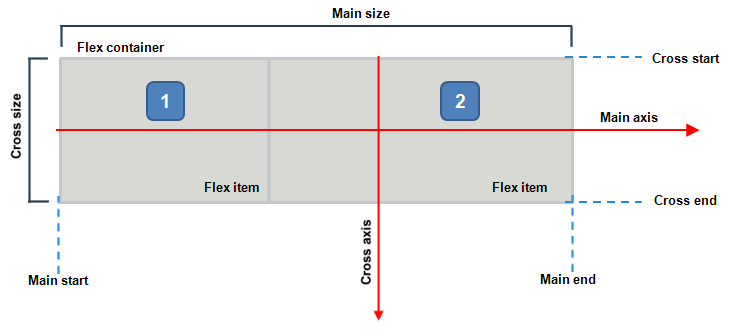
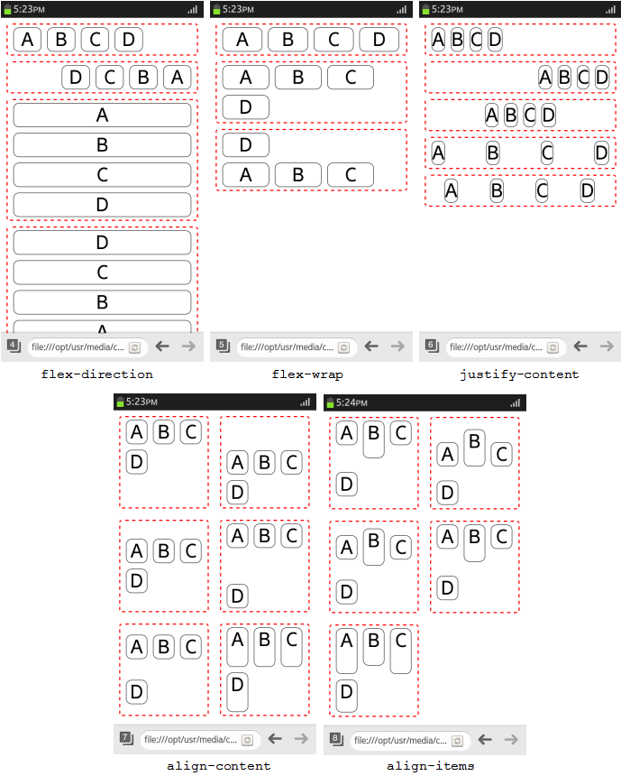
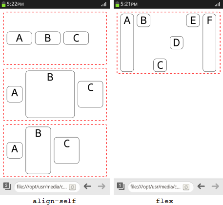
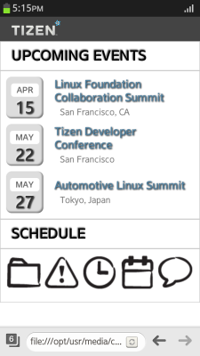

# CSS Flexible Box Layout Module

CSS attributes, such as `float`, `display`, and `position`, can be used to adjust and align the screen layout according to various resolutions. However, operating the layout accurately among changing screen sizes is difficult.

Tizen supports the CSS Flexible Box Layout Module API that enables you to create an easily manageable flexible layout, which fluidly adjusts the layout according to viewport size changes. When you [create and use a flexible box layout](#creating-a-flexible-layout-with-css3), the alignment method or object (flex item) size within a specific area (flex container) can be adjusted.

The main components of the flexible box layout include:

-   Flex container (in [mobile](http://www.w3.org/TR/2015/WD-css-flexbox-1-20150514/#flex-containers), [wearable](http://www.w3.org/TR/2014/WD-css-flexbox-1-20140325/#flex-containers), and [TV](http://www.w3.org/TR/2015/WD-css-flexbox-1-20150514/#flex-containers) applications), which refers to flex or inline-flex DOM elements assigned by the display.

    You can [use the flex container](#using-the-flex-container) to assign a flex area and the flex items included in it. The flex container properties are used to assign the indication area and alignment method.

-   Flex item (in [mobile](http://www.w3.org/TR/2015/WD-css-flexbox-1-20150514/#flex-items), [wearable](http://www.w3.org/TR/2014/WD-css-flexbox-1-20140325/#flex-items), and [TV](http://www.w3.org/TR/2015/WD-css-flexbox-1-20150514/#flex-items) applications), which refers to the child nodes of the flex container.

    The flex item changes its size fluidly according to the area of the flex container. You can [define flex item properties](#using-the-flex-items) to assign the sizes of the respective items and the alignment method.

**Figure: Flexible box layout**



## Using the Flex Container

To assign size and alignment to a flex container:

1. Assign the area (flex container) where the flexible box layout is applied by using the `display: flex` property:

   ```
   <style>
      .flex_container {display: -webkit-flex}
   </style>

   <div class="flex_container">
      <div class="flex_item">A</div>
      <div class="flex_item">B</div>
      <div class="flex_item">C</div>
      <div class="flex_item">D</div>
   <div>
   ```

   The child nodes within the assigned flex container become flex items.

2. Define the necessary properties for the flex container to assign the alignment of the flex items within it:

   - `flex-direction` property sets the alignment direction of the flex items:

     - `row`: Align from left to right.
     - `row-reverse`: Align from right to left.
     - `column`: Align from top to bottom.
     - `column-reverse`: Align from bottom to top.

   - `flex-wrap` property sets the line changing of the flex items:

     - `nowrap`: Reduces the size of the flex items without changing lines.
     - `wrap`: The flex items reaching beyond the flex container area are divided into multiple lines using the cross axis direction of the current writing mode.
     - `wrap-reverse`: The flex items reaching beyond the flex container area are divided into multiple lines using the opposite cross axis direction than in the `wrap` value.

   - `justify-content` property sets the handling of gaps between the flex items on the main axis:

     - `flex-start`: Gathers the items at the alignment starting point.

     - `flex-end`: Gathers the items at the alignment finishing point.

     - `center`: Gathers the items in the center.

     - `space-between`: Aligns the start and end item at both ends, and creates equal gaps in between the rest of the items.

     - `space-around`: Creates equal gaps between all items.

      > **Note**  
      > This property is similar to `text-align`, but the alignment direction and the starting point are based on the `flex-direction` and `flex-wrap` properties.   

   - `align-content` property sets the handling of gaps between the flex items on the cross axis. It has the same values as the `justify-content` property, and 1 additional value:

     - `stretch`: Extends the size of the flex items and aligns them without gaps.

   - `align-items` property sets the relative location and size between the flex items on the cross axis:

     - `flex-start`: Aligns the items vertically to the top.

     - `flex-end`: Aligns the items vertically to the bottom.

     - `center`: Aligns the items vertically to the middle.

     - `baseline`: Aligns the items vertically to the baseline.

     - `stretch`: Extends the height of the flex items and aligns them without gaps.

      > **Note**  
      > If the `flex-wrap` property is set to `wrap-reverse`, the start and end points of the alignment are reversed.

The following figure shows examples of flex containers and how their flex items have been aligned.

**Figure: Flex container properties (in mobile applications only)**



### Source Code

For the complete source code related to this use case, see the following files:

- [flex_container_properties_2.html](http://download.tizen.org/misc/examples/w3c_html5/dom_forms_and_styles/css_flexible_box_layout_module)
- [flex_container_properties_3.html](http://download.tizen.org/misc/examples/w3c_html5/dom_forms_and_styles/css_flexible_box_layout_module)
- [flex_container_properties_4.html](http://download.tizen.org/misc/examples/w3c_html5/dom_forms_and_styles/css_flexible_box_layout_module)
- [flex_container_properties_5.html](http://download.tizen.org/misc/examples/w3c_html5/dom_forms_and_styles/css_flexible_box_layout_module)
- [flex_container_properties_6.html](http://download.tizen.org/misc/examples/w3c_html5/dom_forms_and_styles/css_flexible_box_layout_module)

## Using the Flex Items

To assign size and alignment to the flex items in a flex container:

1. Assign the area (flex container) where the flexible box layout is applied, and define the flex items for it:

   ```
   <style>
      .flex_container {display: -webkit-flex}
   </style>

   <div class="flex_container">
      <div class="flex_item">A</div>
      <div class="flex_item">B</div>
      <div class="flex_item">C</div>
   <div>
   ```

2. Define the necessary properties for the flex items:

   - `align-self` property is similar as the [align-items](#using-the-flex-container) property of the flex container.

      > **Note**  
      > If both the `align-self` and `align-items` properties are used simultaneously, the `align-items` property is ignored.

   - `flex` property is a shorthand expression defining the flex item size handling:

     - `flex-grow`: Sets whether the spaces between flex items are filled.
     - `flex-shrink`: Sets whether the width of the flex items is reduced according to the size of the flex container.
     - `flex-basis`: Sets the default width of the relevant flex items.

The following figure shows examples of how flex items can be placed and sized within a flex container.

**Figure: Flex items (in mobile applications only)**



### Source Code

For the complete source code related to this use case, see the following files:

- [flex_item_properties_2.html](http://download.tizen.org/misc/examples/w3c_html5/dom_forms_and_styles/css_flexible_box_layout_module)
- [flex_item_properties_3.html](http://download.tizen.org/misc/examples/w3c_html5/dom_forms_and_styles/css_flexible_box_layout_module)

## Creating a Flexible Layout with CSS3

To create a flexible box layout with CSS3:

1. Define the HTML content for the flexible layout. In this example, create 2 articles areas, 1 for a text list and 1 for an icon list:

   ```
   <div class="container">
      <article class="events">
         <h2>UPCOMING EVENTS</h2>
         <ul>
            <li>
               <div class="date"><span>APR</span><br/> 15</div>
               <p class="title">
                  Linux Foundation Collaboration Summit <span class="local">San Francisco, CA</span>
               </p>
            </li>
            <!--Other text items-->
         </ul>
      </article>
      <article class="schedule">
         <h2>SCHEDULE</h2>
         <div class="img_list">
            
            
            <!--Other icons-->
         </div>
      </article>
   </div>
   ```

2. Define styles to decorate the article areas. (The following figure applies to mobile applications only.)

   ```
   <!--Border for the article areas-->
   .container article > * {border: 1px solid #ccc;}

   <!--Font style for the article area titles-->
   .container .events > h2, .container .schedule > h2 {
      padding: 10px 20px;
      text-shadow: 1px 1px 2px #fff, -1px -1px 2px #000;
   }

   <!--List styles-->
   .container .events > ul, .container .schedule .img_list {
      height: 100%;
      padding: 10px;
   }

   <!--Text style for the text list item title-->
   .container .events > ul > li .title {
      color: #51809e;
      text-shadow: 1px 1px 2px #000;
   }

   <!--Text style for the text list item location info-->
   .container .events > ul > li .title .local {
      text-indent: 10px;
      text-shadow: 0 0 0 #fff;
   }

   <!--Styles for the text list item date box-->
   .container .events > ul > li .date {
      text-align: center;
   }
   .container .events > ul > li .date {
      background-color: #ddd;
      border-radius: 10px;
      box-shadow: inset -2px -2px 4px rgba(0, 0, 0, .5);
   }
   .container .events > ul > li .date > span {
      background-color: #fff;
      border-radius: 5px;
   }
   ```

   

3. Define a flexible alignment for the article areas to support screen orientation changes and ensure that the content fills up the entire available screen area regardless of the orientation:

   1. Define the text list items and the icon list as flex containers using the `display: -webkit-flex;` property:
   
      - For the text list items, align them vertically in the middle, define a 0 margin at the top for the first item, and center-align the text for the date box.

      - For the icon list, align the icon list so that the first and last icon are placed at the ends and the gaps between the rest of the icons are equal.

      (The following figure applies to mobile applications only.)

      ```
      <!--Flexible alignment of text list-->
      .container .events > ul > li {
         display: -webkit-flex;
         -webkit-align-items: center;
      }
      .container .events > ul > li: first-child {
         margin-top: 0;
      }

      .container .events > ul > li .date {
         -webkit-flex: 0 0 20%;
         text-align: center;
      }

      <!--Flexible alignment of icon list-->
      .container .schedule .img_list {
         display: -webkit-flex;
         -webkit-justify-content: space-between;
      }
      ```

      

   2. Special consideration can be given for some screen sizes. The following example defines a specific layout for small screens (where the screen width is less than 390 pixels). (The following figure applies to mobile applications only.)

      ```
      @media screen and (min-width: 390px) {
         .container .schedule .img_list {
            display: -webkit-flex;
            -webkit-flex-wrap: wrap;
            -webkit-justify-content: space-between;
            -webkit-align-content: space-around;
         }

         .container {display: -webkit-flex;}
         .container > * {-webkit-align-content: center;}
         .container article {height: 250px;}
      }
      ```

      

      For more information on defining screen-size-specific rules, see [Media Queries](./media-query.md).

### Source Code

For the complete source code related to this use case, see the following files:

- [flexible_layout_1.html](http://download.tizen.org/misc/examples/w3c_html5/dom_forms_and_styles/css_flexible_box_layout_module)
- [flexible_layout_2.html](http://download.tizen.org/misc/examples/w3c_html5/dom_forms_and_styles/css_flexible_box_layout_module)
- [alert.png](http://download.tizen.org/misc/examples/w3c_html5/dom_forms_and_styles/css_flexible_box_layout_module)
- [folder.png](http://download.tizen.org/misc/examples/w3c_html5/dom_forms_and_styles/css_flexible_box_layout_module)

## Related Information
* Dependencies
  - Tizen 2.4 and Higher for Mobile
  - Tizen 2.3.1 and Higher for Wearable
  - Tizen 3.0 and Higher for TV
