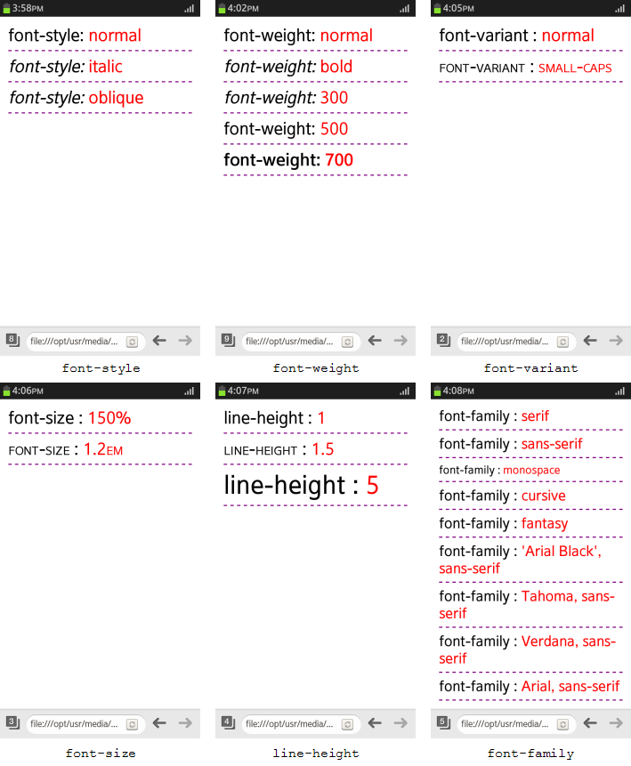

# CSS Fonts Module (Level 3)

You can change the text fonts easily.

The new text features in CSS Fonts Module Level 3 API include:

- Font properties

  You can [use CSS font properties](#manipulating-fonts), such as `font-style`, `font-weight`, `font-variant`, `font-size`, and `font-family`, to modify the appearance of text.

## Manipulating Fonts

To manipulate fonts using CSS font properties:

1. Define the `font-style` property within a `<style>` element in the `<head>` section of the Web page to apply different font styles:

   ```
   <head>
      <style>
         p:nth-child(1) em{font-style: normal}
         p:nth-child(2) em{font-style: italic}
         p:nth-child(3) em{font-style: oblique}
      </style>
   </head>
   <body>
      <p>font-style: <em>normal</em></p>
      <p>font-style: <em>italic</em></p>
      <p>font-style: <em>oblique</em></p>
   </body>
   ```

2. Define the `font-weight` property, which controls the weight of the text:

   ```
   <head>
      <style>
         p:nth-child(1) {font-weight: normal}
         p:nth-child(2) {font-weight: bold}
         p:nth-child(3) {font-weight: 300}
         p:nth-child(4) {font-weight: 500}
         p:nth-child(5) {font-weight: 700}
      </style>
   </head>
   <body>
      <p>font-weight: <em>normal</em></p>
      <p>font-weight: <em>bold</em></p>
      <p>font-weight: <em>300</em></p>
      <p>font-weight: <em>500</em></p>
      <p>font-weight: <em>700</em></p>
   </body>
   ```

3. Define the `font-variant` property to change the font to, for example, use small capital letters:

   ```
   <head>
      <style>
         p:nth-child(1) {font-variant: normal}
         p:nth-child(2) {font-variant: small-caps}
      </style>
   </head>
   <body>
      <p>font-variant: <em>normal</em></p>
      <p>font-variant: <em>small-caps</em></p>
   </body>
   ```

4. Define the `font-size` property, which controls the size of the font:

   ```
   <head>
      <style>
         p:nth-child(1) {font-size: 150%}
         p:nth-child(2) {font-size: 1.2em}
      </style>
   </head>
   <body>
      <p>font-size: <em>150%</em></p>
      <p>font-size: <em>1.2em</em></p>
   </body>
   </html>
   ```

5. Define the `line-height` property, which controls the height of a text line:

   ```
   <head>
      <style>
         p:nth-child(1) {line-height: 1}
         p:nth-child(2) {line-height: 1.5}
         p:nth-child(3) {line-height: 5}
      </style>
   </head>
   <body>
      <p>line-height: <em>1</em></p>
      <p>line-height: <em>1.5</em></p>
      <p>line-height: <em>5</em></p>
   </body>
   ```

6. Define the `font-family` property, which assigns a specific font or its representative to an element. The list order within the `<style>` element determines the property priority.  
If the assigned font is not installed on the target, a different font is obtained based on the user system.

   ```
   <head>
      <style>
         p:nth-child(1) {font-family: serif}
         p:nth-child(2) {font-family: sans-serif}
         p:nth-child(3) {font-family: monospace}
         p:nth-child(4) {font-family: cursive}
         p:nth-child(5) {font-family: fantasy}
         p:nth-child(6) {font-family: 'Arial Black', sans-serif}
         p:nth-child(7) {font-family: Tahoma, sans-serif}
         p:nth-child(8) {font-family: Verdana, sans-serif}
         p:nth-child(9) {font-family: Arial, sans-serif}
      </style>
   </head>
   <body>
      <p>font-family: <em>serif</em></p>
      <p>font-family: <em>sans-serif</em></p>
      <p>font-family: <em>monospace</em></p>
      <p>font-family: <em>cursive</em></p>
      <p>font-family: <em>fantasy</em></p>
      <p>font-family: <em>'Arial Black', sans-serif</em></p>
      <p>font-family: <em>Tahoma, sans-serif</em></p>
      <p>font-family: <em>Verdana, sans-serif</em></p>
      <p>font-family: <em>Arial, sans-serif</em></p>
   </body>
   </html>
   ```

The following figure shows examples of manipulating the text font properties.

**Figure: Font properties (in mobile applications only)**



> **Note**  
> For a complete list of CSS Fonts Module Level 3 font properties (in [mobile](../../../api/latest/w3c_api/w3c_api_m.html#font), [wearable](../../../api/latest/w3c_api/w3c_api_w.html#font), and [TV](../../../api/latest/w3c_api/w3c_api_tv.html#font) applications) and their possible values, see the [Property index](http://www.w3.org/TR/2013/CR-css-fonts-3-20131003/#property-index).

## Related Information
* Dependencies
  - Tizen 2.4 and Higher for Mobile
  - Tizen 2.3.1 and Higher for Wearable
