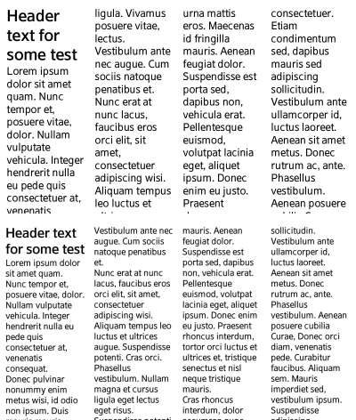
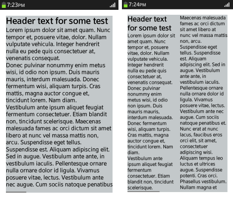
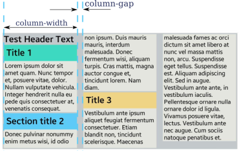
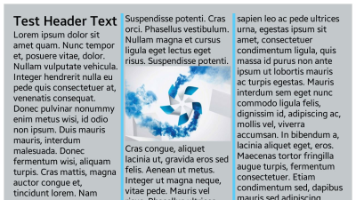
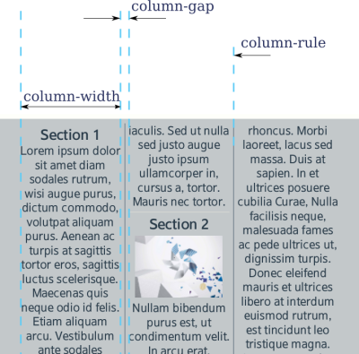
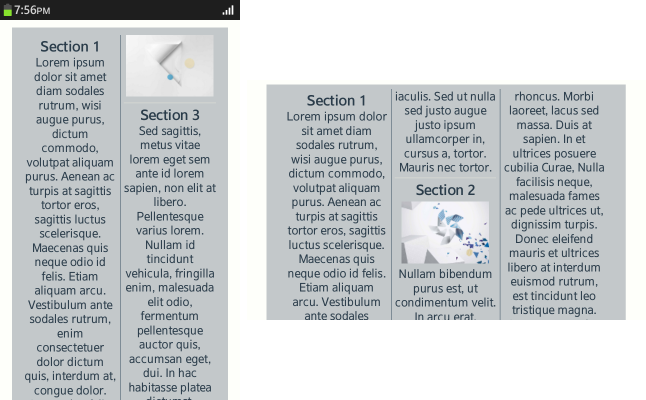
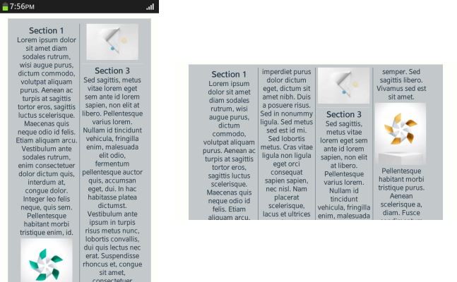
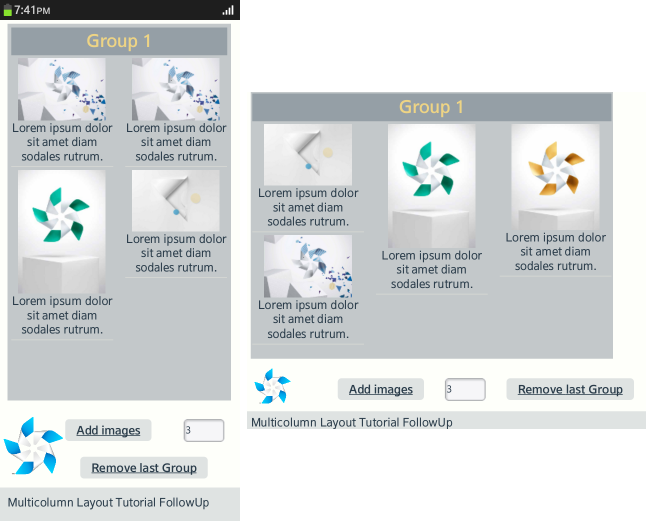

# CSS Multi-column Layout Module

You can arrange the screen content into columns. Using the CSS `column-` properties, the content elements can flow between columns when the column height or number changes. You can use the properties alone to [create a basic layout](#creating-a-basic-layout), or add JavaScript code to [make the layout dynamic](#creating-a-layout-with-dynamic-content).

This feature is supported in mobile and TV applications only.

You can manage the following column-related features:

- [Setting the column number and width](#setting-the-column-number-and-width)
- [Setting the column gap](#setting-the-column-gap)
- [Setting the column rule](#setting-the-column-rule)
- [Setting the column span](#setting-the-column-span)
- [Setting the column break](#setting-the-column-break)

## Setting the Column Number and Width

 When the layout is set to a constant number of columns using the `column-count` (or `-webkit-column-count)` property, the column width is set to fill the available horizontal space.

In the following code snippet and figure, the column number is set to 4. As a result, on a 480 x 800 display (shown at the top), the column width is 116 px, whereas on a 720 x 1280 display (shown at the bottom), the column width is 143 px.

The following code snippet demonstrates how to use the `column-count` property. For a complete source code, see [multi_column_column_count/renamed_index.html](http://download.tizen.org/misc/examples/w3c_html5/dom_forms_and_styles/css_multi_column_layout_module/multi_column_column_count).

```
article {
   column-count: 4;
   -webkit-column-count: 4;
   margin: 10px;
}
```

**Figure: 4 columns on different resolution displays**



The `column-width` (or `-webkit-column-width)` property sets the base column width.

In the following code snippet and figure, the column width is set to 153 px, but the effective column width is 288 px for a 480 x 800 display (shown on the left) and 154 px for a 720 x 1280 display (shown on the right). The parameter sets the column to at least the defined width, but not wider than the available display space or twice the defined width. The actual column width is calculated using a [pseudo-algorithm](http://www.w3.org/TR/2011/CR-css3-multicol-20110412/#pseudo-algorithm).

The code snippet shows how the multi-column layout is implemented when the vertical space is limited. If there is more content than fits the available space, the next column is set outside the available space. Using the `overflow: scroll` property, the column can be scrolled horizontally.

The following code snippet demonstrates how to use the `column-width` property. For a complete source code, see [multi_column_column_width/renamed_index.html](http://download.tizen.org/misc/examples/w3c_html5/dom_forms_and_styles/css_multi_column_layout_module/multi_column_column_width).

```
article {
   width: 90vw;
   height: 90vh;
   column-width: 153px;
   -webkit-column-width: 153px;
   margin: 5vw;
   background: #c3c8ca;
   overflow: scroll;
}
```

**Figure: Column width 153 px on different resolution displays**



## Setting the Column Gap

The `column-gap` (or `-webkit-column-gap`) property sets the distance between columns. The property affects the column width, as the column width, gap, and margins all take available space. In the following code snippet and figure, the column gap is set to 17 px.

The following code snippet demonstrates how to use the `column-gap` property. For a complete source code, see [multi_column_column_gap/renamed_index.html](http://download.tizen.org/misc/examples/w3c_html5/dom_forms_and_styles/css_multi_column_layout_module/multi_column_column_gap).

```
article {
   height: 303px;
   column-width: 153px;
   -webkit-column-width: 153px;
   column-gap: 17px;
   -webkit-column-gap: 17px;
   margin: 7px;
   padding: 3px;
   background: #c3c8ca;
}
```

**Figure: Column gap**



## Setting the Column Rule

The `column-rule` (or `-webkit-column-rule`) property displays a vertical line in the middle of the column gap.

The rule has analogical parameters, such as width, line style, and color, but its size is not included in the available space, and it is a drawing similar to the background.

Rules are only displayed in the content area. If the `padding` property is set in the same element, the rule appears shorter than the background. In the following code snippet and figure, the rule width is set to 5 px.

The following code snippet demonstrates how to use the `column-rule` property. For a complete source code, see [multi_column_column_rule/renamed_index.html](http://download.tizen.org/misc/examples/w3c_html5/dom_forms_and_styles/css_multi_column_layout_module/multi_column_column_rule).

```
article {
   -webkit-column-rule-width: 5px;
   -webkit-column-rule-color: rgb(92, 203, 246);
   -webkit-column-rule-style: solid;
}
```

**Figure: Column rule**



> **Note**  
> In Tizen 2.2, to avoid displaying the rules incorrectly, do not use the `column-rule` (or `-webkit-column-rule`) property with horizontal scrolling of the columns.

## Setting the Column Span

By default, all elements within the columns are no wider than the column width. The `column-span` (or `-webkit-column-span`) property can be used to display content across all columns.

When using this property with column elements which have the `column-count` or `column-width` property set, the following restrictions apply:

- Column element height is not used and elements in columns take more vertical space than is set in height.
- If the column element has the `overflow` property set to `hidden`, the `column-span` property is ignored.
- An element using the `column-span` property does not have to be a direct child of the column element.

In the following figure, the blue arrow shows the order of the column elements. In the upper header area, the `column-span` property is not used, and in the lower header area, the `column-span` property is set to  `all`, as in the following code snippet.

The following code snippet demonstrates how to use the `column-span` property. For a complete source code, see [multi_column_column_span/renamed_index.html](http://download.tizen.org/misc/examples/w3c_html5/dom_forms_and_styles/css_multi_column_layout_module/multi_column_column_span).

```
article.left header {
   column-span: all;
   -webkit-column-span: all;
}
```

**Figure: Column span**


## Setting the Column Break

By default, column elements are broken to balance column height. The `break-before` (or `-webkit-column-break-before`), `break-after` (or `-webkit-column-break-after`), and `break-inside` (or `-webkit-column-break-inside`) properties can be used to define that an element cannot be broken between columns (set to `avoid`), or that an element must begin or end within a given column.

The following code snippet and figure illustrate the use of the `break-` property. In the upper header area, the `break-` property is not used, and in the lower header area, the `break-before` property is set to  `always`.

The following code snippet demonstrates how to use the `column-break` property. For a complete source code, see [multi_column_column_break/renamed_index.html](http://download.tizen.org/misc/examples/w3c_html5/dom_forms_and_styles/css_multi_column_layout_module/multi_column_column_break).

```
article.lower section {
   break-before: always;
   -webkit-column-break-before: always;
}
```

**Figure: Column break**


## Creating a Basic Layout

To create a basic layout for your application using CSS, providing consistent behavior across a wide range of displays with different resolutions and orientations:

1. Create the HTML layout, defining separate sections for the column content and including an image file:

   ```
   <body>
      <article id="article">
         <section>
            <header>
               <h1>Section 1</h1>
            </header>
            <p>Lorem ipsum dolor (...), id.</p>
            
            <p>Maecenas at (...)tortor.</p>
         </section>
         <section>
            <header>
               <h1>Section 2</h1>
            </header>
            
            <p>Nullam bibendum (...) Curabitur.</p>
            
         </section>
         <section>
            <header>
               <h1>Section 3</h1>
            </header>
            <p>Sed sagittis, (...) Vivamus sed est sit amet.</p>
            
            <p>Pellentesque habitant (...). Duis lobortis, nibh.</p>
         </section>
      </article>
   </body>
   ```

2. Set the CSS column properties:

   1. The `article` element acts as a multi-column container. Set the `column-width` (or `-webkit-column-width`) property to enable the multi-column layout:

      ```
      article {
         width: 80vw;
         column-width: 119px;
         -webkit-column-width: 119px;

         margin: 2vh 5vw;
         padding: 2vh 5vw;
         background: #c3c8ca;
      ```

      The `column-width` property defines the default column width but the visible width is not always similar. An algorithm calculates the width according to available space. Normally, a column has a different display width from the one set in the property because as the columns are sized to fill all available space.

      For example, on a 480 x 800 display in portrait orientation, the device width is 123 px, whereas on a 720 x 1280 display in landscape orientation, the width is 120 px. The space available for columns is the `width` attribute value reduced by `padding`, in this case 80vw - (2 * 5vw) = 70vw, which means 70/100 width of the device display.

   2. Use the `column-gap` (or `-webkit-column-gap`) property to set the distance between columns:

      ```
         column-gap: 10px;
         -webkit-column-gap: 10px;
      ```

   3. Use the `column-rule` (or `-webkit-column-rule`) property to draw a vertical line between columns. Define the width, color, and style of the rule:

      ```
         -webkit-column-rule-width: 1px;
         -webkit-column-rule-color: #677784;
         -webkit-column-rule-style: solid;
         column-rule-width: 1px;
         column-rule-color: #677784;
         column-rule-style: solid;
      }
      ```

      The rule width does not increase the distance between columns. It is drawn under the column gap and can be even wider than the gap.

   The following figure shows the layout with the `column-rule` `width` set to 40 px and the `column-gap` set to 10 px.

   **Figure: Column settings**

   

3. Define the `footer` element with the display height set to 5/100 and padding set to 2 * 2vh:

   ```
   footer {
      padding: 2vh;
      height: 5vh;
      background: rgba(103, 119, 132, 0.2);
   }
   ```

4. Define the `section` elements setting the `border-bottom` and vertical `padding` values. It is not necessary to define horizontal padding, as it has been defined for the `article` element.

   ```
   article > section {
      border-bottom: 1px solid #d8d9d4;
      padding: 4px 0;
      text-align: center;
   }
   ```

5. Set image elements to have an automatic `margin` to center them within the column.

   If the image `id` attribute is set to `figure`, set it to be a floating element with text drawn around it.

   ```
   img {
      display: block;
      margin: 4px auto;
   }

   #figure {
      float: right;
      margin: 4px;
   }
   ```

The following figures illustrate the created layout in different display sizes and orientations.

**Figure: Basic layout on a 480 x 800 display**



**Figure: Basic layout on a 720 x 1280 display**



### Source Code

For the complete source code related to this use case, see the following files:

- [renamed_index.html](http://download.tizen.org/misc/examples/w3c_html5/dom_forms_and_styles/css_multi_column_layout_module/multi_column_warm_up)
- [style.css](http://download.tizen.org/misc/examples/w3c_html5/dom_forms_and_styles/css_multi_column_layout_module/multi_column_warm_up/css)
- [pinwheel_green.png](http://download.tizen.org/misc/examples/w3c_html5/dom_forms_and_styles/css_multi_column_layout_module/multi_column_warm_up/images)
- [pinwheel_yellow.png](http://download.tizen.org/misc/examples/w3c_html5/dom_forms_and_styles/css_multi_column_layout_module/multi_column_warm_up/images)
- [Tizen_Pinwheel_Secondary_Confetti.png](http://download.tizen.org/misc/examples/w3c_html5/dom_forms_and_styles/css_multi_column_layout_module/multi_column_warm_up/images)
- [Tizen_WhiteFold_4.png](http://download.tizen.org/misc/examples/w3c_html5/dom_forms_and_styles/css_multi_column_layout_module/multi_column_warm_up/images)

## Creating a Layout with Dynamic Content

To use CSS to create a layout that provides varying amounts of content, providing consistent behavior across a wide range of displays with different resolutions and orientations:

1. Create the HTML layout. The `article` element displays the columns, and the `nav` element contains buttons to add and remove content in the columns.

   ```
   <body>
      <article id="article">
      </article>
      <nav>
         <a id="addSections" href="#">Add images</a>
         <input type="number" id="howMany" value="3"/>
         <a id="removeGroup" href="#">Remove last Group</a>
      </nav>
      <footer> Multicolumn Layout Tutorial 02</footer>
   </body>
   ```

2. Set the CSS properties:

   1. Define the CSS display and column properties:

      ```
      body {
         display: flex;
         display: -webkit-flex;
         flex-direction: column;
         -webkit-flex-direction: column;
         background: #fefffa;
      }
      ```

   2. Set the `article`, `nav` and `footer` elements in one column using the flexible box layout.

      The `nav` element is also a flexible box layout container to set UI elements in.

      ```
      nav {
         height: 20vh;
         padding-left: 20%;
         padding-top: 10px;
         display: flex;
         display: -webkit-flex;
         flex-flow: row wrap;
         -webkit-flex-flow: row wrap;
         flex: none;
         -webkit-flex: none;
         justify-content: space-around;
         -webkit-justify-content: space-around;
         align-items: center;
         -webkit-align-items: center;
         background: url(../images/white_logo.png) no-repeat;
         background-position: 2%;
         background-size: auto 70%;
      }
      ```

   3. Define the styles for the `a` elements within the `nav` element to make them appear as buttons:

      ```
      nav a {
         margin: 3px;
         border-radius: 5px;
         padding: 5px 15px;
         background: rgba(103, 119, 132, 0.2);
         text-align: center;
         font-weight: bold;
      }
      ```

      When the user taps the **Add images** button, the images and their descriptions are displayed.

   4. Define the `input` element (with the property type set to `number`) style with an increased height to match the buttons around it:

      ```
      nav input {
         width: 50px;
         height: 2em;
      }
      ```

   5. The `article` element contains the column properties. Use the `-webkit-column-width` property to set the column width. The real width is calculated based on available space.

      ```
      article {
         width: 90vw;
         column-width: 136px;
         -webkit-column-width: 136px;
         margin: 1vh 2vh;
         padding: 1vh;
         background: #c3c8ca;
      }
      ```

   6. Set the images within the `article` element with a block display to separate them from text:

      ```
      article img {
         margin: 0 auto;
         display: block;
      }
      ```

   7. Define the `column-span` property as `all` for the `h1` elements:

      ```
      article > h1 {
         background: rgba(103, 119, 132, 0.5);
         padding: 4px;
         text-align: center;
         color: #eed484;
         column-span: all;
         -webkit-column-span: all;
      }
      ```

       As a result, the `h1` elements are spread across the columns. When the `column-span` property is used, you cannot have more columns than can fit in the available horizontal space.

   8. Define the `break-inside` property as `avoid` to avoid breaking elements between columns:

      ```
      article > section {
         break-inside: avoid;
         -webkit-column-break-inside: avoid;
         border-bottom: 1px solid #d8d9d4;
         padding: 4px 0;
         text-align: center;
      }
      ```

   9. Set the `footer` size:

      ```
      footer {
         padding: 2vh;
         height: 5vh;
         background: rgba(103, 119, 132, 0.2);
      }
      ```

3. Add the JavaScript code to make the content dynamic:

   1. Declare a variable for the images. Elements included in the variable amount to data displayed in a column layout, such as a newsfeed:

      ```
      var images = ['images/pinwheel_green.png',
                    'images/Tizen_Pinwheel_Secondary_Confetti.png',
                    'images/Tizen_WhiteFold_4.png',
                    'images/pinwheel_yellow.png'];
      ```

   2. Declare a variable for the input element for selecting the number of images added to the content:

      ```
      var howManyInput;
      ```

   3. Use the `addGroup()` method with the input parameter value to add random images to the column layout and initialize the button events:

      ```
      window.onload = function() {
          addGroup(4);
          howManyInput = document.getElementById('howMany');
          var addBtn = document.getElementById('addSections');
          addBtn.onclick = function() {
              addGroup(howManyInput.value);

              return false;
          };
          var removeBtn = document.getElementById('removeGroup');
          removeBtn.onclick = function() {
              removeGroup();

              return false;
          };
      };
      ```

   4. Declare the `h1No` variable containing the number of `h1` elements included in the `article` elements, and one added to next lines.

      Declare the `newHTML` variable to add new content to the column layout. Each added element contains an `h1` element as a header, and `section` elements. Include an `img` element with a text description in each `section` element to display a random image. The `art` variable is initialized, and new HTML code (`newHTML`) is concatenated with the existing one (`innerHTML`):

      ```
      function addGroup(howMany) {
          var h1No = document.querySelectorAll('article>h1').length + 1;
          var newHTML = "<h1>Group " + h1No + "</h1>";
          var i;

          for (i = 0; i < howMany; ++i) {
              newHTML += '<section>Lorem ipsum dolor sit amet diam sodales rutrum.</section>';
          }
          var art = document.getElementById('article');
          art.innerHTML += newHTML;
      }
      ```

   5. When the user taps the **Remove last Group** button, the `removeGroup()` method is called to remove the group of images that was added last. Use the `all` variable to select all  `h1` elements in the content using the `querySelectorAll()` method. If the `last` value is less than 0, there is no element to remove. Use the `removeNextSibling()` method to recursively delete the next sibling element, and the  `removeChild()` method to remove the `h1` elements from its parent.

      ```
      function removeGroup() {
          var all = document.querySelectorAll('article>h1');
          var last = all.length - 1;
          if (last < 0) {
              return;
          }
          removeNextSibling(all[last].nextSibling);
          all[last].parentElement.removeChild(all[last]);
      }
      ```

The following figures illustrate the created layout in different display sizes and orientations.

**Figure: Dynamic layout on a 480 x 800 display**



**Figure: Dynamic layout on a 720 x 1280 display**


### Source Code

For the complete source code related to this use case, see the following files:

- [renamed_index.html](http://download.tizen.org/misc/examples/w3c_html5/dom_forms_and_styles/css_multi_column_layout_module/multi_column_follow_up)
- [style.css](http://download.tizen.org/misc/examples/w3c_html5/dom_forms_and_styles/css_multi_column_layout_module/multi_column_follow_up/css)
- [main.js](http://download.tizen.org/misc/examples/w3c_html5/dom_forms_and_styles/css_multi_column_layout_module/multi_column_follow_up/js)
- [pinwheel_green.png](http://download.tizen.org/misc/examples/w3c_html5/dom_forms_and_styles/css_multi_column_layout_module/multi_column_follow_up/images)
- [pinwheel_yellow.png](http://download.tizen.org/misc/examples/w3c_html5/dom_forms_and_styles/css_multi_column_layout_module/multi_column_follow_up/images)
- [Tizen_Pinwheel_Secondary_Confetti.png](http://download.tizen.org/misc/examples/w3c_html5/dom_forms_and_styles/css_multi_column_layout_module/multi_column_follow_up/images)
- [Tizen_WhiteFold_4.png](http://download.tizen.org/misc/examples/w3c_html5/dom_forms_and_styles/css_multi_column_layout_module/multi_column_follow_up/images)
- [white_logo.png](http://download.tizen.org/misc/examples/w3c_html5/dom_forms_and_styles/css_multi_column_layout_module/multi_column_follow_up/images)

## Related Information
* Dependencies
  - Tizen 2.4 and Higher for Mobile
  - Tizen 3.0 and Higher for TV
