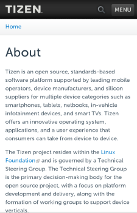
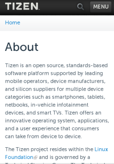
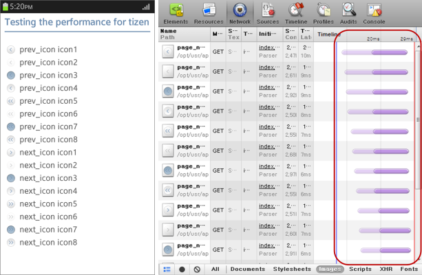
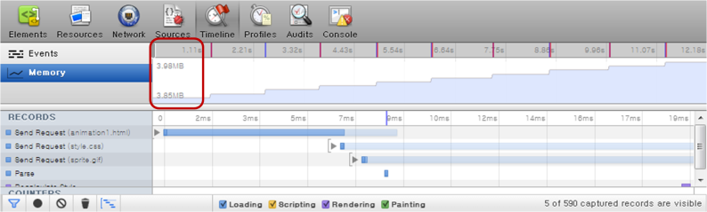
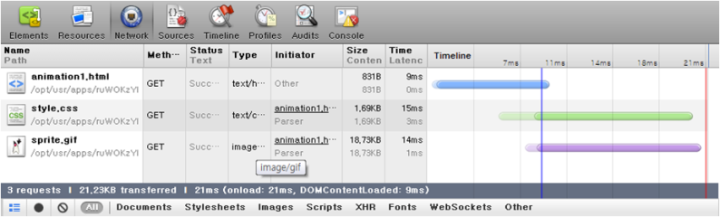
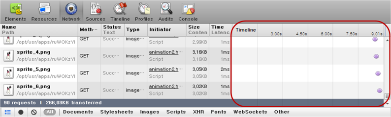

# Multiple Screen Support

Tizen is available on various devices which support different screen sizes and resolutions. When developing Tizen Web applications, you must take this into account if you want your application to function well on various device models.

This feature is supported in mobile applications only.

Before [implementing multiple screen support](#creating-applications-supporting-multiple-screens), make sure you are familiar with the [key concepts of multiple screen support](#key-concepts).

Tizen provides the [UI scalability](#ui-scalability) resolution feature, which allows you to create scalable applications.

To optimize images used in Web applications, images based on a single resource can be used in [various resolutions](#image-resolution-optimization).

## Key Concepts

Before building a Web application for multiple resolutions, make sure you are familiar with the following [W3C](http://www.w3.org/) Web content scaling standards, which must be taken into account when developing Web applications:

- Viewport meta tag
- CSS media query

### Viewport Meta Tag

A viewport defines the application area that displays the Web page content.

In a Web browser, the viewport size depends on the browser window size. If the viewport is smaller than the Web content size, horizontal and vertical scrollbars are displayed for page navigation. The Web browser viewport does not support the zoom feature. However, in a mobile Web browser, there are no window scrollbars and the viewport supports the zoom feature.

The [viewport meta tag](http://www.w3.org/TR/mwabp/#bp-viewport) enables you to customize the viewport size and zoom levels in a majority of mobile Web browsers. Using this tag, you can set the width, height, initial scale, and scale range for Web pages.

To use the viewport meta tag while developing Web applications, you must note the following:

- The `device-height` and `device-width` attributes defined in the viewport meta tag are not the same as the real device width and height in pixels.
- Using the viewport meta tag, the Web browsers of different devices display the same content with different layout size and scale factor. The scale factor is calculated using the device pixel ratio (DPR).

### CSS Media Query

The [CSS media query](http://www.w3.org/TR/css3-mediaqueries/) enables you to set conditions for particular media features and types to apply different CSS files for the application content. For Web content scaling, you can use the CSS media query to, for example:

- Define the image resource to be used based on the screen dots per inch (DPI) ratio.
- Determine the CSS layout to be used based on the screen width.

## UI Scalability

With UI scalability, you can support multiple screen resolutions in a single Tizen Web application. Tizen automatically converts and translates the size and position values that are defined in the application's logical resolution to the physical resolution at runtime. The Tizen Advanced UI (TAU) uses the [viewport meta tag](#viewport-meta-tag) to fit the Web page into the device screen, and the `rem` unit to determine the size of the Tizen Web UI components.

### Setting the Viewport

Tizen devices support a variety of screen resolutions and dots per inch (DPI) values. If the viewport meta tag is not defined, TAU uses the default viewport width and scale factor. This ensures that Web content layout varies between different screen resolutions.

In the following example, the viewport width is set to `device-width`, which is determined by the width of the Tizen device. The `device-width` value is retrieved to set similar virtual DPI values and to display UI components with similar physical sizes across all devices. (TAU uses the example value by default, if no other viewport value is defined.)

```
<meta name="viewport"
      content="width=device-width, initial-scale=1, maximum-scale=1, user-scalable=no">
```

If the viewport width is set to `device-width`, the width and scale factor values are calculated by the Web browser. The following table shows different layout sizes and scale factors of the Tizen Web site (`http://tizen.org`) on different devices with the viewport width set to `device-width`.

```
<meta name="viewport" content="width=device-width, initial-scale=1, user-scalable=no">
```

**Table: Layout size and scale factor**

| Device screen resolution | Real screen DPI | Device DPI | Web browser page                         | Viewport width | Scale factor |
| ------------------------ | --------------- | ---------- | ---------------------------------------- | -------------- | ------------ |
| 720 x 1280               | 306             | 320        |  | 360 px         | 2.0          |
| 480 x 800                | 218             | 240        |  | 320 px         | 1.5          |

### Working with Tizen Web Winsets

The default sizes of Tizen Web winsets (such as Popup, Button, and Checkbox) are designed based on the reference viewport DPI of 160. Therefore, these winsets are of similar sizes on any Tizen device if the viewport width is set to `device-width`.

If you manually set the viewport width of your application to a fixed value, the Tizen Web winsets may not fit appropriately in the application. To avoid the problem, Tizen Web winsets use the `rem` unit for the winset length, which depends on the base font size of the winset. Each Tizen Web winset theme has its own base font size, and the `<html>` element font size is also set to the base font size. If the viewport width is set to a fixed value, this base font size is recalculated and set to the `<html>` element to adjust the Tizen Web winset sizes accurately.

## Creating Applications Supporting Multiple Screens

To create an application that supports multiple screen sizes, you must consider the following while coding your application:

- Configuring the viewport
- Optimizing resources
- Creating screen resolution-independent UI

### Configuring the Viewport

To use UI scalability in your application, set the `viewport` meta tag while [creating a Web application project](../../../tutorials/process/app-dev-process.md) in the Tizen Studio. To configure the viewport in the Tizen Web applications, add the `viewport` meta tag in the `<head>` section of the `index.html` file:

```
<meta name="viewport"
      content="width=device-width, initial-scale=1.0,
               minimum-scale=1.0, maximum-scale=1.0, user-scalable=no">
```

### Optimizing Resources

By default, the Tizen Advanced UI (TAU) consists of the HD Web winsets. The winset scale is lowered for lower screen resolution devices. To optimize resources for different screen resolutions and devices, use the [CSS media query](#css-media-query) for different resolutions available in Tizen. You can use CSS media queries in the HTML or CSS files.

In the HTML file:

```
<link media="only screen and (min-resolution: 320dpi)"
      href="high-quality-images.css" type= "text/css" rel="stylesheet">
```

In the CSS file:

```
@media screen and (max-resolution: 159dpi) {
   <!--Set styles-->
}

@media screen and (min-resolution: 160dpi and max-resolution: 239dpi) {
   <!--Set styles-->
}

@media screen and (min-resolution: 240dpi and max-resolution: 319dpi) {
   <!--Set styles-->
}

@media screen and (min-resolution: 320dpi) {
   <!--Set styles-->
}
```

You can also set different layout and resources for the portrait and landscape views in the CSS file:

```
@media screen and (orientation: portrait) {
   <!--Set styles-->
}

@media screen and (orientation: landscape) {
   <!--Set styles-->
}
```

### Creating Screen Resolution-independent UI

The Tizen base font size is 22 px. This base font size value varies based on the device screen resolution. However, to create a screen resolution-independent UI, the Web browser engine renders the base font size as a logical pixel size instead of a physical pixel size.

## Image Resolution Optimization

In Web applications, optimization of applications for various platforms (regarding devices, OS, and resolution) is efficient.

[Media Queries](./media-query.md) and [Flexible Box Layout](./flexible.md) can be used to create flexible layouts, and to build the deployable package easily.

Images can be used in Web applications in the following ways:

- `IMG` element linking images directly to HTML
- CSS `background` property expressing images as a background in HTML
- [SVG (Scalable Vector Graphics)](../graphics/svg.md), [Canvas](../graphics/canvas.md), and [WebGL&trade;](http://www.khronos.org/registry/webgl/specs/latest/) APIs implementing graphics in HTML

When selecting an option from the list above, consider the type of the image resource you are going to use.

You can use the following types of image resources:

- [Photos](#photos)
- [Icons](#icons)
- [Animated images](#animated-images)

### Photos

An image can be added to an application using the HTML `img` element, or CSS `background` property as shown in the following example:

```
<!--HTML-->


<!--CSS-->
.photo {
   background: url(../images/sample.jpg) 0 0 no-repeat;
   background-size: 100%;
   width: 100%;
   height: 200px;
}
```

In terms of performance, there is no difference between the options.

The image color is expressed based on pixels. Therefore, the higher resolution an image has, the better it looks on a large screen. For full HD display, a resolution bigger than the image size displayed on the screen is needed. However, since a high resolution image tends to have a large size, limit the image size as to fit the maximum screen size:

- 1024 x 768 px: 90 KB
- 300 x 200 px: 39 KB
- 300 x 200 px: 15 KB

Current full HD displays have a resolution that is 1.5 to 2 times bigger than the actual screen size. The image quality is guaranteed if you size images as 2 times bigger than their original size.

```
img {
   max-width: 100%;
}
```

**Figure: Enlarging a low-resolution image**


### Icons

Icons generally have a fixed size. Size icon images as 2 times bigger than their original size. Using the CSS3 `background-size` property, you can add an image with the size of, for example, 40 x 40 px, compressed as 20 x 20 px.

```
.prev_icon, .next_icon {
   padding-left: 30px;
   height: 30px;
   line-height: 30px;
   font-size: 1.2em;
   background-repeat: no-repeat;
   background-position: 0 50%;
   background-size: auto 20px;
}

.prev_icon.icon1 {
   background-image: url(../images/page_navi_arrow_left_01.png);
}
```

When multiple icons are used on a page, all the image files are called separately. This slows down the loading speed and causes a large number of network roundtrips, as illustrated in the following figure.

**Figure: Network speed when calling each image separately**



You can use the sprite image technique (grouping multiple images as one and showing the only desired images defined with the `background-position` property) to noticeably reduce the page loading speed without any loss in quality of the image, as the following example shows.

```
.prev_icon, .next_icon {
   background-size: 20px auto; <!--Full HD Display-->
   background-image: url(../images/page_navi_arrow.png);
}

.prev_icon.icon1 {
   background-position: 0 0;
}

.prev_icon.icon2 {
   background-position: 0 -50px;
}
```

**Figure: Network speed when using sprite images**


### Animated Images

Animated images can be created in various formats and with many tools, such as GIF, JavaScript, Canvas, and SVG.

To create a simple and repetitive animation effect (such as the following JAVA mascot) as effectively as possible, use GIF images, JavaScript, or the CSS3 `animation` attribute.

**Figure: JAVA mascot character in GIF (source: http://lea.verou.me)**


The following sections compare the network capacity usage and timeline of the following animation types using the [Web Inspector](../../../../tizen-studio/web-tools/web-inspector.md):

- [GIF animation](#gif)
- [JavaScript animation](#js)
- [CSS3 animation](#css3)

<a name="gif"></a>
#### GIF Animation

Using GIF animation, the resource usage is as follows:

- Events: Fires only the painting event
- Memory: 3 ~ 4 MB
- Network: 10 ~ 25 ms

**Figure: Events for a GIF image**


**Figure: Memory usage of a GIF image**



**Figure: Network capacity usage of a GIF image**



GIF animation can be created in various resolutions without quality loss when you use the option introduced in [Photos](#photos). This, however, increases memory occupancy.

<a name="js"></a>
#### JavaScript Animation

JavaScript animation is less affected by enlarging or reducing its screen size. However, it uses a lot of device resources compared to using CSS3 animations:

- Events: Event is fired every 100 ms, the interval of `setInterval()`.
- Memory: Increases in proportion to time, from the initial size 90 KB.
- Network: Used until the animation is stopped.

**Figure: Events for a JavaScript animation**


**Figure: Memory usage of a JavaScript animation**


**Figure: Network capacity usage of a JavaScript animation**



The following example shows how JavaScript animation can be implemented:

```
<script>
    var obj = document.querySelector('.animated img'), flag = 0;
    function animate() {
        obj.src = './images/sprite_' + ((flag++) % 10) + '.png';
    }
    setInterval(animate, 100);
</script>
```

You can use the `requestAnimationFrame()` method of the [Timing control for script-based animations](../../../api/latest/w3c_api/w3c_api_m.html#timing) API to prevent animation freezes that occur occasionally:

```
<script>
    var obj = document.querySelector('.animated img'), flag = 0, i = 0;
    function animate() {
        if (!(i % 6)) obj.src = './images/sprite_' + ((flag++) % 10) + '.png';
            i++;
        -webkit-RequestAnimationFrame(animate);
    }
    -webkit-RequestAnimationFrame(animate);
</script>
```

<a name="css3"></a>
#### CSS3 Animation

CSS3 animation has a low usage of events, memory, and network capacity. It is efficient for animations that have a fixed size. However, since CSS3 animation is pixel-based, it is difficult to use for animations that need to be enlarged or reduced, in which case JavaScript is a better option:

- Events: Fires only rendering and painting events
- Memory: 50 ~ 90 KB
- Network: 9 ~ 21 ms

**Figure: Events for a CSS3 animation**


**Figure: Memory usage of a CSS3 animation**


**Figure: Network capacity usage of a CSS3 animation**


The following example shows how CSS3 animation can be implemented:

```
<style>
   .css_animation {
      width: 50px;
      height: 70px;
      background-image: url(../images/sprite.png);
      -webkit-animation: cssAni .8s steps(10) infinite;
   }

   @-webkit-keyframes cssAni {
      from {background-position: 0px;}
      to {background-position: -500px;}
   }
</style>
```

## Related Information
* Dependencies
  - Tizen 2.4 and Higher for Mobile
