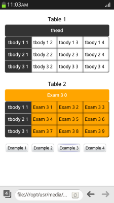

# Selectors API (Level 1 and 2)

The selectors allow you to select element nodes in the DOM tree by matching them against a group of selectors, and testing whether the element matches a particular selector. Using selectors makes searching and selecting complex elements faster.

You can use the `querySelector()` and `querySelectorAll()` methods to retrieve the element nodes. Both methods accept a single parameter, a string selector. The string selector is a selector or a group of selectors that can be surrounded by whitespace. If you use a selector group as the string selector with the `querySelector()` method, the method returns the first element (if any) that matches any of the selectors in the group.

The main features of the Selectors API Level 1 and Level 2 include:

- Selecting a single element

  Use CSS selectors to [select a single element](#selecting-a-single-node).

- Selecting multiple elements simultaneously

  [Select multiple elements](#selecting-multiple-nodes) using the `querySelectorAll()` method.

You can also [create an accordion menu](#creating-an-accordion-menu).

## Selecting a Single Node

To use selectors for handling page elements and selecting a single node:

1. To select the first matching element found in the child nodes, use the `querySelector()` method with CSS selectors. You get the same result as when using the `getElementById()`, `getElementsByTagName()`, and `getElementsByClassName()` methods.

   ```
   /* First <td> element in the document */
   var obj1 = document.getElementsByTagName('td')[0];
   /* Element with the ID #foo */
   var obj2 = document.getElementById('foo');
   /* First element in the bar class */
   var obj3 = document.getElementsByClassName('bar')[0];

   var obj4 = document.querySelector('td'); /* Same as obj1 */
   var obj5 = document.querySelector('#foo'); /* Same as obj2 */
   var obj6 = document.querySelector('.bar'); /* Same as obj3 */
   ```

   The `querySelector()` method returns the first matching element node within the subtrees of the context node. If no matching element is found, the method returns `null`.

2. You can use the CSS selectors to ensure that elements with complex structures can be easily selected.  

   For example, the following example selects the last element among the child nodes of the second `<tr>` element, which is a child of the `<tbody>` element in the second `<table>` element of the document.

   ```
   var obj = document.querySelector('table:nth-child(2) tbody > tr:nth-child(2) :last-child');
   ```

3. You can use method chaining to select an element:

   ```
   var obj = document.querySelector('table:nth-child(2)');
   var targetObj = obj.querySelector('tbody > tr:nth-child(2) :last-child');
   ```

   **Figure: Single node selection (in mobile applications only)**

   

### Source Code

For the complete source code related to this use case, see the following file:

- [accordion.html](http://download.tizen.org/misc/examples/w3c_html5/dom_forms_and_styles/selectors_api)

## Selecting Multiple Nodes

To use selectors for handling page elements and selecting multiple nodes in a node list:

1. Select an element in the node list using the `querySelector()` method:

   ```
   var obj = document.querySelector('table:nth-child(2)');
   ```

   The `querySelector()` method returns the first matching element node within the subtrees of the context node. If no matching element is found, the method returns `null`. The query above selects the second `<table>` element in the document as a single element.

2. Select multiple elements in the node list using the `querySelectorAll()` method, and define a variable to represent the length of the `targetObj` node list:

   ```
   var targetObj = obj.querySelectorAll('thead th, tbody td');
   var i = targetObj.length;
   ```

   The `querySelectorAll()` method returns an array containing all matching element nodes within the subtrees of the context node, in the document order, and saves the elements in a node list. If there are no matching nodes, the method returns an empty array. The query above selects the `<th>` elements in the table head and the `<td>` elements in the table body.

3. Apply a defined style to all elements stored in the `targetObj` node list:

   ```
   while (0 < i) {
       i--;
       targetObj[i].style.backgroundColor = 'orange';
       targetObj[i].textContent = 'Exam 3' + i;
   }
   ```

   **Figure: Multiple node selection (in mobile applications only)**

   

### Source Code

For the complete source code related to this use case, see the following file:

- [accordion.html](http://download.tizen.org/misc/examples/w3c_html5/dom_forms_and_styles/selectors_api)

## Creating an Accordion Menu

You can retrieve element nodes from the DOM tree and create a simple accordion menu.

The accordion menu is created using the CSS3 Basic User Interface Module Level 3 API (in [mobile](../../../api/latest/w3c_api/w3c_api_m.html#basicui), [wearable](../../../api/latest/w3c_api/w3c_api_w.html#basicui), and [TV](../../../api/latest/w3c_api/w3c_api_tv.html#basicui) applications). When a title is touched, the relevant content is shown, and other content is hidden.

1. Create the HTML layout:

   ```
   <ul class="accordion">
      <li>
         <p class="title current">Title 1<p>
         <div>contents 1</div>
      </li>
      <li>
         <p class="title">Title 2</p>
         <div>contents 2</div>
      </li>
      <!--Other list elements-->
   </ul>
   ```

2. Use [CSS transitions](./transition.md) to add sliding effects when content appears:

   ```
   .accordion  > li  > div {
      padding: 0 15px;

      <!--Assign time for CSS transformation-->
      -webkit-transition: all .5s;
      opacity: 0;
      height: 0;
      box-shadow: inset 1px 1px 4px rgba(0, 0, 0, .5);
      line-height: 2;
   }
   <!--Assign styles to be applied when the current class is added to p.title-->
   .accordion  > li  > p.current {
      background: -webkit-linear-gradient(top, #666, #000);
      color: #fff;
   }
   .accordion > li > p.current + div {
      opacity: 1;
      height: 200px;
   }
   ```

3. Use the `querySelector()` and `querySelectorAll()` methods to change the class of the subject in the elements where the event is fired:

   ```
   var testAccordion = function(obj) {
       var targetObj = document.querySelector(obj);
       var targetLength = document.querySelectorAll(obj + 'li').length;

       /* If the elements are not selected */
       if (targetLength <= 0)
           return false;

       targetObj.onclick = function(e) {
           var that = e.target;

           /* If the e.target class is not title */
           if ((that.className !== 'title'))
               return false;

           for (var i = 0; i < targetLength; i++) {
               /*
                  Change all classes of the 'li p' elements
                  at the bottom of .accordion to title
               */
               targetObj.querySelectorAll('li p')[i].className = 'title';
           }
           /* Define the e.target class as current */
           that.className += 'current';
       };
   };
   ```

4. Define the elements that use the accordion menu:

   ```
   testAccordion('.accordion');
   ```

   **Figure: Accordion menu (in mobile applications only)**

   

### Source Code

For the complete source code related to this use case, see the following file:

- [selector_sample.html](http://download.tizen.org/misc/examples/w3c_html5/dom_forms_and_styles/selectors_api)

## Related Information
* Dependencies
  - Tizen 2.4 and Higher for Mobile
  - Tizen 2.3.1 and Higher for Wearable
  - Tizen 3.0 and Higher for TV
