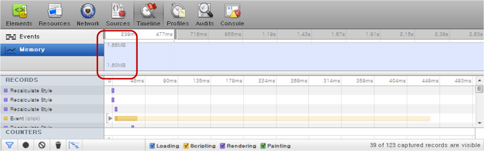
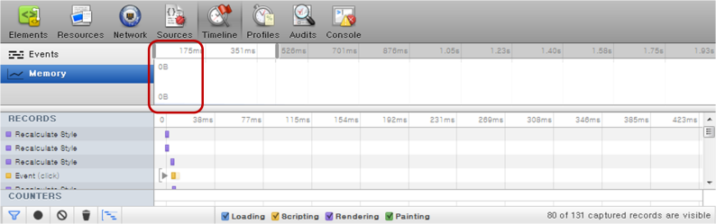

# CSS Transforms

Transforms allow you to modify the coordinate space where each element is positioned. The elements can be translated, rotated, and scaled in 2- or 3-dimensional space. According to the API, the coordinate system is a visual formatting model, and positions and sizes in the coordinate space are expressed in pixels, starting in the origin of point with positive values proceeding to the right and down.

The main features of the CSS Transforms API include:

- Defining transform properties

  You can [define various properties](#defining-transform-properties) to control the elements within the coordinate space.

- Using transform methods for 2D and 3D

  You can [use various transform methods](#using-2d-and-3d-transform-methods) in both 2D and 3D.

- Creating transform animations

  You can [use transforms with animations](#creating-an-animation-with-transforms).

- Creating fade animations

  You can [use fade animation effects](#creating-fade-animation-effects) in your application to improve the user experience.

- Using hardware acceleration

  To enhance the rendering performance, you can [enable hardware acceleration](#using-hardware-acceleration).

## Defining Transform Properties

You can define various properties to control the elements within the coordinate space:

- `transform-origin`  
  This property changes the location of the transformed element. It can only be used with elements for whom the `transform` property has been declared.

- `transform-style`  
  This property defines the rendering of the inherited element in the 3D space. Animation property has been added in the example for easier comprehension.

- `perspective`  
  This property changes the perspective of the element being expressed. A 3D transform element must be used together with this property to emphasize the expression of the X axis.

- `perspective-origin`  
  This property defines the location facing the element.

- `backface-visibility`  
  This property defines whether the backside of the transformed element is expressed.

```
<head>
   <style type="text/css">
      .box {
         transform: rotate(30deg);
         transform-origin: 30% 30%;
         perspective: 220;
         animation: trans-ani 10s infinite linear;
         backface-visibility: visible;

         /* Google Chrome and Safari browsers */
         -webkit-transform: rotate(30deg);
         -webkit-transform-origin: 30% 30%;
         -webkit-perspective: 220;
         -webkit-animation: trans-ani 10s infinite linear;
         -webkit-backface-visibility: visible;
      }
      .box.case01 {
         transform-style: preserve-3d;
         perspective-origin: 30% 30%;

         /* Google Chrome and Safari browsers */
         -webkit-transform-style: preserve-3d;
         -webkit-perspective-origin: 30% 30%;
      }
   </style>
</head>
<body>
   <h1>transform-origin</h1>
   <div class="boxarea">
      <div class="box">
         <p>transform</p>
         <p>transform-origin: 30% 30%;</p>
      </div>
      <div class="box case01">
         <p>box</p>
      </div>
   </div>
</body>
```

In addition to transform properties, you can also use various [2D and 3D transform methods](#using-2d-and-3d-transform-methods).

## Using 2D and 3D Transform Methods

The CSS Transforms API supports various transform methods in 2D and 3D.

In 2D transforms, all transform methods are expressed based on a matrix. The X and Y values of the `translate()`, `scale()`, and `skew()` methods can be expressed in individual methods. For example, the X and Y values of the `translate()` method can be expressed with the `translateX(number)` and `translateY(number)` methods.

```
<head>
   <style type="text/css">
      .box-translate {
         transform: translate(30px, 30px);
         -webkit-transform: translate(30px, 30px);
      }

      .box-scale {
         transform: scale(1.2, 1.2);
         -webkit-transform: scale(1.2, 1.2);
      }

      .box-rotate {
         transform: rotate(45deg);
         -webkit-transform: rotate(45deg);
      }

      .box-skew {
         transform: skew(20deg, 20deg);
         -webkit-transform: skew(20deg, 20deg);
      }

      .box-matrix {
         transform: matrix(0.8, 0.5, 0.9, 0.9, 0, 0);
         -webkit-transform: matrix(0.8, 0.5, 0.9, 0.9, 0, 0);
      }
   </style>
</head>
<body>
   <h1>2d transform</h1>
   <h2>translate</h2>
   <div class="boxarea">
      <div class="box no-transform">
         <p>Original</p>
      </div>
      <div class="box transformed box-translate">
         <p>transform</p>
         <p>transform: translate(30px, 30px);</p>
      </div>
   </div>
</body>
```

In 3D transforms, the Z axis has been added (for example, `translateZ(number)` and `scale3dZ(number)`). When handling 3D transforms, pay attention to the following:

- If a transform method is used together with the `perspective` property, the Z axis is emphasized.

- The X, Y, and Z values of the `translate3d()`, `scale3d()`, and `rotate3d()` methods can be expressed in individual methods.

- In the `rotate3d(number, number, number, angle)` method, the element rotates according to the assigned parameter (angle) with the X, Y, and Z directional vectors as the center. Each vector can be expressed as an individual method: for example, the `rotateX(<angle>)` and `rotate3d(1, 0, 0, <angle>)` methods perform the same task.

The following code snippet demonstrates how to implement a 3D transform. For a complete source code, see [3d_transform.html](http://download.tizen.org/misc/examples/w3c_html5/dom_forms_and_styles/css_3d_transforms_module_level_3).

```
<head>
   <style type="text/css">
      .first-transform {opacity: .5; background: #3399cc;}
      .transformed {opacity: .8;}
      /* translate3d */
      .box-translate3d: hover .first-transform {
         transform: translate3d(-5px, -5px, -60px) rotateY(70deg);
         -webkit-transform: translate3d(-5px, -5px, -60px) rotateY(70deg);
      }
      .box-translate3d: hover .transformed {
         transform: translate3d(15px, 15px, 60px) rotateY(70deg);
         -webkit-transform: translate3d(15px, 15px, 60px) rotateY(70deg);
      }
      /* scale3d */
      .box-scale3d: hover .first-transform {
         transform: scale3d(1, 1, 1) rotateY(70deg);
         -webkit-transform: scale3d(1, 1, 1) rotateY(70deg);
      }
      .box-scale3d: hover .transformed {
         transform: scale3d(0.6, 0.6, 2) rotateY(70deg);
         -webkit-transform: scale3d(0.6, 0.6, 2) rotateY(70deg);
      }
      /* rotate3d */
      .box-rotate3d: hover .first-transform {
         transform: rotate3d(-1, -1, -1, 110deg);
         -webkit-transform: rotate3d(-1, -1, -1, 110deg);
      }
      .box-rotate3d: hover .transformed {
         transform: rotate3d(1, 1, 1, 110deg);
         -webkit-transform: rotate3d(1, 1, 1, 110deg);
      }
      /* matrix3d */
      .box-matrix3d: hover .first-transform {
         transform: matrix3d(0.3, 0.2, -0.9, 0, 0.2, 0.8, 0.2, 0, 0.6, 0, 0.4, 0, 0, 0, 0, 1);
         -webkit-transform: matrix3d(0.3, 0.2, -0.9, 0, 0.2, 0.8, 0.2, 0, 0.6, 0, 0.4, 0, 0, 0, 0, 1);
      }
      .box-matrix3d: hover .transformed {
         transform: matrix3d(0.4, -0.5, 0.8, 0, 0.2, 0.8, 0.2, 0, -0.6, 0, 0.4, 0, 0, 0, 0, 1);
         -webkit-transform: matrix3d(0.4, -0.5, 0.8, 0, 0.2, 0.8, 0.2, 0, -0.6, 0, 0.4, 0, 0, 0, 0, 1);
      }
   </style>
</head>
<body>
   <h1>3D transform</h1>
   <h2></h2>
   <p><strong>First box value:</strong> transform: translate3d(-5px, -5px, -60px) rotateY(70deg);</p>
   <p><strong>Second box value:</strong> transform: translate3d(15px, 15px, 60px) rotateY(70deg);</p>
   <div class="boxarea box-translate3d">
      <div class="box first-transform">
         First box
      </div>
      <div class="box transformed">
         <p>Second Box</p>
         Mouse over or tab here to animate
      </div>
   </div>
</body>
```

## Creating an Animation with Transforms

You can create an animation with transforms. The following example uses the animation from the [Creating a Logo Animation](./animation.md#creating-a-logo-animation) use case as a basis, and adds a more diverse visual effect to it with the `transform` property. In the modified animation:

- As in the original animation, no elements are initially shown on the screen.

- The Tizen logo gradually appears in the middle of the screen, and as it moves to the right, it becomes smaller. With the `transform` property, the logo is made to rotate.

- Each letter in the word "TIZEN" consecutively comes in from the left of the screen and moves to the right to its correct location. With the `transform` property, the letters are translated in the 3D space and rotated around the Y axis.

**Figure: Tizen logo to be transformed**


1. Create the HTML layout to control the movement of each individual animation element:

   ```
   <div class="animation-holder">
      <span class="tizen-txt t"></span>
      <span class="tizen-txt i"></span>
      <span class="tizen-txt z"></span>
      <span class="tizen-txt e"></span>
      <span class="tizen-txt n"></span>
      <span class="tizen-txt tm"></span>
      <span class="tizen-logo"></span>
   </div>
   ```

2. Define the basic style of the animation elements. Add the `perspective` property to increase the Z axis effect of the 3D transform.

   ```
   .animation-holder {
      -webkit-perspective: 1000px;
      height: 88px;
      left: 50%;
      margin: -54px 0px 0px -140px;
      position: absolute;
      top: 50%;
      width: 280px;
   }
   .tizen-txt,
   .tizen-logo {
      background-position: 50% 50%;
      background-repeat: no-repeat;
      display: block;
      position: absolute;
   }
   .tizen-txt.t {
      background-image: url("images/txt_t.png");
      height: 56px;
      left: 0px;
      top: 31px;
      width: 48px;
   }
    ```

3. Create the animation:

   1. Assign keyframes for the logo element to transform it. In order to rotate the logo, use the `-webkit-transform: rotate()` method, which defines the angle of the rotation.

      ```
      @-webkit-keyframes tizen-logo {
         0% {
            -webkit-animation-timing-function: ease-in;
            height: 211px;
            left: 30px;
            opacity: 0;
            top: -61px;
            -webkit-transform: rotate(0deg);
            width: 220px;
         }
         30% {
            -webkit-animation-timing-function: ease-out;
            height: 211px;
            left: 30px;
            opacity: 1;
            top: -61px;
            -webkit-transform: rotate(720deg);
            width: 220px;
         }
         50% {
            height: 32px;
            left: 247px;
            opacity: 1;
            top: 0;
            -webkit-transform: rotate(1440deg);
            width: 33px;
         }
         100% {
            height: 32px;
            left: 247px;
            opacity: 1;
            top: 0;
            -webkit-transform: rotate(1440deg);
            width: 33px;
         }
      }
      ```

      > **Note**  
      > For a rotation, the image has to be carefully created to ensure the correct end result. The rotation occurs with the center of the element as the center. If the rotation center must be moved because the image center is not aligned, use the `transform-origin` property to adjust the rotation location.

   2. Create the keyframes for the first letter in the word "TIZEN". In the animation, due to the `translate3d()` and `rotateY()` methods, each letter transforms slightly from the right to the left as it comes in.
   
      

      ```
      @-webkit-keyframes tizen-txt-t {
         0% {
            opacity: 0;
            -webkit-transform: translate3d(20px, 0, -200px) rotateY(90deg);
         }
         30% {
            opacity: 0;
            -webkit-transform: translate3d(20px, 0, -200px) rotateY(90deg);
         }
         35% {
            opacity: 1;
            -webkit-transform: translate3d(0, 0, 0) rotateY(0deg);
         }
         100% {}
      }
      ```

   3. To emphasize the fact that the letters are being created on the right, change the location of the transform. If the `transform-origin` property is declared for the entire animation element, the logo rotation changes. Consequently, you must only declared it for the letters.

      ```
      .tizen-txt {
         -webkit-transform-origin: 100% 50%;
      }
      ```

   4. Create the keyframes for the other letters similarly:

      ```
      @-webkit-keyframes tizen-txt-i {
         0% {
            opacity: 0;
            -webkit-transform: translate3d(20px, 0, -200px) rotateY(90deg);
         }
         32% {
            opacity: 0;
            -webkit-transform: translate3d(20px, 0, -200px) rotateY(90deg);
         }
         37% {
            opacity: 1;
            -webkit-transform: translateX(0) rotateY(0deg);
         }
         100% {}
      }
      ```

The following figure shows the full Tizen logo animation with the `transform` properties.

**Figure: Full Tizen logo animation**


### Source Code

For the complete source code related to this use case, see the following files:

- [transform_practical.html](http://download.tizen.org/misc/examples/w3c_html5/dom_forms_and_styles/css_3d_transforms_module_level_3)
- [logo_tizen.png](http://download.tizen.org/misc/examples/w3c_html5/dom_forms_and_styles/css_3d_transforms_module_level_3/images/)
- [txt_e.png](http://download.tizen.org/misc/examples/w3c_html5/dom_forms_and_styles/css_3d_transforms_module_level_3/images/)
- [txt_i.png](http://download.tizen.org/misc/examples/w3c_html5/dom_forms_and_styles/css_3d_transforms_module_level_3/images/)
- [txt_n.png](http://download.tizen.org/misc/examples/w3c_html5/dom_forms_and_styles/css_3d_transforms_module_level_3/images/)
- [txt_t.png](http://download.tizen.org/misc/examples/w3c_html5/dom_forms_and_styles/css_3d_transforms_module_level_3/images/)
- [txt_tm.png](http://download.tizen.org/misc/examples/w3c_html5/dom_forms_and_styles/css_3d_transforms_module_level_3/images/)
- [txt_z.png](http://download.tizen.org/misc/examples/w3c_html5/dom_forms_and_styles/css_3d_transforms_module_level_3/images/)

## Creating Fade Animation Effects

You can create fade animation effects using a modal layer pop-up. The modal layer pop-up can be used to, for example, show enlarged thumbnail images or notice messages. The modal layer pop-up has the following basic properties:

- If an event is fired, it gradually becomes visible. This is known as the Fade In effect.

- The existing background is covered with a translucent layer to make the user focus on the pop-up.

- When the pop-up is closed, it gradually becomes transparent. This is known as the Fade Out effect.

**Figure: Fade effect**


You can control UI events and change the DOM elements in the following ways:

- Events can be controlled with JavaScript, and DOM elements can be devised with CSS.

- You can use JavaScript frameworks, such as jQuery, Prototype, and Dojo.

To create fade effects:

- Create a modal layer pop-up using jQuery:

  ```
  (function($) {
      function showModalPopup(url) {
          $('body').append('<div class='mask'></div>'); /* Mask in body appended */
          $('.mask').css({'height': $(window).height()}); /* Mask area set */

          /* Target layer position set */
          $(url).css({
              'top': ($(window).height()/2 + $(document).scrollTop() - $(url).height()/2) + 'px',
              'left': ($(window).width()/2 + $(document).scrollLeft() - $(url).width()/2) + 'px'
          });

          /* Fade effect */
          $('.mask').fadeTo('slow', 0.7);
          $(url).fadeTo('slow', 1);
      }

      $('.layerpopupActive a').on('click', function() {
          var targetUrl = $(this).attr('href');

          showModalPopup(targetUrl);

          return false;
      });

      /* End processing - Fade Out effect */

      $('body').on('click', function(e) {
          if (e.target.className === 'mask') {
              $('.layerpop').fadeOut();
              $('.mask').fadeOut(400, function() {
                  $('.mask').remove();
              });
          }
      });
  })(jQuery);
  ```

  If the animation effect is created by using JavaScript, the browser executes the following tasks:

  1. A structure layer is created and added to the document. This is a CPU task.
  2. The added layer is painted as a default value. This is a GPU task.
  3. The layer is painted once again according to the change of value. This is a CPU task.

  Steps 1 and 3 incur CPU tasks, which affect performance the most.

  In step 1, only 2 layers are created, but as the number of layers created increases, the efficiency of page rendering drops. In step 3 as well, the more steps it undergoes, the slower the rendering becomes.

  In certain browsers, even if the style of only 1 layer is changed, the entire document is repainted. As the repainting takes only a moment, any animation effects that are supposed to happen cannot be executed in such a short time. This issue occurs frequently in Android&trade; with severe fragmentation.

	> **Note**  
	> If a new layer is created in Android 4.0X version, and if the fade effect is used, it only shows the initial value and the result value of the layer style.

  To avoid such a situation to the maximum possible extent, CPU tasks must be reduced to the minimum, and it is better to use transition or animation that uses the internal timer of the browser.

	> **Note**  
	> When using 3D effects, `-webkit-transform: translateZ(0);` can be used to accelerate the hardware. However, since hardware acceleration support varies among operating systems and devices, the resulting effects can vary too. Moreover, on Android 2.1 or iOS 3.X and below, transitions and animations may not be realized.

- Create a modal layer pop-up using CSS3:

  ```
  <!--CSS-->
  .mask {
     opacity: 0;
     z-index: -1;
     -webkit-transition: all 400ms ease-in-out;
  }

  .mask.active {
     opacity: .7;
     z-index: 498;
  }

  <!--Layer pop-up public styles-->
  .layerpop {
     opacity: 0;
     z-index: -1;
     -webkit-transition: all 300ms ease-in-out;
  }

  .layerpop.active {
     opacity: 1;
     z-index: 499;
  }
  ```

  ```
  /* JavaScript */
  function showModalPopup(url) {
      url.className += 'active';
  }
  ```

### Performance Differences

There can be a difference in performance depending on how the modal layer pop-up is used.

The following figures illustrate the difference in event performance, when using JavaScript and CSS3.

**Figure: Event performance using JavaScript**


**Figure: Event performance using CSS3**


The following figures illustrate the difference in memory performance, when using JavaScript and CSS3.

**Figure: Memory performance using JavaScript**



**Figure: Memory performance using CSS3**



When the styles are applied using JavaScript, the UI thread is used to create the pop-up. The UI thread increases the usage of CPU memory in proportion to the number of pop-ups used.

> **Note**  
> Tizen provides remote debugging through the [JavaScript Debugger tool](../../../../tizen-studio/web-tools/web-inspector.md).  


> **Note**  
> If CSS is used, the handling of JavaScript events and UI DOM operations becomes unnecessary, so the load of the UI thread decreases, and the usage of CPU memory decreases as well. However, CSS3 transitions cannot be applied to versions below Android 2.3 and for versions above iOS 4.3, which are still widely used, so attention is needed when distributing it to various devices.

## Using Hardware Acceleration

The rendering performance of a Web application depends on both the Tizen platform and application design.

With hardware acceleration, the GPU is used to perform a method faster than is possible if the application is running on the CPU. It enhances the rendering performance in the dynamic objects used in Web applications.

### Using CSS Transition and 3D Transform

To improve the rendering performance, separate moving elements to independent layers as much as possible. You can use CSS transition with the `-webkit-transition` CSS attribute, or 3D transform with the `-webkit-transform` attribute. For the best performance, set the `-webkit-transform` attribute to the 3D type.

In the following examples, a blue box moves from the top left diagonally downward for 1 second.

**Figure: Blue box**


- Use CPU painting:

  JavaScript performs CPU painting for a moving element for each frame at 16 ms interval using the `setTimeout()` method over the changing top-left coordinate. This approach does not use hardware acceleration, only the CPU.

  1. Construct the blue box and set its position on the screen:

     ```
     <!DOCTYPE html>
     <html xmlns="http://www.w3.org/1999/xhtml">
        <head>
           <meta http-equiv="Content-Type" content="text/html; charset=utf-8">
           <title>JavaScript transition sample</title>
           <style>
              #box {
                 position: absolute;
                 width: 100px;
                 height: 100px;
                 background-color: blue;
                 left: 0px;
                 top: 50px;
              }
           </style>
     ```

  2. Perform CPU painting for a moving element at a rate of 1 frame per 16 ms (62.5 frames per second) using the `setTimeout()` method:

     ```
           <script>
               var delta = 0;
               function startTransition() {
                   process();
               }
               function process() {
                   document.getElementById('box').style.left = delta + 'px';
                   document.getElementById('box').style.top = delta + 50 + 'px';
                   delta += 4;
                   if (delta <= 200)
                       setTimeout(function() {process();}, 16);
               }
           </script>
        </head>
        <body>
           <div id='box' onclick='startTransition()'>click me!</div>
        </body>
     </html>
     ```

- Use CSS transition:

  Separate a moving element to an independent layer with the `-webkit-transition` CSS attribute. This approach uses hardware acceleration, and can enhance performance while an element is moving.

  ```
  <!DOCTYPE html>
  <html xmlns="http://www.w3.org/1999/xhtml">
     <head>
        <meta http-equiv="Content-Type" content="text/html; charset=utf-8">
        <title>-webkit-transition sample</title>
        <style>
           #box {
              position: absolute;
              width: 100px;
              height: 100px;
              left: 0px;
              top: 50px;
              background-color: blue;
              -webkit-transition-duration: 1s;
              -webkit-transition-timing-function: linear;
           }
        </style>
        <script>
            function startTransition() {
                document.getElementById('box').style.webkitTransform = 'translate(200px, 200px)';
            }
        </script>
     </head>
     <body>
        <div id='box' onclick='startTransition()'>click me!</div>
     </body>
  </html>
  ```

- Use 3D transform:		

  Use the `-webkit-transform: translate3d` 3D transform attribute. The element is separated to an independent layer and uses hardware acceleration irrespective of its movement:

  ```
  <!DOCTYPE html>
  <html xmlns="http://www.w3.org/1999/xhtml">
     <head>
        <meta http-equiv="Content-Type" content="text/html; charset=utf-8">
        <title>-webkit-transition with translate3d sample</title>
        <style>
           #box {
              position: absolute;
              width: 100px;
              height: 100px;
              left: 0px;
              top: 50px;
              background-color: blue;
              -webkit-transform: translate3d(0, 0, 0);
              -webkit-transition-duration: 1s;
              -webkit-transition-timing-function: linear;
           }
        </style>
        <script>
            function startTransition() {
                document.getElementById('box').style.webkitTransform = 'translate3d(200px, 200px, 0px)';
            }
        </script>
     </head>
     <body>
        <div id='box' onclick='startTransition()'>click me!<p></div>
     </body>
  </html>
  ```

### Using Accelerated Overflow Scroll

If a page has an overflow scroll, use the `-webkit-overflow-scrolling` attribute. It separates overflow scroll to an independent layer and enhances rendering performance:

```
#scroll_area {
   overflow: scroll;
   -webkit-overflow-scrolling: touch;
}
```

## Related Information
* Dependencies
  - Tizen 2.4 and Higher for Mobile
  - Tizen 2.3.1 and Higher for Wearable
  - Tizen 3.0 and Higher for TV
