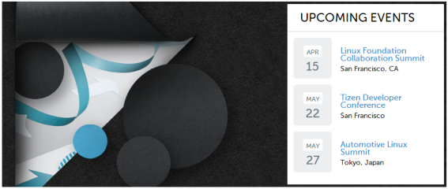

# CSS Transitions Module (Level 3)

Transitions allow you to enable implicit transitions, which describe how the CSS properties can be made to change smoothly from one value to another over a given duration.

The main features of the CSS Transitions Module Level 3 API include:

- Defining transition properties

  You can [define various properties](#defining-transition-properties) to control element transitions.

- Modifying element properties

  You can  use transitions to [change element property values](#modifying-element-properties).

- Using hardware acceleration

  You can improve the rendering performance of the application by [enabling hardware acceleration](#using-hardware-acceleration).

## Defining Transition Properties

You can define various properties to control the element transitions:

- `transition-property`  
This property defines the element property that is changed during the transition. In the following code snippet, both the width and height of the element change when the mouse hovers over it, but the transition effect is applied to the width property only.

- `transition-duration`  
This property defines the duration of the transition. You must define as many instances of the property as you have elements in the `transition-property` property.

- `transition-timing-function`  
This property defines the pace of the transition. The value of the property is defined as a stepping function or a cubic Bézier curve. The `ease` stepping function equals `cubic-bezier(0.25, 0.1, 0.25, 1)`, and the `linear` stepping function equals `cubic-bezier(0, 0, 1, 1)`.

- `transition-delay`  
This property defines the delay time before the start of the transition.

The following code snippet demonstrates how to use transition properties. For a complete source code, see [transition_property.html](http://download.tizen.org/misc/examples/w3c_html5/dom_forms_and_styles/css_transitions_module_level_3).

```
<head>
   <style type="text/css">
      body{font-size: 12px}

      .box {
         -webkit-transition-property: width;
         -webkit-transition-duration: 2s;
         -webkit-transition-timing-function: ease;
         -webkit-transition-delay: 0.5s;
      }

      .box: hover {
         width: 300px;
         height: 200px;
         background: CornflowerBlue;
      }
   </style>
</head>
<body>
   <h1>CSS transitions tutorial</h1>
   <div class="box">
      <p>Mouse over or tap here to animate</p>
      <p>transition-property: width, height, background</p>
   </div>
</body>
```

> **Note**  
> The `hover` pseudo class in Tizen maintains a `mouseover` state when an element is tapped, and becomes a `mouseout` state when another element is tapped.

The `transition` property allows you to define all the transition properties in a shorthand mode in the order of `transition-property` | `transition-duration` | `transition-timing-function` | `transition-delay`. If you omit a property value, a default value is used instead.

```
<style type="text/css">
   .box {
      -webkit-transition: width 1s ease 1s;
   }
</style>
```

The `transition` property connects movement more naturally than the more generally used pseudo classes, such as `:hover` or `:active`. The smooth effect can be achieved more conveniently and easily with the `transition` property than with JavaScript or Flash, and the `transition` property also supports the browser side to provide excellent performance.

## Modifying Element Properties

You can use transitions to change element property values naturally. The following example uses a partial section of the `http://tizen.org` Web site, where the current "UPCOMING EVENTS" area only has the `text-decoration: underline` property in a `mouseover` state (the text gets underlined when the mouse hovers over it). To improve the effects, the example adds various `transitions` properties in this area.

**Figure: Tizen site section to be transitioned**



1. Add a background color change to the "UPCOMING EVENTS" area during a `mouseover` state:

   1. Originally, the area on the site is defined as follows:

      ```
      <h2 class="block-title">Upcoming Events</h2>
      ```

      Additionally, a `transition` property is declared in the `block-title` class:

      ```
      .block-title {
         -webkit-transition: all 2s ease;
      }
      ```

      The `all` value in the transition property means that the transition effect applies to all CSS properties of the element.

   2. Define the `mouseover` state for the `block-title` class:

      ```
      .block-title: hover {background: #eaeaea;}
      ```

      Due to the CSS characteristics, adding a class through an event allows immediate rendering in the screen.

   When the mouse is moved over the "UPCOMING EVENTS" area, the background color changes.

   

2. Apply the transition effect in other elements:

   1. To avoid unnecessary repetition, tie a list of `transition` elements together into groups `a` and `span`:

      ```
      .location, .date, .location .anibg, h3 > a, .day > span {
         -webkit-transition: all 1s ease;
      }
      ```

   2. When the mouse hovers over the date element, change the background of the date and the font size of all the elements tied into the `span` group. When the mouse hovers over the title element, change the color of all elements tied into the `a` group.

      ```
      .date: hover {background: #d2ecff !important;}
      .date: hover .day > span {font-size: 1.9em;}

      .event-info: hover h3 > a {color: #ec4986;}
      ```

   

3. Emphasize the location phrase by adding an empty element. The emphasis is made by filling the background with black from left to right, and changing the font color to an appropriate value for the black background.

   1. Add the empty element:

      ```
      <div class="location">San Francisco, CA<span class="anibg"></span></div>
      ```

   2. Create the effect using the width value of the added element:

      ```
      .location {position: relative; z-index: 3; margin-top: 3px;}
      .location .anibg {
         position: absolute;
         left: -3px; top: 0;
         display: block;
         width: 0; height: 100%;
         background: #000;
         z-index: -1;
      }
      ```

      The effect is defined by using the `position` property. The location element position is declared `relative`, while the `anibg` child element position is declared as `absolute`. The width of the child element basic state is set as 0. Since the child element layer covers the location text, the child element has been defined to come out from the back of the text in the `z-index` value of the child.

   3. Define the state to be changed:

      ```
      .location, .date, .location .anibg, h3 > a, .day > span {
         -webkit-transition: all 1s ease;
      }

      .event-info: hover .location {color: #fff;}
      .event-info: hover .location .anibg {width: 100%; color: #fff;}
      ```

      The transition takes place when the property in question is at the front on the screen. The `event-info` class is used as the subject for the change, and it has been defined so that  the transition occurs simultaneously in the `.location` and `.anibg` elements when the mouse hovers over any of the elements tied together as group `a`.

   

### Source Code

For the complete source code related to this use case, see the following file:

- [transition_practical.html](http://download.tizen.org/misc/examples/w3c_html5/dom_forms_and_styles/css_transitions_module_level_3)

## Using Hardware Acceleration

The rendering performance of a Web application depends on both the Tizen platform and application design.

In hardware acceleration, GPU is used to perform a function faster than is possible if the application is running on the CPU. It enhances the rendering performance in the dynamic objects used in Web applications.

### Using CSS Transition and 3D Transform

To improve the rendering performance, separate moving elements to independent layers as much as possible. You can use CSS transition with the `-webkit-transition` CSS attribute, or 3D transform with the `-webkit-transform` attribute. For the best performance, set the `-webkit-transform` attribute to the 3D type.

In the following examples, a blue box moves from the top left diagonally downward for 1 second.

**Figure: Blue box**


- Use CPU painting:

  JavaScript performs CPU painting for a moving element for each frame at 16 ms interval using the `setTimeout()` method over the changing top-left coordinate. This approach does not use hardware acceleration, only the CPU.

  1. Construct the blue box and set its position on the screen:

     ```
     <!DOCTYPE html>
     <html xmlns="http://www.w3.org/1999/xhtml">
        <head>
           <meta http-equiv="Content-Type" content="text/html; charset=utf-8">
           <title>JavaScript transition sample</title>
           <style>
              #box {
                 position: absolute;
                 width: 100px;
                 height: 100px;
                 background-color: blue;
                 left: 0px;
                 top: 50px;
              }
           </style>
     ```

  2. Perform CPU painting for a moving element at a rate of 1 frame per 16 ms (62.5 frames per second) using the `setTimeout()` method:

     ```
           <script>
               var delta = 0;
               function startTransition() {
                   process();
               }
               function process() {
                   document.getElementById('box').style.left = delta + 'px';
                   document.getElementById('box').style.top = delta + 50 + 'px';
                   delta += 4;
                   if (delta <= 200)
                       setTimeout(function() {process();}, 16);
               }
           </script>
        </head>
        <body>
           <div id='box' onclick='startTransition()'>click me!</div>
        </body>
     </html>
     ```

- Use CSS transition:

  Separate a moving element to an independent layer with the `-webkit-transition` CSS attribute. This approach uses hardware acceleration, and can enhance performance while an element is moving.

  ```
  <!DOCTYPE html>
  <html xmlns="http://www.w3.org/1999/xhtml">
     <head>
        <meta http-equiv="Content-Type" content="text/html; charset=utf-8">
        <title>-webkit-transition sample</title>
        <style>
           #box {
              position: absolute;
              width: 100px;
              height: 100px;
              left: 0px;
              top: 50px;
              background-color: blue;
              -webkit-transition-duration: 1s;
              -webkit-transition-timing-function: linear;
           }
        </style>
        <script>
            function startTransition() {
                document.getElementById('box').style.webkitTransform = 'translate(200px, 200px)';
            }
        </script>
     </head>
     <body>
        <div id='box' onclick='startTransition()'>click me!</div>
     </body>
  </html>
  ```

- Use 3D transform:

  Use the `-webkit-transform: translate3d` 3D transform attribute. The element is separated to an independent layer and uses hardware acceleration irrespective of its movement:

  ```
  <!DOCTYPE html>
  <html xmlns="http://www.w3.org/1999/xhtml">
     <head>
        <meta http-equiv="Content-Type" content="text/html; charset=utf-8">
        <title>-webkit-transition with translate3d sample</title>
        <style>
           #box {
              position: absolute;
              width: 100px;
              height: 100px;
              left: 0px;
              top: 50px;
              background-color: blue;
              -webkit-transform: translate3d(0, 0, 0);
              -webkit-transition-duration: 1s;
              -webkit-transition-timing-function: linear;
           }
        </style>
        <script>
            function startTransition() {
                document.getElementById('box').style.webkitTransform = 'translate3d(200px, 200px, 0px)';
            }
        </script>
     </head>
     <body>
        <div id='box' onclick='startTransition()'>click me!<p></div>
     </body>
  </html>
  ```

### Using Accelerated Overflow Scroll

If a page has an overflow scroll, use the `-webkit-overflow-scrolling` attribute. It separates overflow scroll to an independent layer and enhances rendering performance:

```
#scroll_area {
   overflow: scroll;
   -webkit-overflow-scrolling: touch;
}
```

## Related Information
* Dependencies
  - Tizen 2.4 and Higher for Mobile
  - Tizen 2.3.1 and Higher for Wearable
  - Tizen 3.0 and Higher for TV
