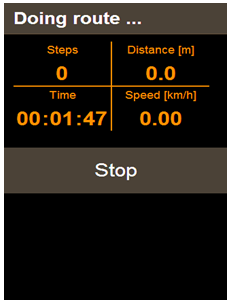
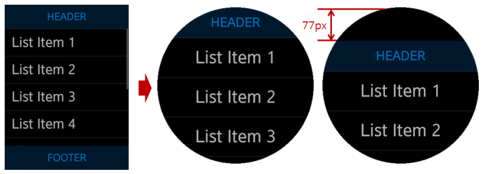
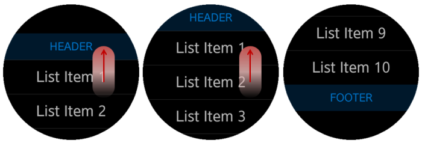

# Multiple UI Layouts

To ensure the largest possible market for your application, you have to design your application layout so that your application can run on multiple Tizen devices.

This feature is supported in wearable applications only.

Although the Web was originally designed to structure documents for large-scaled Internet world, with CSS (Cascading Style Sheet), JavaScript, and various device APIs, it is quickly evolving to a complete runtime environment for applications. In addition, its W3C open development model and the flexibility of its CSS-based presentation make it every developer's choice as the next development platform. CSS is the key technology for flexible presentation, and it is used to describe the look and formatting of HTML documents. The role of CSS is to determine how the logical structure of the document is displayed to the user.

The Tizen Web engine provides the basic mechanisms for fitting the application content to the target screen. However, to ensure that the application runs well on multiple devices, you must understand those mechanisms in detail. In general, select a relative layout rather than a fixed layout, because a relative layout helps to maintain usability even when the application runs on unexpected devices. To enhance usability even further, use different layouts for each device category.

Using some CSS techniques and Tizen Web engine mechanisms, you can design your application UI layout so that it displays properly on multiple devices:

- You can use a [single layout](#single-layout-for-multiple-devices) and take advantage of the auto-fitting mechanism of the Tizen Web engine to ensure that a single layout covers multiple devices.
- You can use [multiple layouts](#multiple-layouts-for-multiple-devices) to define a separate optimal layout for each device category.

## Single Layout for Multiple Devices

A typical application developer designs an optimized UI for a target device with a fixed layout and high-quality resources. This approach usually results in a nice look for the end user, but can sometimes result in an ugly layout, which makes the application unusable. And this unfortunate result can occur merely due to a change in the device form factor.

Since the presentation and business logic are strictly separated in a Web application, it handles the device form factor change better than native applications. One single layout, taking advantage of Web technology, can ensure usability even on multiple devices with different form factors.

To design applications with a single layout, you must consider the following issues:

- [Viewport and other meta tags](#viewport-and-other-meta-tags)
- [Relative layout](#relative-layout)
- [Header and footer position](#header-and-footer-position)
- [Flexible media](#flexible-media)

For a complete application layout that considers all the above issues, see [Single Layout Example](#single-layout-example).

### Viewport and Other Meta Tags

The viewport is a screen area that the Web engine displays in the UI and, in the Web world, the `viewport` meta tag is used to inform the Web engine that this content is written for a specific form factor, such as device width. The `viewport` meta tag was introduced by Apple to fill the screen resolution gap between initial Smart phone (for example, 320 px) and PC (for example, 980 px). Basically, the `viewport` meta tag helps the Web engine to determine the scale factor for the content on the current device.

To use the tag in an HTML file, set its name and content:

```
<meta name="viewport" content="XXX">
```

As shown in the following code snippet, use the `viewport` meta tag to tell the Web engine which device width is targeted by the application. The Web engine can estimate the scale factor based on the target content size and the real screen width. For example, usually almost all wearable applications have the following `viewport` meta tag, which sets the viewport width to the appropriate size based on each device:

```
<meta name="viewport" content="width=device-width, user-scalable=no">
```

If you want to set your content layout to the target width of 320 px on every wearable device, use the following meta tag:

```
<meta name="viewport" content="width=320">
```

The `viewport` meta tag has other properties, such as `height`, `initial-scale`, `minimum-scale`, `maximum-scale`, and `user-scalable`. However, do not use those properties unless you understand their exact meaning. Wrong values can cause the Web engine to incorrectly fit the application content to the current device.

### Relative Layout

The relative layout concept means that the element size of all content is set as a relative unit (such as percentage), and not as absolute values (such as pixels or points). In responsive Web design, this concept is also known as **fluid grid** (for more information, search for **responsive web design** in your Web browser). To achieve a layout that works on multiple devices, you only need to know about relative layout, not all the other concepts of responsive Web design.

To implementing a relative layout, you only have to set the width and height of each element as a percentage, as shown in the following example and figure. In the example, the width and height of the `number_pad` element is set to 100% and 70%, not 320 px and 224 px.

**Figure: 320x320 calculator**

`number_pad {width: 100%; height: 70%;}`


An application with this relative layout is auto-fitted when it runs on an unexpected device, such as the device with a 360x480 resolution shown in the following figure. Even though this adjusted layout may not be as good as the original, it is good enough, since it shows a usable application UI.

**Figure: 360x480 calculator with a relative layout**


The following figure shows what happens if you use an absolute 320x320 layout. The presentation is definitely ugly (with an empty white space at the bottom) and usability reduced, although the calculation logic itself still works.

**Figure: 360x480 calculator with an absolute 320x320 layout**

`number_pad {width: 320px; height: 224px;}`


### Header and Footer Position

While the content layout itself becomes the application UI layout on a Web page, a typical wearable application layout consists of a header area, content area, and footer area. With this trend, many wearable Web applications are designed by separating the 3 areas explicitly.

**Figure: Typical wearable Web application layout**


Not setting the place of the header and footer areas clearly can easily cause problems for your layout. For the header, the side-effect is relatively small. However, a wrongly defined footer area can be quite visible and lead to poor usability. The following figure shows the original layout of a pedometer application that consists of a header, content, and footer, with a Stop button set in the footer area.

**Figure: 320x320 sample Web application**


In this case, if the position of the footer is not defined explicitly or if the position and bottom properties do not have proper values, an ugly layout can be displayed on an unexpected device, such as the 360x480 screen shown in the following figure.

**Figure: Layout on 360x480**



To make the layout correct, define the position property as fixed and set the bottom property explicitly as 0 px:

```
.footer {position: fixed; bottom: 0px;}
```

The following figure shows the same Web application running on the unexpected device after the footer properties are defined properly. With the correct values, the Web application is usable even on a new target, not planned during the development phase. Note that if a [relative layout](#relative-layout) is also applied to the content area, the result is an even better layout and further improved usability.

**Figure: Usable layout on 360x480**


### Flexible Media

One of key elements used in the content area is a media element, including image and video. As all other elements, the media elements also must be placed within a relative layout to allow the application flexibly handle resolution changes. When such relative sizing is applied to a media element, it is called **flexible media** in responsive Web design.

The main issue when making a media element size relative is to ensure that the usable ratio does not change. The following figure shows a video element that works on both 320x320 and 360x480 resolutions, even though the aspect ratio of the screen is changed and scaled up. Basically, when handling media elements, you want to keep the size or ratio of the element the same as on the initially targeted device, even when displayed using a different resolution and aspect ratio. To achieve this, set the width and height properties of the media element with percentage and the auto keyword.

**Figure: Flexible media on 320x320 and 360x480**

`.video iframe {width: 100%; height: auto;}`


The following figure shows an example of wrong usage, where usability decreases as the video element is simply scaled up based on the aspect ratio change. If you set the video element size using a fixed size like this, you get no benefit from the increased resolution, and the layout on the whole screen becomes inharmonious, decreasing usability.

**Figure: Fixed size media element**

` .video iframe {width: 320px; height: 240px;}`


### Single Layout Example

This section illustrates a complete application layout that takes advantage of the issues discussed in previous sections. In particular, it shows how to set the viewport properly to help the Web engine scaling mechanism and how to create a CSS-based layout.

First of all, set the targeted size of the content area as 320 px in the `viewport` meta tag, and disable the `user-scalable` property, as shown in the following code snippet.

```
<html>
   <head>
      <link href="css/style.css" rel="stylesheet" type="text/css">
      <meta name="viewport" content="width=320px, user-scalable=no"/>
   </head>
   <body>
      <main>
         <div class="tile left">
            <div id="box1" class="box"></div>
         </div>
         <div class="tile right">
            <div id="box2" class="box"></div>
         </div>
         <div class="tile left">
            <div id="box3" class="box"></div>
         </div>
         <div class="tile right">
            <div id="box4" class="box"></div>
         </div>
      </main>
   </body>
</html>
```

In the above HTML code, the content area consists of 4 `<div>` box elements, and their UI layout is described in the `style.css` file. The following CSS code programs the layout and the specific box element styles that were defined in the HTML file.

The code snippet shows that the content size is set to be same as the viewport size. Each box is filled with a different color and placed so that it fills a quarter of the content area. Because each box size is defined with the width and height of 100%, the relative size of each box element remains the same even if the viewport size changes.

```
<!--Default, used for all-->
* {box-sizing: border-box;}
body, div, h1 {margin: 0px; padding: 0px;}
html, body {width: 100%; height: 100%; overflow-x: hidden;}

#box1 {background-color: rgb(255, 255, 141);}
#box2 {background-color: rgb(165, 241, 238);}
#box3 {background-color: rgb(248, 179, 179);}
#box4 {background-color: rgb(192, 161, 246);}
.tile {
   width: 50%;
   height: 50%;
   float: left;
}
.left {padding: 10px 5px 5px 10px;}
.right {padding: 10px 10px 5px 5px;}

.box {
   width: 100%;
   height: 100%;
}
```

The following figure shows a final view when the 320 px is set as a target device in the HTML file. As defined in the CSS file, the content area fills the whole screen, 320x320 pixels, and the 4 box elements equally divide the area.

**Figure: Original layout on a target device**


The following figure shows that the relative layout and scaling are correctly applied even when the same application is run on a mobile device with the aspect ratio of 16:9.

**Figure: Scaled layout on a 16:9 mobile device**


The following code snippet shows an example where the background color is replaced with an image while the layout is exactly same as in the 4 box example. The following figures show how the layout including media elements (such as images) functions exactly like the basic box layout.

```
<!--Default, used for all-->
* {box-sizing: border-box;}
body, div, h1 {margin: 0px; padding: 0px;}
html, body {width: 100%; height: 100%; overflow-x: hidden;}

#box1 {background-color: rgb(255, 255, 141);}
#box2 {background-color: rgb(165, 241, 238);}
#box3 {background-color: rgb(248, 179, 179);}
#box4 {background-color: rgb(192, 161, 246);}
.tile {
   width: 50%;
   height: 50%;
   float: left;
}
.left {padding: 10px 5px 5px 10px;}
.right {padding: 10px 10px 5px 5px;}

.box {
   width: 100%;
   height: 100%;
   padding: 20px;
   background: no-repeat center;
   background-size: 100% 100%;
}

#box1 {background-image: url('../a.png');}
#box2 {background-image: url('../b.png');}
#box3 {background-image: url('../c.png');}
#box4 {background-image: url('../d.png');}
```

**Figure: Image-based layout on a target device**


**Figure: Image-based scaled layout on a 16:9 mobile device**


## Multiple Layouts for Multiple Devices

In many cases, the desired end result for your application can be achieved using scaling and a relative layout within a [single layout](#single-layout-for-multiple-devices). However, this approach does not always provide the best quality for the end user.

You can support the best possible layout and usability with some additional development efforts. For instance, you can create an application which, on a tablet, shows the main information (watch face) and also delivers more meaningful information (calendar), while on a watch device the same application only displays the main information (watch face). This kind of end result, as shown in the following figure, cannot be achieved by only scaling up the whole layout of the watch device.

**Figure: Application for a watch and tablet**


W3C CSS3 Media Queries already support the majority of techniques needed to provide category-based layouts. To support the optimal layout using CSS techniques and design applications with multiple layouts, you must consider the following issues:

- [Viewport setting](#viewport-setting-for-multiple-layouts)
- [Category classification](#category-classification)
- [Classification for display modes](#classification-for-display-modes)

Since the **2.3.1** version, Tizen also supports a special media query feature to provide device shape-based layouts. If you want to create an application for both square-shaped and circular-shaped devices, you can easily [migrate your application to support both shapes](#application-migration-to-a-circular-device).

**Figure: Application for a square and circular device**


### Viewport Setting for Multiple Layouts

The difference between multiple and single layouts is that, in the multiple layouts, the content width of the `viewport` meta tag is set to `"device-width"`. This sets the layout viewport width to the ideal viewport width and tells the Web engine that the application adapts to the device width. In short, the `"device-width"` setting is needed to create an adaptive and responsive Web application.

To use the meta tag in an HTML file, set its name and content:

```
<meta name="viewport" content="width=device-width, user-scalable=no">
```

### Category Classification

When creating multiple layouts, you must first configure the layout categories. In other words, a classifying category is needed to fit the layout on the current executable environment. Media queries are supported in CSS3 to give Web application information to the executable environment.

#### W3C Media Queries

Media queries consist of a media type and expressions of media features.

The media types indicate the media on which the current Web application is running. They are defined in HTML4. The following media types are supported:

- `aural`
- `braille`
- `handheld`
- `print`
- `projection`
- `screen`
- `tty`
- `tv`

You can declare that sections apply to certain media types inside a CSS style sheet.  As in the following example, you can declare `screen` as a media type and describe its layout inside `{...}`. That code applies the layout inside `{...}` when the Web application is run on the screen type executable context.

```
@media screen {...}
```

Several media queries can be combined in a media query list to configure the executable environment and define the detailed layout configuration, as needed. The following example shows a case in which the Web application runs on the executable environment having a `screen` media type and a 500 pixel minimum width. Its final view shows the layout inside `{...}` to the end user.

```
@media screen and (min-width: 500px) {...}
```

The following table lists the CSS media features, which you can use to specify the layout utilizing the media queries.

**Table: Media features**

| Feature             | Value                      | Min/Max | Description                              |
| ------------------- | -------------------------- | ------- | ---------------------------------------- |
| color               | integer                    | yes     | Number of bits per color  component      |
| color-index         | integer                    | yes     | Number of entries in the color  lookup table |
| device-aspect-ratio | integer/integer            | yes     | Aspect ratio                             |
| device-height       | length                     | yes     | Output device height                     |
| device-width        | length                     | yes     | Output device width                      |
| grid                | integer                    | no      | Set to true for a grid-based  device     |
| height              | length                     | yes     | Rendering surface height                 |
| monochrome          | integer                    | yes     | Number of bits per pixel in a  monochrome frame buffer |
| resolution          | resolution (`dpi` or `dpcm`)   | yes     | Resolution                               |
| scan                | `progressive` or `interlaced` | no      | Scanning process of the `tv` media types   |
| width               | length                     | yes     | Rendering surface width                  |


#### Tizen Specialized Media Query

Tizen supports a special media query feature for a circular device shape. The following table lists the supported media features.

> **Note**  
> This feature is supported since **2.3.1**.

**Table: Tizen specialized media feature**

| Feature                  | Value                    | Min/Max    | Description  |
| ------------------------ | ------------------------ | ---------- | ------------ |
| `-tizen-geometric-shape` | `"rectangle" | "circle"` | No         | Device shape |

You can combine this media query feature with the W3C type in your code. The final view shows the layout inside `{...}` to the end user:

```
@media all and (-tizen-geometric-shape: circle) {...}
```

### Classification for Display Modes

The display mode can be classified as portrait or landscape for a rectangle-shaped device, or circular for a circular device.

#### Portrait and Landscape

You can configure the device landscape and portrait mode using the `device-aspect-ratio` attribute in media queries. This approach is already commonly used in creating mobile Web applications. The following example shows how the `max-device-aspect-ratio` feature is used.

If you use the `orientation: portrait/landscape` feature, the layout can change unexpectedly when the virtual keypad is displayed. To avoid the problem, use the `device-aspect-ratio` to configure the portrait and landscape mode.

```
@media screen and (max-width: 320px) and (max-device-aspect-ratio: 1/1) {
   <!--For portrait mode-->
}
@media screen and (max-width: 640px) and (min-device-aspect-ratio: 11/10) {
   <!--For landscape mode-->
}
```

#### Circular Device

You can configure the device circular mode using the `-tizen-geometric-shape` attribute in the Tizen environment. The following example shows how to use the `-tizen-geometric-shape` feature.

> **Note**  
> This feature is supported since **2.3.1**.

```
@media all and (-tizen-geometric-shape: circle) {
   <!--For a circular device-->
}
```

### Application Migration to a Circular Device

This section illustrates an example for how you can migrate a basic application from a rectangular device (such as Gear 2 or Gear S) to a circular device. Use this example as the best practice to improve your layout.

The example uses the following HTML and CSS code for the sample application and its layout.

```
<!--HTML code-->
<section id="main">
   <header>HEADER</header>
   <article id="content">
      <ul>
         <li>List Item 1</li>
         <li>List Item 2</li>
         <li>List Item 3</li>
         <li>List Item 4</li>
         <li>List Item 5</li>
         <li>List Item 6</li>
         <li>List Item 7</li>
         <li>List Item 8</li>
         <li>List Item 9</li>
         <li>List Item 10</li>
      </ul>
   </article>
   <footer>FOOTER</footer>
</section>

<!--CSS code-->
html, body {
   height: 100%;
   width: 100%;
   padding: 0;
   margin: 0;
   font-size: 24px;
   overflow: hidden;
}

section {
   width: 100%;
   height: 100%;
   overflow: auto;
   padding: 70px 0;
}

header, footer {
   width: 100%;
   height: 70px;
   min-height: 70px;
   line-height: 70px;
   font-size: 30px;
   text-align: center;
   position: fixed;
}

header {
   top: 0;
}

footer {
   bottom: 0;
}

article ul li {
   border-top: 1px solid rgba(52, 52, 52, 1);
   padding: 15px 20px;
   color: rgba(209, 209, 209, 1);
   font-size: 40px;
}

article ul li:first {
   border-top: 0 none;
}
```

To migrate the application, use the following steps:

1. Use a relative layout.

   To achieve a responsive layout for different devices, implement a relative layout. Simply set the `width: 100%` attribute to the layout elements in the CSS code:

   ```
   section {
      width: 100%;
      height: 100%;
   }

   header, footer {
      width: 100%;
   }
   ```

	> **Note**  
	> The **relative layout** concept is described in more detail in [Relative Layout](#relative-layout).

2. Set extra spaces both at the top and bottom.

   During the migration, you can see how a certain portion of the rectangle view is covered over by the circular view, especially the header and the footer. To make them fully and consistently visible in the circular view, provide a "padding" space at the top and bottom of the page. In the following example of migrating to a circular gear device from a rectangular Gear S, extra 77 px padding is used:

   ```
   @media all and (-tizen-geometric-shape: circle) {
      section {padding: 77px 0;}
   }
   ```

   **Figure: Top and bottom padding**

   

3. Set the header and footer position.

   After setting the top and bottom padding, set the header and footer position for scrolling in the circular view.

   For a rectangular device with a lengthwise screen, especially Gear S, the best option is to make only the content area scrollable.

   **Figure: Scrolling with a rectangular screen**

   

   In a circular screen, it is better to make the whole page scrollable, including the top and bottom space.

   **Figure: Scrolling with a circular screen**

   

   To implement the header and footer position, use the CSS `position` attribute:

   ```
   <!--Rectangular device-->
   header, footer {
      position: fixed;
   }

   <!--Circular device-->
   @media all and (-tizen-geometric-shape: circle) {
      header, footer {
         position: static;
      }
   }
   ```

4. Move the display to the initial position.

   To provide a better user experience, show the entire display at the beginning, including the "top padding" space. A few seconds after the application launch, move the display back to its initial position, where the header is placed on the top without any space between itself and the edge of the screen. When the display moves like this, the users can perceive the existence of the top space.

   **Figure: Moving to the initial position**

   

   The scroll move requires several lines of JavaScript code. In the following sample, the few (N) seconds is set to 1500 ms, but you can change the value as needed.

   ```
   (function initScrollPosition() {
       var SCROLL_DELAY_TIME = 1500,
           page = document.getElementById('main'),
           scrollPosition = window.parseInt(window.getComputedStyle(page)['padding-top']),
           initScrollTimeoutId = null,
           mql = window.matchMedia('(-tizen-geometric-shape: circle)');

       /* Effect is applied to a circular device only, so use a media query */
       if (mql.matches) {
           page.addEventListener('scroll', function clearInitScrollCallback() {
               window.clearTimeout(initScrollTimeoutId);
               page.removeEventListener('scroll', clearInitScrollCallback, false);
           }, false);

           initScrollTimeoutId = window.setTimeout(function() {
               page.scrollTop = scrollPosition;
           }, SCROLL_DELAY_TIME);
       }
   }());
   ```

5. Set extra attributes for a better view.

   Extra attributes are not mandatory in the migration process, but they can be helpful for a better application view.

   Sometimes changing the layout of the basic elements is not enough to achieve a user-friendly view, and changes in other elements' layout are needed too. For example, consider setting the `text-align: center` attribute for the header and list items in the circular view (this attribute is already defined in the above circular screenshots). If the list is aligned to left in a circular view, the list items may not be all visible when placed out of the middle space.

   ```
   <!--Common style for header and footer text-->
   header, footer {
      text-align: center;
   }

   <!--In a circular screen, list item has a center position-->
   @media all and (-tizen-geometric-shape: circle) {
      article ul li {
         text-align: center;
         line-height: 60px;
      }
   }
   ```

## Related Information
* Dependencies   
   - Tizen 2.3.1 and Higher for Wearable
