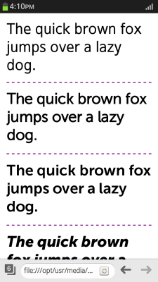

# WOFF File Format (1.0 and 2.0)

You can decode and restore font data easily.

The new text features in WOFF File Format 2.0 (in mobile and TV applications) and 1.0 (in wearable applications) include:

- Decoding and restoring font data

  WOFF (Web Open Font Format) is a packaging format used to decode and restore font data according to the [`@font-face` rule](http://www.w3.org/TR/2013/CR-css-fonts-3-20131003/#font-face-rule) to display it identically with the input font. The `@font-face` rule is a CSS rule that allows linking to fonts and finding a suitable font to display if the original font is not available. You can [use WOFF](#using-the-woff-file-format) within a Web page. 

## Using the WOFF File Format

To use the WOFF (Web Open Font Format) file format, which is a W3C standard font packaging format used in Web pages:

1. Download and use fonts installed on the Web server by creating [`@font-face` rules](http://www.w3.org/TR/2013/CR-css-fonts-3-20131003/#font-face-rule). Within the rules, you can define the following properties:

   - `font-family`  
   Defines a name for the font. This property is mandatory.
   
   - `src`  
   Defines the URL of the font file on the server. This property is mandatory. If the `local` attribute is defined, the font resource is not downloaded from the server if it already exists in the local storage.

   - `font-stretch`  
   Defines the way the font is stretched. This property is optional.
   
   - `font-style`  
   Defines the font style. This property is optional.
   
   - `font-weight`  
   Defines the font weight. This property is optional.
   
   Define the rules with in a `<style>` element in the `<head>` section of a Web page:

   ```
   <head>
      <style>
      @font-face {
         font-family: MuseoSans;
         src: local('MuseoSans'),
              url('https://www.tizen.org/sites/all/themes/tizen_theme/webfonts/244CBE_1_0.woff') format('woff');
      }

      @font-face {
         font-family: MuseoSans;
         font-weight: bold;
         src: local('MuseoSans'),
              url('https://www.tizen.org/sites/all/themes/tizen_theme/webfonts/244CBE_0_0.woff') format('woff');
      }

      @font-face {
         font-family: MuseoSans;
         font-weight: 900;
         src: local('MuseoSans'),
              url('https://www.tizen.org/sites/all/themes/tizen_theme/webfonts/244CBE_2_0.woff') format('woff');
      }

      p:nth-child(2) {font-family: MuseoSans}
      p:nth-child(3) {font-family: MuseoSans; font-weight: bold;}
      p:nth-child(4) {font-family: MuseoSans; font-weight: 900;}
      </style>
   </head>
   ```

2. In the `<body>` section, create `<p>` elements containing text in which the font rules are implemented:

   ```
   <body>
      <p>The quick brown fox jumps over a lazy dog.</p>
      <p>The quick brown fox jumps over a lazy dog.</p>
      <p>The quick brown fox jumps over a lazy dog.</p>
      <p>The quick brown fox jumps over a lazy dog.</p>
   </body>
   </html>
   ```

**Figure: Implementing the @font-face rules (in mobile applications only)**



## Related Information
* Dependencies
  - Tizen 2.4 and Higher for Mobile
  - Tizen 2.3.1 and Higher for Wearable
  - Tizen 3.0 and Higher for TV
