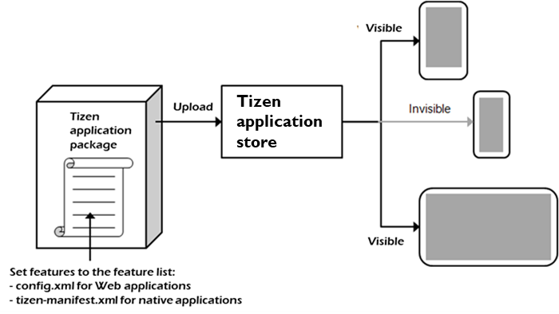

# Application Filtering

The Tizen platform provides a wide range of features across a variety of
hardware and software components. Among the features, there are some
that can be selectively supported by the Tizen device manufacturer. For
application stores to correctly select your application for installation
on an appropriate device, the feature and profile information must be
correctly declared in your application.

<a name="filter_w"></a>
## Feature-based filter

Some features can be selectively supported by the Tizen device
manufacturer. To prevent problems when the user is trying to run your
application on a device that does not support all the features your
application is using, do one of the following:

-   When the application is running, check whether the device supports
    the needed features. If not, the application can use other features,
    which are supported by the device, as a workaround.

    For example, if an application wants to use location information, it
    can check the device capability by using the `getCapability()`
    method of the `SystemInfo` interface (in
    [mobile](../api/latest/device_api/mobile/tizen/systeminfo.html#SystemInfo),
    [wearable](../api/latest/device_api/wearable/tizen/systeminfo.html#SystemInfo),
    and
    [TV](../api/latest/device_api/tv/tizen/systeminfo.html#SystemInfo) applications).
    If the device supports GPS, the application uses GPS information,
    and if the device supports WPS only, the application uses WPS
    information instead of GPS.

- Use feature-based filtering to prevent your application from being
    shown in the application list on the official site for Tizen applications, if the user's
    device does not support all the features of your application. This
    way you can prevent the application from being installed on an
    unsupported device in the first place.

    Be careful when defining the feature list for
    feature-based filtering. The feature list can dramatically reduce
    your chances of getting the application downloaded by reducing the
    number of devices which can support the application.

If the `config.xml` file of the application package includes a feature
list, the store compares the capabilities of the device with the
required feature conditions of the application. The store only lists the
applications whose conditions match the capabilities of the device, and
thus prevents incompatible applications from being installed.

**Figure: Feature-based filtering**



When multiple features are defined in the feature list for feature-based
filtering, the store creates the filtering condition for all using
the "AND" operation. For example, if there are
`http://tizen.org/feature/network.nfc` and
`http://tizen.org/feature/network.bluetooth` features in the feature
list of the application package, only a device that has both those
features can show the application on the store application list
for downloading.

<a name="screen_size"></a>
### Screen size feature

The screen size feature is the only exception to the normal feature
handling process described above. When the screen size is defined in the
feature list, the store creates the filtering condition with the
"OR" operation. For example, if the
`http://tizen.org/feature/screen.size.normal.480.800` and
`http://tizen.org/feature/screen.size.normal.720.1280` features are
defined in your application feature list, a device that supports one or
the other of those features can show the application on the store
application list.

If you do not specify a proper screen size in the `config.xml` file,
your application can be rejected from the store.

<a name="hierarchy"></a>
### Feature hierarchy

The feature keys have a hierarchy. For example, consider the
`http://tizen.org/feature/location`,
`http://tizen.org/feature/location.gps`, and
`http://tizen.org/feature/location.wps` features:

-   If the feature list includes the
    `http://tizen.org/feature/location.gps` feature, only a device which
    has the `http://tizen.org/feature/location.gps` feature can show the
    application on the store application list.
- If the feature list includes the `http://tizen.org/feature/location`
    feature, a device which has the
    `http://tizen.org/feature/location.gps`,
    `http://tizen.org/feature/location.wps`, or
    `http://tizen.org/feature/location` feature can show the application
    on the store application list.

    This means that the store considers the
    `http://tizen.org/feature/location` feature as the
    `http://tizen.org/feature/location.gps OR http://tizen.org/feature/location.wps` feature.
    (If the feature list includes the
    `http://tizen.org/feature/location.gps` and
    `http://tizen.org/feature/location.wps` features together, only a
    device which supports both those features can show the application.)

<a name="adding"></a>
### Add the feature list

To enable filtering for your Web application, add the feature list for
the application `config.xml` file, follow these steps:
1.  To open the Web application configuration editor in Tizen
    Studio, double-click the `config.xml` file in the **Project
    Explorer** view.
2.  In the **Features** tab, click **+**.
3.  Select the features you need.
4.  Click **OK**.

After setting the feature information with the Web application
configuration editor, you can see the added code in the **Source** tab.

The following example shows the setting in the `config.xml` file code:

```xml
<tizen:feature name="http://tizen.org/feature/network.nfc"/>
```

The following tables show the available requirements for Tizen Web
application package.

**Table: Available requirements for TV Web Device APIs**

| Feature key                              | Description                              | Since |
| ---------------------------------------- | ---------------------------------------- | ----- |
| `http://tizen.org/feature/network.bluetooth` | Specify this key, if the application requires the Bluetooth feature. | 6.0 |
| `http://tizen.org/feature/network.bluetooth.le` | Specify this key, if the application requires the Bluetooth Low Energy feature (BLE). | 6.0   |
| `http://tizen.org/feature/network.bluetooth.le.gatt.client` | Specify this key, if the application requires the Bluetooth Low Energy GATT Client feature. | 6.0   |
| `http://tizen.org/feature/display`       | Specify this key, if the application requires the display feature. | 5.5   |
| `http://tizen.org/feature/display.state` | Specify this key, if the application requires System Device API to control display state. | 5.0   |
| `http://tizen.org/feature/storage.external` | Specify this key, if the application requires the external storage feature. | 5.5   |
| `http://tizen.org/feature/tv.audio`      | Specify this key, if the application requires the audio control functionality for using the [TV Audio Control](../api/latest/device_api/tv/tizen/tvaudiocontrol.html) API. | 3.0   |
| `http://tizen.org/feature/tv.display`    | Specify this key, if the application requires the screen display functionality for using the [TV Display Control](../api/latest/device_api/tv/tizen/tvdisplaycontrol.html) API. | 3.0   |
| `http://tizen.org/feature/tv.inputdevice` | Specify this key, if the application requires the input device event monitoring functionality for using the [TV Input Device](../api/latest/device_api/tv/tizen/tvinputdevice.html) API. | 3.0   |
| `http://tizen.org/feature/tv.pip`        | Specify this key, if the application requires the picture-in-picture (PIP) functionality for using the [TV Window](../api/latest/device_api/tv/tizen/tvwindow.html) API. | 3.0   |
| `http://tizen.org/feature/tv.information` | Specify this key, if the application requires the TV setting functionality for using the [TV Information](../api/latest/device_api/tv/tizen/tvinfo.html) API. | 3.0   |

**Table: Available requirements for TV Web W3C/HTML5 APIs**

| Feature key                              | Description                              | Since |
| ---------------------------------------- | ---------------------------------------- | ----- |
| `http://tizen.org/feature/microphone`    | Specify this key, if the application requires a microphone for using the [getUserMedia](../api/latest/w3c_api/w3c_api_tv.html#getusermedia) API. | 3.0   |
| `http://tizen.org/feature/sensor.accelerometer` | Specify this key, if the application requires an acceleration sensor for using the [Screen Orientation](../api/latest/w3c_api/w3c_api_tv.html#sceenori) API. | 3.0   |
| `http://tizen.org/feature/speech.synthesis` | Specify this key, if the application requires the speech synthesis (text-to-speech, TTS) feature for using the [Web Speech](../api/latest/w3c_api/w3c_api_tv.html#webspeech) API. | 3.0   |

<a name="profile_w"></a>

## Profile-based filter

A Tizen profile describes the requirements for a category of Tizen
devices that have a common application execution environment.
Applications are created for a single specific target profile, such as
TV, and can run on devices compliant with that
profile.

Use profile-based filtering to ensure that your application is only
downloaded on the appropriate device profile. To ensure this, declare
the intended profile by adding the `profile name` element in the
`config.xml` file.

The following table lists the Tizen profiles and related profile name
attributes.

**Table: Tizen profiles and profile name attributes**

| Tizen profile | Profile name attribute |
| ------------- | ---------------------- |
| TV            | `TV`                   |

In a Web application, the profile name element can be added to the
`config.xml` file as follows:

```xml
<widget xmlns="http://www.w3.org/ns/widgets" xmlns:tizen="http://tizen.org/ns/widgets" ... >
   <tizen:profile name="TV"/>
```

The official site for Tizen applications compares the device profile and the `profile name`
element in an application. The store only shows the applications with a
profile name matching the device profile to prevent unsupported
applications from being installed.

<a name="multi_profile"></a>
## Single Web application for multiple profiles

Applications are created for a single specific target profile and can
only run on devices compliant to that profile. However, it is easily
possible to develop a Web application on one profile and make it work on
another profile if you use Web APIs that are common to both the
profiles. You simply modify the ` <tizen:profile>` tag to switch
profiles. You may also have to make other changes, like adapting your
application to different screen sizes and input events. It is
recommended that you test this modified application to ensure it
performs as desired.
