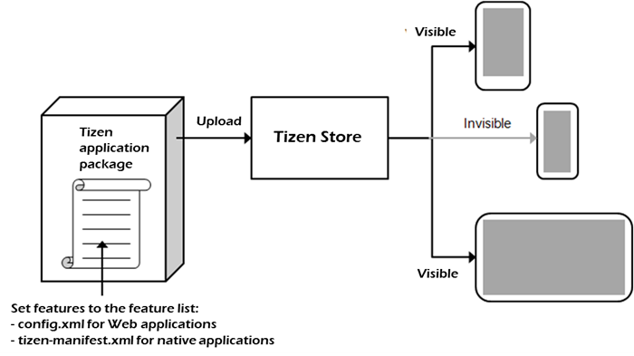

# Application Filtering

The Tizen platform provides a wide range of features across a variety of
hardware and software components. Among the features, there are some
that can be selectively supported by the Tizen device manufacturer. For
application stores to correctly select your application for installation
on an appropriate device, the feature and profile information must be
correctly declared in your application.

<a name="filter_w"></a>
## Feature-based Filtering

Some features can be selectively supported by the Tizen device
manufacturer. To prevent problems when the user is trying to run your
application on a device that does not support all the features your
application is using, do one of the following:

-   When the application is running, check whether the device supports
    the needed features. If not, the application can use other features,
    which are supported by the device, as a workaround.

    For example, if an application wants to use location information, it
    can check the device capability by using the `getCapability()`
    method of the `SystemInfo` interface (in
    [mobile](../api/latest/device_api/mobile/tizen/systeminfo.html#SystemInfo),
    [wearable](../api/latest/device_api/wearable/tizen/systeminfo.html#SystemInfo),
    and
    [TV](../api/latest/device_api/tv/tizen/systeminfo.html#SystemInfo) applications).
    If the device supports GPS, the application uses GPS information,
    and if the device supports WPS only, the application uses WPS
    information instead of GPS.

- Use feature-based filtering to prevent your application from being
    shown in the application list on the Tizen Store, if the user's
    device does not support all the features of your application. This
    way you can prevent the application from being installed on an
    unsupported device in the first place.

    Be careful when defining the feature list for
    feature-based filtering. The feature list can dramatically reduce
    your chances of getting the application downloaded by reducing the
    number of devices which can support the application.

If the `config.xml` file of the application package includes a feature
list, the Tizen Store compares the capabilities of the device with the
required feature conditions of the application. The store only lists the
applications whose conditions match the capabilities of the device, and
thus prevents incompatible applications from being installed.

**Figure: Feature-based filtering**



When multiple features are defined in the feature list for feature-based
filtering, the Tizen Store creates the filtering condition for all using
the "AND" operation. For example, if there are
`http://tizen.org/feature/network.nfc` and
`http://tizen.org/feature/network.bluetooth` features in the feature
list of the application package, only a device that has both those
features can show the application on the Tizen Store application list
for downloading.

<a name="screen_size"></a>
### Screen Size Feature

The screen size feature is the only exception to the normal feature
handling process described above. When the screen size is defined in the
feature list, the Tizen Store creates the filtering condition with the
"OR" operation. For example, if the
`http://tizen.org/feature/screen.size.normal.480.800` and
`http://tizen.org/feature/screen.size.normal.720.1280` features are
defined in your application feature list, a device that supports one or
the other of those features can show the application on the Tizen Store
application list.

If you do not specify a proper screen size in the `config.xml` file,
your application can be rejected from the Tizen Store.

The following tables list the available screen size features.

**Table: Available screen size features for mobile applications**

| Feature key                              | Description                              | Since |
| ---------------------------------------- | ---------------------------------------- | ----- |
| `http://tizen.org/feature/screen.size.normal` | Specify this key, if the application supports all possible current and future resolutions on the normal screen size.<br>You cannot specify keys on both `screen.size.*` and `screen.size.normal.*` levels simultaneously. If you do, only the most specific resolution key is considered and the less specific resolution keys are ignored. For example, if you specify both `http://tizen.org/feature/screen.size.normal` and `http://tizen.org/feature/screen.size.normal.320.480` keys, only the `http://tizen.org/feature/screen.size.normal.320.480` key is applied.<br>If no screen size key is declared, it is assumed that the application supports only `screen.size.normal.720.1280`. To avoid this, specify at least 1 screen size key. | 2.2.1 |
| `http://tizen.org/feature/screen.size.normal.240.400` | Specify this key, if the application supports the 240 x 400 resolution on the normal screen size.<br>You can specify multiple `http://tizen.org/feature/screen.size.normal.*` keys, if your application supports multiple screen resolutions on the normal screen size. However, you cannot specify keys on both `screen.size.*` and `screen.size.normal.*` levels simultaneously.<br>If no screen size key is declared, it is assumed that the application supports only `screen.size.normal.720.1280`. To avoid this, specify at least 1 screen size key. | 2.2.1 |
| `http://tizen.org/feature/screen.size.normal.320.320` | Specify this key, if the application supports the 320 x 320 resolution on the normal screen size.<br>You can specify multiple `http://tizen.org/feature/screen.size.normal.*` keys, if your application supports multiple screen resolutions on the normal screen size. However, you cannot specify keys on both `screen.size.*` and `screen.size.normal.*` levels simultaneously.<br>If no screen size key is declared, it is assumed that the application supports only `screen.size.normal.720.1280`. To avoid this, specify at least 1 screen size key. | 2.3   |
| `http://tizen.org/feature/screen.size.normal.320.480` | Specify this key, if the application supports the 320 x 480 resolution on the normal screen size.<br>You can specify multiple `http://tizen.org/feature/screen.size.normal.*` keys, if your application supports multiple screen resolutions on the normal screen size. However, you cannot specify keys on both `screen.size.*` and `screen.size.normal.*` levels simultaneously.<br>If no screen size key is declared, it is assumed that the application supports only `screen.size.normal.720.1280`. To avoid this, specify at least 1 screen size key. | 2.2.1 |
| `http://tizen.org/feature/screen.size.normal.360.360` | Specify this key, if the application supports the 360 x 360 resolution on the normal screen size.<br>You can specify multiple `http://tizen.org/feature/screen.size.normal.*` keys, if your application supports multiple screen resolutions on the normal screen size. However, you cannot specify keys on both `screen.size.*` and `screen.size.normal.*` levels simultaneously.<br>If no screen size key is declared, it is assumed that the application supports only `screen.size.normal.720.1280`. To avoid this, specify at least 1 screen size key. | 2.3.2 |
| `http://tizen.org/feature/screen.size.normal.360.480` | Specify this key, if the application supports the 360 x 480 resolution on the normal screen size.<br>You can specify multiple `http://tizen.org/feature/screen.size.normal.*` keys, if your application supports multiple screen resolutions on the normal screen size. However, you cannot specify keys on both `screen.size.*` and `screen.size.normal.*` levels simultaneously.<br>If no screen size key is declared, it is assumed that the application supports only `screen.size.normal.720.1280`. To avoid this, specify at least 1 screen size key. | 2.3   |
| `http://tizen.org/feature/screen.size.normal.480.800` | Specify this key, if the application supports the 480 x 800 resolution on the normal screen size.<br>You can specify multiple `http://tizen.org/feature/screen.size.normal.*` keys, if your application supports multiple screen resolutions on the normal screen size. However, you cannot specify keys on both `screen.size.*` and `screen.size.normal.*` levels simultaneously.<br>If no screen size key is declared, it is assumed that the application supports only `screen.size.normal.720.1280`. To avoid this, specify at least 1 screen size key. | 2.2.1 |
| `http://tizen.org/feature/screen.size.normal.540.960` | Specify this key, if the application supports the 540 x 960 resolution on the normal screen size.<br>You can specify multiple `http://tizen.org/feature/screen.size.normal.*` keys, if your application supports multiple screen resolutions on the normal screen size. However, you cannot specify keys on both `screen.size.*` and `screen.size.normal.*` levels simultaneously.<br>If no screen size key is declared, it is assumed that the application supports only `screen.size.normal.720.1280`. To avoid this, specify at least 1 screen size key. | 2.2.1 |
| `http://tizen.org/feature/screen.size.normal.600.1024` | Specify this key, if the application supports the 600 x 1024 resolution on the normal screen size.<br>You can specify multiple `http://tizen.org/feature/screen.size.normal.*` keys, if your application supports multiple screen resolutions on the normal screen size. However, you cannot specify keys on both `screen.size.*` and `screen.size.normal.*` levels simultaneously.<br>If no screen size key is declared, it is assumed that the application supports only `screen.size.normal.720.1280`. To avoid this, specify at least 1 screen size key. | 2.2.1 |
| `http://tizen.org/feature/screen.size.normal.720.1280` | Specify this key, if the application supports the 720 x 1280 resolution on the normal screen size.<br>You can specify multiple `http://tizen.org/feature/screen.size.normal.*` keys, if your application supports multiple screen resolutions on the normal screen size. However, you cannot specify keys on both `screen.size.*` and `screen.size.normal.*` levels simultaneously.<br>If no screen size key is declared, it is assumed that the application supports only `screen.size.normal.720.1280`. To avoid this, specify at least 1 screen size key. | 2.2.1 |
| `http://tizen.org/feature/screen.size.normal.1080.1920` | Specify this key, if the application supports the 1080 x 1920 resolution on the normal screen size.<br>You can specify multiple `http://tizen.org/feature/screen.size.normal.*` keys, if your application supports multiple screen resolutions on the normal screen size. However, you cannot specify keys on both `screen.size.*` and `screen.size.normal.*` levels simultaneously.<br>If no screen size key is declared, it is assumed that the application supports only `screen.size.normal.720.1280`. To avoid this, specify at least 1 screen size key. | 2.2.1 |
| `http://tizen.org/feature/screen.size.all` | Specify this key, if the application supports all possible current and future screen sizes and all possible current and future resolutions per screen size.<br>You cannot specify keys on both `screen.size.*` and `screen.size.normal.*` levels simultaneously. If you do, only the most specific resolution key is considered and the less specific resolution keys are ignored. For example, if you specify both `http://tizen.org/feature/screen.size.all` and `http://tizen.org/feature/screen.size.normal.320.480` keys, only the `http://tizen.org/feature/screen.size.normal.320.480` key is applied.<br>If no screen size key is declared, it is assumed that the application supports only `screen.size.normal.720.1280`. To avoid this, specify at least 1 screen size key. | 2.2.1 |

**Table: Available screen size features for wearable applications**

| Feature key                              | Description                              | Since |
| ---------------------------------------- | ---------------------------------------- | ----- |
| `http://tizen.org/feature/screen.size.normal` | Specify this key, if the application supports all possible current and future resolutions on the normal screen size.<br>You cannot specify keys on both `screen.size.*` and `screen.size.normal.*` levels simultaneously. If you do, only the most specific resolution key is considered and the less specific resolution keys are ignored. For example, if you specify both `http://tizen.org/feature/screen.size.normal` and `http://tizen.org/feature/screen.size.normal.320.480` keys, only the `http://tizen.org/feature/screen.size.normal.320.480` key is applied.<br>If no screen size key is declared, it is assumed that the application supports only `screen.size.normal.720.1280`. To avoid this, specify at least 1 screen size key. | 2.2.1 |
| `http://tizen.org/feature/screen.size.normal.320.320` | Specify this key, if the application supports the 320 x 320 resolution on the normal screen size.<br>You can specify multiple `http://tizen.org/feature/screen.size.normal.*` keys, if your application supports multiple screen resolutions on the normal screen size. However, you cannot specify keys on both `screen.size.*` and `screen.size.normal.*` levels simultaneously.<br>If no screen size key is declared, it is assumed that the application supports only `screen.size.normal.720.1280`. To avoid this, specify at least 1 screen size key. | 2.3   |
| `http://tizen.org/feature/screen.size.normal.360.360` | Specify this key, if the application supports the 360 x 360 resolution on the normal screen size.<br>You can specify multiple `http://tizen.org/feature/screen.size.normal.*` keys, if your application supports multiple screen resolutions on the normal screen size. However, you cannot specify keys on both `screen.size.*` and `screen.size.normal.*` levels simultaneously.<br>If no screen size key is declared, it is assumed that the application supports only `screen.size.normal.720.1280`. To avoid this, specify at least 1 screen size key. | 2.3.2 |
| `http://tizen.org/feature/screen.size.normal.360.480` | Specify this key, if the application supports the 360 x 480 resolution on the normal screen size.<br>You can specify multiple `http://tizen.org/feature/screen.size.normal.*` keys, if your application supports multiple screen resolutions on the normal screen size. However, you cannot specify keys on both `screen.size.*` and `screen.size.normal.*` levels simultaneously.<br>If no screen size key is declared, it is assumed that the application supports only `screen.size.normal.720.1280`. To avoid this, specify at least 1 screen size key. | 2.3   |
| `http://tizen.org/feature/screen.size.all` | Specify this key, if the application supports all possible current and future screen sizes and all possible current and future resolutions per screen size.<br>You cannot specify keys on both `screen.size.*` and `screen.size.normal.*` levels simultaneously. If you do, only the most specific resolution key is considered and the less specific resolution keys are ignored. For example, if you specify both `http://tizen.org/feature/screen.size.all` and `http://tizen.org/feature/screen.size.normal.320.480` keys, only the `http://tizen.org/feature/screen.size.normal.320.480` key is applied.<br>If no screen size key is declared, it is assumed that the application supports only `screen.size.normal.720.1280`. To avoid this, specify at least 1 screen size key. | 2.2.1 |

<a name="hierarchy"></a>
### Feature Hierarchy

The feature keys have a hierarchy. For example, consider the
`http://tizen.org/feature/location`,
`http://tizen.org/feature/location.gps`, and
`http://tizen.org/feature/location.wps` features:

-   If the feature list includes the
    `http://tizen.org/feature/location.gps` feature, only a device which
    has the `http://tizen.org/feature/location.gps` feature can show the
    application on the Tizen Store application list.
- If the feature list includes the `http://tizen.org/feature/location`
    feature, a device which has the
    `http://tizen.org/feature/location.gps`,
    `http://tizen.org/feature/location.wps`, or
    `http://tizen.org/feature/location` feature can show the application
    on the Tizen Store application list.

    This means that the Tizen Store considers the
    `http://tizen.org/feature/location` feature as the
    `http://tizen.org/feature/location.gps OR http://tizen.org/feature/location.wps` feature.
    (If the feature list includes the
    `http://tizen.org/feature/location.gps` and
    `http://tizen.org/feature/location.wps` features together, only a
    device which supports both those features can show the application.)

<a name="adding"></a>
### Adding the Feature List

To enable filtering for your Web application, add the feature list for
the application `config.xml` file:  
1.  To open the Web application configuration editor in the Tizen
    Studio, double-click the `config.xml` file in the **Project
    Explorer** view.
2.  In the **Features** tab, click **+**.
3.  Select the features you need.
4.  Click **OK**.

After setting the feature information with the Web application
configuration editor, you can see the added code in the **Source** tab.

The following example shows the setting in the `config.xml` file code:

```xml
<tizen:feature name="http://tizen.org/feature/network.nfc"/>
```

The following tables show the available requirements for Tizen Web
application package.

**Table: Available requirements for mobile Web Device APIs**

| Feature key                              | Description                              | Since |
| ---------------------------------------- | ---------------------------------------- | ----- |
| `http://tizen.org/feature/account`       | Specify this key, if the application requires the account feature. | 4.0   |
| `http://tizen.org/feature/app_history`   | Specify this key, if the application requires the application history feature. | 4.0   |
| `http://tizen.org/feature/badge`         | Specify this key, if the application requires the badge feature. | 4.0   |
| `http://tizen.org/feature/battery`       | Specify this key, if the application requires information on the device battery. | 2.3*  |
| `http://tizen.org/feature/calendar`      | Specify this key, if the application requires the calendar feature. | 4.0   |
| `http://tizen.org/feature/contact`       | Specify this key, if the application requires the contact feature. | 4.0   |
| `http://tizen.org/feature/database.encryption` | Specify this key, if the application requires the database encryption feature. | 2.2.1 |
| `http://tizen.org/feature/datasync`      | Specify this key, if the application requires the DataSync feature. | 2.3   |
| `http://tizen.org/feature/fmradio`       | Specify this key, if the application requires an FM radio. | 2.2.1 |
| `http://tizen.org/feature/humanactivitymonitor` | Specify this key, if the application requires any of the Human Activity Monitor features. | 2.3   |
| `http://tizen.org/feature/iot.ocf`       | Specify this key, if the application requires the Open Connectivity Foundation (OCF) framework. | 3.0   |
| `http://tizen.org/feature/led`           | Specify this key, if the application requires the LED feature. | 2.4   |
| `http://tizen.org/feature/location.batch` | Specify this key, if the application requires the location tracking with a position batch information feature for using the [Human Activity Monitor](../api/latest/device_api/mobile/tizen/humanactivitymonitor.html) (GPS Type) API. | 2.3   |
| `http://tizen.org/feature/network.bluetooth` | Specify this key, if the application requires the Bluetooth feature. | 2.2.1 |
| `http://tizen.org/feature/network.bluetooth.audio.media` | Specify this key, if the application requires the Bluetooth Advanced Audio feature (A2DP). | 2.3   |
| `http://tizen.org/feature/network.bluetooth.health` | Specify this key, if the application requires the Bluetooth Health feature (HDP). | 2.3   |
| `http://tizen.org/feature/network.bluetooth.le` | Specify this key, if the application requires the Bluetooth Low Energy feature (BLE). | 2.3   |
| `http://tizen.org/feature/network.net_proxy` | Specify this key, if the application requires the net-proxy feature for the Internet connection. A net-proxy feature for a device acts as an intermediary between client (network service customer) and server (network service provider). | 3.0   |
| `http://tizen.org/feature/network.nfc`   | Specify this key, if the application requires the use of any API that, in turn, requires the Near Field Communication (NFC) feature. | 2.2.1 |
| `http://tizen.org/feature/network.nfc.card_emulation` | Specify this key, if the application requires the NFC card emulation feature. | 2.3   |
| `http://tizen.org/feature/network.nfc.card_emulation.hce` | Specify this key, if the application requires the NFC host-based card emulation feature. | 2.3.1 |
| `http://tizen.org/feature/network.nfc.p2p` | Specify this key, if the application requires the NFC P2P feature. | 2.3.1 |
| `http://tizen.org/feature/network.nfc.tag` | Specify this key, if the application requires the NFC tag feature. | 2.3.1 |
| `http://tizen.org/feature/network.push`  | Specify this key, if the application requires the network-based push service. | 2.2.1 |
| `http://tizen.org/feature/network.secure_element` | Specify this key, if the application requires the secure element feature. | 2.2.1 |
| `http://tizen.org/feature/network.telephony` | Specify this key, if the application requires the use of any API that, in turn, requires the telephony feature. | 2.2.1 |
| `http://tizen.org/feature/network.telephony.mms` | Specify this key, if the application requires the MMS feature. | 2.2.1 |
| `http://tizen.org/feature/network.telephony.sms` | Specify this key, if the application requires the SMS feature. | 2.4   |
| `http://tizen.org/feature/network.wifi`  | Specify this key, if the application requires the use of any API that, in turn, requires the Wi-Fi feature. | 2.2.1 |
| `http://tizen.org/feature/security.tee`  | Specify this key, if the application requires the Trusted Execution Environment feature. | 4.0   |
| `http://tizen.org/feature/sensor.accelerometer` | Specify this key, if the application requires an acceleration sensor. | 4.0   |
| `http://tizen.org/feature/sensor.barometer` | Specify this key, if the application requires a pressure sensor. | 2.3   |
| `http://tizen.org/feature/sensor.gravity` | Specify this key, if the application requires a gravity sensor. | 3.0   |
| `http://tizen.org/feature/sensor.gyroscope` | Specify this key, if the application requires a gyroscope sensor. | 3.0   |
| `http://tizen.org/feature/sensor.gyroscope_rotation_vector` | Specify this key, if the application requires a gyroscope rotation vector sensor. | 3.0   |
| `http://tizen.org/feature/sensor.gyroscope.uncalibrated` | Specify this key, if the application requires an uncalibrated gyroscope sensor. | 4.0   |
| `http://tizen.org/feature/sensor.heart_rate_monitor` | Specify this key, if the application requires a heart rate monitor sensor. | 2.3   |
| `http://tizen.org/feature/sensor.heart_rate_monitor.led_green` | Specify this key, if the application requires a green LED heart rate monitor sensor. | 2.3.1 |
| `http://tizen.org/feature/sensor.heart_rate_monitor.led_ir` | Specify this key, if the application requires an infrared LED heart rate monitor sensor. | 2.3.1 |
| `http://tizen.org/feature/sensor.heart_rate_monitor.led_red` | Specify this key, if the application requires a red LED heart rate monitor sensor. | 2.3.1 |
| `http://tizen.org/feature/sensor.linear_acceleration` | Specify this key, if the application requires a linear acceleration sensor. | 3.0   |
| `http://tizen.org/feature/sensor.magnetometer` | Specify this key, if the application requires a magnetic sensor. | 2.3   |
| `http://tizen.org/feature/sensor.magnetometer.uncalibrated` | Specify this key, if the application requires an uncalibrated magnetic sensor. | 3.0   |
| `http://tizen.org/feature/sensor.pedometer` | Specify this key, if the application requires a pedometer sensor. | 2.3   |
| `http://tizen.org/feature/sensor.photometer` | Specify this key, if the application requires a light sensor. | 2.3   |
| `http://tizen.org/feature/sensor.proximity` | Specify this key, if the application requires a proximity sensor. | 2.3   |
| `http://tizen.org/feature/sensor.significant_motion` | Specify this key, if the application requires a significant motion sensor which detects any significant movements caused by changes in the user location. | 4.0   |
| `http://tizen.org/feature/sensor.sleep_monitor` | Specify this key, if the application requires a sleep monitor sensor which tracks the human sleep state or a sleep detector sensor which detects whether the human falls asleep or wakes up. | 3.0   |
| `http://tizen.org/feature/sensor.ultraviolet` | Specify this key, if the application requires a ultraviolet sensor. | 2.3   |
| `http://tizen.org/feature/sensor.wrist_up` | Specify this key, if the application requires a wrist up sensor. | 2.3   |


\* This key has been available for checking device capabilities since
Tizen 2.3. It is recommended for application filtering purposes since
Tizen 4.0.

**Table: Available requirements for mobile Web W3C/HTML5 APIs**

| Feature key                              | Description                              | Since |
| ---------------------------------------- | ---------------------------------------- | ----- |
| `http://tizen.org/feature/camera`        | Specify this key, if the application requires any kind of a camera for using the [getUserMedia](../api/latest/w3c_api/w3c_api_m.html#getusermedia) or [HTML Media Capture](../api/latest/w3c_api/w3c_api_m.html#mediacapture) API. | 2.2.1 |
| `http://tizen.org/feature/location.gps`  | Specify this key, if the application requires the Global Positioning System (GPS) feature for using the [GeoLocation](../api/latest/w3c_api/w3c_api_m.html#geo) API. | 2.2.1 |
| `http://tizen.org/feature/microphone`    | Specify this key, if the application requires a microphone for using the getUserMedia or HTML Media Capture API. | 2.2.1 |
| `http://tizen.org/feature/sensor.accelerometer` | Specify this key, if the application requires an acceleration sensor for using the [DeviceOrientation Event Specification](../api/latest/w3c_api/w3c_api_m.html#orientation) API. | 2.2.1 |
| `http://tizen.org/feature/sensor.gyroscope` | Specify this key, if the application requires a gyro sensor for using the DeviceOrientation Event API. | 2.2.1 |
| `http://tizen.org/feature/sensor.magnetometer` | Specify this key, if the application requires a magnetic sensor for using the DeviceOrientation Event Specification or [Screen Orientation](../api/latest/w3c_api/w3c_api_m.html#sceenori) API. | 2.2.1 |
| `http://tizen.org/feature/speech.synthesis` | Specify this key, if the application requires the speech synthesis (text-to-speech, TTS) feature for using the [Web Speech](../api/latest/w3c_api/w3c_api_m.html#webspeech) API. | 2.2.1 |

**Table: Available requirements for mobile Web Runtime**

| Feature key                              | Description                              | Since |
| ---------------------------------------- | ---------------------------------------- | ----- |
| `http://tizen.org/feature/shell.appwidget` | Specify this key, if the application requires the Widget feature. Since 2.3.1, this key indicates only the native Widget. | 2.2.1 |

**Table: Available requirements for wearable Web Device APIs**

| Feature key                              | Description                              | Since |
| ---------------------------------------- | ---------------------------------------- | ----- |
| `http://tizen.org/feature/account`       | Specify this key, if the application requires the account feature. | 4.0   |
| `http://tizen.org/feature/app_history`   | Specify this key, if the application requires the application history feature. | 4.0   |
| `http://tizen.org/feature/badge`         | Specify this key, if the application requires the badge feature. | 4.0   |
| `http://tizen.org/feature/battery`       | Specify this key, if the application requires information on the device battery. | 2.3*  |
| `http://tizen.org/feature/calendar`      | Specify this key, if the application requires the calendar feature. | 4.0   |
| `http://tizen.org/feature/contact`       | Specify this key, if the application requires the contact feature. | 4.0   |
| `http://tizen.org/feature/database.encryption` | Specify this key, if the application requires the database encryption feature. | 2.2.1 |
| `http://tizen.org/feature/download`      | Specify this key, if the application requires the [download](../api/latest/device_api/wearable/tizen/download.html) feature. | 2.3   |
| `http://tizen.org/feature/humanactivitymonitor` | Specify this key, if the application requires the [Human Activity Monitor](../api/latest/device_api/wearable/tizen/humanactivitymonitor.html) API.<br>If the key is declared in the `config.xml` file, the application can be installed on the device with any of the Human Activity Monitor features:<br><br> - HRM: `http://tizen.org/feature/sensor.heart_rate_monitor`<br> - PEDOMETER: `http://tizen.org/feature/sensor.pedometer`<br> - WRIST_UP: `http://tizen.org/feature/sensor.wrist_up`<br> - GPS: `http://tizen.org/feature/location.batch` | 2.3   |
| `http://tizen.org/feature/iot.ocf`       | Specify this key, if the application requires the Open Connectivity Foundation (OCF) framework. | 3.0   |
| `http://tizen.org/feature/led`           | Specify this key, if the application requires the LED feature. | 2.4   |
| `http://tizen.org/feature/location.batch` | Specify this key, if the application requires the location tracking with a position batch information feature. | 2.3   |
| `http://tizen.org/feature/network.bluetooth` | Specify this key, if the application requires the Bluetooth feature. | 2.2.1 |
| `http://tizen.org/feature/network.bluetooth.audio.media` | Specify this key, if the application requires the Bluetooth Advanced Audio feature (A2DP) feature for using the [Media Key](../api/latest/device_api/wearable/tizen/mediakey.html) API. | 2.3   |
| `http://tizen.org/feature/network.bluetooth.health` | Specify this key, if the application requires the Bluetooth Health feature (HDP). | 2.3   |
| `http://tizen.org/feature/network.bluetooth.le` | Specify this key, if the application requires the Bluetooth Low Energy feature (BLE). | 2.3   |
| `http://tizen.org/feature/network.net_proxy` | Specify this key, if the application requires the net-proxy feature for the Internet connection. A net-proxy feature for a device acts as an intermediary between client (network service customer) and server (network service provider). | 3.0   |
| `http://tizen.org/feature/network.nfc`   | Specify this key, if the application requires the use of any API that, in turn, requires the Near Field Communication (NFC) feature. | 2.2.1 |
| `http://tizen.org/feature/network.nfc.card_emulation` | Specify this key, if the application requires the NFC card emulation feature. | 2.3   |
| `http://tizen.org/feature/network.nfc.card_emulation.hce` | Specify this key, if the application requires the NFC host-based card emulation feature. | 2.3.1 |
| `http://tizen.org/feature/network.nfc.p2p` | Specify this key, if the application requires the NFC P2P feature. | 2.3.1 |
| `http://tizen.org/feature/network.nfc.tag` | Specify this key, if the application requires the NFC tag feature. | 2.3.1 |
| `http://tizen.org/feature/network.push`  | Specify this key, if the application requires the network-based push service. | 2.2.1 |
| `http://tizen.org/feature/network.secure_element` | Specify this key, if the application requires the secure element feature. | 2.2.1 |
| `http://tizen.org/feature/network.telephony` | Specify this key, if the application requires the use of any API that, in turn, requires the telephony feature. | 2.2.1 |
| `http://tizen.org/feature/network.telephony.sms` | Specify this key, if the application requires the SMS feature. | 2.4   |
| `http://tizen.org/feature/network.wifi`  | Specify this key, if the application requires the use of any API that, in turn, requires the Wi-Fi feature (for example, the Download API). | 2.2.1 |
| `http://tizen.org/feature/security.tee`  | Specify this key, if the application requires the Trusted Execution Environment feature. | 4.0   |
| `http://tizen.org/feature/sensor.accelerometer` | Specify this key, if the application requires an acceleration sensor. | 4.0   |
| `http://tizen.org/feature/sensor.barometer` | Specify this key, if the application requires a pressure sensor. | 2.3   |
| `http://tizen.org/feature/sensor.gravity` | Specify this key, if the application requires a gravity sensor. | 2.3.2 |
| `http://tizen.org/feature/sensor.gyroscope` | Specify this key, if the application requires a gyroscope sensor. | 2.3.2 |
| `http://tizen.org/feature/sensor.gyroscope_rotation_vector` | Specify this key, if the application requires a gyroscope rotation vector sensor. | 2.3.2 |
| `http://tizen.org/feature/sensor.gyroscope.uncalibrated` | Specify this key, if the application requires an uncalibrated gyroscope sensor. | 4.0   |
| `http://tizen.org/feature/sensor.heart_rate_monitor` | Specify this key, if the application requires a heart rate monitor sensor. | 2.3   |
| `http://tizen.org/feature/sensor.heart_rate_monitor.led_green` | Specify this key, if the application requires a green LED heart rate monitor sensor. | 2.3.1 |
| `http://tizen.org/feature/sensor.heart_rate_monitor.led_ir` | Specify this key, if the application requires an infrared LED heart rate monitor sensor. | 2.3.1 |
| `http://tizen.org/feature/sensor.heart_rate_monitor.led_red` | Specify this key, if the application requires a red LED heart rate monitor sensor. | 2.3.1 |
| `http://tizen.org/feature/sensor.linear_acceleration` | Specify this key, if the application requires a linear acceleration sensor. | 3.0   |
| `http://tizen.org/feature/sensor.magnetometer` | Specify this key, if the application requires a magnetic sensor. | 2.3   |
| `http://tizen.org/feature/sensor.magnetometer.uncalibrated` | Specify this key, if the application requires an uncalibrated magnetic sensor. | 4.0   |
| `http://tizen.org/feature/sensor.pedometer` | Specify this key, if the application requires a pedometer sensor. | 2.3   |
| `http://tizen.org/feature/sensor.photometer` | Specify this key, if the application requires a light sensor. | 2.3   |
| `http://tizen.org/feature/sensor.proximity` | Specify this key, if the application requires a proximity sensor. | 2.3   |
| `http://tizen.org/feature/sensor.sleep_monitor` | Specify this key, if the application requires a sleep monitor sensor which tracks the human sleep state or a sleep detector sensor which detects whether the human falls asleep or wakes up. | 3.0   |
| `http://tizen.org/feature/sensor.ultraviolet` | Specify this key, if the application requires an ultraviolet sensor. | 2.3   |
| `http://tizen.org/feature/sensor.wrist_up` | Specify this key, if the application requires a wrist up sensor. | 2.3   |
| `http://tizen.org/feature/watch_app`     | Specify this key, if the application requires the watch application feature. | 4.0   |

\* This key has been available for checking device capabilities since
Tizen 2.3. It is recommended for application filtering purposes since
Tizen 4.0.

**Table: Available requirements for wearable Web W3C/HTML5 APIs**

| Feature key                              | Description                              | Since |
| ---------------------------------------- | ---------------------------------------- | ----- |
| `http://tizen.org/feature/camera`        | Specify this key, if the application requires any kind of a camera for using the [getUserMedia](../api/latest/w3c_api/w3c_api_w.html#getusermedia) API. | 2.2.1 |
| `http://tizen.org/feature/input.rotating_bezel` | Specify this key, if the application requires rotating bezel input. | 2.3.1 |
| `http://tizen.org/feature/location.gps`  | Specify this key, if the application requires the Global Positioning System (GPS) feature for using the [GeoLocation](../api/latest/w3c_api/w3c_api_w.html#geo) API. | 2.2.1 |
| `http://tizen.org/feature/microphone`    | Specify this key, if the application requires a microphone for using the getUserMedia API. | 2.2.1 |
| `http://tizen.org/feature/network.internet` | Specify this key, if the application requires Internet access for using the [WebSocket API](../api/latest/w3c_api/w3c_api_w.html#websocket), [XMLHttpRequest](../api/latest/w3c_api/w3c_api_w.html#httpreq), or [Cross-Origin Resource Sharing](../api/latest/w3c_api/w3c_api_w.html#cross) API. | 2.3.1 |
| `http://tizen.org/feature/screen.shape.circle` | Specify this key, if the application requires a circle-shaped screen. | 2.3.1 |
| `http://tizen.org/feature/screen.shape.rectangle` | Specify this key, if the application requires a rectangle-shaped screen. | 2.3.1 |
| `http://tizen.org/feature/sensor.accelerometer` | Specify this key, if the application requires an acceleration sensor for using the [DeviceOrientation Event Specification](../api/latest/w3c_api/w3c_api_w.html#orientation) API. | 2.2.1 |
| `http://tizen.org/feature/sensor.gyroscope` | Specify this key, if the application requires a gyro sensor for using the DeviceOrientation Event API. | 2.2.1 |
| `http://tizen.org/feature/speech.synthesis` | Specify this key, if the application requires the speech synthesis (text-to-speech, TTS) feature for using the [Web Speech](../api/latest/w3c_api/w3c_api_w.html#webspeech) API. | 2.2.1 |

**Table: Available requirements for wearable Web Supplementary APIs**

| Feature key                              | Description                              | Since |
| ---------------------------------------- | ---------------------------------------- | ----- |
| `http://tizen.org/feature/media.audio_recording` | Specify this key, if the application requires the audio recording functionality of the device for using the [Camera API (Tizen Extension)](../api/latest/w3c_api/w3c_api_w.html#camera) (Audio Recording) API. | 2.3   |
| `http://tizen.org/feature/media.image_capture` | Specify this key, if the application requires the image capture functionality of the device for using the [Camera API (Tizen Extension)](../api/latest/w3c_api/w3c_api_w.html#camera) (Image Recording) API. | 2.3   |
| `http://tizen.org/feature/media.video_recording` | Specify this key, if the application requires the video recording functionality of the device for using the [Camera API (Tizen Extension)](../api/latest/w3c_api/w3c_api_w.html#camera) (Video Recording) API. | 2.3   |


**Table: Available requirements for wearable Web Runtime**

| Feature key                              | Description                              | Since |
| ---------------------------------------- | ---------------------------------------- | ----- |
| `http://tizen.org/feature/shell.appwidget` | Specify this key, if the application requires the Widget feature. Since 2.3.1, this key indicates only the native Widget. | 2.2.1 |
| `http://tizen.org/feature/web.service`   | Specify this key, if the application requires the Web service application feature. | 2.3   |

**Table: Available requirements for TV Web Device APIs**

| Feature key                              | Description                              | Since |
| ---------------------------------------- | ---------------------------------------- | ----- |
| `http://tizen.org/feature/tv.audio`      | Specify this key, if the application requires the audio control functionality for using the [TV Audio Control](../api/latest/device_api/tv/tizen/tvaudiocontrol.html) API. | 3.0   |
| `http://tizen.org/feature/tv.tuner`      | Specify this key, if the application requires the channel tuner functionality for using the [TV Channel](../api/latest/device_api/tv/tizen/tvchannel.html) API. | 3.0   |
| `http://tizen.org/feature/tv.display`    | Specify this key, if the application requires the screen display functionality for using the [TV Display Control](../api/latest/device_api/tv/tizen/tvdisplaycontrol.html) API. | 3.0   |
| `http://tizen.org/feature/tv.inputdevice` | Specify this key, if the application requires the input device event monitoring functionality for using the [TV Input Device](../api/latest/device_api/tv/tizen/tvinputdevice.html) API. | 3.0   |
| `http://tizen.org/feature/tv.pip`        | Specify this key, if the application requires the picture-in-picture (PIP) functionality for using the [TV Window](../api/latest/device_api/tv/tizen/tvwindow.html) API. | 3.0   |
| `http://tizen.org/feature/tv.information` | Specify this key, if the application requires the TV setting functionality for using the [TV Information](../api/latest/device_api/tv/tizen/tvinfo.html) API. | 3.0   |

**Table: Available requirements for TV Web W3C/HTML5 APIs**

| Feature key                              | Description                              | Since |
| ---------------------------------------- | ---------------------------------------- | ----- |
| `http://tizen.org/feature/microphone`    | Specify this key, if the application requires a microphone for using the [getUserMedia](../api/latest/w3c_api/w3c_api_tv.html#getusermedia) API. | 3.0   |
| `http://tizen.org/feature/sensor.accelerometer` | Specify this key, if the application requires an acceleration sensor for using the [Screen Orientation](../api/latest/w3c_api/w3c_api_tv.html#sceenori) API. | 3.0   |
| `http://tizen.org/feature/speech.synthesis` | Specify this key, if the application requires the speech synthesis (text-to-speech, TTS) feature for using the [Web Speech](../api/latest/w3c_api/w3c_api_tv.html#webspeech) API. | 3.0   |

<a name="profile_w"></a>

## Profile-based Filtering

A Tizen profile describes the requirements for a category of Tizen
devices that have a common application execution environment.
Applications are created for a single specific target profile, such as
mobile, wearable, or TV, and can run on devices compliant with that
profile.

Use profile-based filtering to ensure that your application is only
downloaded on the appropriate device profile. To ensure this, declare
the intended profile by adding the `profile name` element in the
`config.xml` file.

The following table lists the Tizen profiles and related profile name
attributes.

**Table: Tizen profiles and profile name attributes**

| Tizen profile | Profile name attribute |
| ------------- | ---------------------- |
| Mobile        | `mobile`               |
| Wearable      | `wearable`             |
| TV            | `TV`                   |

In a Web application, the profile name element can be added to the
`config.xml` file as follows:

```xml
<widget xmlns="http://www.w3.org/ns/widgets" xmlns:tizen="http://tizen.org/ns/widgets" ... >
   <tizen:profile name="mobile"/>
```

The Tizen Store compares the device profile and the `profile name`
element in an application. The store only shows the applications with a
profile name matching the device profile to prevent unsupported
applications from being installed.

<a name="multi_profile"></a>
## Single Web Application for Multiple Profiles

Applications are created for a single specific target profile and can
only run on devices compliant to that profile. However, it is easily
possible to develop a Web application on one profile and make it work on
another profile if you use Web APIs that are common to both the
profiles. You simply modify the ` <tizen:profile>` tag to switch
profiles. You may also have to make other changes, like adapting your
application to different screen sizes and input events. It is
recommended that you test this modified application to ensure it
performs as desired.
