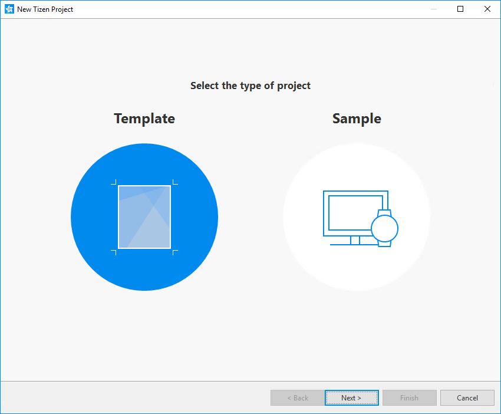
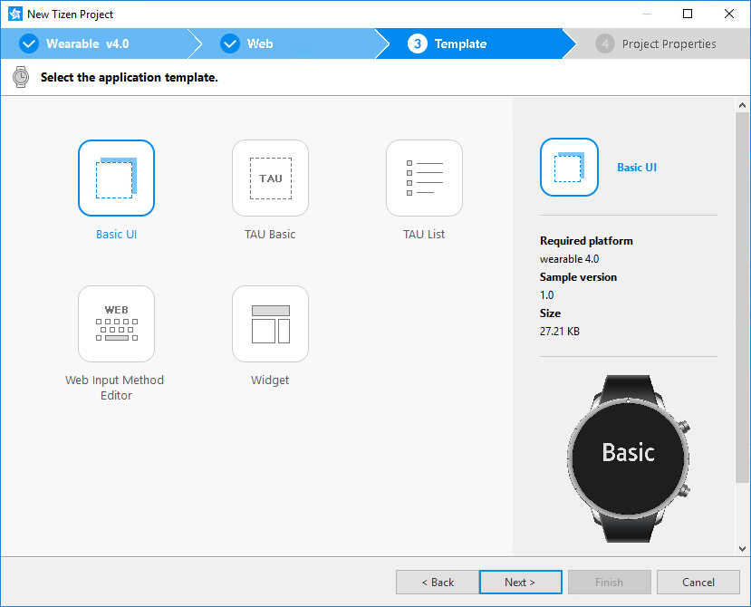

# Creating the Application Project

You can create a Web application project by selecting from a variety of
templates and samples. The following instructions are specific for
creating the project with a template.

To create a Web application project:

1.  In the Tizen Studio, select **File &gt; New &gt; Tizen Project**.

    

    The Project Wizard opens.

2.  In the Project Wizard, define the project details.

    The Project Wizard is used to create the basic application skeleton
    with the required folder structure and mandatory files. You can
    easily create different applications by selecting an applicable
    template or sample for the Project Wizard to use.

    1.  Select the **Template** project type and click **Next**.

        

    2.  Select the profile (**Mobile**, **Wearable**, or **TV**) and
      version from a drop-down list and click **Next**.  
        >  **Note**  
        > If you cannot see the TV profile option, open the Package Manager and make sure that you have installed the TV extension packages in the **Extension SDK** tab.

        

    3. Select the **Web Application** application type and click **Next**.

        

    4. Select the template you want to use and click **Next**.

       

    5. Define the project properties and click **Finish**.  
       You can fill the project name. You can also select the location and working sets by clicking **More properties**.  
       >  **Note**  
       > The Tizen API names cannot be used as project names. The project name must be more than 2 characters and is restricted to the following regular expression: \[a-zA-Z\]\[a-zA-Z0-9-\]{2,49}.

       

      The Project Wizard sets up the project, creates the application files using the default content from the template, and closes. For more information on the Project Wizard and the available templates, see [Creating Tizen Projects with Tizen Project Wizard](../../../tizen-studio/web-tools/project-wizard.md).

The new application project is shown in the **Project Explorer** view of the Tizen Studio, with default content in the `config.xml` file as well as in several project folders.

## Importing a Project

If you have an existing Tizen application project, you can import it into the Tizen Studio:  
1.  In the Tizen Studio menu, go to **File &gt; Import &gt; Tizen &gt;    Tizen Project**, and click **Next**.
2.  Select the location of the root directory or archive file of the    Tizen project and click **Next**.
3.  If you want to convert the project profile and version, use the
    **Profile/Version** combo box.
4.  Click **Finish**.

The project appears in the **Project Explorer** view.
