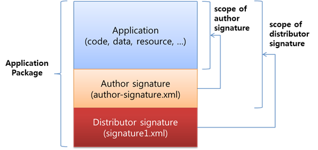
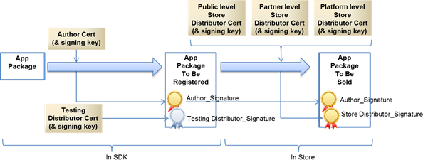
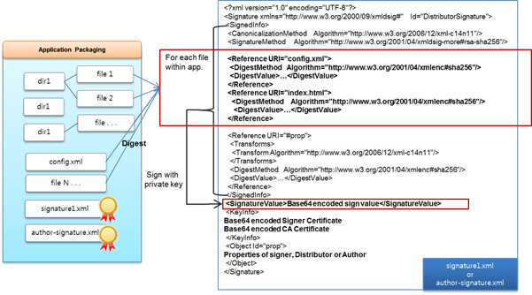

# Application Signing and Certificates

Application signing is the process of digitally signing executables,
scripts, and content of an application to confirm the application author
and guarantee that the application has not been altered or corrupted
since it was signed. The process employs the use of a cryptographic hash
to validate authenticity and integrity.

Tizen requires that all applications are digitally signed with a proper
signing key and certificate before they can be installed.

Through application signing, Tizen achieves the following goals:

-   Ensuring application integrity: Users can download an application
    that has not been tampered with after development.
-   Identifying the application developer: The applications with the
    same signing key are regarded as developed by the same developer. A
    set of applications with same developer's signing key can share
    secured resources as the developer intended.
-   Proof of store validation: An application store performs some
    validation checks before distributing an application. As the proof
    of store validation, the application store signs the application.
-   Enforcing proper usage of privileged APIs: An application
    distributor, such as an application store, can restrict the API set
    used by the application by signing a key with a proper privilege.

## Signature Type

All Tizen applications must have at least 2 signatures:

-   Author signature:
    -   You sign the author signature with your own author signing key
        in the Tizen Studio.
    -   Applications with the same author signing key are regarded as
        developed by the same developer.
    -   Application update is allowed only when the author signature of
        the old version and the new version are signed with a same
        author signing key.
    -   A set of applications with a same author's signing key can share
        secured resources as the author (developer) intended.
-   Distributor signature:
    -   The distributor signature is signed by a distributor, such as
        the Tizen Store, as the proof of application validation.
    -   The distributor signature determines the API set that the
        application can use.

**Figure: Signature type**

## Certificate and API Privileges

Tizen API privileges represent the ability to use a certain set of
sensitive APIs and secure system resources. The privileges are
categorized into 3 levels according to their security and privacy level:

-   Public level: used by any application developers.
-   Partner level: used by developers with a business relationship with
    a device vendor.
-   Platform level: exclusively used by a device vendor.

For an application to use a privileged API, the distributor signature
must be generated from a certificate (and its signing key) with a proper
privilege level. If an application has a distributor signature generated
from a partner level certificate (and its signing key), the application
can use only public and partner level APIs.

The following table shows the relationship between the certificate (and
signing key) privilege level and the API privilege level.

**Table: API levels allowed in specific certificate privilege levels**

| Certificate privilege level | Public level API | Partner level API | Platform level API |
| ---  | --- | --- | --- |
| Public level | Allowed | Not allowed | Not allowed |
| Partner level | Allowed | Allowed | Not allowed |
| Platform level | Allowed | Allowed | Allowed |

## Signing Flow and Getting Certificates

You can sign your application with your own author signing key and a
testing distributor signing key in the Tizen Studio. With those, you can
install and test the application on your test device and an emulator.

When the application is submitted to a store after development, the
store removes the testing distributor signature and adds the store
distributor signature for the application release. Normal applications
are signed with the public level distributor signing key in the store.
Some applications granted from a device vendor are allowed to be signed
with the partner level distributor signing key. Signing with the
platform level distributor key is permitted only for the internal
application of a device vendor or Tizen.

The following figure illustrates the signature and certificate flow.

**Figure: Signature flow**

The testing distributor certificate and its signing key with the public
level are preloaded in the Tizen Studio. The author certificate and its
signing key can also be created in the Tizen Studio. For more
information, see [Working with the Certificate
Profile](../../../tizen-studio/common-tools/certificate-registration.md).

A device vendor can disallow unauthorized applications to be installed
on its devices to protect its devices from viruses and malwares. Samsung
also disallows unauthorized applications to be installed on its Tizen
devices. In such cases, you must get an author certificate and a
distributor certificate from the device vendor. For more information,
see [Issuing a Tizen Certificate and Running Applications in Commercial
Devices](https://developer.tizen.org/community/tip-tech/issuing-tizen-certificate-certificate-extension-ver-1.2).

## Signature Specification

The application signing scheme of Tizen follows the specification of the
[XML Digital Signatures for Widgets specified by
W3C](http://www.w3.org/TR/2011/PR-widgets-digsig-20110811/).

The following figure shows the signature file structure.

**Figure: Signature file structure**

