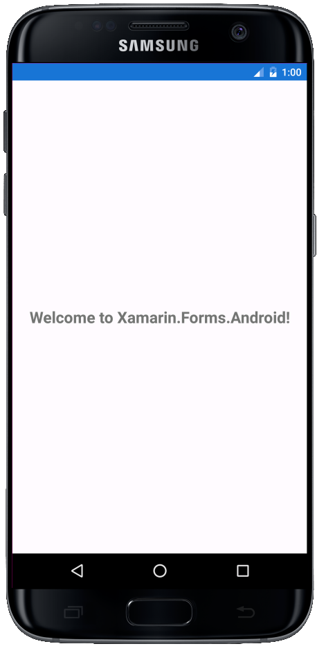
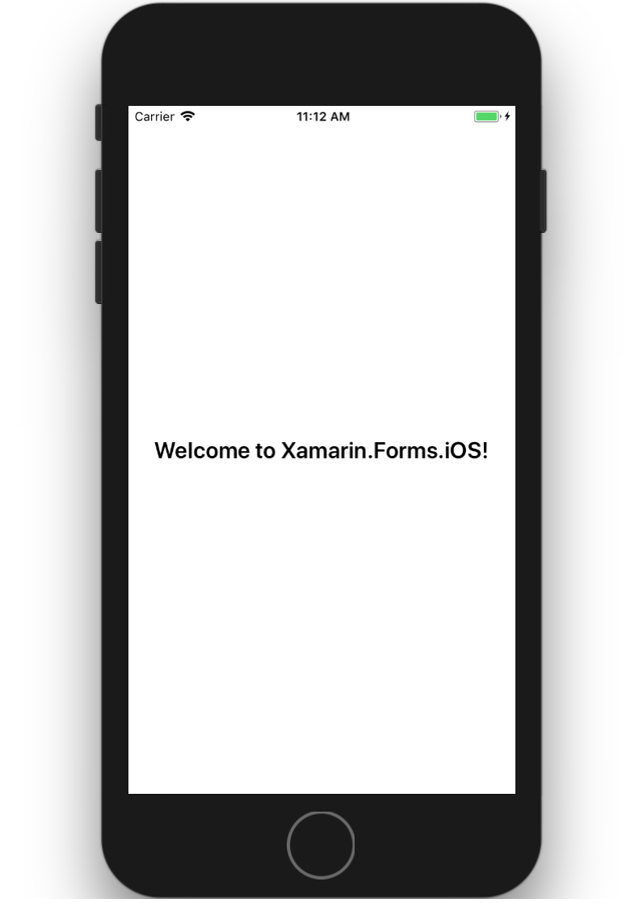
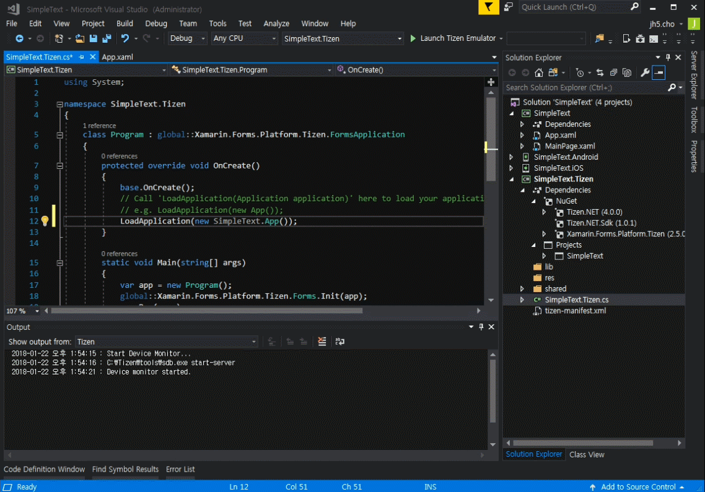
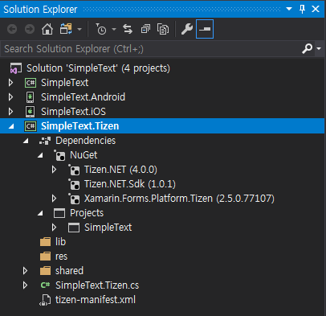
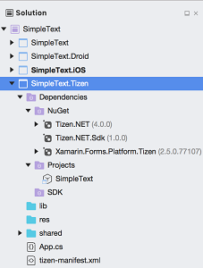
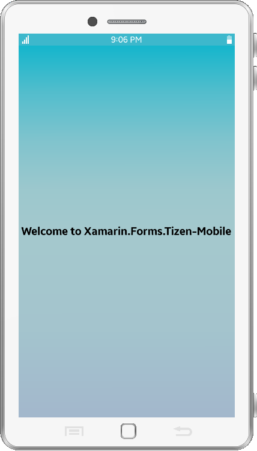
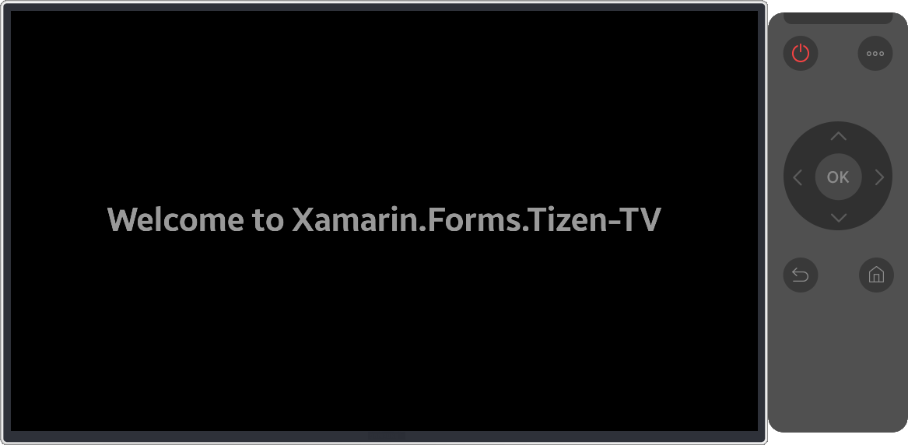
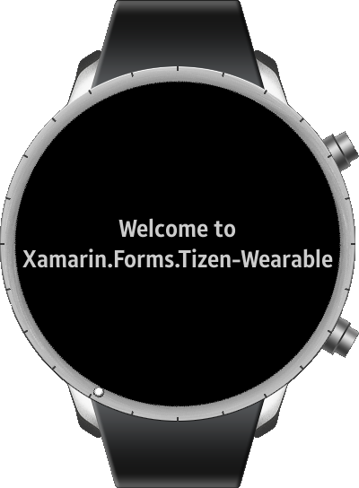

# Add Tizen Project to Your Xamarin Forms App

## Background
It has been a while since the first preview version of Tizen .NET is released, and developing Tizen applications has never been so easy, thanks to it. Using the familiar Visual Studio as the IDE, you can now develop applications by installing the extension called ‘Visual Studio Tools for Tizen’, and use Xamarin Forms as the UI framework. This new way of developing Tizen applications is the great opportunity for not only existing Tizen developers but also for Xamarin developers.
> For anyone who wants to get to know more about developing Tizen .NET applications, visit [here](https://developer.tizen.org/development/guides/.net-application) for developing guides and [here](https://developer.tizen.org/development/visual-studio-tools-tizen/installing-visual-studio-tools-tizen) for tools.

If you already have your own cross platform Xamarin apps, or if you are about to create a new one, it is definitely worth adding a Tizen project to your apps. Now your apps can run on many profiles of Tizen devices such as mobile, TV, and wearable. Super awesome!

## Add Tizen Project
### On Visual Studio
As an example, I created a sample cross platform app named ‘SimpleText’ which shows one simple text in center. The text varies depends on the Platform and Idiom.

<p align="center">
  
  
</p>

On Android Emulator, you can see the text displayed as “Welcome to Xamarin.Forms.Android!”.
On iOS Simulator, the text is replaced to "Welcome to Xamarin.Forms.iOS!".

To run on the Tizen platform:
- In Visual Studio, go to "File -> Add -> New Project"
- Select a Tizen cross platform template "Visual C# -> Tizen -> Blank App (Xamarin.Forms)" and give a project name "SimpleText.Tizen"
- On Tizen project Wizard:
  - Select "Common" as Profile (There are also Mobile, TV, and Wearable profile you can select)
  - Choose "Select Project in Solution" option and select "SimpleText" as the reference
    (The feature of selecting existing reference is added on 1.2.0 version of Visual Studio Tools for Tizen)
- Add code `LoadApplication(new SimpleText.App())` on SimpleText.Tizen/SimpleText.Tizen.cs file

  ```csharp
  namespace SimpleText.Tizen
  {
      class Program : global::Xamarin.Forms.Platform.Tizen.FormsApplication
      {
          protected override void OnCreate()
          {
              base.OnCreate();
              // Call 'LoadApplication(Application application)' here to load your application.
              // e.g. LoadApplication(new App());
              LoadApplication(new SimpleText.App());
          }

          static void Main(string[] args)
          {
              var app = new Program();
              global::Xamarin.Forms.Platform.Tizen.Forms.Init(app);
              app.Run(args);
          }
      }
  }

  ```
<p align="center">
  
</p>

Check out the result below, and see if the generated Tizen project refers the correct reference as a dependency.

<p align="center">
  
</p>

Instead of adding a stably released Xamarin.Forms NuGet package, you should use the [nightly build](https://www.myget.org/feed/xamarinforms-ci/package/nuget/Xamarin.Forms), or the Xamarin.Forms.Platform.Tizen package as a reference at this moment. I found 2.5.0.77107 version of Xamarin.Forms.Platform.Tizen works beautifully.
This would soon be unnecessary because now Tizen renderer code is merged on the Xamarin.Forms GitHub and it is ready on nightly builds. When Xamarin.Forms package which includes Tizen is stably released, you would be able to simply add the Xamarin.Forms package just like how you do for other platforms.
There is another significant package called Tizen.NET. This allows your app to use the Tizen platform specific APIs. This package includes all features of Tizen and helps your app to do things what Tizen native applications can do. You can visit [here](https://developer.tizen.org/dev-guide/csapi/index.html) to see what Tizen APIs are provided.
> Visit [here](https://github.com/xamarin/xamarin-forms-samples/pull/245) to see how Tizen projects are added to tons of existing Xamarin samples.

### On Visual Studio for Mac
If you are using Mac, loading Tizen project will fail on Visual Studio for Mac because it cannot recognize 'Tizen 4.0' as a target framework yet. I suggest to install the [add-in](https://github.com/mrward/temp-addin-upload/tree/master/DotNetCoreSupportAnyTargetFramework) to support Tizen project on your Visual Studio for Mac. This is one way to develop a Tizen app on your Mac PC as you can also build the project.

<p align="center">
  
</p>

## How to get a type of OS or Idiom
Xamarin.Forms.Device class may be familiar to the most Xamarin developers as it provides useful public properties like RuntimePlatform and Idiom. Those properties provide which OS and which device Xamarin.Forms is working on. In this SimpleText app, platforms and target devices are separated on the code like below.
```xml
<?xml version="1.0" encoding="utf-8" ?>
<ContentPage xmlns="http://xamarin.com/schemas/2014/forms"
             xmlns:x="http://schemas.microsoft.com/winfx/2009/xaml"
             xmlns:local="clr-namespace:SimpleText"
             x:Class="SimpleText.MainPage">
    <Label VerticalOptions="Center" HorizontalOptions="Center" FontSize="Large" FontAttributes="Bold">
        <Label.Text>
            <OnPlatform x:TypeArguments="x:String">
                <On Platform="Android" Value="Welcome to Xamarin.Forms.Android!" />
                <On Platform="iOS" Value="Welcome to Xamarin.Forms.iOS!" />
                <On Platform="UWP" Value="Welcome to Xamarin.Forms.UWP!" />
                <On Platform="Tizen">
                    <On.Value>
                        <OnIdiom x:TypeArguments="x:String">
                            <OnIdiom.Phone>Welcome to Xamarin.Forms.Tizen-Mobile</OnIdiom.Phone>
                            <OnIdiom.TV>Welcome to Xamarin.Forms.Tizen-TV</OnIdiom.TV>
                        </OnIdiom>
                    </On.Value>
                </On>
            </OnPlatform>
        </Label.Text>
    </Label>
</ContentPage>
```

Check out how it is implemented on the CS code too.
Here you can try using `TargetIdiom.Unsupported` to test code on the Tizen wearable emulator. Idiom for the wearable device is not yet defined on Xamarin but this is expected to be added as soon as it is prepared.
```csharp
using Xamarin.Forms;

namespace SimpleText
{
    class MainPageCS : ContentPage
    {
        public MainPageCS()
        {
            Content = new StackLayout
            {
                VerticalOptions = LayoutOptions.Center,
                Children =
                {
                        new Label
                        {
                            HorizontalTextAlignment = TextAlignment.Center,
                            FontAttributes = FontAttributes.Bold,
                            FontSize = Device.GetNamedSize(NamedSize.Large, typeof(Label)),
                            Text = Device.RuntimePlatform == Device.Android ? "Welcome to Xamarin.Forms.Android!" :
                            Device.RuntimePlatform == Device.iOS ? "Welcome to Xamarin.Forms.iOS!" :
                            Device.RuntimePlatform == Device.UWP ? "Welcome to Xamarin.Forms.UWP!" :
                            "Welcome to Xamarin.Forms.Tizen-" + (Device.Idiom == TargetIdiom.Phone ? "Mobile" : "TV"),
                        }
                        //Sample code for Tizen Wearable
                        //new Label
                        //{
                        //    HorizontalTextAlignment = TextAlignment.Center,
                        //    FontAttributes = FontAttributes.Bold,
                        //    Text = "Welcome to Xamarin.Forms.Tizen-" + (Device.Idiom == TargetIdiom.Unsupported ? "Wearable" : ""),
                        //}
                    }
            };
        }
    }
}
```

## Run on Tizen Emulators
Let’s run the SimpleText app on Tizen emulators. You can start emulators at “Tools -> Tizen -> Tizen Emulator Manager“. Three types of Tizen profiles including wearable are provided like you can see below and Wearable now is the preview version.
Check out how different text is displayed on different devices.

<p align="center">
  
</p>
<p align="center">
  
</p>
<p align="center">
  
</p>

## Start Now
Tizen .NET is now ready for any developers who want to create a fabulous app that works on various platforms and device types. For Xamarin developers, you have no reason to hesitate creating a Tizen app. You already know enough to start.
> If you are particularly interested in developing Tizen TV apps, visiting [here](http://developer.samsung.com/tv/tizen-net-tv/getting-started/creating-net-tv-applications) will be very helpful to find more guides and see TV specific API reference.
