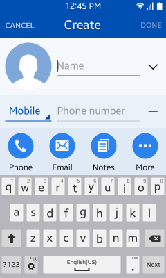

# Edit

Edit is one of the most commonly used functions to help users manage data. Normally, every application needs elements related to the edit function.

However, adhere to the consistency principle of the Tizen platform by giving users the basic functions they expect, in the location where they expect to find them.

Basic edit functions include creating, deleting, and moving data. Based on the characteristics of your application, you can offer the edit function so that it combines multiple functions.

## Creating and Composing a New Item

Provide the create function in the **More** menu. This functionality should take priority over other functions in the menu.

The **Confirm** and **Cancel** buttons are used, for example, when the user is creating new content or sharing/sending the created content. If the user applies both **Cancel** button and back navigation in the saving process, the application should ask the user to save the data in the application.

The following figure shows how to create a new memo in the Memo application. The user can create a memo by tapping the **More** menu and selecting **Create memo**. Once the memo is created, the user can go back to the list screen and see the newly created memo on the list. The **Done** button is activated in the **Create** view when the user has entered a value in every mandatory field.

 

**Figure: Creating a new item**

****

## Deleting an Item

Provide the delete function in the detail view or list view in the **More** menu. In the list view, the user can select and delete multiple items by using the multi-selection feature.

Once the user has deleted the data, the application should display text information representing the current status (such as “No images”).

The feedback can be followed by a pop-up used to prompt the user to confirm a delete action. Always prompt the user with a pop-up when the deleted item cannot be recovered, or the deletion affects other contents as well (for example, initializing data or deleting an account).

 

**Video: Deleting items (click to play)**  

## Moving and Copying an Item

The user can move and copy single or multiple items from a list. Moving or copying a single item, when the destination is explicit, requires no user input. The user can simply use the pop-up menu as shown in the following figure. Provide the delete and move actions in the **More** menu.

 

**Video: Moving an item (click to play)**  

## Multi-selection

Users often need to manage multiple items simultaneously, for example, to delete several items at once. You can support this behavior by offering the multi-selection feature in your application.

Multi-selection works when the user taps **Delete, Move, or Copy **in the **More** menu. This creates a checkbox for each list item, thereby facilitating multiple selections.

You can also offer information about the selected items (for example, the number of items selected) in the header. Both the list and grid views support the multi-selection functionality.

The multi-selection mode is accessed through an action in **More** menu.

Multi-selection in a grid list works the same way as in a stacked list. The select all functionality can be placed as a regular item above the grid.

 

**Video: Multi-selection in the list view (click to play)**  

 

**Video: Multi-selection in the grid view (click to play)**  

 

The select all feature scrolls with the list. By tapping **Select all**, the user selects all items in the list. By tapping again, the user deselects all items.

 

**Video: Select all (click to play)**  

 
> **NOTE**  
> The select all functionality supported in the Native framework.
