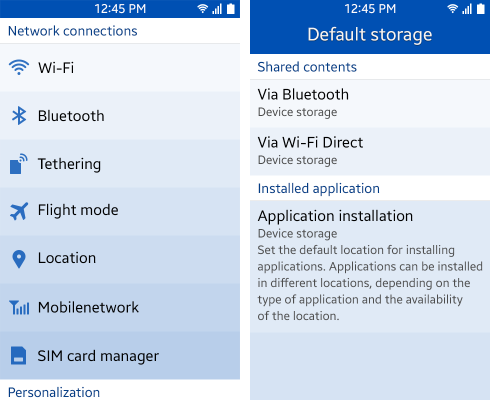
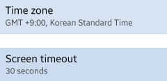
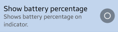
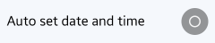
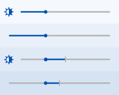

# Settings

In Settings, users can view and customize various functions. By offering the right setting at the right time, you can enrich your application user experience.

## Designing Settings

The user can view application preferences:

-   Using a function within the application
-   From the Settings application

Keep the following guidelines in mind when designing user-definable settings:

-   Include the setting in the application when the user may want to change the function frequently.
-   Ask for preferences or include the setting in the application if it is likely that most (but not all) users set the same value. 
-   If you expect most users to set the same value or that they do not change the settings very often, you can use a fixed setting or prompt users for their preferences.
-   If none of the other guidelines apply, you can simply create the preferences and manage them in the General settings.

> **NOTE**  
> If you do not organize the preferences by purpose, the user sometimes wants to include all functions in the General settings and not arrange them by user convenience.

Design the preferences as shown in the following figure. Classify your application settings by function and group them with different names.

 

**Figure: General settings**

****

 

## Preference UI Controls

The UI control types for designing application preferences are as follows:

### Secondary Text

**Status**: Show the present state within the list.

 

**Help text**: Show the help text with in the list.  

 

------------------------------------------------------------------------

### On/off Switch

This control helps the user enable or disable a specific function. The control can be used on the first depth without showing additional depths unless the switch is on.

 

**Figure: On/off switch**

****

 

------------------------------------------------------------------------

### Slider

These controls are useful when adjusting values in settings in multiple steps or consecutive steps. Optional image or text that conveys the meaning of the bar can be included.

 

**Figure: Sliders**

